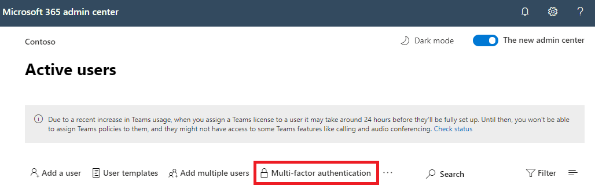

# Microsoft 365 的多重要素驗證Multi-factor authentication for Microsoft 365

密碼是驗證電腦或線上服務之登錄的最常見方法，但也容易受到任何影響。Passwords are the most common method of authenticating a sign-in to a computer or online service, but they are also the most vulnerable. 使用者可以選擇簡易密碼，並針對不同電腦和服務的多個登錄使用相同的密碼。People can choose easy passwords and use the same passwords for multiple sign-ins to different computers and services.

若要為 Sign-in 提供額外的安全性層級，您必須使用多重要素驗證 (MFA) ，它同時使用一個密碼 ，這個密碼應該很強，並且根據：To provide an additional level of security for sign-ins, you must use multi-factor authentication (MFA), which uses both a password, which should be strong, and an additional verification method based on:

- 您擁有無法輕易複製的手機，例如智慧型手機。Something you have with you that is not easily duplicated, such as a smart phone.
- 您獨有的專案，例如指紋、臉部或其他指紋屬性。Something you uniquely and biologically have, such as your fingerprints, face, or other biometric attribute.

驗證使用者密碼之後，才能使用額外的驗證方法。The additional verification method is not employed until after the user's password has been verified. 使用 MFA 時，即使強使用者密碼遭到入侵，攻擊者並沒有您的智慧型手機或指紋才能完成該登錄。With MFA, even if a strong user password is compromised, the attacker does not have your smart phone or your fingerprint to complete the sign-in.

## Microsoft 365 中的 MFA 支援MFA support in Microsoft 365

根據預設，Microsoft 365 和 Office 365 都支援使用：By default, both Microsoft 365 and Office 365 support MFA for user accounts using:

- 一則文字訊息，會送到需要使用者輸入驗證碼的電話。A text message sent to a phone that requires the user to type a verification code.
- 通話。A phone call.
- Microsoft Authenticator 智慧型手機應用程式。The Microsoft Authenticator smart phone app.

在這兩種情況下，MFA 的登錄都是使用「您擁有、不容易複製」的方法進行額外驗證。In both cases, the MFA sign-in is using the "something you have with you that is not easily duplicated" method for the additional verification. 啟用 Microsoft 365 和 Office 365 的 MFA 有多種方式：There are multiple ways in which you can enable MFA for Microsoft 365 and Office 365:

- 使用安全性預設值With security defaults
- 使用條件式存取策略With Conditional Access policies
- 針對每個個別使用者帳戶 (不建議) For each individual user account (not recommended)

這些方法是以您的 Microsoft 365 方案為基礎。These ways are based on your Microsoft 365 plan.

|方案Plan|建議Recommendation|客戶類型Type of customer|
|---|---|---|
|所有 Microsoft 365 方案All Microsoft 365 plans|使用安全性預設值，要求所有使用者帳戶使用 MFA。Use security defaults, which require MFA for all user accounts. 
 您也可以針對個別使用者帳戶設定每個使用者 MFA，但不建議您這樣做。You can also configure per-user MFA on individual user accounts, but this is not recommended.|小型企業Small business|
|Microsoft 365 商務進階版Microsoft 365 Business Premium 
 Microsoft 365 E3Microsoft 365 E3 
 Azure Active Directory (Azure AD) 進版 P1 授權Azure Active Directory (Azure AD) Premium P1 licenses|使用條件式存取策略，以根據群組成員資格、應用程式或其他準則要求使用者帳戶使用 MFA。Use Conditional Access policies to require MFA for user accounts based on group membership, apps, or other criteria.|小型企業對企業Small business to enterprise|
|Microsoft 365 E5Microsoft 365 E5 
 Azure AD Premium P2 授權Azure AD Premium P2 licenses|使用 Azure AD 身分識別保護來根據登錄風險準則要求 MFA。Use Azure AD Identity Protection to require MFA based on sign-in risk criteria.|企業Enterprise|
||||

### 安全性預設Security defaults

安全性預設是 2019 年 10 月 21 日之後所建立 Microsoft 365 和 Office 365 付費或試用版訂用帳戶的新功能。Security defaults is a new feature for Microsoft 365 and Office 365 paid or trial subscriptions created after October 21, 2019. 這些訂閱會開啟安全性預設值，其中：These subscriptions have security defaults turned on, which:

- 需要所有使用者將 MFA 與 Microsoft Authenticator App 一同使用。Requires all of your users to use MFA with the Microsoft Authenticator app.
- 區塊舊版驗證。Blocks legacy authentication.

使用者有 14 天的時間可以從其智慧型手機向 Microsoft Authenticator 應用程式註冊 MFA，時間從啟用安全性預設後使用者首次登入時起算。Users have 14 days to register for MFA with the Microsoft Authenticator app from their smart phones, which begins from the first time they sign in after security defaults has been enabled. 14 天過後，使用者就無法登入，除非其完成 MFA 註冊。After 14 days have passed, the user won't be able to sign in until MFA registration is completed.

安全性預設可確保所有組織都具備預設啟用的使用者登入基本層級安全性。Security defaults ensure that all organizations have a basic level of security for user sign-in that is enabled by default. 您可以使用條件式存取策略來停用安全性預設值，以 MFA 為根據。You can disable security defaults in favor of MFA with Conditional Access policies.

從 Azure 入口網站中 Azure  AD 的屬性窗格啟用或停用安全性預設值。You enable or disable security defaults from the **Properties** pane for Azure AD in the Azure portal.

您可以在任何 Microsoft 365 方案使用安全性預設值。You can use security defaults with any Microsoft 365 plan.

如需詳細資訊，請參閱這個[安全性預設概觀](https://docs.microsoft.com/azure/active-directory/fundamentals/concept-fundamentals-security-defaults)。For more information, see this [overview of security defaults](https://docs.microsoft.com/azure/active-directory/fundamentals/concept-fundamentals-security-defaults).

### 條件式存取原則Conditional Access policies

條件式存取原則是一組規則，可指定要在什麼條件下評估和允許登入。Conditional Access policies are a set of rules that specify the conditions under which sign-ins are evaluated and allowed. 例如，您可以建立敘述如下的條件式存取原則：For example, you can create a Conditional Access policy that states:

- 如果使用者帳戶名稱是獲派 Exchange、使用者、密碼、安全性、SharePoint 或全域管理員角色的使用者群組成員，則先要求 MFA 再允許存取。If the user account name is a member of a group for users that are assigned the Exchange, user, password, security, SharePoint, or global administrator roles, require MFA before allowing access.

此原則可讓您根據群組成員資格要求 MFA，而不是在指派或取消指派這些管理員角色時，嘗試針對 MFA 設定個別使用者帳戶。This policy allows you to require MFA based on group membership, rather than trying to configure individual user accounts for MFA when they are assigned or unassigned from these administrator roles.

您也可以使用條件式存取策略來使用進一步功能，例如要求特定 App 使用 MFA，或是在符合規範的裝置上完成該登錄，例如執行 Windows 10 的膝上型電腦。You can also use Conditional Access policies for more advanced capabilities, such as requiring MFA for specific apps or that the sign-in is done from a compliant device, such as your laptop running Windows 10.

您從 Azure 入口網站中的 Azure AD 安全性窗格設定條件式存取策略。You configure Conditional Access policies from the **Security** pane for Azure AD in the Azure portal.

您可以將條件式存取策略用於：You can use Conditional Access policies with:

- Microsoft 365 商務進階版Microsoft 365 Business Premium
- Microsoft 365 E3 和 E5Microsoft 365 E3 and E5
- Azure AD Premium P1 和 Azure AD Premium P2 授權Azure AD Premium P1 and Azure AD Premium P2 licenses

對於使用 Microsoft 365 商務進版小型企業，您可以利用下列步驟輕鬆使用條件式存取政策：For small businesses with Microsoft 365 Business Premium, you can easily use Conditional Access policies with the following steps:

1. 建立群組以包含需要 MFA 的使用者帳戶。Create a group to contain the user accounts that require MFA.
2. 啟用 **全域系統管理員的需要 MFA** 政策。Enable the **Require MFA for global admins** policy.
3. 使用這些設定建立以群組為基礎的條件式存取政策：Create a group-based Conditional Access policy with these settings:
    - 指派>使用者和群組：上述步驟 1 的組名。Assignments > Users and groups: The name of your group from Step 1 above.
    - 指派>雲端 App 或動作：所有雲端 App。Assignments > Cloud apps or actions: All cloud apps.
    - 存取控制專案>授予>存取>需要多重要素驗證。Access controls > Grant > Grant access > Require multi-factor authentication.
4. 啟用該政策。Enable the policy.
5. 將使用者帳戶新增到上述步驟 1 中建立並測試的群組。Add a user account to the group created in Step 1 above and test.
6. 若要要求其他使用者帳戶使用 MFA，請將其新增到步驟 1 中建立群組。To require MFA for additional user accounts, add them to the group created in Step 1.

此條件式存取政策可讓您以自己的步調將 MFA 需求推出給使用者。This Conditional Access policy allows you to roll out the MFA requirement to your users at your own pace.

企業應該使用 [一般條件式存取策略](https://docs.microsoft.com/azure/active-directory/conditional-access/concept-conditional-access-policy-common) 來設定下列策略：Enterprises should use [Common Conditional Access policies](https://docs.microsoft.com/azure/active-directory/conditional-access/concept-conditional-access-policy-common) to configure the following policies:

- [要求系統管理員使用 MFARequire MFA for administrators](https://docs.microsoft.com/azure/active-directory/conditional-access/howto-conditional-access-policy-admin-mfa)
- [要求所有使用者使用 MFARequire MFA for all users](https://docs.microsoft.com/azure/active-directory/conditional-access/howto-conditional-access-policy-all-users-mfa)
- [封鎖舊版驗證Block legacy authentication](https://docs.microsoft.com/azure/active-directory/conditional-access/howto-conditional-access-policy-block-legacy)

如需詳細資訊，請參閱這個[條件式存取概觀](https://docs.microsoft.com/azure/active-directory/conditional-access/overview)。For more information, see this [overview of Conditional Access](https://docs.microsoft.com/azure/active-directory/conditional-access/overview).

### Azure AD Identity ProtectionAzure AD Identity Protection

使用 Azure AD 身分識別保護，您可以建立額外的條件式存取策略，在有中或高之登錄風險時要求[MFA。](https://docs.microsoft.com/microsoft-365/enterprise/identity-access-policies#require-mfa-based-on-sign-in-risk)With Azure AD Identity Protection, you can create an additional Conditional Access policy to [require MFA when sign-in risk is medium or high](https://docs.microsoft.com/microsoft-365/enterprise/identity-access-policies#require-mfa-based-on-sign-in-risk).

您可以使用 Azure AD 身分識別保護與以風險為基礎的條件式存取策略，以執行：You can use Azure AD Identity Protection and risk-based Conditional Access policies with:

- Microsoft 365 E5Microsoft 365 E5
- Azure AD Premium P2 授權Azure AD Premium P2 licenses

如需詳細資訊，請參閱這個 [Azure AD Identity Protection 概觀](https://docs.microsoft.com/azure/active-directory/identity-protection/overview-identity-protection)。For more information, see this [overview of Azure AD Identity Protection](https://docs.microsoft.com/azure/active-directory/identity-protection/overview-identity-protection).

### 不建議使用舊版每個使用者 MFA (MFA) Legacy per-user MFA (not recommended)

您應該使用安全性預設值或條件式存取策略，要求使用者帳戶的登錄使用 MFA。不過，如果無法使用上述任一項，Microsoft 強烈建議擁有系統管理員角色的使用者帳戶使用 MFA，尤其是任何大小訂閱的全域系統管理員角色。You should be using either security defaults or Conditional Access policies to require MFA for your user account sign-ins. However, if either of these cannot be used, Microsoft strongly recommends MFA for user accounts that have administrator roles, especially the global administrator role, for any size subscription.

您從 Microsoft 365系統管理中心的使用中使用者窗格啟用個別使用者帳戶的 MFA。You enable MFA for individual user accounts from the **Active user** pane of the Microsoft 365 admin center.

啟用後，下次使用者進行登錄時，系統會提示他們註冊 MFA，以及選擇並測試其他驗證方法。After being enabled, the next time the user signs in, they will be prompted to register for MFA and to choose and test the additional verification method.

### 共同使用這些方法Using these methods together

下表顯示啟用 MFA 與安全性預設、條件式存取原則和每一使用者帳戶設定的結果。This table shows the results of enabling MFA with security defaults, Conditional Access policies, and per-user account settings.

||EnabledEnabled|停用Disabled|次要驗證方法Secondary authentication method|
|---|---|---|---|
|**安全性預設****Security defaults**|無法使用條件式存取策略Can't use Conditional Access policies|可以使用條件式存取原則Can use Conditional Access policies|Microsoft Authenticator 應用程式Microsoft Authenticator app|
|**條件式存取原則****Conditional Access policies**|如果有任何啟用，您則無法啟用安全性預設值If any are enabled, you can't enable security defaults|如果已停用所有原則，則可啟用安全性預設If all are disabled, you can enable security defaults|在註冊 MFA 期間由使用者指定User-specified during MFA registration|
|**不建議使用舊版每個使用者 MFA (MFA)****Legacy per-user MFA (not recommended)**|會優先于安全性預設值和條件式存取策略，要求每一個登錄都使用 MFAOverrides security defaults and Conditional Access policies requiring MFA at each sign in|安全性預設值和條件式存取政策所覆蓋Overridden by security defaults and Conditional Access policies|在註冊 MFA 期間由使用者指定User-specified during MFA registration|
||||

如果已啟用安全性預設值，系統會提示所有新使用者進行 MFA 註冊，以及下一次使用 Microsoft Authenticator App。If security defaults are enabled, all new users are prompted for MFA registration and the use of the Microsoft Authenticator app at their next sign-in.

## 管理 MFA 設定的方法Ways to manage MFA settings

管理 MFA 設定的方法有兩種。There are two ways to manage MFA settings.

在 Azure 入口網站中，您可以：In the Azure portal, you can:

- 啟用和停用安全性預設值Enable and disable security defaults
- 設定條件式存取策略Configure Conditional Access policies

在 Microsoft 365 系統管理中心，您可以設定每個使用者和服務 MFA 設定。In the Microsoft 365 admin center, you can configure per-user and service MFA settings.

## 您的下一個步驟Your next step

[設定 Microsoft 365 的 MFASet up MFA for Microsoft 365](set-up-multi-factor-authentication.md)
