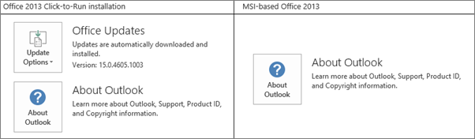

# Office 365 部署多重要素驗證方案Plan for multi-factor authentication for Office 365 Deployments

多重要素驗證 (MFA) 是一種需要使用多種驗證方法並為使用者登入和交易額外添加一層安全性的驗證方法。它的運作方式是要求使用下列兩種或更多的驗證方法：Multi-factor authentication (MFA) is a method of authentication that requires the use of more than one verification method and adds a second layer of security to user sign-ins and transactions. It works by requiring any two or more of the following verification methods:
  
- 隨機產生的密碼A randomly generated pass code
    
- 電話A phone call
    
- 智慧卡 (虛擬或實體)A smart card (virtual or physical) 
    
- 生物特徵辨識裝置A biometric device 
    
## Office 365中的多重要素驗證Multi-factor authentication in Office 365

Office 365 使用多重要素驗證，協助提供額外的安全性，並從 Microsoft 365 系統管理中心加以管理。Office 365 uses multi-factor authentication to help provide the extra security and is managed from the Microsoft 365 admin center. Office 365 提供下列 Azure Multi-Factor 驗證功能的子集做為訂閱的一部分：Office 365 offers the following subset of Azure Multi-Factor Authentication capabilities as a part of the subscription: 
  
- 能夠啟用並強制執行使用者的多重要素驗證The ability to enable and enforce multi-factor authentication for end users
    
- 使用行動裝置 App (線上和單次密碼 [OTP]) 做為次要驗證因素The use of a mobile app (online and one-time password [OTP]) as a second authentication factor
    
- 使用電話做為次要驗證因素The use of a phone call as a second authentication factor
    
- 使用簡訊服務 (SMS) 訊息做為次要驗證因素The use of a Short Message Service (SMS) message as a second authentication factor
    
- 非瀏覽器用戶端的應用程式密碼 (例如，Microsoft Lync 2013 通訊軟體)Application passwords for non browser clients (for example, the Microsoft Lync 2013 communications software)
    
- 驗證電話期間的預設 Microsoft 問候語Default Microsoft greetings during authentication phone calls
    
如需新增功能的完整清單，請參閱 [Azure 多重要素驗證版本比較](https://go.microsoft.com/fwlink/?LinkId=506927)。您可以購買 Azure 多重要素驗證服務，隨時獲得完整功能。For the full list of added features, see [the comparison of Azure Multi-Factor Authentication version](https://go.microsoft.com/fwlink/?LinkId=506927). You can always get the full functionality by purchasing the Azure Multi-Factor Authentication service. 
  
視您擁有的是 Office 365 之僅限雲端部署或使用單一登入和 Active Directory 同盟服務 (AD FS) 的混合設定而定，您會獲得不同的功能子集。You get a different subset of capabilities depending on whether you have a cloud-only deployment for Office 365 or a hybrid set up with single sign-on and Active Directory Federation Services (AD FS). 
  
|**您在何處管理 Office 365 租用戶？****Where do you manage your Office 365 tenant?**|**MFA 次要因素選項****MFA second factor options**|
|:-----|:-----|
|僅限雲端Cloud only    |Azure Multi-Factor 驗證（文字或電話）Azure Multi-Factor Authentication (text or phone call)    |
|混合設定、受管理的內部部署Hybrid setup, managed on-premises    | 如果您透過內部部署管理使用者身分識別，您有下列選擇：If you manage user identity on-premises, you have the following choices:     實體或虛擬智慧卡（使用 AD FS 時）Physical or virtual smart card (when using AD FS)    [Azure Multi-Factor 驗證](https://go.microsoft.com/fwlink/p/?LinkId=526677)（AD FS 的模組）[Azure Multi-Factor Authentication](https://go.microsoft.com/fwlink/p/?LinkId=526677) (module for AD FS)     Azure Active Directory （Azure AD） Multi-Factor 驗證Azure Active Directory (Azure AD) Multi-Factor Authentication    |
   
  
下圖顯示更新的 Office 2013 裝置 App (Windows 版) 如何讓使用者能夠使用 MFA 登入。Office 2013 裝置 App 透過使用 [Active Directory Authentication Library (ADAL)](https://go.microsoft.com/fwlink/p/?LinkId=526684) 支援多重要素驗證。Azure AD 託管使用者可以登入的網頁。身分識別提供者可以是 Azure AD 或 AD FS 等同盟身分識別提供者。同盟使用者的驗證按下列步驟進行：The following figure shows how the updated Office 2013 device apps (on Windows) enable users to sign in with MFA. TheOffice 2013 device apps support multi-factor authentication through the use of the [Active Directory Authentication Library (ADAL)](https://go.microsoft.com/fwlink/p/?LinkId=526684). Azure AD hosts a webpage where users can sign in. The identity provider can be Azure AD or a federated identity provider like AD FS. The authentication for federated users follows these steps:
  
1. Azure AD 將使用者重新導向到由 Office 365 租用戶的記錄之身分識別提供者託管的登入網頁。身分識別提供者取決於使用者登入名稱中指定的網域。Azure AD redirects the user to the sign-in web page hosted by the identity provider of record for the Office 365 tenant. The identity provider is determined by the domain specified in the user's sign in name.
    
2. 使用者在他的裝置的登入網頁上登入。The user signs in on the sign in web page on his or her device. 
    
3. 使用者成功登入後，身分識別提供者會傳回權杖給 Azure AD。The identity provider returns a token to Azure AD when the user is successfully signed in.
    
4. Azure AD 會傳回 JSON Web 權杖 (JWT) 給 Office 裝置 App，而裝置 App 會搭配 Office 365 使用 JWT 獲得授權。Azure AD returns a JSON Web Token (JWT) to the Office device app, and the device app is authenticated by using a JWT with Office 365. 
    
請見下圖的詳細說明：This is detailed in the following figure:
  

  
## 軟體需求Software requirements

若要啟用適用於 Office 2013 用戶端應用程式的 MFA，您必須安裝下列軟體 (以下所列的版本或更新版本)，根據您擁有的是[隨選即用型安裝](#click-to-run-based-installations)或 [MSI 型安裝](#msi-based-installations)而定。To enable MFA for Office 2013 client apps, you must have the following software installed (the version listed below, or a later version) based on whether you have a [Click-to-run based installations](#click-to-run-based-installations) or an [MSI-based installations](#msi-based-installations).
  
若要判斷您的 Office 安裝是否為隨選即用或 MSI 型：To determine whether your Office installation is Click-to-run or MSI-base:
  
1. 啟動 Outlook 2013。Start Outlook 2013.
    
2. **在 [檔案] 功能表上**，選擇 [ **Office 帳戶**]。On the **File** menu, choose **Office Account**.
    
3. For Outlook 2013 Click-to-Run installations, an **Update Options** item is displayed. For MSI-based installations, the **Update Options** item is not displayed.For Outlook 2013 Click-to-Run installations, an **Update Options** item is displayed. For MSI-based installations, the **Update Options** item is not displayed. 
    
    
  
### 隨選即用型安裝Click-to-run based installations

若是隨選即用型安裝，您必須安裝下列軟體 (以下所列的檔案版本或更新的檔案版本)。如果您的檔案版本並非大於或等於列出的檔案版本，請使用下列步驟進行更新。For Click-to-run based installations, you must have the following software installed, at file version listed below or a later file version. If your file version is not equal to or greater than the file version listed, update it using the steps below.
  
|**檔案名稱****File name**|**電腦上的安裝路徑****Install path on your computer**|**檔案版本****File version**|
|:-----|:-----|:-----|
|MSO.DllMSO.DLL    |C:\Program Files\Microsoft Office 15\root\vfs\ProgramFilesCommonx86\Microsoft Shared\OFFICE15\MSO.DLLC:\Program Files\Microsoft Office 15\root\vfs\ProgramFilesCommonx86\Microsoft Shared\OFFICE15\MSO.DLL    |15.0.4753.100115.0.4753.1001    |
|Csi。DllCSI.DLL    |CSI.DLL C:\Program Files\Microsoft Office 15\root\office15\csi.dllCSI.DLL C:\Program Files\Microsoft Office 15\root\office15\csi.dll    |15.0.4753.100015.0.4753.1000    |
|GrooveGroove.EXE    |C:\Program Files\Microsoft Office 15\root\office15\GROOVE.exeC:\Program Files\Microsoft Office 15\root\office15\GROOVE.exe    |15.0.4763.100015.0.4763.1000    |
|Outlook .exeOutlook.exe    |C:\Program Files\Microsoft Office 15\root\office15\OUTLOOK.exeC:\Program Files\Microsoft Office 15\root\office15\OUTLOOK.exe    |15.0.4753.100215.0.4753.1002    |
|ADAL.DllADAL.DLL    |C:\Program Files\Microsoft Office 15\root\vfs\ProgramFilesCommonx86\Microsoft Shared\OFFICE15\ADAL.DLLC:\Program Files\Microsoft Office 15\root\vfs\ProgramFilesCommonx86\Microsoft Shared\OFFICE15\ADAL.DLL    |1.0.2016.6241.0.2016.624    |
|Iexplore.exeIexplore.exe    |C:\Program Files\Internet ExplorerC:\Program Files\Internet Explorer    |不盡相同varies    |
   
### MSI 型安裝MSI-based installations

若是 MSI 型安裝，您必須安裝下列軟體 (以下所列的檔案版本或更新的檔案版本)。如果您的檔案版本並非大於或等於列出的檔案版本，請使用「更新知識庫文章」一欄中的連結進行更新。For MSI-based installations, you must have the following software installed, at file version listed below or a later file version. If your file version is not equal to or greater than the file version listed, update it using the link in the Update KB Article column.
  
|**檔案名稱****File name**|**電腦上的安裝路徑****Install path on your computer**|**可於何處取得更新****Where to get the update**|**版本****Version**|
|:-----|:-----|:-----|:-----|
|MSO.DllMSO.DLL    |C:\Program Files\Common Files\Microsoft Shared\OFFICE15\MSO.DLLC:\Program Files\Common Files\Microsoft Shared\OFFICE15\MSO.DLL    |[KB3085480KB3085480](https://support.microsoft.com/kb/3085480)   |15.0.4753.100115.0.4753.1001    |
|Csi。DllCSI.DLL    |C:\Program Files\Common Files\Microsoft Shared\OFFICE15\Csi.dllC:\Program Files\Common Files\Microsoft Shared\OFFICE15\Csi.dll    |[KB3085504KB3085504](https://support.microsoft.com/kb/3085504)   |15.0.4753.100015.0.4753.1000    |
|GrooveGroove.exe    |C:\Program Files\Microsoft Office\Office15\GROOVE.EXEC:\Program Files\Microsoft Office\Office15\GROOVE.EXE    |[KB3085509KB3085509](https://support.microsoft.com/kb/3085509)   |15.0.4763.100015.0.4763.1000    |
|Outlook .exeOutlook.exe    |C:\Program Files\Microsoft Office\Office15\OUTLOOK.EXEC:\Program Files\Microsoft Office\Office15\OUTLOOK.EXE    |[KB3085495KB3085495](https://support.microsoft.com/kb/3085495)   |15.0.4753.100215.0.4753.1002    |
|ADAL.DllADAL.DLL    |C:\Program Files\Common Files\Microsoft Shared\OFFICE15\ADAL.DLLC:\Program Files\Common Files\Microsoft Shared\OFFICE15\ADAL.DLL    |[KB3055000KB3055000](https://support.microsoft.com/kb/3055000)   |1.0.2016.6241.0.2016.624    |
|Iexplore.exeIexplore.exe    |C:\Program Files\Internet ExplorerC:\Program Files\Internet Explorer    |[MS14-052MS14-052](https://support.microsoft.com/kb/2977629)   |不適用Not applicable    |
   
## 啟用 MFAEnable MFA

若要啟用 MFA，您必須完成下列事項：To enable MFA, you have to complete the following:
  
1. 啟用新式驗證的用戶端：Enable clients for modern authentication:
    
  - [在 Windows 裝置上啟用 Office 2013 的新式驗證](enable-modern-authentication.md) 。[Enable Modern Authentication for Office 2013 on Windows devices](enable-modern-authentication.md) . 
    
  - 使用協力廠商目錄服務設定 Azure Multi-Factor 驗證。Set up Azure Multi-Factor Authentication with third-party directory services.
    
    請參閱[Azure Multi-Factor 驗證和協力廠商 VPN 解決方案的高級案例](https://docs.microsoft.com/azure/active-directory/authentication/howto-mfaserver-nps-vpn)，以取得此程式接受之特定身分識別提供者的資訊。See the [Advanced scenarios with Azure Multi-Factor Authentication and third-party VPN solutions](https://docs.microsoft.com/azure/active-directory/authentication/howto-mfaserver-nps-vpn) for information on specific identity providers accepted to this program. 
    
2. [設定 Office 365 的多重要素驗證Set up multi-factor authentication for Office 365](set-up-multi-factor-authentication.md)
    
3. 告知個別使用者如何使用 MFA 登入：[使用雙步驟驗證登入 Office 365](https://support.office.com/article/2b856342-170a-438e-9a4f-3c092394d3cb.aspx)。Tell individual users how to sign in by MFA: [Sign in to Office 365 with 2-step verification](https://support.office.com/article/2b856342-170a-438e-9a4f-3c092394d3cb.aspx).
    
> [!IMPORTANT]
> 如果您已對使用者啟用 Azure Multi-Factor 驗證，而且他們的任何執行 Office 2013 的裝置都未啟用新式驗證，則需要在這些裝置上使用 AppPasswords。If you have enabled your users for Azure Multi-Factor Authentication and they have any devices running Office 2013 that are not enabled for Modern Authentication, they will need to use AppPasswords on those devices. 如需更多有關 AppPasswords 以及應使用它們的時機/位置/方式，請參閱：[Azure 多重要素驗證的應用程式密碼](https://go.microsoft.com/fwlink/p/?LinkId=528178)。More information on AppPasswords and when/where/how they should be used can be found here: [App Passwords with Azure Multi_Factor Authentication](https://go.microsoft.com/fwlink/p/?LinkId=528178). 
  
## 常見問題集FAQ

[新式驗證 Wiki 文章的相關常見問題集FAQ about Modern Authentication wiki article](https://go.microsoft.com/fwlink/p/?LinkId=530064)
  
 **已知問題：****Known issues:**
  
[Office 2013 和 Office 365 專業增強版新式驗證：上線前的相關須知Office 2013 and Office 365 ProPlus modern authentication : Things to know before onboarding](https://social.technet.microsoft.com/wiki/contents/articles/30214.office-2013-and-office-365-proplus-modern-authentication-things-to-know-before-onboarding.aspx)
  
 **Azure 多重要素驗證疑難排解：****Troubleshooting Azure Multi-Factor Authentication:**
  
請參閱[Azure Multi-Factor 驗證疑難排解](https://support.microsoft.com/help/2937344/troubleshooting-azure-multi-factor-authentication-issues)。See [Troubleshoot Azure Multi-Factor Authentication](https://support.microsoft.com/help/2937344/troubleshooting-azure-multi-factor-authentication-issues).
  
[如何針對使用 AD FS 時的 Office 2013 新式驗證之登入問題進行疑難排解How to troubleshoot sign-in issues with Office 2013 modern authentication when you use AD FS](https://support.microsoft.com/kb/3052203/)
  
 **當無法使用替代識別碼時：****When alternate IDs don't work:**
  
[如何使用 PowerShell 修正 UPN 重複的問題How to use PowerShell to fix duplicate UPN](https://go.microsoft.com/fwlink/p/?LinkId=396730)
  
[用來修正使用者主體名稱重複問題的指令碼](https://go.microsoft.com/fwlink/p/?LinkId=396725) (英文)[Script to fix duplicate user principal names](https://go.microsoft.com/fwlink/p/?LinkId=396725)
  
 **用戶端存取篩選：****Client access filtering:**
  
[Office 2013 和 Office 365 專業增強版新式驗證和用戶端存取篩選原則：上線前的相關須知Office 2013 and Office 365 ProPlus modern authentication and client access filtering policies : Things to know before onboarding](https://social.technet.microsoft.com/wiki/contents/articles/30214.office-2013-and-office-365-proplus-modern-authentication-things-to-know-before-onboarding.aspx)
  
 **哪些應用程式支援 MFA？****Which apps support MFA?**
  
|**Windows****Windows**|**Mac****Mac**|**iOS****iOS**|**Android 手機****Android phone**|**Android 平板電腦****Android tablet**|
|:-----|:-----|:-----|:-----|:-----|
|此版本支援 Word 2013、Word 2016、Excel 2013、Excel 2016、PowerPoint 2013、PowerPoint 2016、OneNote 2013、OneNote 2016、Project 2013、Project 2016、Visio 2013、Visio 2016、Lync 2013 及商務用 Skype 的新式驗證。Modern authentication for Word 2013, Word 2016, Excel 2013, Excel 2016, PowerPoint 2013, PowerPoint 2016, OneNote 2013, OneNote 2016, Project 2013, Project 2016, Visio 2013, Visio 2016, Lync 2013, and Skype for Business is supported with this release.    |此版本支援 Mac 版 Word 2016、Mac 版 Excel 2016 及 Mac 版 PowerPoint 2016 的新式驗證。Modern authentication for Word 2016 for Mac, Excel 2016 for Mac, and PowerPoint 2016 for Mac is supported with this release.    |此版本支援 iPad 版 Word、iPad 版 Excel 及 iPad 版 PowerPoint 的新式驗證。Modern authentication for Word for iPad, Excel for iPad, and PowerPoint for iPad is supported with this release.    |此版本支援 Android 版 Word、Android 版 Excel 及 Android 版 PowerPoint 的新式驗證。Modern authentication for Word for Android, Excel for Android, and PowerPoint for Android is supported with this release.    |此版本支援 Android 版 Word、Android 版 Excel 及 Android 版 PowerPoint 的新式驗證。Modern authentication for Word for Android, Excel for Android, and PowerPoint for Android is supported with this release.    |
|此版本支援 Outlook 2013 和 Outlook 2016 的新式驗證。Modern authentication for Outlook 2013 and Outlook 2016 is supported with this release.    |此版本支援 Mac 版 Outlook 2016 的新式驗證。Modern authentication for Outlook 2016 for Mac is supported with this release.    |此版本支援 iPad 版 Outlook 的新式驗證。Modern authentication for Outlook for iPad is supported with this release.    |||
   

