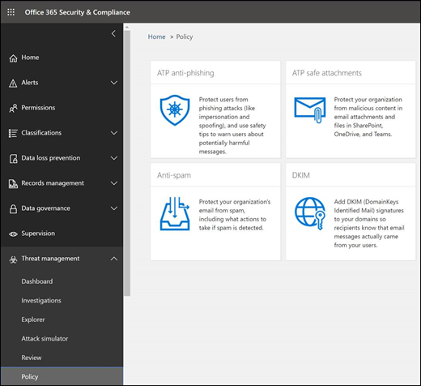

# 保護 Office 365 和 Microsoft 365 商務方案的前 10 個最佳方法

如果您是使用 Microsoft 商務方案之一的小型或中型組織，且您的組織類型是由網路罪犯和駭客的目標所組成，請使用本文中的指導方針增加組織的安全性。 本指南可協助您的組織達成 Harvard 甘迺迪 School [Cybersecurity 活動手冊](https://go.microsoft.com/fwlink/?linkid=2015598&amp;clcid=0x409)中所述的目標。
  
Microsoft 建議您完成下清單格中所列的工作，以套用至您的服務方案。 
  
||**工作**|**Office 365 商務進階版**|**Microsoft 365 商務版**|
|:-----|:-----|:-----|:-----|
|1     |[設定多重要素驗證](secure-your-business-data.md#setup)   |             |             |
|2     |[訓練您的使用者](secure-your-business-data.md#train)   |             |             |
|3     |[使用專用的系統管理員帳戶](secure-your-business-data.md#admin)   |             |             |
|4     |[提升郵件中惡意程式碼的保護層級](secure-your-business-data.md#malware)   |             |             |
|5     |[防護勒索軟體](secure-your-business-data.md#ransomware)   |             |             |
|6     |[停止電子郵件的自動轉寄功能](secure-your-business-data.md#forwarding)   |             |             |
|7     |[使用 Office 郵件加密](secure-your-business-data.md#encryption)   ||             |
|8     |[保護您的電子郵件免受網路釣魚攻擊](secure-your-business-data.md#phishing)   ||             |
|9     |[使用 ATP 安全附件防護惡意附件和檔案](secure-your-business-data.md#atp)   ||             |
|10     |[使用 ATP 安全連結防禦網路釣魚攻擊](secure-your-business-data.md#phishingatp)   ||             |
   
開始之前，請先在 Microsoft 365 安全性中心檢查您的[microsoft 365 安全分數](https://docs.microsoft.com/microsoft-365/security/mtp/microsoft-secure-score)。 您可以從集中式儀表板，監視及提高 Microsoft 365 身分識別、資料、應用程式、裝置和基礎結構的安全性。 您可以在設定建議的安全性功能、執行安全性相關工作（如查看報告），或使用協力廠商應用程式或軟體來處理建議的情況下，取得點數。 透過更深入的見解和更深入的 Microsoft 產品和服務集合，您可以自信地報告組織的安全性健康情況。
  

  
## 1：設定多重要素驗證

使用多重要素驗證是增加組織安全性的最簡單且最有效的方式之一。 它會比您登入時更輕鬆-當您登入時，多重要素驗證表示您會輸入您的電話中的程式碼，以取得 Microsoft 365 的存取權。 這可防止駭客在知道密碼的情況時採取行動。 多重要素驗證也稱為雙步驟驗證。 個人可以輕鬆地將兩步驟驗證新增至大多數帳戶，例如，加入其 Google 或 Microsoft 帳戶。 以下說明如何[將兩步驟驗證新增至您的個人 Microsoft 帳戶](https://go.microsoft.com/fwlink/?linkid=2016403&amp;clcid=0x409)。
  
針對使用 Office 365 和 Microsoft 365 的企業，新增設定，以要求使用者使用多重要素驗證來登入。 當您進行此項變更時，系統會提示使用者在下一次登入時設定其電話進行兩個要素驗證。
若要查看如何設定 MFA 的訓練影片和使用者完成設定的方式，請參閱[設定 mfa](https://support.office.com/article/e12187b8-216a-4490-9e3b-df34a06fb787)和[使用者設定](https://support.office.com/article/a32541df-079c-420d-9395-9d59354f7225)。
  
若要設定多重要素驗證：

1. 在系統[管理中心](https://go.microsoft.com/fwlink/p/?linkid=834822)中，選取 [**使用者** > 作用中**使用者**]。

2. 在 [作用中**使用者**] 區段中，選取 [ **Multi-Factor 驗證**]。

3. 在 [ **Multi-Factor 驗證**] 頁面上，選取 [**使用者**]，如果您要針對某個使用者啟用此項，或您可以執行**大量更新**。

4. 選取 [**快速步驟**] 下方的 [**啟用**]。

5. 在快顯視窗中，選擇 [**啟用 Multi-Factor 驗證**]。

為組織設定多重要素驗證之後，您的使用者必須在其裝置上設定雙步驟驗證。 如需詳細資訊，請參閱[設定 Office 365 的雙步驟驗證](https://support.office.com/article/ace1d096-61e5-449b-a875-58eb3d74de14)。
  
如需完整詳細資料及完整建議，請參閱[設定 Office 365 使用者的多重要素驗證](set-up-multi-factor-authentication.md)。
  
## 2：訓練您的使用者

Harvard 甘迺迪 School [Cybersecurity 活動手冊](https://go.microsoft.com/fwlink/?linkid=2015598&amp;clcid=0x409)提供好的指導方針，可為組織內的安全性感知建立強大的文化，包括訓練使用者來識別網路釣魚攻擊。 
  
除了這項指導之外，Microsoft 也建議您的使用者採取本文所述的動作：[保護您的帳戶和裝置免受駭客和惡意](https://support.office.com/article/066d6216-a56b-4f90-9af3-b3a1e9a327d6.aspx)代碼的攻擊。 這些動作包括：
  
- 使用強式密碼
    
- 保護裝置
    
- 啟用 Windows 10 和 Mac 電腦上的安全性功能
    
Microsoft 也建議您採取下列文章中建議的動作來保護其個人電子郵件帳戶：
  
- [協助保護您的 Outlook.com 電子郵件帳戶](https://support.office.com/article/a4f20fc5-4307-4ece-8231-6d4d4bd8a9ba.aspx)
    
- [使用2步驟驗證保護您的 Gmail 帳戶](https://go.microsoft.com/fwlink/?linkid=2015688&amp;clcid=0x409)
    
## 3：使用專用的系統管理員帳戶

您用來管理 Office 365 或 Microsoft 365 環境的管理帳戶包含較高的許可權。 這些是駭客和網路罪犯的有用目標。 僅使用系統管理帳戶進行管理。 系統管理員應該要有個別的使用者帳戶，以進行一般的非系統管理，而且只有在必要時才使用系統管理帳戶，才可完成與工作職能相關聯的工作。 其他建議：
  
- 請確定系統管理員帳戶也設定進行多重要素驗證。 
    
- 使用系統管理員帳戶之前，請先關閉所有不相關的瀏覽器會話和應用程式（包括個人電子郵件帳戶）。
    
- 完成系統管理工作之後，請務必登出瀏覽器會話。
    
## 4：提升郵件中惡意程式碼的保護層級

您的 Office 365 或 Microsoft 365 環境包括防範惡意程式碼，但是您可以使用常見於惡意程式碼的檔案類型來封鎖附件，以提升這種保護。 若要在電子郵件中增加惡意程式碼保護，請觀看[簡短的訓練影片](https://support.office.com/article/02b5783a-eea0-42e8-8856-62440718c3f0)，或完成下列步驟：
  
1. 移至[https://protection.office.com](https://protection.office.com)並以您的系統管理員帳號憑證登入。 
    
2. 在 [Office 365 安全性&amp;與合規性中心] 的左功能窗格中，在 [**威脅管理**] 底下，選擇 [**原則** \> **Anti-Malware**]。
    
3. 按兩下預設原則，以編輯此全公司原則。
    
4. 選取 [設定]****。
    
5. 在 [**一般附件類型篩選**] 底下，選取 [**開啟**]。 封鎖的檔案類型會列在此控制項底下的視窗中。 您可以稍後新增或刪除檔案類型（如有必要）。
    
6. 選取 [**儲存]。**
    
如需詳細資訊，請參閱[反惡意程式碼保護](https://go.microsoft.com/fwlink/?linkid=2015692&amp;clcid=0x409)。
  
## 5：防禦勒索軟體

勒索軟體會以加密檔案或鎖定電腦畫面限制存取資料。 然後，它會詢問 "ransom" （通常是在 exchange 中的 cryptocurrencies 如 Bitcoin），以從受害者 extort 金錢，以供 exchange 存取資料。 
  
您可以建立一或多個郵件流程規則來封鎖勒索軟體常用的副檔名，或警告使用電子郵件接收這些附件的使用者，以防禦勒索軟體。 最好的起點是建立兩個規則：
  
- 在開啟包含宏的 Office 檔案附件之前警告使用者。 勒索軟體可以隱藏在宏內，因此我們會警告使用者不要從他們不知道的人開啟這些檔案。 
    
- 封鎖可能包含勒索代碼或其他惡意程式碼的檔案類型。 我們會從常見的可執行檔案清單開始（列在下表中）。 如果您的組織使用任何這些可執行類型，而您想要以電子郵件傳送它們，請將它們新增至上一個規則（警告使用者）。
    
若要建立郵件傳輸規則、查看[簡短的訓練影片](https://support.office.com/article/a9ecca03-42a6-4867-b9fd-38e3f6bb06ad)，或完成下列步驟：
  
1. 移至 <a href="https://go.microsoft.com/fwlink/p/?linkid=2059104" target="_blank">Exchange 系統管理中心</a>。

2. 在 [**郵件流程**] 類別中，選取 [**規則**]。
    
3. 選取**+**[]，然後**建立新的規則**。
    
4. 選取對話方塊底部的 [* * * *]，以查看完整的選項組。 
    
5. 針對每個規則套用下表中的設定。 除非您想要變更這些設定，否則請保留預設值。
    
6. 選取 [儲存]****。
    
|**設定**|**開啟 Office 檔案的附件之前警告使用者**|**封鎖可能包含勒索代碼或其他惡意程式碼的檔案類型**|
|:-----|:-----|:-----|
|名稱    |反內部的勒索軟體規則：警告使用者    |防勒索軟體規則：封鎖檔案類型    |
|將此規則套用至 if。 . .    |任何附件。 . . 副檔名符合。 . .    |任何附件。 . . 副檔名符合。 . .    |
|指定字詞或片語    |新增下列檔案類型：    .docm、xlsm、sltm、xla、xlam、xll、pptm、potm、ppam、ppsm、sldm    |新增下列檔案類型：    ade、adp、ani、bas，bat，chm，cmd，com，cpl，crt，.hlp，ht，的 hta，inf，ins，jse，mdb，mdb，mde，mdz，msc，msi，msp，.msp，.pcd，reg，.scr，sct，wsc，wsf，wsh，vbe，pif    |
|請執行下列動作。 . .    |以郵件通知收件者    |封鎖郵件。 . . 拒絕郵件並包含說明    |
|提供郵件文字    |除非您想要的話，否則請勿開啟這些類型的檔，因為檔案可能包含惡意程式碼，而且知道寄件者不會保證安全性。   |
|
   
> [!TIP]
> 您也可以將您想要封鎖的檔案新增至[步驟 4](#4-raise-the-level-of-protection-against-malware-in-mail)中的反惡意代碼清單。

如需詳細資訊，請參閱：
  
- [如何處理勒索軟體](https://go.microsoft.com/fwlink/?linkid=2016501&amp;clcid=0x409)
    
- [還原您的 OneDrive](https://support.office.com/article/fa231298-759d-41cf-bcd0-25ac53eb8a15.aspx)
    
## 6：停止自動轉送電子郵件

取得使用者信箱存取權的駭客可以將信箱設定為自動轉寄電子郵件，以 exfiltrate 郵件。 即使沒有使用者的認知，也可能會發生這種情況。 您可以設定郵件流程規則，避免發生這種情況。 
  
若要建立郵件傳輸規則：
  
1. 移至 <a href="https://go.microsoft.com/fwlink/p/?linkid=2059104" target="_blank">Exchange 系統管理中心</a>。

2. 在 [**郵件流程**] 類別中，選取 [**規則**]。
    
3. 選取**+**[]，然後**建立新的規則**。
    
4. 在對話方塊底部選取 [**更多選項**]，以查看完整的選項組。 
    
5. 套用下表中的設定。 除非您想要變更這些設定，否則請保留預設值。
    
6. 選取 [儲存]****。
    
|**設定**|**開啟 Office 檔案的附件之前警告使用者**|
|:-----|:-----|
|名稱    |禁止將電子郵件自動轉寄轉送至外部網域    |
|將此規則套用至 if .。。    |寄件者。 . . 為外部/內部。 . . 組織內部    |
|新增條件    |郵件屬性。 . . 包含郵件類型。 . . 自動轉寄    |
|請執行下列動作 .。。    |封鎖郵件。 . . 拒絕郵件並包含說明。    |
|提供郵件文字    |由於安全性原因，禁止此組織外部的電子郵件的自動轉寄電子郵件。    |
   
## 7：使用 Office 郵件加密

Office 郵件加密隨附于 Microsoft 365。 已設定好。 透過 Office 郵件加密，您的組織可以在組織內部和外部的人員之間傳送和接收加密的電子郵件。 Office 365 郵件加密可與 Outlook.com、Yahoo！、Gmail 及其他電子郵件服務搭配使用。 電子郵件加密可協助確保只有預定的收件者可以查看郵件內容。
  
在傳送郵件時，Office 郵件加密會提供兩個保護選項：
  
- 請勿轉寄
    
- 加密
    
您的組織可能已設定其他選項，可將標籤套用至電子郵件，例如機密。
  
### 傳送受保護的電子郵件

在 [適用于電腦的 Outlook] 中，選取 [電子郵件] 中的**選項**，然後選擇 [**許可權**]。 
  

  
在 Outlook.com 中，選取電子郵件中的 [**保護**]。 預設保護不會**轉寄**。 若要將此設為加密，請選取 [**變更許可權** \> **加密**]。 
  

  
### 若要接收加密電子郵件

如果收件者有 Outlook 2013 或 Outlook 2016 和 Office 365 電子郵件帳戶，他們會在讀取窗格中看到有關該專案限制許可權的警示。 開啟郵件後，收件者可以像任何其他方式一樣查看郵件。
  
如果收件者使用另一個電子郵件用戶端或電子郵件帳戶，例如 Gmail 或 Yahoo，他們會看到可讓他們登入電子郵件訊息或要求單一時間密碼以在網頁瀏覽器中查看郵件的連結。 如果使用者未收到電子郵件，請他們檢查其 [垃圾郵件] 或 [垃圾郵件] 資料夾。 
  
如需詳細資訊，請參閱[在 Outlook 中傳送、查看和回復加密郵件的電腦](https://support.office.com/article/eaa43495-9bbb-4fca-922a-df90dee51980.aspx)。
  
## 8. 保護您的電子郵件免受網路釣魚攻擊

如果您已為 Office 365 或 Microsoft 365 環境設定一或多個自訂網域，您可以設定目標的反網路釣魚防護。 ATP 反網路釣魚保護，部分的 Office 365 高級威脅防護，可協助保護您的組織免受惡意模擬型網路釣魚攻擊和其他網路釣魚攻擊。 若尚未設定自訂網域，您不需要執行此動作。
  
建議您建立原則來保護您最重要的使用者和自訂網域，以開始使用這項保護。 
  

  
若要建立 ATP 反網路釣魚原則，請觀看[簡短的訓練影片](https://support.office.com/article/86c425e1-1686-430a-9151-f7176cce4f2c)，或完成下列步驟：
  
1. 請移至 [https://protection.office.com](https://protection.office.com)。 
    
2. 在 [Office 365 安全性&amp;與合規性中心] 的左功能窗格中，選取 [**威脅管理**] 底下的 [**原則**]。
    
3. 在 [原則] 頁面上，選取 [ **ATP 反網路釣魚**]。
    
4. 在 [反網路釣魚] 頁面上，選取 [ **+ 建立**]。 嚮導會啟動以逐步逐步定義您的反網路釣魚原則。
    
5. 請依照下表中的建議，指定原則的名稱、描述及設定。 如需詳細資訊，請參閱[瞭解 ATP 反網路釣魚原則選項](https://go.microsoft.com/fwlink/?linkid=2016505&amp;clcid=0x409)。 
    
6. 檢查您的設定之後，請選取 [**建立這個原則**] 或 [**儲存**] （視需要）。
    
|**設定或選項**|**建議的設定**  |
| :-------| :-----|
|名稱    |網域和最有價值的活動人員    |
|描述    |確定最重要的人員和我們的網域未進行類比。    |
|新增要保護的使用者    |選取 **[+ 新增條件]，收件者是**。 輸入使用者名稱，或輸入候選人、活動管理員及其他重要員工成員的電子郵件地址。 您最多可以新增20個要從類比中保護的內部和外部地址。    |
|新增要保護的網域    |選取 **[+ 新增條件]，收件者網域是**。 輸入您的 Microsoft 365 訂閱相關聯的自訂網域（如果您已定義的話）。 您可以輸入一個以上的網域。    |
|選擇動作    |如果模仿的使用者傳送電子郵件：選取 [重新**導向郵件至另一個電子郵件地址**]，然後輸入安全性管理員的電子郵件地址。例如，securityadmin@contoso.com。          如果模仿的網域傳送電子郵件： [選取**隔離郵件**]。    |
|信箱情報    |當您建立新的反網路釣魚原則時，系統會預設選取信箱情報。 請將此設定保留為 **[開啟]**，以獲得最佳結果。    |
|新增受信任的寄件者與網域    |在此範例中，請不要定義任何覆寫。    |
|套用對象    |請選取 **[收件者的網域是]**。 在 **[任一項]** 底下選取 **[選擇]**。 選取 **[+ 新增]**。 選取功能變數名稱（例如，contoso.com，在清單中）旁的核取方塊，然後選取 [**新增**]。 選取 **[完成]**。    |
   
如需詳細資訊，請參閱[設定 Office 365 ATP 反網路釣魚原則](https://go.microsoft.com/fwlink/?linkid=2016505&amp;clcid=0x409)。
  
## 9：防禦具有 ATP 安全附件的惡意附件和檔案

人們經常傳送、接收及共用附件，例如文件、簡報和試算表等等。 只查看電子郵件訊息，不一定可輕易知道附件是否安全或有危害。 Office 365 的高級威脅防護包括 ATP 安全附件保護，但預設不會開啟此保護。 建議您建立新的規則，以開始使用這種保護。 這項保護會延伸至 SharePoint、OneDrive 和 Microsoft 小組中的檔案。
  
若要建立 ATP 安全附件原則，請觀看[簡短的訓練影片](https://support.office.com/article/e7e68934-23dc-4b9c-b714-e82e27a8f8a5)，或完成下列步驟：
  
1. 移至[https://protection.office.com](https://protection.office.com)並以您的系統管理員帳戶登入。 
    
2. 在 [Office 365 安全性&amp;與合規性中心] 的左功能窗格中，選取 [**威脅管理**] 底下的 [**原則**]。
    
3. 在 [原則] 頁面上，選取 [ **ATP 安全附件**]。
    
4. 在 [安全附件] 頁面上，選取 [**開啟 SharePoint、OneDrive 和 Microsoft 小組的 ATP** ] 核取方塊，廣泛套用此保護。 
    
5. 選取**+** 以建立新的原則。 
    
6. 套用下表中的設定。 
    
7. 檢查您的設定之後，請選取 [**建立這個原則**] 或 [**儲存**] （視需要）。

|**設定或選項**|**建議的設定**  |
| :-------| :-----|
|名稱    |使用偵測到的惡意程式碼封鎖目前和未來的電子郵件。    |
|描述    |使用偵測到的惡意程式碼封鎖目前和未來的電子郵件和附件。    |
|儲存附件未知的惡意程式碼回應    |Select **Block-封鎖目前和未來的電子郵件和附件偵測到的惡意**代碼。    |
|在偵測時重新導向附件    |啟用重新導向（選取此方塊）輸入系統管理員帳戶或隔離的信箱設定。          若惡意程式碼掃描附件超時或發生錯誤，請套用上述選取範圍（選取此方塊）。    |
|套用對象    |收件者網域是。 . . 選取您的網域。    |
|
   
如需詳細資訊，請參閱[設定 Office 365 ATP 反網路釣魚原則](https://go.microsoft.com/fwlink/?linkid=2016505&amp;clcid=0x409)。
  
## 10：防禦具有 ATP 安全連結的網路釣魚攻擊

駭客有時候會在電子郵件或其他檔案的連結中隱藏惡意網站。 Office 365 ATP 安全連結（ATP 安全連結）是 Office 365 高級威脅防護的一部分，可在電子郵件訊息和 Office 檔中提供網頁位址（URLs）的時間驗證，以協助保護您的組織。 保護是透過 ATP 安全連結原則定義。
  
我們建議您執行下列作業：
  
- 修改預設原則以提升保護。
    
- 新增針對您網域中所有收件者的新原則。
    
若要取得 ATP 安全連結，請觀看[簡短的訓練影片](https://support.office.com/article/61492713-53c2-47da-a6e7-fa97479e97fa)，或完成下列步驟：
  
1. 移至[https://protection.office.com](https://protection.office.com)並以您的系統管理員帳戶登入。 
    
2. 在 [Office 365 安全性&amp;與合規性中心] 的左功能窗格中，選取 [**威脅管理**] 底下的 [**原則**]。
    
3. 在 [原則] 頁面上，選取 [ **ATP 安全連結**]。
    
若要修改預設原則：
  
1. 在 [安全連結] 頁面上，于 [套用**至整個組織的原則**] 底下，選取**預設**原則。 
    
2. 在 [**電子郵件除外，套用至內容**] 底下，選取 [ **office 365 ProPlus，office For iOS 和 Android**。
    
3. 選取 [儲存]****。 
    
若要建立新的原則針對您網域中的所有收件者：
  
1. 在 [安全連結] 頁面上，于 [套用**至整個組織**的原則**+** ] 底下，選取 [建立新原則]。 
    
2. 套用下表所列的設定。
    
3. 選取 [儲存]****。 
    
**設定或選項**|**建議的設定**  |
| :-------| :-----|
|名稱    |網域中所有收件者的安全連結原則    |
|選取郵件中未知可能惡意 URLs 的動作    |選取 **[URLs 會在使用者按一下連結時，重新寫入並檢查已知惡意連結的清單**。    |
|使用安全附件掃描可下載的內容    |選取此方塊。    |
|套用對象    |收件者網域是。 . . 選取您的網域。    |
|
   
如需詳細資訊，請參閱[Office 365 ATP 安全連結](https://go.microsoft.com/fwlink/?linkid=2016138&amp;clcid=0x409)。
