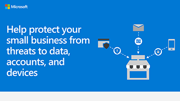

# 適用于小型企業的安全性資訊圖形Security info graphic for small businesses

**摘要：** 瞭解您的業務面臨之威脅的基本術語，以及您可以採取哪些措施來保護您的資料、帳戶和裝置。**Summary:** Learn the basic terms for the threats your business faces and what you can do to protect your data, accounts, and devices. 做為適用于商務用 Microsoft 365 的系統管理員，採取行動使您的業務更安全，並協助每個員工瞭解如何讓您的商務資料和裝置安全。As an admin for Microsoft 365 for business, take action to make your business more secure, and help every employee learn how to keep your business data and devices safe.

下列 PowerPoint 和 PDF 的連結可以以 tabloid 格式（也稱為分類帳、11 x 17 或 A3）下載及列印。The links for PowerPoint and PDF below can be downloaded and printed in tabloid format (also known as ledger, 11 x 17, or A3).

[PDF](downloads/smbthreatprotection-infographic.pdf) | [PowerPoint](https://github.com/MicrosoftDocs/microsoft-365-docs-pr/raw/live/m365-democracy/microsoft-365/admin/downloads/smbthreatprotection-infographic.pptx)[PDF](downloads/smbthreatprotection-infographic.pdf) | [PowerPoint](https://github.com/MicrosoftDocs/microsoft-365-docs-pr/raw/live/m365-democracy/microsoft-365/admin/downloads/smbthreatprotection-infographic.pptx)
