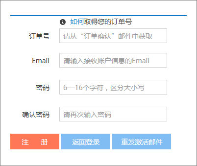
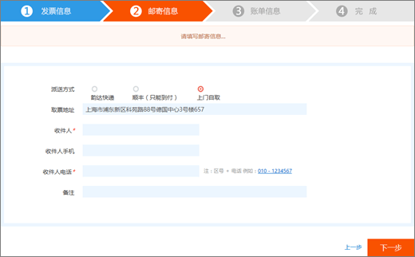
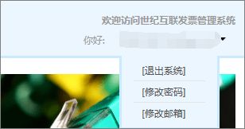

# 由 21Vianet 運作的 Office 365 申請發票

您可以提交至 21Vianet 發票管理系統發票要求約三天後沒有付費。 您提交發票要求之後，它會處理在兩天內。
  

  
## 步驟 1： 申請發票

有兩種方式可申請發票：
  
1. 由 21Vianet 網站運作的 Office 365 中進行付款之後, 就會收到訂單確認電子郵件，其中包含您的訂單編號和發票管理系統的連結。 您可以使用電子郵件中的連結， <a href="https://go.microsoft.com/fwlink/p/?linkid=837466" target="_blank">21Vianet 發票的資訊管理系統</a>中建立帳戶。
    
    或者
    
2. 您可以申請發票，從<a href="https://go.microsoft.com/fwlink/p/?linkid=850627" target="_blank">系統管理中心</a>。
    
    ![在 Microsoft 365 系統管理中心的 [帳單] 頁面。](../media/a6e3b953-abd4-46aa-a910-08c517915a21.png)
  
## 步驟 2： 註冊 21Vianet 發票管理系統

> [!NOTE]
> 您可以使用相同的電子郵件名稱和密碼為您的 Office 365 帳戶，或您可以使用不同的項目。 
  
1. 移至<a href="https://go.microsoft.com/fwlink/p/?linkid=837466" target="_blank">21Vianet 發票的資訊管理系統</a>。
    
2. 在註冊表單中，輸入您的訂單號碼、 電子郵件地址和密碼，然後選取 [**註冊**。
    
    
  
3. 您的註冊完成後，系統將會啟用電子郵件傳送給您的電子郵件地址中。 開啟電子郵件訊息，並選取 [啟用您的帳戶] 連結。
    
## 步驟 3： 提交您的帳單發票

1. 登入<a href="https://go.microsoft.com/fwlink/p/?linkid=837465" target="_blank">發票管理系統</a>。
    
2. 選取帳單的記錄，然後選取 [**套用帳單**。
    
    > [!NOTE]
    > 付款系統是協力廠商平台上，並採取三天的時間可以同步處理的順序與付款的記錄。 
  
    
  
3. 選取發票類型，輸入所需的資訊，然後選取 [**下一步**。
    
    
  
    > [!NOTE]
    > - 針對一般 VAT 發票，您只需要輸入該位購買者的名稱。
    > - 如有需要，您可以申請發票具有不同的標題。 不過，您只能在一個卷的一個發票標題套用在系統中。 如果您想要分割成不同的金額或標題的發票，請<a href="https://portal.partner.microsoftonline.cn/Support/SupportOverview.aspx" target="_blank">將提交您在系統管理中心的要求</a>。
    > - 下一次申請發票，系統會自動呈現先前的發票資訊。
    > - 如果您需要購買憑證或退款，必須符合的付款者名稱與發票標題。
    
4. 選取 [運送方式，然後輸入郵件的資訊。 您可以選擇 Yunda 或 SF （運費收集）。 您也可以移至要取得發票 21Vianet 上海分支。 選取 [**下一步**]。
    
    
  
    **21Vianet 上海分支公司地址：**

    從上海，Pudong 新區域 Keyuan 隨身攜帶 [否]。 88，德文中心建置 3，657

    **連絡人資訊：**

    Zhu qin qin 021 28986102
   
5. 確認資訊正確，然後選取 [ **Confirm**。
    
    ![發票要求表單的 [確認] 頁面。](../media/18706d9d-defc-4285-8fd3-990448b44a18.png)
  
## 步驟 4： 檢查應用程式進度

應用程式自動傳輸值得 21Vianet 服務，並將兩個工作天內完成。
  
您提交的應用程式後，您可以隨時查看進度。 我們將會更新您的應用程式的狀態與**發行**或**出 Mailed**之類的註解。
  

  
使用超出發票時，系統會顯示通知，且會指出發出發票的預計的時間。
  

  
## 常見問題集

### 從 [線上支援可以取得哪些服務？

您可以檢查您的發票要求的進度，並找出您還沒有收到發票的原因為何。
  
如果您想要變更的發票標題，請將發票傳送給我們，我們將會重新提交的發票。 您可以提交要求透過<a href="https://portal.partner.microsoftonline.cn/Support/SupportOverview.aspx" target="_blank">系統管理中心</a>。
  

  
### 如何變更我的登入電子郵件地址和密碼？

1. 登入<a href="https://go.microsoft.com/fwlink/p/?linkid=837465" target="_blank">發票管理系統</a>中，然後選取 [**變更電子郵件地址**。
    
    
  
2. 如果您忘記您的登入的密碼，您可以使用您的登入電子郵件地址重設密碼。 發票管理系統會將新的密碼傳送到您的電子郵件地址。 您可以使用新的密碼以登入。
    
    
  
3. 如果您忘記您的登入電子郵件地址，請連絡 21Vianet 客戶服務 (86) 400-089-0365。
    
### 如何尋找我的順序識別碼？

1. 在[系統管理中心](https://go.microsoft.com/fwlink/p/?linkid=850627)，移至**帳單** \> **帳單 & 付款**] 頁面。
    
2. 尋找您想要選取若要檢視，或選擇下載 PDF 發票。

  
### 如果我註冊時輸入錯誤的電子郵件地址？

如果您輸入錯誤的電子郵件地址，當您註冊時，不會收到啟用電子郵件。 電子郵件中的 [註冊] 連結會自動將在 24 小時後到期。 您可以回到<a href="https://go.microsoft.com/fwlink/p/?linkid=837466" target="_blank">註冊] 頁面上</a>，並重新註冊正確的電子郵件地址。 
  
### 如果我未收到啟用電子郵件？

如果您未收到帳戶啟用電子郵件，您在註冊後的 24 小時內，移至<a href="https://go.microsoft.com/fwlink/p/?linkid=837466" target="_blank">21Vianet 發票的資訊管理系統</a>，輸入您的電子郵件地址，然後選取 [ **Resend 啟用電子郵件**。 系統將會重新傳送至您已註冊的電子郵件地址的帳戶啟用電子郵件。
  

  
如果您仍未收到啟用電子郵件，請連絡 21Vianet 客戶服務 (86) 400-089-0365。