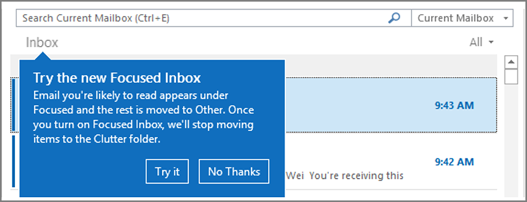

# <a name="configure-focused-inbox-for-everyone-in-your-organization"></a>為組織中的每個人設定焦點收件匣

如果您負責為企業中的每個人設定電子郵件的運作方式，本文就是為您準備的！ 本文說明如何為您的企業自訂或關閉焦點收件匣，以及回答[常見問題集](#faq-for-focused-inbox)。

如果您只想要關閉自己的焦點收件匣，請參閱[關閉焦點收件匣](https://support.microsoft.com/office/f714d94d-9e63-4217-9ccb-6cb2986aa1b2)。  

如果您想要確認您的使用者接收特定商務電子郵件訊息 (例如 HR 或薪資資料)，您可以設定焦點收件匣，讓這些訊息可送往 [焦點] 檢視。您也可以控制您組織中的使用者是否會在信箱中看到焦點收件匣。
  
## <a name="turn-focused-inbox-on-or-off-in-your-organization"></a>開啟或關閉組織中的焦點收件匣

您可以使用 PowerShell 為組織中的每個人開啟或關閉焦點收件匣。 您要在 Microsoft 365 系統管理中心執行這個動作嗎？ 讓我們的工程小組知道。 **[在這裡投票！](https://go.microsoft.com/fwlink/?linkid=862489)**
  
**關閉焦點收件匣：**
  
下列 PowerShell 範例會 **關閉** 組織中的焦點收件匣。但是，它不會阻止您的使用者使用該功能。如果使用者想要使用的話，他們仍然可以在每個用戶端重新啟用焦點收件匣。 
  
1. [使用遠端 PowerShell 連線到 Exchange Online](/powershell/exchange/connect-to-exchange-online-powershell)。

2. 您需要先獲指派權限，才能執行此程序或各個程序。若要查看您需要哪些權限，請參閱[訊息原則與合規性權限](/exchange/messaging-policy-and-compliance-permissions-exchange-2013-help) 中的「傳輸規則」項目。

3. 執行 **Get-OrganizationConfig** Cmdlet。 

    ```powershell
    Get-OrganizationConfig
    ```

4. 尋找 **FocusedInboxOn** 以檢視其目前的設定： 

    
  
5. 執行下列 Cmdlet 關閉焦點收件匣。

    ```powershell
    Set-OrganizationConfig -FocusedInboxOn $false
    ```

6. 再次執行 **Get-OrganizationConfig** cmdlet ，您就會看到 FocusedInboxOn 設為 $false，這表示它已經關閉。 

**開啟焦點收件匣：**
  
- 在上方步驟 5 中，執行下列 cmdlet 可開啟焦點收件匣。

  ```powershell
  Set-OrganizationConfig -FocusedInboxOn $true
  ```
    
## <a name="what-do-users-see-after-i-turn-on-focused-inbox"></a>開啟焦點收件匣之後，使用者會看見什麼？

當使用者關閉並重新啟動 Outlook 之後，只會看到 [焦點] 檢視。當他們重新啟動 Outlook 後，就會在 Outlook 使用者介面看見一則提示，提供他們使用新焦點收件匣的選項。
  

  
如果您從 [待過濾郵件] 切換至 [焦點收件匣]，他們能決定要啟用 ([試用]) 或是關閉該功能。如果使用者有多個 (受支援的) 用戶端，他們能個別啟用/停用其 [焦點收件匣]。提示看起來像這樣：
  

  
當使用者決定要開始使用 [焦點收件匣] 時，[待過濾郵件] 便會自動停用。該 [待過濾郵件] 資料夾會轉換成一般的資料夾，讓使用者能重新命名或刪除。
  
## <a name="turn-focused-inbox-on-or-off-for-specific-users"></a>針對特定的使用者開啟或關閉焦點收件匣

此範例針對 Contoso 組織中的 Tim Matthews 關閉焦點收件匣。 但是，它不會阻止他使用該功能。 如果他想要的話，仍然可以在每個用戶端重新啟用焦點收件匣。 
  
1. [使用遠端 PowerShell 連線到 Exchange Online](/powershell/exchange/connect-to-exchange-online-powershell)。

2. 需要先指派權限，您才能執行此程序或各個程序。若要查看您需要哪些權限，請參閱訊息原則與合規性權限主題中的「傳輸規則」項目。

3. 執行 **Get-FocusedInbox** cmdlet，例如： 

    ```powershell
    Get-FocusedInbox -Identity <tim@contoso.com>
    ```

4. 尋找 FocusedInboxOn 以檢視其目前的設定：

    
  
5. 執行下列 Cmdlet 關閉焦點收件匣：

    ```powershell
    Set-FocusedInbox -Identity <tim@contoso.com> -FocusedInboxOn $false
    ```

    或者，執行下列 Cmdlet 將它開啟：

    ```powershell
    Set-FocusedInbox -Identity <tim@contoso.com> -FocusedInboxOn $true
    ```

## <a name="use-the-ui-to-create-a-transport-rule-to-direct-email-messages-to-the-focused-view-for-all-your-users"></a>使用 UI 建立傳輸規則，將電子郵件導向至所有使用者的 [焦點] 檢視。

1. 移至 <a href="https://go.microsoft.com/fwlink/p/?linkid=2059104" target="_blank">Exchange 系統管理中心</a>。

2. 瀏覽至 **[郵件流程]** \> **[規則]**。 選取 ![[EAC 新增] 圖示](../../media/795e5bdd-48bb-433f-8e07-3c7a19f8eca2.gif)，然後選取 **[建立新的規則...]**。 

3. 建立新的規則完成後，選取 **[儲存]** 以啟動規則。

    下列影像顯示讓來自「薪資部門」的所有郵件傳送到焦點收件匣的範例。

    

    > [!NOTE]
    > 在此範例中的郵件標頭值文字為，**X-MS-Exchange-Organization-BypassFocusedInbox**。
  
## <a name="use-powershell-to-create-a-transport-rule-to-direct-email-messages-to-the-focused-view-for-all-your-users"></a>使用 PowerShell 建立傳輸規則，將電子郵件導向至所有使用者的 [焦點] 檢視

1. [使用遠端 PowerShell 連線到 Exchange Online](/powershell/exchange/connect-to-exchange-online-powershell)。

2. 您需要先獲指派權限，才能執行此程序或各個程序。若要查看您需要哪些權限，請參閱[訊息原則與合規性權限](/exchange/messaging-policy-and-compliance-permissions-exchange-2013-help) 中的「傳輸規則」項目。

3. 例如，執行下列命令，讓來自「薪資部門」的所有郵件傳送到焦點收件匣。

    ```powershell
    New-TransportRule -Name <name_of_the_rule> -From "Payroll Department" -SetHeaderName "X-MS-Exchange-Organization-BypassFocusedInbox" -SetHeaderValue "true"
    ```

> [!IMPORTANT]
> 在此範例中，"X-MS-Exchange-Organization-BypassFocusedInbox" 和 "true" 有區分大小寫。
> 同時，焦點收件匣會受限於略過待過濾郵件的 X 標頭，因此，如果在待過濾郵件中使用此設定，它也將用於焦點收件匣。 如需詳細的語法和參數資訊，請參閱 [New-TransportRule](/powershell/module/exchange/new-transportrule)。

### <a name="how-do-you-know-this-worked"></a>如何知道這是否正常運作？

您可以檢查電子郵件訊息標題，以查看電子郵件是否由於略過焦點收件匣傳輸規則，而在收件箱中登陸。 從組織中已套用焦點收件匣傳輸規則的信箱中，選擇一封電子郵件。 查看郵件上的標題，您應該會看到 **X-MS-Exchange-Organization-BypassFocusedInbox: true** 標題。 這表示略過正常運作。 如需如何尋找標題資訊的詳細資訊，請查看 [檢視電子郵件的網際網路標題資訊](https://go.microsoft.com/fwlink/p/?LinkId=822530) 文章。

### <a name="what-will-the-user-see"></a>使用者會看到什麼？

如果傳輸規則已就位，將會顯示進行覆蓋的通知。 Outlook 網頁版將會停用「一律移至其他」，並顯示工具提示。 桌面版 Outlook 用戶端將允許選取「一律移至其他」，並彈出對話方塊。

## <a name="turn-onoff-clutter"></a>開啟/關閉 [待過濾郵件]

我們收到的報告指出，部分使用者的 [待過濾郵件] 會突然停止運作。如果發生這種情況，您可以為特定的使用者重新啟用。請參閱[為貴組織設定待過濾郵件](../email/configure-clutter.md)。

## <a name="faq-for-focused-inbox"></a>焦點收件匣常見問題集

以下是關於焦點收件匣常見問題集的解答。

### <a name="can-i-control-how-i-roll-out-focused-inbox-in-my-organization"></a>我是否可以控制在我的組織中推出焦點收件匣的方式？

是。您可以針對整個組織開啟或關閉焦點收件匣，也可以針對指定的使用者開啟或關閉該功能。請參閱上述內容。
  
### <a name="is-the-focused-inbox-feature-only-available-for-office-2016-clients"></a>焦點收件匣功能「僅適用於」Office 2016 用戶端嗎？

是，只有 Office 2016 的使用者會受到影響。該功能不會回溯到 Outlook 2013 或更舊版本。
  
### <a name="how-long-does-it-take-for-focused-inbox-changes-to-take-place-in-outlook"></a>焦點收件匣變更需要多久時間才能在 Outlook 中生效？

一旦您開啟或關閉焦點收件匣，設定將在您的使用者關閉並重新啟動 Outlook 後生效。
  
### <a name="what-happens-to-clutter-once-i-turn-on-focused-inbox"></a>當我開啟焦點收件匣之後，待過濾郵件會發生什麼情況？

切換之後，您的 [待過濾郵件] 資料夾就不會再收到可執行的電子郵件。電子郵件將改為分類至收件匣的 [焦點] 及 [其他] 索引標籤中。用來將郵件移至 [待過濾郵件] 資料夾的相同演算法現在改用來實現焦點收件匣功能，也就是說以前設定為移至 [待過濾郵件] 的任何電子郵件，現在都會移至 [其他]。已經在 [待過濾郵件] 資料夾中的任何郵件仍會留在該資料夾中，直到您決定刪除或移動它們為止。
  
請參閱 Microsoft 最有價值專家 [Tony Redmond](https://www.petri.com/author/tony-redmond) 的這篇文章： [焦點收件匣如何取代 Office 365 內部的待過濾郵件](https://www.petri.com/focused-inbox-office-365)。
  
### <a name="can-i-keep-users-on-clutter-what-is-microsofts-recommendation-when-it-comes-to-using-clutter-vs-focused-inbox"></a>可讓使用者各自使用待過濾郵件嗎？Microsoft 對使用待過濾郵件與焦點收件匣的建議是什麼？

是，您可以讓使用者使用待過濾郵件功能，並停用焦點收件匣，但最終焦點收件匣會完全取代待過濾郵件，因此，Microsoft 建議您立即移動至焦點收件匣。若要深入了解搭配 Exchange Online 使用待過濾郵件的時機，請參閱此部落格文章：[焦點收件匣和待過濾郵件計劃的更新](https://techcommunity.microsoft.com/t5/Outlook-Blog/Update-on-Focused-Inbox-and-our-plans-for-Clutter/ba-p/136448)。
  
### <a name="should-i-disable-clutter-for-my-end-users-if-we-are-going-to-move-everyone-to-focused-inbox"></a>如果我們要將每個人都移動到焦點收件匣，我是否應該為我的使用者停用待過濾郵件？

否。可以透過執行 Set-Clutter Cmdlet 針對信箱明確停用待過濾郵件。但是，如果您這麼做，信箱擁有者會看到先前已重新導向到 [待過濾郵件] 資料夾的郵件保留在收件匣中，且他們必須處理這些郵件，直到他們的用戶端升級為支援焦點收件匣的版本。因此，在可以使用升級的用戶端之前，不建議停用待過濾郵件。
  
### <a name="why-are-there-two-different-cmdlets-for-managing-focused-inbox"></a>為什麼有兩個不同的 Cmdlet 可用來管理焦點收件匣？

有兩個狀態與焦點收件匣相關聯。
  
- **組織層級**：焦點收件匣狀態，以及相關聯的最後更新時間戳記。

- **信箱層級**：焦點收件匣狀態，以及相關聯的最後更新時間戳記。 

### <a name="how-does-outlook-decide-to-show-the-focused-inbox-experience-with-these-two-states"></a>Outlook 如何決定透過這兩種狀態顯示焦點收件匣體驗？

Outlook 會透過選擇具有最新時間戳記的 Cmdlet 來顯示體驗。根據預設，這兩個時間戳記都是 "null"，在此情況下會啟用此功能。
  
### <a name="why-does-the-get-focusedinbox-cmdlet-return-true-when-ive-turned-focused-inbox-off-in-my-organization"></a>當我在組織中將焦點收件匣關閉時，為什麼 Get-FocusedInbox Cmdlet 會傳回 “true”？

有兩個用於控制焦點收件匣的 Cmdlet。當您針對信箱執行 Get-FocusedInbox 時，它會傳回功能的信箱層級狀態。Outlook 中的體驗是根據前次修改的 Cmdlet 狀態來選擇的。
  
### <a name="can-i-run-a-script-to-see-who-has-turned-on-focused-inbox"></a>是否可以執行指令碼以查看誰開啟焦點收件匣？

否，這是預設的設計。焦點收件匣啟用為用戶端設定，因此 Cmdlet 只能告訴您使用者的信箱是否符合用戶端體驗的資格。有可能發生某些用戶端啟用焦點收件匣，但某些用戶端停用這項功能的情況，比方說，在 Outlook App 啟用焦點收件匣，但在 Outlook 網頁版停用此功能。

## <a name="related-content"></a>相關內容

[為貴組織設定待過濾郵件](../email/configure-clutter.md) (文章)
[設置共用信箱的設定](../email/configure-a-shared-mailbox.md) (文章)
[建立簽章及免責聲明](create-signatures-and-disclaimers.md) (影片)
