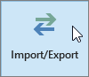

# 將電子郵件和連絡人移轉到 Microsoft 365

匯入或遷移來自 Gmail 或其他電子郵件提供者的電子郵件，以 Microsoft 365。
  
 **需要協助做什麼？**  [Microsoft 365 商務支援人員的連絡方式](../../business-video/get-help-support.md)。 
  
您必須使用安裝在桌面上的 Outlook 版本，才能執行這項工作。 Outlook 包含在大部分 Microsoft 365[計畫](https://go.microsoft.com/fwlink/p/?LinkId=723731)中。
  
### 將 Gmail 遷移至 Microsoft 365

請遵循下列步驟，將電子郵件、連絡人及行事曆從 Gmail 匯入至具有 Microsoft 365 的 Outlook：
  
- [將 Gmail 匯入 Outlook](https://support.microsoft.com/office/20fdb8f2-fed8-4b14-baf0-bf04b9c44bf7)
    
- [匯入連絡人至 Outlook](https://support.microsoft.com/office/bb796340-b58a-46c1-90c7-b549b8f3c5f8)
    
- [匯入 Google Calendar](https://support.microsoft.com/office/098ed60c-936b-41fb-83d6-7e3786437330)

## 觀賞：匯入行事曆
    
> [!VIDEO https://www.microsoft.com/videoplayer/embed/c1e45708-9a92-475b-910b-f5aa40614d92?autoplay=false]
  
### 將 Outlook pst 檔案匯入 Microsoft 365 (桌面) 

請遵循下列步驟，將電子郵件、連絡人及行事曆從 Outlook 匯出到 .pst 檔案，然後匯入該檔案，以 Microsoft 365 Outlook：
  
1. [匯出電子郵件、連絡人及行事曆](https://support.microsoft.com/office/14252b52-3075-4e9b-be4e-ff9ef1068f91)
    
2. [匯入郵件、連絡人及行事曆](https://support.microsoft.com/office/431a8e9a-f99f-4d5f-ae48-ded54b3440ac)
    
如果您只想要連絡人，請遵循下列步驟：
  
1. [從 Outlook 匯出連絡人](https://support.microsoft.com/office/10f09abd-643c-4495-bb80-543714eca73f)
    
2. [匯入連絡人至 Outlook](https://support.microsoft.com/office/bb796340-b58a-46c1-90c7-b549b8f3c5f8)
    
若要開始處理常式，請開啟 Outlook，**然後選擇 [** 檔案 \> **開啟 &amp; 匯出** \> **匯入/匯出**]。
  
![Outlook 2016 中的 [檔案] 功能表](../../media/2f1c39a5-177e-4052-9dd8-90c0d140be2c.png)
  
## 在 Outlook 中查看其他電子郵件帳戶

只想要查看 Outlook 中的其他提供者 (例如 Gmail、Yahoo 或 Live.com) 中的電子郵件嗎？ 不需要匯入或遷移。 您可以設定 Outlook 或 Outlook Web App，這樣您就可以從 Microsoft 365 信箱的相同位置存取其他帳戶，以及傳送、接收及讀取傳送至這些帳戶的電子郵件。
  
### Outlook (桌面) 

將帳戶（如私人 Gmail 帳戶）新增至 Outlook。
  
- 開啟 Outlook，然後 **移至 [** 檔案] [ \> **新增帳戶**]。
    
需要更詳細的步驟嗎？ 請參閱 [新增帳戶](https://support.microsoft.com/office/6e27792a-9267-4aa4-8bb6-c84ef146101b)。
  
[![螢幕擷取畫面顯示 backstage 視圖中 Outlook 帳戶資訊] 頁面。](../../media/6a7fa106-1077-4351-9fe2-8eb00918b40a.png)](https://support.microsoft.com/office/6e27792a-9267-4aa4-8bb6-c84ef146101b)
  
## 多個信箱：系統管理員可以大量將電子郵件、連絡人及行事曆匯入 Microsoft 365

視您的來源電子郵件系統而定，您可以選擇數種大量遷移方法。 閱讀將[多個電子郵件帳戶遷移至 Microsoft 365 的方式](/Exchange/mailbox-migration/mailbox-migration)，以決定哪種方法適用于您。

## 相關內容

[規劃 Microsoft 365 商務](plan-your-setup.md) (文章設定) \
[Office 應用程式](install-applications.md) (連結頁面上安裝) \
[Microsoft 365 系統管理中心概觀](../../business-video/admin-center-overview.md) (影片)