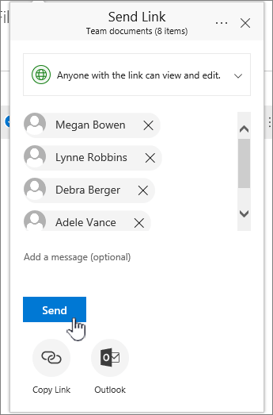

# 在 Microsoft 365 中設定檔儲存與共享

為您的公司設定檔案存放區與共享的其中一個最佳方法，就是使用 OneDrive 和小組網站一起使用。 如果您擁有少數員工的小型企業，這是理想的方式。

## 觀賞：在 Office 365 中儲存檔案的位置

> [!VIDEO https://www.microsoft.com/videoplayer/embed/RE1FTHX] 

如果您覺得這段影片很有幫助，請查看[適用於小型企業和 Microsoft 365 新手的完整訓練系列](../../business-video/index.yml)。

## Microsoft 365 檔儲存與管理

- OneDrive 是專為個別用途所設計，且有偶然的檔案共用。

- 小組網站的設計是要定期共用和協同作業。 小組網站非常適合儲存具有共用擁有權的檔案，讓數個人員擁有該檔案，並可能共同作業這些檔案。 建立 Microsoft 小組以新增小組網站。 若要[深入瞭解，請參閱 Create a team in Teams](https://support.microsoft.com/office/174adf5f-846b-4780-b765-de1a0a737e2b)。

OneDrive 和小組網站都為您和您的員工提供隨處存取。
  

  
以下是當您同時使用 OneDrive 和小組網站時，在每個位置中儲存內容的建議： 

  
|儲存位置|其用途|在這裡儲存的專案|
|:-----|:-----|:-----|
|**OneDrive** |將內容儲存在 OneDrive 中，就像是在您的電腦上儲存檔案;任何人都無法輕易存取。  如需詳細資訊，請參閱[什麼是商務用 OneDrive？](https://support.microsoft.com/office/187f90af-056f-47c0-9656-cc0ddca7fdc2)   |其他小組成員不需要定期共同作業或存取的商務檔。  |
|**SharePoint 小組網站**   |共同作業。 當您建立 Microsoft 365 群組時 (例如，在 [Microsoft 365 系統管理中心] 中的 [Outlook] 或 [Microsoft Teams) 中建立團隊時，會為該群組建立 SharePoint 小組網站。 同樣地，當您從 SharePoint 首頁或新的 SharePoint 系統管理中心建立新的 SharePoint 小組網站時，也會建立 Microsoft 365 群組。 如需詳細資訊，請參閱[什麼是 SharePoint 小組網站？](https://support.microsoft.com/office/75545757-36c3-46a7-beed-0aaa74f0401e)並[在 Online SharePoint 中建立小組網站](https://support.microsoft.com/office/ef10c1e7-15f3-42a3-98aa-b5972711777d)。    |具有共用擁有權的檔案。 建議您組織中每個工作單位使用不同的小組網站。 例如，若要將個人和財務檔存放在小型小組，請建立個別小組網站。    |

> [!NOTE]
> SharePoint 也有其他類型的網站可供商務使用。 您可以使用內部網路中的 [通訊網站](https://support.microsoft.com/office/7fb44b20-a72f-4d2c-9173-fc8f59ba50eb) 來發佈廣泛使用者的資訊。 您也可以使用集線網站，連接內部 [網路](https://support.microsoft.com/office/fe26ae84-14b7-45b6-a6d1-948b3966427f) 中的網站。
  
## 開始使用 OneDrive 和您的小組網站

### 小組成員可以將自己的檔案儲存在 OneDrive

您公司中的每位人員都已指派 Microsoft 365 授權 (並 SharePoint 線上) 取得 OneDrive 雲端儲存空間。 他們可以在這裡儲存商務相關檔案，以供任何裝置存取，而且只有該使用者可以使用這些檔案。 例如，他們可能會儲存草稿提案、其會議筆記或即將交付之示範的腳本。
  
員工也可以共用 OneDrive 檔案和資料夾。 如果員工休假或離開公司，其他人可以存取儲存在 OneDrive (OneDrive 小組資料夾共用) 中的共用檔案。
  
以下是團隊中每個人如何設定 OneDrive 及共用檔案。

1. 移至<a href="https://admin.mirosoft.com/ " target="_blank">Microsoft 365 系統管理中心</a>，然後使用您的使用者名稱和密碼登入。

2. 在應用程式啟動器中，選取 [ **OneDrive**]。

3. 在 OneDrive 中，小組成員可以儲存自己的與商務相關的檔。 您可以共用個別檔或整個資料夾。 挑選檔案或資料夾，以滑鼠右鍵按一下，然後選擇 [ **共用**]。

    
  
4. 在 [ **傳送連結** ] 頁面上，保留 **具有連結的任何人都可以查看和編輯** 的預設選項。

    輸入您想要存取資料夾的小組成員的名稱或電子郵件地址，然後新增選用的郵件。

    如果您想要傳送的電子郵件副本，請將您的電子郵件地址新增至清單。

    ![[共用連結] 對話方塊，顯示輸入並選取名稱。](../../media/877e6587-db9d-4903-a87b-11e570eee926.png)
  
5. 當您完成輸入您要與其共用的人員時，請選取 [ **傳送**]。 電子郵件會立即傳送給您邀請的人員。

    
  
6. 電子郵件的外觀如下。 

    
  
### 將檔案 Upload 至小組網站以進行線上協同作業

小組網站隨附存放盤案的位置，稱為文件庫。  
  
新增檔案的步驟如下：
  
1. 在小組網站的首頁上，選擇左側流覽功能表中的 [ **檔** ]。 這將會帶您前往您的 **文件庫**。
  
2. 當您仍登入 Microsoft 365 時，請從您的工作列或其他位置開啟 Windows 檔案 **瀏覽器**。 移至您要上傳到小組網站的檔案。

3. 選取您要上傳到小組網站的檔案，然後將其拖曳至 **文件庫**。
  
4. 當您完成時，檔案會同時儲存在您的小組網站和您的電腦中。
  
5. 您可以從您的電腦中刪除檔案。 在下一個步驟中，將 [線上檔案與您的 PC 或 Mac 同步處理](#sync-online-files-with-your-pc-or-mac)，您將在電腦上建立這些檔案的新位置。

    如果您有多個檔案或大型檔案上傳至您的小組網站，請閱讀將 [大型檔案或多個檔案上傳至文件庫](https://support.microsoft.com/office/da549fb1-1fcb-4167-87d0-4693e93cb7a0#__toc384119242)的秘訣。

    如果您需要更多儲存空間，請參閱 [變更您訂閱的儲存空間](../../commerce/add-storage-space.md)。

### 將線上檔案與您的 PC 或 Mac 同步處理

現在您的小組網站上有檔案，您可以將檔案設定為與您的 PC 或 Mac 同步。 如此一來，您就可以從您的 PC 或 Mac 處理檔案，而不是在 Microsoft Edge、Chrome 或另一個瀏覽器中工作。 在您的電腦上同步處理檔案的版本時，如果您需要取得檔案，但未連線到網際網路，也會有很大的作用。
  
當您設定要與電腦同步的檔案之後，當您連線至網際網路時，系統會自動同步處理這些檔案。
  
以下說明如何將小組網站上的檔案與您的桌面同步處理：
  
1. 在小組網站的首頁上，選擇左側流覽功能表中的 [ **檔** ]。 這會帶您前往您的文件庫。

    > [!TIP]
    > 同步處理小組網站上的檔案時，您正在同步處理網站上的每個檔案庫，而不是整個網站。
  
2. 選擇 [ **同步** 處理] 以同步處理所有檔案。 或流覽至您要同步處理的特定資料夾。

3. 如果系統提示您切換應用程式，請選擇 **[是]**。 OneDrive 是執行同步處理的程式。
  
4. 如果您已 **設定 OneDrive** 提示，請使用您的公司或學校帳戶登入。

    
  
5. 如果您還沒有同步處理 OneDrive，您可能會看到 [**這是您的 OneDrive 資料夾**] 畫面。 請檢查 **您 OneDrive 資料夾** 下的路徑。 如果您想要使用不同的路徑，請選擇 [ **變更位置** ]，然後選取 **[下一步]**。

    
  
6. 小組網站中的檔案會以組織名稱顯示在 [檔案瀏覽器] 的左窗格中。 OneDrive 中的檔案會出現在 "OneDrive- \<Name of Organization\> " 底下。

    
  
7. 在電腦上的小組資料夾中開啟檔案，以測試同步處理。 進行變更，然後選擇 [ **儲存**]。

## 檔案儲存和共用的最佳作法

以下是取得大部分 OneDrive 或 SharePoint 小組網站的一些秘訣。
  
### 其他小型企業類型的檔案儲存和協同作業建議

- **獨自 proprietorships**：使用 OneDrive 來儲存您自己的檔案，並以每個案例為客戶分享這些檔案。

- **共同 ownerships**：兩個擁有者都使用 OneDrive，並來回共用檔案。

- **需要存取檔案的外部用戶端或合作夥伴的企業**：建立新的小組網站，以儲存及共用專為特定客戶的檔。 設定網站，只允許存取該客戶。 您無需擔心，一位客戶會意外取得其他客戶的資訊存取權。

### 保密私人檔案

當您將檔案儲存在 OneDrive，除非您與其他人共用，否則您只能存取它。 當您共用檔時，可以選擇建立可以轉寄的連結，或只與特定人員共用。 您也可以在 OneDrive 中建立個別的資料夾，以用於不同的目的，例如，公用、個人或個別專案。 每個資料夾都可以與不同的人員或群組共用，或者根本沒有任何人。
  
如需共用的詳細資訊，請參閱[與 Microsoft 365 共用檔案和資料夾](https://support.microsoft.com/office/72f26d6c-bf9e-432c-8b96-e3c2437f5b65)。
  
### 追蹤留下多少空間

若要查看您在 OneDrive 中留下多少儲存空間，請參閱[管理您的商務用 OneDrive 儲存體](https://support.microsoft.com/office/31519161-059C-4764-B6F8-F5CD29F7FE68)。
  
### 哪些檔案可以儲存在 OneDrive 和小組網站？

雖然您可以上傳幾乎所有類型的檔案，但不允許檔案名中的某些檔案名和字元。 如需詳細資訊，請參閱[商務用 OneDrive 中的無效檔案字元和檔案類型](https://support.microsoft.com/office/64883A5D-228E-48F5-B3D2-EB39E07630FA)。
  
### 啟用或停用協力廠商儲存體服務

您可以在 Microsoft 365 中為使用者啟用協力廠商儲存空間，讓他們可以使用 Dropbox （如 OneDrive 和小組網站）來儲存及共用檔。 如果您想提供使用者可能已在使用或想要用於商務專案的服務，這可說是很好的方法。 如果您不想讓組織中的人員使用 Office 開啟協力廠商服務中的檔案，請遵循下列步驟加以關閉。
  
> [!IMPORTANT]
> 預設會啟用協力廠商儲存區，因此如果您不想讓使用者使用這些步驟，您必須立即執行這些步驟。
  
1. 登入系統 <a href="https://go.microsoft.com/fwlink/p/?linkid=2024339" target="_blank">管理中心</a>。

2. 移至 [**設定** \> <a href="https://go.microsoft.com/fwlink/p/?linkid=2053743" target="_blank">**組織設定**</a>] 頁面。

3. 在 [**服務**] 索引標籤上，選取 [ **Office 網頁版**]。

4. 選取或取消選取此核取方塊，以開啟或關閉協力廠商儲存體，然後選取 [ **儲存變更**]。

## 後續步驟

- [自訂您的小組網站以進行檔案儲存與共享](customize-team-site.md)。 這個逐步教學課程會告訴您如何利用更多儲存空間與共同作業功能。

- **在平板電腦與手機上設定 Office App 。** 您必須這麼做，您就可以在平板電腦或手機上 **編輯** 儲存在 OneDrive 和小組網站上的檔案。 如果您未安裝平板電腦或手機的 Office 應用程式，您將可以查看檔案，但無法進行編輯。

  - [在 Android 上使用 Microsoft 365 安裝及設定 Office](https://support.microsoft.com/office/cafe9d6f-8b0c-4b03-b20a-12438a82a22d)

  - [使用 Microsoft 365 安裝及設定 iPhone 或 iPad 上的 Office](https://support.microsoft.com/office/9df6d10c-7281-4671-8666-6ca8e339b628)

  - [在具有 Microsoft 365 的 Windows Phone 上設定 Office](https://support.microsoft.com/office/2b7c1b51-a717-45d6-90c9-ee1c1c5ee0b7)

## 相關內容

[新增您訂閱的儲存空間](../../commerce/add-storage-space.md) (文章) \
[與 Microsoft 365 商務 (影片共用檔案和資料夾](https://support.microsoft.com/office/share-files-and-folders-with-microsoft-365-business-72f26d6c-bf9e-432c-8b96-e3c2437f5b65)) \
[自訂您的小組網站以進行檔案儲存和共用](customize-team-site.md) (文章) 