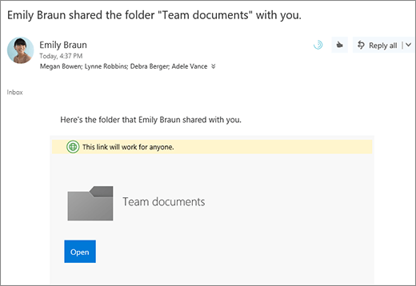

# 在 Microsoft 365 中設定檔儲存與共享Set up file storage and sharing in Microsoft 365

為您的公司設定檔案存放區與共享的其中一個最佳方法，就是使用 OneDrive 和小組網站一起使用。One of the best ways to set up file storage and sharing for your business is to use OneDrive and a team site together. 如果您擁有少數員工的小型企業，這是理想的方式。This is ideal if you have a small business with a few employees.

## 觀賞：在 Office 365 中儲存檔案的位置Watch: Where to store files in Office 365

> [!VIDEO https://www.microsoft.com/videoplayer/embed/RE1FTHX] 

如果您覺得這段影片很有幫助，請查看[適用於小型企業和 Microsoft 365 新手的完整訓練系列](../../business-video/index.yml)。If you found this video helpful, check out the [complete training series for small businesses and those new to Microsoft 365](../../business-video/index.yml).

## Microsoft 365 檔儲存與管理Microsoft 365 document storage and management

- OneDrive 是專為個別用途所設計，且有偶然的檔案共用。OneDrive is designed for individual use, with the occasional sharing of files.

- 小組網站的設計是要定期共用和協同作業。A team site is designed for sharing and collaborating on files regularly. 小組網站非常適合儲存具有共用擁有權的檔案，讓數個人員擁有該檔案，並可能共同作業這些檔案。A team site is ideal for storing files that have shared ownership where several people own the files and might collaborate on them. 建立 Microsoft 小組以新增小組網站。Create a Microsoft Team to add a team site. 若要[深入瞭解，請參閱 Create a team in Teams](https://support.microsoft.com/office/174adf5f-846b-4780-b765-de1a0a737e2b)。[Learn more at Create a team in Teams](https://support.microsoft.com/office/174adf5f-846b-4780-b765-de1a0a737e2b).

OneDrive 和小組網站都為您和您的員工提供隨處存取。Both OneDrive and team sites provide anywhere access for you and your employees.
  

  
以下是當您同時使用 OneDrive 和小組網站時，在每個位置中儲存內容的建議：Here are recommendations for what to store in each location when you use OneDrive and team sites together: 

  
|儲存位置Storage location|其用途What's it for|在這裡儲存的專案What to store here|
|:-----|:-----|:-----|
|**OneDrive****OneDrive** |將內容儲存在 OneDrive 中，就像是在您的電腦上儲存檔案;任何人都無法輕易存取。Storing content in OneDrive is like storing files on your computer; no one else can easily access them.  如需詳細資訊，請參閱[什麼是商務用 OneDrive？](https://support.microsoft.com/office/187f90af-056f-47c0-9656-cc0ddca7fdc2)For more info, see [What is OneDrive for Business?](https://support.microsoft.com/office/187f90af-056f-47c0-9656-cc0ddca7fdc2)   |其他小組成員不需要定期共同作業或存取的商務檔。Business files that other team members won't need to collaborate on or access regularly.  |
|**SharePoint 小組網站****SharePoint team sites**   |協作。Collaboration. 當您建立 Microsoft 365 群組時 (例如，在 [Microsoft 365 系統管理中心] 中的 [Outlook]，或透過 Microsoft Teams) 建立團隊時，會為該群組建立 SharePoint 小組網站。When you create a Microsoft 365 group (for example, in the Microsoft 365 admin center, in Outlook, or by creating a team in Microsoft Teams), a SharePoint team site is created for that group. 同樣地，當您從 SharePoint 首頁或新的 SharePoint 系統管理中心建立新的 SharePoint 小組網站時，也會建立 Microsoft 365 群組。Likewise, when you create a new SharePoint team site from the SharePoint home page or from the new SharePoint admin center, it also creates a Microsoft 365 group. 如需詳細資訊，請參閱[什麼是 SharePoint 小組網站？](https://support.microsoft.com/office/75545757-36c3-46a7-beed-0aaa74f0401e)並[在 Online SharePoint 中建立小組網站](https://support.microsoft.com/office/ef10c1e7-15f3-42a3-98aa-b5972711777d)。For more info, see [What is a SharePoint team site?](https://support.microsoft.com/office/75545757-36c3-46a7-beed-0aaa74f0401e) and [Create a team site in SharePoint Online](https://support.microsoft.com/office/ef10c1e7-15f3-42a3-98aa-b5972711777d).    |具有共用擁有權的檔案。Files that have shared ownership. 建議您組織中每個工作單位使用不同的小組網站。We recommend separate team sites for each unit of work in your organization. 例如，若要將個人和財務檔存放在小型小組，請建立個別小組網站。For example, to keep personnel and financial documents private to a small team, create a separate team site.    |

> [!NOTE]
> SharePoint 也有其他類型的網站可供商務使用。SharePoint also has other types of sites you can use for your business. 您可以使用內部網路中的 [通訊網站](https://support.microsoft.com/office/7fb44b20-a72f-4d2c-9173-fc8f59ba50eb) 來發佈廣泛使用者的資訊。You can use [communication sites](https://support.microsoft.com/office/7fb44b20-a72f-4d2c-9173-fc8f59ba50eb) in your intranet to publish information for a broad audience. 您也可以使用集線網站，連接內部 [網路](https://support.microsoft.com/office/fe26ae84-14b7-45b6-a6d1-948b3966427f) 中的網站。And you can use [hub sites](https://support.microsoft.com/office/fe26ae84-14b7-45b6-a6d1-948b3966427f) to connect sites in your intranet.
  
## 開始使用 OneDrive 和您的小組網站Start using OneDrive and your team site

### 小組成員可以將自己的檔案儲存在 OneDriveTeam members can store their own files in OneDrive

您公司中的每位人員都已指派 Microsoft 365 授權 (並 SharePoint 線上) 取得 OneDrive 雲端儲存空間。Each person in your business who has a Microsoft 365 license assigned (and SharePoint Online selected) gets OneDrive cloud storage. 他們可以在這裡儲存商務相關檔案，以供任何裝置存取，而且只有該使用者可以使用這些檔案。They can store business-related files here for access from any device, and they are only available to that user. 例如，他們可能會儲存草稿提案、其會議筆記或即將交付之示範的腳本。For example, they might store a draft proposal, their meeting notes, or the script for a demo they're going to deliver.
  
員工也可以共用 OneDrive 檔案和資料夾。Employees can also share OneDrive files and folders. 如果員工休假或離開公司，其他人可以存取儲存在 OneDrive (OneDrive 小組資料夾共用) 中的共用檔案。If an employee is away or leaves the company, others can access shared files stored in OneDrive (OneDrive team folder sharing).
  
以下是團隊中每個人如何設定 OneDrive 及共用檔案。Here's how each person on your team can set up OneDrive and share files.

1. 請移至<a href="https://portal.office.com/ " target="_blank">Microsoft 365 入口網站</a>，然後使用您的使用者名稱和密碼登入。Go to the <a href="https://portal.office.com/ " target="_blank">Microsoft 365 Portal</a>, and sign in with your user name and password.

2. 在應用程式啟動器中，選取 [ **OneDrive**]。From the App launcher, select **OneDrive**.

3. 在 OneDrive 中，小組成員可以儲存自己的與商務相關的檔。In OneDrive, team members can store their own business-related files. 您可以共用個別檔或整個資料夾。You can share either individual files, or a whole folder. 挑選檔案或資料夾，以滑鼠右鍵按一下，然後選擇 [ **共用**]。Pick a file or folder, right-click, and then choose **Share**.

    
  
4. 在 [ **傳送連結** ] 頁面上，保留 **具有連結的任何人都可以查看和編輯** 的預設選項。On the **Send Link** page, leave the default selection **Anyone with the link can view and edit**.

    輸入您想要存取資料夾的小組成員的名稱或電子郵件地址，然後新增選用的郵件。Type names or email addresses of team members who you want to have access to the folder, and add an optional message.

    如果您想要傳送的電子郵件副本，請將您的電子郵件地址新增至清單。If you want your own copy of the email that will be sent, add your email address to the list.

    ![[共用連結] 對話方塊，顯示輸入並選取名稱。](../../media/877e6587-db9d-4903-a87b-11e570eee926.png)
  
5. 當您完成輸入您要與其共用的人員時，請選取 [ **傳送**]。When you're done entering who you want to share with, select **Send**. 電子郵件會立即傳送給您邀請的人員。The email is immediately sent to the people you invite.

    
  
6. 電子郵件的外觀如下。Here's what the email looks like. 

    
  
### 將檔案 Upload 至小組網站以進行線上協同作業Upload files to a team site for online collaboration

小組網站隨附存放盤案的位置，稱為文件庫。Team sites come with a place to store files, called a document library.  
  
新增檔案的步驟如下：Here are the steps to add files:
  
1. 在小組網站的首頁上，選擇左側流覽功能表中的 [ **檔** ]。On the home page of your team site, choose **Documents** from the left-hand navigation menu. 這將會帶您前往您的 **文件庫**。This will take you to your **Documents library**.
  
2. 當您仍登入 Microsoft 365 時，請從您的工作列或其他位置開啟 Windows 檔案 **瀏覽器**。While you're still signed in to Microsoft 365, open Windows **File Explorer** from your taskbar or other location. 移至您要上傳到小組網站的檔案。Go to the files you want to upload to your team site.

3. 選取您要上傳到小組網站的檔案，然後將其拖曳至 **文件庫**。Select the files you want to upload to your team site, and then drag them to the **Document library**.
  
4. 當您完成時，檔案會同時儲存在您的小組網站和您的電腦中。When you're done, the files will be stored in both your team site and your computer.
  
5. 您可以從您的電腦中刪除檔案。You can delete the files from your computer. 在下一個步驟中，將 [線上檔案與您的 PC 或 Mac 同步處理](#sync-online-files-with-your-pc-or-mac)，您將在電腦上建立這些檔案的新位置。In the next step, [Sync online files with your PC or Mac](#sync-online-files-with-your-pc-or-mac), you're going to create a new location for these files on your computer.

    如果您有多個檔案或大型檔案上傳至您的小組網站，請閱讀將 [大型檔案或多個檔案上傳至文件庫](https://support.microsoft.com/office/da549fb1-1fcb-4167-87d0-4693e93cb7a0#__toc384119242)的秘訣。If you have numerous files or large files to upload to your team site, read these tips on [uploading large or many files to a library](https://support.microsoft.com/office/da549fb1-1fcb-4167-87d0-4693e93cb7a0#__toc384119242).

    如果您需要更多儲存空間，請參閱 [變更您訂閱的儲存空間](../../commerce/add-storage-space.md)。If you need more storage space, see [Change storage space for your subscription](../../commerce/add-storage-space.md).

### 將線上檔案與您的 PC 或 Mac 同步處理Sync online files with your PC or Mac

現在您的小組網站上有檔案，您可以將檔案設定為與您的 PC 或 Mac 同步。Now that you have files on your team site, you can set them up to sync with your PC or Mac. 如此一來，您就可以從您的 PC 或 Mac 處理檔案，而不是在 Microsoft Edge、Chrome 或另一個瀏覽器中工作。This way, you can work on your files from your PC or Mac instead of working in Microsoft Edge, Chrome, or another browser. 在您的電腦上同步處理檔案的版本時，如果您需要取得檔案，但未連線到網際網路，也會有很大的作用。It's also useful to have a version of your files synced on your computer for situations when you need to get to a file and you aren't connected to the Internet.
  
當您設定要與電腦同步的檔案之後，當您連線至網際網路時，系統會自動同步處理這些檔案。After you set up files to sync with your computer, when you're connected to the Internet, they'll be synchronized automatically.
  
以下說明如何將小組網站上的檔案與您的桌面同步處理：Here's how to synchronize files on your team site with your desktop:
  
1. 在小組網站的首頁上，選擇左側流覽功能表中的 [ **檔** ]。On the home page of your team site, choose **Documents** from the left-hand navigation menu. 這會帶您前往您的文件庫。This takes you to your Documents library.

    > [!TIP]
    > 同步處理小組網站上的檔案時，您正在同步處理網站上的每個檔案庫，而不是整個網站。When syncing files on your team site, you're syncing each file library on the site, not the entire site.
  
2. 選擇 [ **同步** 處理] 以同步處理所有檔案。Choose **Sync** to synchronize all the files. 或流覽至您要同步處理的特定資料夾。Or browse to the specific folder you want to sync.

3. 如果系統提示您切換應用程式，請選擇 **[是]**。If prompted to switch apps, choose **Yes**. OneDrive 是執行同步處理的程式。OneDrive is the process doing the synchronization.
  
4. 如果您已 **設定 OneDrive** 提示，請使用您的公司或學校帳戶登入。If you then get a **Set up OneDrive** prompt, sign in with your work or school account.

    
  
5. 如果您還沒有同步處理 OneDrive，您可能會看到 [**這是您的 OneDrive 資料夾**] 畫面。If you haven't yet synced your OneDrive, you might see a **This is your OneDrive folder** screen. 請檢查 **您 OneDrive 資料夾** 下的路徑。Check the path under **Your OneDrive folder is here**. 如果您想要使用不同的路徑，請選擇 [ **變更位置** ]，然後選取 **[下一步]**。Choose **Change Location** if you want to use a different path, and then select **Next**.

    
  
6. 小組網站中的檔案會以組織名稱顯示在 [檔案瀏覽器] 的左窗格中。The files in your team sites will appear in the left pane of File Explorer under the name of your organization. OneDrive 中的檔案會出現在 "OneDrive- \<Name of Organization\> " 底下。The files in OneDrive will appear under "OneDrive - \<Name of Organization\>"

    
  
7. 在電腦上的小組資料夾中開啟檔案，以測試同步處理。Test the synchronization by opening a file in the team's folder on your computer. 進行變更，然後選擇 [ **儲存**]。Make a change, and then choose **Save**.

## 檔案儲存和共用的最佳作法Best practices for file storage and sharing

以下是取得大部分 OneDrive 或 SharePoint 小組網站的一些秘訣。Here are a few tips for getting the most from OneDrive or your SharePoint team site.
  
### 其他小型企業類型的檔案儲存和協同作業建議File storage and collaboration recommendations for other types of small businesses

- **獨自 proprietorships**：使用 OneDrive 來儲存您自己的檔案，並以每個案例為客戶分享這些檔案。**Sole proprietorships**: Use OneDrive to store your own files and share them with customers on a case-by-case basis.

- **共同 ownerships**：兩個擁有者都使用 OneDrive，並來回共用檔案。**Co-ownerships**: Both owners use OneDrive and share files back and forth.

- **需要存取檔案的外部用戶端或合作夥伴的企業**：建立新的小組網站，以儲存及共用專為特定客戶的檔。**Businesses with external clients or partners who need access to files**: Create a new team site to store and share documents intended for a specific customer. 設定網站，只允許存取該客戶。Set up the site to allow access to only that customer. 您無需擔心，一位客戶會意外取得其他客戶的資訊存取權。You then don't need to worry that one customer will accidentally get access to information intended for another customer.

### 保密私人檔案Keep private files private

當您將檔案儲存在 OneDrive，除非您與其他人共用，否則您只能存取它。When you store a file in OneDrive it's only accessible by you, unless you share it with others. 當您共用檔時，可以選擇建立可以轉寄的連結，或只與特定人員共用。When you share files, you can choose to create a link that can be forwarded, or to share with only specific people. 您也可以在 OneDrive 中建立個別的資料夾，以用於不同的目的，例如，公用、個人或個別專案。You can also create separate folders in OneDrive for different purposes such as public, personal, or for individual projects. 每個資料夾都可以與不同的人員或群組共用，或者根本沒有任何人。Each folder can be shared with a different person or group, or nobody else at all.
  
如需共用的詳細資訊，請參閱[與 Microsoft 365 共用檔案和資料夾](https://support.microsoft.com/office/72f26d6c-bf9e-432c-8b96-e3c2437f5b65)。For more information on sharing, also see [Share files and folders with Microsoft 365](https://support.microsoft.com/office/72f26d6c-bf9e-432c-8b96-e3c2437f5b65).
  
### 追蹤留下多少空間Track how much space you have left

若要查看您在 OneDrive 中留下多少儲存空間，請參閱[管理您的商務用 OneDrive 儲存體](https://support.microsoft.com/office/31519161-059C-4764-B6F8-F5CD29F7FE68)。To see how much storage space you have left in OneDrive, see [Manage your OneDrive for Business storage](https://support.microsoft.com/office/31519161-059C-4764-B6F8-F5CD29F7FE68).
  
### 哪些檔案可以儲存在 OneDrive 和小組網站？What files can be stored in OneDrive and a team site?

雖然您可以上傳幾乎所有類型的檔案，但不允許檔案名中的某些檔案名和字元。While you can upload almost all types of files, some file names and characters in file names aren't allowed. 如需詳細資訊，請參閱[商務用 OneDrive 中的無效檔案字元和檔案類型](https://support.microsoft.com/office/64883A5D-228E-48F5-B3D2-EB39E07630FA)。For more info, see [Invalid file characters and file types in OneDrive for Business](https://support.microsoft.com/office/64883A5D-228E-48F5-B3D2-EB39E07630FA).
  
### 啟用或停用協力廠商儲存體服務Enable or disable third-party storage services

您可以在 Microsoft 365 中為使用者啟用協力廠商儲存空間，讓他們可以使用 Dropbox （如 OneDrive 和小組網站）來儲存及共用檔。You can enable third-party storage for your users in Microsoft 365 so they can store and share documents using services like Dropbox in addition to OneDrive and team sites. 如果您想提供使用者可能已在使用或想要用於商務專案的服務，這可說是很好的方法。This can be a great way to provide services that your users may already be using or prefer to use for business projects. 如果您不想讓組織中的人員使用 Office 開啟協力廠商服務中的檔案，請遵循下列步驟加以關閉。If you don't want people in your organization using Office to open files in a third-party service, follow these steps to turn it off.
  
> [!IMPORTANT]
> 預設會啟用協力廠商儲存區，因此如果您不想讓使用者使用這些步驟，您必須立即執行這些步驟。Third-party storage is enabled by default so you need to perform these steps right away if you don't want it available to your users.
  
1. 登入系統 <a href="https://go.microsoft.com/fwlink/p/?linkid=2024339" target="_blank">管理中心</a>。Sign in to to the <a href="https://go.microsoft.com/fwlink/p/?linkid=2024339" target="_blank">admin center</a>.

2. 移至 [**設定** \> <a href="https://go.microsoft.com/fwlink/p/?linkid=2053743" target="_blank">**組織設定**</a>] 頁面。Go to the **Settings** \> <a href="https://go.microsoft.com/fwlink/p/?linkid=2053743" target="_blank">**Org settings**</a> page.

3. 在 [**服務**] 索引標籤上，選取 [ **Office 網頁版**]。On the **Services** tab, select **Office on the web**.

4. 選取或取消選取此核取方塊，以開啟或關閉協力廠商儲存體，然後選取 [ **儲存變更**]。Select or deselect the check box to turn third-party storage on or off, then select **Save changes**.

## 後續步驟Next steps

- [自訂您的小組網站以進行檔案儲存與共享](customize-team-site.md)。[Customize your team site for file storage and sharing](customize-team-site.md). 這個逐步教學課程會告訴您如何利用更多儲存空間與共同作業功能。This step-by-step tutorial shows you how to you can take advantage of more storage and collaboration features.

- **在平板電腦與手機上設定 Office App 。****Set up Office apps on your tablets and phones.** 您必須這麼做，您就可以在平板電腦或手機上 **編輯** 儲存在 OneDrive 和小組網站上的檔案。You need to do this so you can **edit** files that are stored in OneDrive and on team sites from your tablet or phone. 如果您未安裝平板電腦或手機的 Office 應用程式，您將可以查看檔案，但無法進行編輯。If you don't install the Office apps for your tablet or phone, you'll be able to view the files but not edit them.

  - [在 Android 上使用 Microsoft 365 安裝及設定 OfficeInstall and set up Office on an Android with Microsoft 365](https://support.microsoft.com/office/cafe9d6f-8b0c-4b03-b20a-12438a82a22d)

  - [使用 Microsoft 365 安裝及設定 iPhone 或 iPad 上的 OfficeInstall and set up Office on an iPhone or iPad with Microsoft 365](https://support.microsoft.com/office/9df6d10c-7281-4671-8666-6ca8e339b628)

  - [在具有 Microsoft 365 的 Windows Phone 上設定 OfficeSet up Office on Windows Phone with Microsoft 365](https://support.microsoft.com/office/2b7c1b51-a717-45d6-90c9-ee1c1c5ee0b7)

## 相關內容Related content

[新增您訂閱的儲存空間](../../commerce/add-storage-space.md) (文章) [Add storage space for your subscription](../../commerce/add-storage-space.md) (article)\
[與 Microsoft 365 商務版 (的影片共用檔案和資料夾](https://support.microsoft.com/office/share-files-and-folders-with-microsoft-365-business-72f26d6c-bf9e-432c-8b96-e3c2437f5b65)) [Share files and folders with Microsoft 365 Business](https://support.microsoft.com/office/share-files-and-folders-with-microsoft-365-business-72f26d6c-bf9e-432c-8b96-e3c2437f5b65) (video)\
[自訂您的小組網站以進行檔案儲存和共用](customize-team-site.md) (文章) [Customize your team site for file storage and sharing](customize-team-site.md) (article)