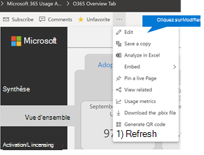

# 自訂 Microsoft 365 使用情況分析中的報告

Microsoft 365 使用情況分析提供提供深入了解使用者如何採用及使用 Microsoft 365 的 Power BI 中的儀表板。 儀表板是只與使用狀況資料互動的起始點。 針對多個人化觀點便可自訂報表。
  
您也可以使用 Power BI desktop 以進一步自訂您的報表將它們連線至其他資料來源，以更豐富的深入了解貴公司的相關情形。
  
## 在瀏覽器中的自訂報告

下列兩個範例顯示如何修改現有 visual 以及如何建立新的視覺。
  
### 修改現有 visual

本範例會示範如何修改**啟用讀授權**報表中的 [**啟用**] 索引標籤。 
  
1. 內 [**啟用/授權**] 報告中，按一下 [**啟用**] 索引標籤。
    
2. 輸入的編輯模式]，即可透過頂端的 [**編輯**] 按鈕![Power BI 中更多的 [頁面] 按鈕](../../media/d8da3c19-3f2d-4bf6-811e-faa804f74770.png)] 按鈕。 
    
    
  
3. 在右上方，按一下 [**複製此頁面**。
    
    
  
4. 在右底端，按一下 [顯示例如 Android、 iOS、 Mac OS 為基礎的使用者啟用計數橫條任何的圖等等。
    
5. 在 [**視覺效果**區域右邊，才能移除 visual **Mac 計數**，請按一下在其旁邊的**X** 。

        
    
### 建立新的視覺

下列範例會示範如何建立新視覺上每月付款追蹤 Yammer 的新使用者。
  
1. 移至**產品使用情況**報表使用左側的導覽中，按一下 [ **Yammer** ] 索引標籤上。
    
2. 切換至編輯模式]，即可在![Power BI 中更多的 [頁面] 按鈕](../../media/d8da3c19-3f2d-4bf6-811e-faa804f74770.png)及**編輯**。 
    
3. 在頁面底部，按一下 [ ![Power BI 中的 [新增頁面] 按鈕](../../media/d3b8c117-17d4-4f53-b078-8fefc2155b24.png) 若要建立新的頁面。
  
4. 在右側的 [**視覺效果**] 區域中，按一下 [**堆疊橫條圖**（上方的列，第一次從左）。

    
    
5. 按一下 [右下方的視覺效果，然後拖曳以使其變大。

6. 在右邊**欄位**] 區域中，依序展開 [**行事曆**表格。

7. 將**MonthName**拖曳至 [欄位] 區域中，正下方的**視覺效果**區域中的**座標軸**標題。
 
    
    
8. 在右邊**欄位**] 區域中，展開 [ **TenantProductUsage**資料表。

9. 將**FirstTimeUsers**拖曳至 [欄位] 區域中，[**值**] 標題的正下方。

10. 將 [**產品**] 拖曳至 [**篩選**] 區域中，正下方**視覺化層級篩選**標題。

11. 在出現 [**篩選器類型**] 區域中，選取 [ **Yammer** ] 核取方塊。

    ![選取 [Yammer] 核取方塊](../../media/82e99730-0de9-42da-928a-76aab0c3e609.png)
  
12. 正下方的視覺效果清單中，按一下 [**格式**] 圖示![Power BI Visualizaions 中的 [格式] 圖示](../../media/ee0602f3-3df5-4930-b862-db1d90ae4ae2.png)。

13. 展開標題及**每月**的第一次 Yammer 使用者變更的**標題文字**值。
    
14. 變更**文字大小**] 值為**12**。
    
15. 編輯上右下方的名稱，以變更新網頁的標題。

16.  儲存出 report 按一下在 [**閱讀] 檢視**在上方，然後**儲存**。
    
## 自訂報告在 Power BI Desktop

對於大多數的客戶在修改的報告和 Power BI web 中的圖表視覺效果會足夠。 針對某些不過，有可能會需要加入此資料與其他資料來源，以獲得更豐富的觀點關聯式自己商務版，在此情況下他們可以自訂，並建置使用 Power BI Desktop 其他報告。 您可以免費下載[Power BI Desktop](https://go.microsoft.com/fwlink/p/?linkid=849797) 。 
  
### 使用報告 Api

您可以啟動直接連線至報告 Api 從 Microsoft 365 ODATA 該 power 這些報告。
  
1. 若**要取得的資料**移\>**其他** \> **ODATA 摘要** \> **連線**。
    
2. 在 [URL] 視窗中輸入 「 https://<i></i>reports.office.com/pbi/v1.0/\<tenantid\>」
    
    **附註：** 報表 Api 是在預覽中並受限於變更，直到使用者移至實際執行環境。 
  
    
  
3. 輸入您 Microsoft 365 （公司或學校） 系統管理員的認證來驗證 Microsoft 365 出現提示時。
    
    請參閱[常見問題集](usage-analytics.md#faq)的誰可以存取 Microsoft 365 採用範本應用程式報告的詳細資訊。 
    
4. 一旦連線獲得授權，您會看到顯示可連線至資料集的導覽視窗。
    
    選取 [全部，然後按一下 [在**載入**。
    
    這會下載資料至 Power BI 桌面上。 儲存檔案，然後您就可以開始建立所需的報表。
    
    
  
### 使用 Microsoft 365 流量分析範本

您也可以使用做為起點連接到資料會對應至 Microsoft 365 使用情況分析報告的 Power BI 範本檔案。 使用的 pbit 檔案的優點是它具有已建立的連接字串。 您也可以利用所有的自訂措施所建立的基底結構描述會傳回，並在其上建置的進一步資料。
  
您可以下載 Power BI 範本檔案從 Microsoft 下載中心從[下載中心](https://download.microsoft.com/download/7/8/2/782ba8a7-8d89-4958-a315-dab04c3b620c/Microsoft%20365%20Usage%20Analytics.pbit)。 下載後的 Power BI 範本檔案請遵循下列步驟以開始：
  
1. 開啟的 pbit 檔案。
    
2. 在對話方塊中輸入您的租用戶識別碼值。
    
    
  
3. 輸入您的系統管理員認證來驗證 Microsoft 365 出現提示時。
    
     如需有關誰允許存取 Microsoft 365 使用情況分析報告。 
    
    授權之後，在 Power BI 檔案將會重新整理資料。
    
    資料負載可能需要一些時間，完成之後，您可以將檔案儲存為.pbix 檔案，並繼續進行自訂報告或其他資料來源帶入這份報告。
    
4. 請遵循[開始使用 Power BI](https://go.microsoft.com/fwlink/?linkid=849802)說明文件，以了解如何建立報表、 發佈到 Power BI 服務，並與您的組織共用。 下列自訂及共用的路徑，可能需要額外的 Power BI 授權。 請參閱 Power BI 的[授權指引](https://go.microsoft.com/fwlink/p/?linkid=849803)的詳細資訊。 
    

