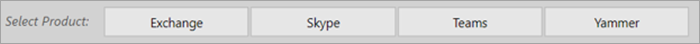
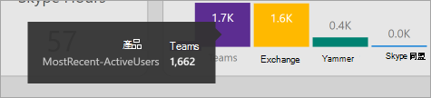
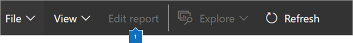

# 導覽和運用 Microsoft 365 使用情況分析中的報告

儀表板可為您提供主要使用情況和採用數據的快速概觀。 透過選取最上層的計量，您可以存取提供更多詳細資料和深入分析的報表。 每個報告索引標籤都包含組織使用狀況和採用狀況的特定資料視覺效果。 收集的資料會在每個報告的標題中說明，而且會出現一個拼貼，其中包含您正在查看之 [報表] 索引標籤上的視覺化效果的進一步資訊。

若要開始使用您的報表，以下是幾個祕訣：

- 在 [ **執行摘要** ] 頁面上，使用左側或相關度量的流覽索引標籤，以流覽至每個最上層的報表。

    

- 使用每個最上層報表頂端的流覽索引標籤，流覽至該層級中的不同報表。

    

- 許多報告都包含一個交叉分析篩選器，您可以在其中篩選您要查看的產品、AAD 屬性或活動。 這些可以是單項選取或多項選取。

    

    

- 將游標暫留在資料點上可檢視包含詳細資料的註標。

    

已範例化範本應用程式的使用者，將可以自訂報告的需求。 若要自訂範本應用程式：

- 在報告頂端選取 [ **編輯報告** ]。

    

- 使用基礎的[資料集](usage-analytics-data-model.md)，建立您自己的視覺效果。

- 使用 PowerBI Desktop 匯入您自己的資料來源。

若要共用您的報表，只要選取 [共用] 按鈕  在頁面頂端。

若要瞭解如何自訂報告，請參閱 [在 Microsoft 365 流量分析中自訂報告](customize-reports.md)。

您可以在 Power BI 說明文件中找到許多額外的資訊：

- [Power BI 基本概念](/power-bi/service-basic-concepts)

    深入瞭解儀表板、資料集、報告及其他 Power BI 概念。

- [Power BI 快速入門](/power-bi/service-get-started?wt.mc_id=O365_Reports_PBI_contentpack)

    了解 Power BI 中的基本功能。提供 Power BI Desktop 使用方法的連結。

- [共用儀表板和報表](/power-bi/service-share-dashboards)

    瞭解如何與您的同事或組織外部的人員共用報告。 您也可以共用報表或篩選的報表版本。