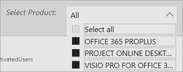

# 導覽和運用 Microsoft 365 使用情況分析中的報告Navigate and utilize the reports in Microsoft 365 usage analytics

儀表板可為您提供主要使用情況和採用數據的快速概觀。The dashboard provides you with a quick overview of the main usage and adoption metrics. 藉由選取的最上層的評量，您可以存取報告，可提供更多詳細資料和見解。By selecting the top-level metrics, you can access reports that provide more details and insights. 每個報表索引標籤包含資料視覺效果專屬於某一方面的使用情況和採用為您的組織。Each report tab contains data visualizations specific to an aspect of usage and adoption for your organization. 收集的資料會說明中的每個報表標題和磚會顯示包含進一步您正在檢視之報表索引標籤上視覺效果的相關資訊。The data collected is explained in the title of each report and a tile appears that contains further information about the visualizations on the report tab that you are viewing.

若要開始使用您的報表，以下是幾個祕訣：To get started with your reports, here are some tips:

- 使用瀏覽索引標籤左邊或相關的度量單位，在**Executive Summary** ] 頁面上，瀏覽至每個最高層級的報表。Use the navigation tabs on the left or on a related metric on the **Executive Summary** page to navigate to each top-level report.

    

- 使用頂端的每個最高層級的報表的瀏覽索引標籤，瀏覽至該階層內的不同報告。Use the navigation tabs at the top of each top-level report to navigate to different reports within that level.

    

- 許多報表都包含交叉分析篩選器，您可以篩選產品，AAD 屬性，或您想要檢視的活動。Many reports contain a slicer where you can filter on the product, AAD attribute, or activity that you want to view. 這些可以是單選或複選。These can be either single-select or multi-select.

    

    

- 將游標暫留在資料點上可檢視包含詳細資料的註標。Hover over data points to view a callout that contains details.

    

具現化範本應用程式的使用者必須能夠自訂報表以符合其需求。The user who has instantiated the template app will have the ability to customize the report to their needs. 若要自訂的範本應用程式：To customize the template app:

- 選取 [**編輯報表**上方的報告]。Select **Edit report** at the top of the report.

    

- 使用基礎的[資料集](usage-analytics-data-model.md)，建立您自己的視覺效果。Create your own visuals by using the underlying [datasets](usage-analytics-data-model.md).

- 使用 PowerBI Desktop 匯入您自己的資料來源。Use PowerBI Desktop to bring in your own data sources.

若要共用報表，只要選取 [共用] 按鈕To share your reports, just select the share button  在頁面頂端。at the top of the page.

若要了解如何自訂報表，請參閱[自訂 Microsoft 365 使用情況分析中的報告](customize-reports.md)。To learn how to customize the reports, see [Customizing the reports in Microsoft 365 usage analytics](customize-reports.md).

您可以在 Power BI 說明文件中找到許多額外的資訊：You can find lots of additional information in the Power BI help documentation:

- [Power BI 基本概念Power BI basic concepts](https://docs.microsoft.com/power-bi/service-basic-concepts)

    了解儀表板、 資料集、 報表和其他 Power BI 概念。Learn about dashboard, datasets, reports, and other Power BI concepts.

- [Power BI 快速入門Get started with Power BI](https://docs.microsoft.com/power-bi/service-get-started?wt.mc_id=O365_Reports_PBI_contentpack)

    了解 Power BI 中的基本功能。提供 Power BI Desktop 使用方法的連結。Learn the basic functionality in Power BI. Find links to how to use Power BI Desktop.

- [共用儀表板和報表Share dashboards and reports](https://docs.microsoft.com/power-bi/service-share-dashboards)

    了解如何與您的同事或組織外部人員共用報表。Learn how to share reports with your colleagues or people outside your organization. 您也可以共用報表的篩選的版本。You can also share the report or a filtered version of the report.
