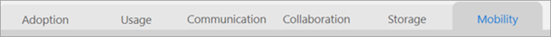

# 導覽和運用 Microsoft 365 使用情況分析中的報告Navigate and utilize the reports in Microsoft 365 usage analytics

儀表板可為您提供主要使用情況和採用數據的快速概觀。The dashboard provides you with a quick overview of the main usage and adoption metrics. 透過選取最上層的計量，您可以存取提供更多詳細資料和深入分析的報表。By selecting the top-level metrics, you can access reports that provide more details and insights. 每個報告索引標籤都包含組織使用狀況和採用狀況的特定資料視覺效果。Each report tab contains data visualizations specific to an aspect of usage and adoption for your organization. 收集的資料會在每個報告的標題中說明，而且會出現一個拼貼，其中包含您正在查看之 [報表] 索引標籤上的視覺化效果的進一步資訊。The data collected is explained in the title of each report and a tile appears that contains further information about the visualizations on the report tab that you are viewing.

若要開始使用您的報表，以下是幾個祕訣：To get started with your reports, here are some tips:

- 在 [ **執行摘要** ] 頁面上，使用左側或相關度量的流覽索引標籤，以流覽至每個最上層的報表。Use the navigation tabs on the left or on a related metric on the **Executive Summary** page to navigate to each top-level report.

    

- 使用每個最上層報表頂端的流覽索引標籤，流覽至該層級中的不同報表。Use the navigation tabs at the top of each top-level report to navigate to different reports within that level.

    

- 許多報告都包含一個交叉分析篩選器，您可以在其中篩選您要查看的產品、AAD 屬性或活動。Many reports contain a slicer where you can filter on the product, AAD attribute, or activity that you want to view. 這些可以是單項選取或多項選取。These can be either single-select or multi-select.

    

    

- 將游標暫留在資料點上可檢視包含詳細資料的註標。Hover over data points to view a callout that contains details.

    

已範例化範本應用程式的使用者，將可以自訂報告的需求。The user who has instantiated the template app will have the ability to customize the report to their needs. 若要自訂範本應用程式：To customize the template app:

- 在報告頂端選取 [ **編輯報告** ]。Select **Edit report** at the top of the report.

    

- 使用基礎的[資料集](usage-analytics-data-model.md)，建立您自己的視覺效果。Create your own visuals by using the underlying [datasets](usage-analytics-data-model.md).

- 使用 PowerBI Desktop 匯入您自己的資料來源。Use PowerBI Desktop to bring in your own data sources.

若要共用您的報表，只要選取 [共用] 按鈕To share your reports, just select the share button  在頁面頂端。at the top of the page.

若要瞭解如何自訂報告，請參閱 [在 Microsoft 365 流量分析中自訂報告](customize-reports.md)。To learn how to customize the reports, see [Customizing the reports in Microsoft 365 usage analytics](customize-reports.md).

您可以在 Power BI 說明文件中找到許多額外的資訊：You can find lots of additional information in the Power BI help documentation:

- [Power BI 基本概念Power BI basic concepts](/power-bi/service-basic-concepts)

    深入瞭解儀表板、資料集、報告及其他 Power BI 概念。Learn about dashboard, datasets, reports, and other Power BI concepts.

- [Power BI 快速入門Get started with Power BI](/power-bi/service-get-started?wt.mc_id=O365_Reports_PBI_contentpack)

    了解 Power BI 中的基本功能。提供 Power BI Desktop 使用方法的連結。Learn the basic functionality in Power BI. Find links to how to use Power BI Desktop.

- [共用儀表板和報表Share dashboards and reports](/power-bi/service-share-dashboards)

    瞭解如何與您的同事或組織外部的人員共用報告。Learn how to share reports with your colleagues or people outside your organization. 您也可以共用報表或篩選的報表版本。You can also share the report or a filtered version of the report.