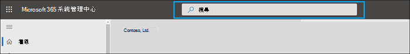
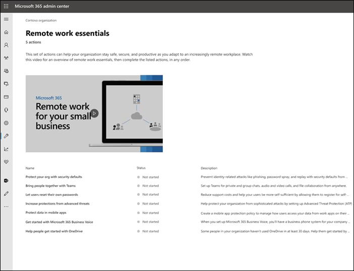
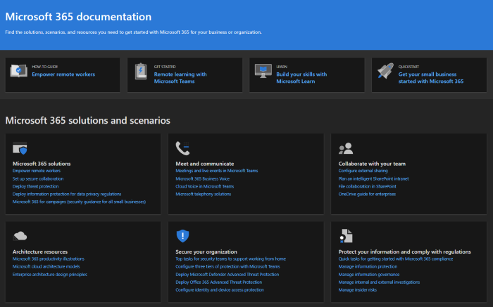
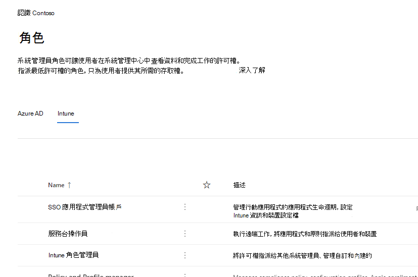

# Microsoft 365 系統管理中心的新功能

::: moniker range="o365-21vianet"

> [!NOTE]
> 本文中的部分資訊可能不適用於由世紀運作的 Office 365。

::: moniker-end

我們不斷將新功能新增至 [Microsoft 365 系統管理中心](https://docs.microsoft.com/microsoft-365/business-video/admin-center-overview)，以修正我們所學的問題，並根據您的意見反應進行變更。 請參閱下列內容，以查看今天可提供的功能。 有些功能會以不同的速度向客戶推出。 如果您還沒有看到功能， [請嘗試將您新增至目標版本](manage/release-options-in-office-365.md)。

如果您想要瞭解其他 Microsoft 雲端服務的新功能：

- [Azure Active Directory 的新功能](/azure/active-directory/fundamentals/whats-new)
- [Exchange 系統管理中心的新功能](/Exchange/whats-new)
- [Microsoft Intune 的新功能](/mem/intune/fundamentals/whats-new)
- [Microsoft 365 規範中心的新功能](/Office365/SecurityCompliance/whats-new)
- [Microsoft 365 Defender 的新功能](../security/mtp/whats-new.md)
- [SharePoint 系統管理中心的新功能](/sharepoint/what-s-new-in-admin-center)
- [Office 更新](/OfficeUpdates/)
- [如何檢查 Windows 版本健康情況](https://docs.microsoft.com/windows/deployment/update/check-release-health)

## Ignite 2021 (三月份) 

歡迎使用 Microsoft Ignite。 我們希望您可以參加下列其中一個會話： [Microsoft Ignite 2021](https://myignite.microsoft.com/sessions)。 以下是我們在 Ignite 中談論的一些事項。
> [!NOTE]
> 並非所有的功能都會立即提供給所有的功能。 如果您未看到新功能，請 [加入目標版本](manage/release-options-in-office-365.md)。

### 訊息中心

我們已 revamped 郵件中心，協助您探索相關郵件，並新增更靈活的閱讀體驗。 我們已新增 [ **服務** ] 欄，可協助您掃描郵件所套用的服務，並依服務和其他中繼資料篩選郵件。 您可以在郵件上方進行標記，以進行後續標記，選擇要顯示在郵寄清單中的欄，然後使用 [上一步] 和 [下一步] 按鈕流覽郵件。 我們也改善了處理訊息中心文章的意見，使其更容易提供意見反應。

:::image type="content" source="../media/message-center.png" alt-text="螢幕擷取畫面：訊息中心首頁顯示收件匣和郵件":::

若要深入瞭解這些新功能，請參閱 [在郵件中心管理郵件](manage/manage-messages.md)。

### 新功能

我們已改進您如何在 Office 應用程式中查看使用者的「新增功能」功能。 您現在可以在 [內容] 的 [新增] 窗格中看到豐富的內容，讓使用者可以看到。 您也可以在決定讓使用者瞭解該功能之前深入瞭解該功能。 如需詳細資訊，請參閱 [管理哪些功能出現在新的 Office 功能](manage/show-hide-new-features.md)。

:::image type="content" source="../media/power-bi-whats-new2.png" alt-text="螢幕擷取畫面： Office 應用程式的新頁面，顯示 Power BI 的增強功能":::

## Ignite 2020 (月 & 年9月) 

歡迎使用 Microsoft Ignite-我們的第一個僅供線上使用的 Ignite。 我們希望在我們的其中一個會話中看到您： [Microsoft Ignite 2020 Session Catalog](https://myignite.microsoft.com/sessions)。 以下是您將在 Ignite 中談論的一些事項。
> [!NOTE]
> 並非所有的功能都會立即提供給所有的功能。 如果您未看到新功能，請 [加入目標版本](manage/release-options-in-office-365.md)。

### 多租使用者管理

我們為多承租人系統管理員開發了一組功能，讓您能更快速且更有效率地完成工作。 如需詳細資訊，請參閱 [管理多個承租人](multi-tenant/manage.md)。

- **您的承租人**：在您管理的承租人之間快速切換。
- **所有承租人**：一種新的頁面，您可以在其中快速查看所有租使用者服務的健康情況、任何開啟的服務要求、產品和計費、建議的設定工作，以及該租使用者的使用者人數。
- **安裝程式**：「多租使用者安裝」頁面提供 [安裝] 頁面的清單視圖，但為許多承租人進行組織。 您可以看到哪些功能未開啟，所有承租人的工作均已完成，但承租人仍需完成的工作。 這個視圖會協助您追蹤功能採用，並確定總能進行建議的安全性設定工作。
- **服務健康** 情況：服務健康情況視圖會向您顯示是否有任何事件或諮詢影響承租人。 它甚至會告訴您受管理的承租人中有多少受到影響。 只要選取一個事件，即可在 [概覽] 索引標籤上取得詳細資訊，然後切換至 [租受影響] 索引標籤，以向下切入並支援該租使用者。
- **跨租使用者信箱遷移** 是一項新服務，現在是公開預覽，可讓您在承租人之間移動信箱，而不需要下架，然後是上架信箱。 
- **跨承租人網域共用**：不久，您可以加入私人預覽，以取得可讓您跨多個承租人共用網域的功能。 例如，如果 Contoso 取得 Wingtip 玩具，Contoso 可以與 Wingtip 玩具共用網域，讓這兩個承租人中的人都可以使用「contoso.com」作為其電子郵件地址。

![已選取事件且受租使用者開啟] 索引標籤的多承租人服務健康情況頁面。 導覽功能表的所有承租人、安裝程式和服務健康情況都是唯一的選項。](../media/MAC-WN-MTinServiceHealth.png)

### 監視最重要的帳戶

您可以監視和追蹤傳送給使用者的失敗或延遲的電子郵件訊息，其具有高業務影響，例如 CEO。 您可以在 Microsoft 365 系統管理中心中，將使用者新增至您的優先順序帳戶清單，以追蹤優先順序帳戶。 新增具有敏感或高優先順序資訊存取權、主管、主管或其他使用者。

優先順序帳戶只適用于符合下列兩項需求的組織：

- Office 365 E3 或 Microsoft 365 E3，或 Office 365 E5 或 Microsoft 365 E5。
- 至少10000個授權，以及至少50個每月使用中 Exchange Online 使用者。

有兩種開始入門：

- 移至 [ **使用者**]，然後在 [其他動作] 功能表中，選取 [ **管理優先順序帳戶** ]，將使用者新增至清單。
- 移至 [ **設定**]，尋找「安裝程式 **工作」監視您最重要的帳戶**，然後選取 [ **開始**]。

如需優先順序帳戶的詳細資訊，請參閱 [監視優先順序帳戶](./setup/priority-accounts.md)。

### 更快地搜尋並取得任何頁面的結果

我們已開始為系統管理中心推出新的搜尋體驗，我們無法等候您進行嘗試。 

- [搜尋] 方塊移至「Microsoft 365 系統管理中心」所在的頁首區域，所以現在您可以從任何頁面（而不只是首頁）進行搜尋。 我們甚至已獲得快捷方式： **Alt + S**。
- 搜尋更聰明，可提供更好的結果，甚至更快速。 請嘗試輸入 "2fa" 開始著手。
- 搜尋結果會依您可以採取的專案類型或動作進行組織。
  - **使用者**：選取使用者的名稱，您可以在其中編輯該使用者。 如果您選取其名稱旁邊的「其他動作」功能表，您可以重設其密碼。 您可以依顯示名稱、姓氏、名字、username 或主要電子郵件地址，以及電子郵件別名進行搜尋。 但若要取得完全相符，請依主要電子郵件地址或使用者名稱進行搜尋。
  - **群組**：從任何頁面編輯群組、新增成員、指派擁有者。
  - **動作**：類似于您可以搜尋使用者然後重設密碼的方式，您也可以從任何頁面搜尋「重設密碼」，然後為使用者重新設定一或多個密碼。
  - **導覽**：導覽底下的結果會很快協助您快速前往系統管理中心的頁面。 例如，搜尋「角色」會帶您前往 Azure AD 角色的「角色」頁面。
  - **設定**：搜尋與您組織相關的任何設定、您訂閱的服務，以及安全性和隱私權設定。 
  - **網域**：您可以找到您的網域的快速連結，然後連結會帶您前往該網域的 [概述與健康情況] 頁面。
  - **檔**：如果找不到結果，我們會嘗試尋找一些檔來協助。 策劃清單若要尋找相符專案所需的時間稍長一些，所以請等候第二個，讓搜尋尋找結果。 
  - **意見** 反應：未找到您所要尋找的專案？ 從搜尋向我們傳送意見反應。 我們會在系統管理中心新增更多頁面和功能的搜尋功能。

### Microsoft 365 admin 行動裝置應用程式

在您的訂閱中隨附的 [microsoft 365 admin 行動應用程式](https://www.microsoft.com/microsoft-365/business/manage-office-365-admin-app)，可讓您從行動裝置管理 microsoft 365，讓您離開桌面執行每一天的工作。 實際上，應用程式中有超過90的功能--而且我們只會新增一些功能：

- **支援 Microsoft Intune 的行動應用程式管理和條件式存取原則**：即使您的組織已開啟 Intune 的行動應用程式管理和條件式存取原則，您現在也可以使用您的個人裝置來管理 Microsoft 365。
- **郵件中心通知**：   >  如果您想要收到有關新的郵件中心文章的警示，請在設定 **通知** 開啟郵件中心通知。 透過通知，我們想要確保您及時瞭解租使用者的重要資訊和事件。
- **帳單** 通知：   >  如果您想要在訂閱即將到期時，在裝置上取得帳單通知，您也可以在設定 **通知** 中開啟帳單通知。
- **深色模式**：歡迎使用行動應用程式的深邊。 這是我們最要求的功能之一。 移至 [**設定**]  >  **主題**，開啟它。
- **報告問題**：您現在可以在應用程式中報告問題，或查看其他系統管理員所報告的問題。 請造訪 **服務健康** 情況，以取出。

### 適用于中小型企業的使用建議

如果組織中的某些人員未使用團隊、OneDrive 或 Office 應用程式，則小型和中型企業可能會在 **首頁** 上獲得建議。 當您查看建議時，您可以將 Microsoft 訓練傳送至非使用中的使用者，以協助他們開始使用應用程式，並確認您已從您的訂閱取得完整的價值。

### 遠端工作集合

在十月，我們將新增一個遠端工作集合，協助小型企業擁有者和員工在遠端工作。  「**遠端工作」基本** 設定是 Microsoft 建議安全啟用遠端工作和有效共同作業的所有功能策劃清單。 在幾周內，您可以在「**安裝程式**  >  **遠端工作」概要** 中嘗試。

如需如何安全地允許遠端工作的詳細資訊，以及便於記憶和共用的便捷網址，請移至 [aka.ms/remote-business](https://aka.ms/remote-business)。

### 需要協助嗎？移至更多系統管理中心

我們會不斷查看和更新內容及工具，以維持產品中的變更。 現在我們有許多自助的診斷工具，可協助您快速有效地解決問題。 以下是最近新增的少數幾個專案：

- 變更您的 Exchange Web 服務節流原則
- 檢查小組提供和驗證特定使用者的狀態
- 修正 DKIM 安裝問題
- 診斷 Intune 使用者註冊錯誤

而且，我們正在推出您已在 Microsoft 365 系統管理中心中看到的新的和改善的支援經驗，以供其他一些系統管理中心。 小組系統管理中心及安全性與合規性管理中心已具備這種新體驗。 而且不久， **Exchange 系統管理中心**、 **SharePoint 系統管理中心** 和 **Office.com** 將會隨系統管理員的這一新協助體驗一起更新。

### 使用 Microsoft Planner 管理變更

在5月宣佈，我們宣佈您可以將郵件中心發佈同步處理至 Microsoft Planner，現在可供所有人使用。  您現在可以從郵件建立工作、指派任務，以及追蹤工作完成。 您第一次選取 [ **Planner 同步** 處理] 時，您必須連線至適當的計畫。

![在 [喜好設定] 按鈕旁邊的命令列中，高亮顯示「規劃同步處理」的郵件中心頁面。](../media/MAC-WN-MCPlannerSync.png)

若要深入瞭解它，請參閱本文和影片以查看其運作方式： [在 Planner 中追蹤您的訊息中心文章](/Office365/Planner/track-message-center-tasks-planner)

### 檔、訓練和影片

- 適用于 Microsoft Ignite--[虛擬中樞](https://adoption.microsoft.com/virtual-hub/)的全新和即時的品牌。 深入深入瞭解 IT 專業人員和開發人員的技術訓練。 在 #SIDETRACKED 中，快速尋找20個新影片，作為的一部分，這一年的 Ignite 系統管理員追蹤名稱。
- [Microsoft 365 vcd 系列的新](https://www.youtube.com/watch?v=OVjb2lGJ4GU&t=2s) 功能：本月，我們涵蓋在小組和網頁上的白板中可用的新功能、如何自動化使用者對 Azure AD 的布建、新的 Power 自動化觸發器及小組中的動作等等。 並在下個月繼續深入瞭解，我們將在 Ignite 取得所有重要事情的回顧！
- 我們會先重新設計著重于解決方案的 [Microsoft 365 檔](/microsoft-365) 頁面。 我們會在此頁面上醒目提示新的解決方案，因此請留意。

## 2020 年 7 月

### 準備好 Ignite 2020

當我們在 Microsoft 移至 Ignite 季節時，我們並未發佈許多功能，讓我們在我們的會話中有大量討論。

本文的下一次更新將會在第一次僅限線上 Ignite 的開始日期。 今年，您可以免費參加！ 請取出： [Microsoft Ignite 2020](https://www.microsoft.com/ignite)。

### 您的產品

在訂閱管理中已完成許多工作，使頁面的載入速度更快、找到您所需的內容，以及符合 web 協助工具標準 ([WCAG 2.1 指導方針](http://www.w3.org/TR/WCAG21/)) 。

- **表重新設計**：資料表經過重新設計，可讓您分組類似的訂閱。 移至  >  **您的產品** 收費。
- **產品詳細資料**：透過選取清單中的產品，即可取得您訂閱的詳細資料。
- **請從這裡執行全部** 動作：而且，您不必移至多個頁面來管理一種產品。 例如，如果您需要取消訂閱，該面板將會開啟，以執行該動作。

![[產品] 頁面，並開啟 [取消訂閱] 面板。](../media/MAC-WN-SubscrDetails.png)

### 網域

網域管理可能很複雜，而且我們已發佈新功能，讓這種情況變得更容易。 移至 [設定] > 網域]，然後選取網域，以取得網域和網域健康狀態的詳細資訊。

:::image type="content" source="../media/MAC-WN-DomainDNS.PNG" alt-text="Contoso.com 的網域詳細資料頁面":::

### 2020年7月 (的檔、訓練和影片) 

[Microsoft 365 vcd 系列的新功能](https://youtu.be/m1Nu8WJgCDY) ：本月，我們涵蓋新的 yammer 體驗網頁和行動裝置，如何整合 Microsoft 小組的 yammer 社區應用程式、新的原則套件以支援 Firstline 工作者和主管等等。

## 2020 年 6 月

### 保持 Office 的新管理功能

在幾個月之前，我們新增了一個設定，可讓您管理 [使用者的 Office 應用程式中顯示的新訊息](#office-whats-new-management)。 本月，我們發行的是新的首頁卡片，可協助您快速行動並追蹤您要向組織中的使用者顯示的 **新** 訊息。

###  (年6月的檔、訓練和影片) 

- [小組快速入門](https://support.microsoft.com/office/184f1aba-2f91-43f0-86e1-9fae607e24f6)

## 2020 年 5 月

### 適用于 Office 的新更新通道

在5月12日，我們宣佈推出新更新通道 for Office：月度 Enterprise 通道。 此更新通道會在每月的第二個星期二，一月內為您的使用者提供新的 Office 功能。

如果您允許使用者從入口網站自行安裝 Office，您可以為其選取每月的 Enterprise 通道。 若要這麼做，請登入 Microsoft 365 系統管理中心，然後移至 [**顯示所有**  > **設定** 的所有設定] [  >  **組織**  >    >  **Office 軟體下載設定**]。 如果您在每月 **(每月的 Enterprise 通道)** 選擇一次，則會將任何新的自行安裝設定為使用每月的 enterprise 通道。

與每月的 Enterprise 通道版本一起，我們也會修訂現有更新通道的名稱。 例如，每月通道都會重新命名為目前通道。 新的名稱會在2020年6月9日生效。

如需詳細資訊，請參閱 [Microsoft 365 Apps 更新通道的變更](/DeployOffice/update-channels-changes) (部分機器翻譯)。

### 新系統管理員角色

我們已在 Microsoft 365 系統管理中心中新增一些新的 Azure Active Directory 系統管理員角色。

- 混合式身分識別系統管理員角色可讓使用者管理雲端布建和驗證服務的許可權。
- 網路管理員角色可讓使用者管理網路位置，並查看 Microsoft 365 軟體的網路洞察力，以作為服務應用程式。
- 印表機系統管理員角色會授與管理印表機及印表機連線所有層面的許可權。
- 印表機技術人員是印表機系統管理員角色的子集，使用者可以在其中註冊及取消註冊印表機，以及更新印表機狀態。
若要瞭解更多有關這些角色的資訊，請參閱 [關於系統管理員角色](./add-users/about-admin-roles.md)。

### 匯出群組清單

我們從許多系統管理員那裡聽說過，他們需要分享群組的相關資訊，以及他們對不具備系統管理員中心存取權的使用方式。 您現在可以將 [群組] 清單匯出至 CSV 檔案，以進行審計，這表示您可以扔掉舊的 PowerShell 腳本。 若要嘗試，請移至 [**群組**]  >  **群組**，然後選取 [從命令列 **匯出群組**]。

### Microsoft 365 解決方案與架構中心

只是在這個月發行新的網站， [https://docs.microsoft.com]() 稱為 [Microsoft 365 解決方案和架構中心](../solutions/index.yml)，其結合了您需要的技術指導方針，以瞭解、規劃及實施整合的 Microsoft 365 解決方案，以進行安全且相容的共同作業。 在此中心，您會發現：

- 基礎解決方案指導方針
- 工作負載解決方案與案例指南
- 海報 (的解決方案和架構圖例!!!) 
- 行業特定指引
- 企業架構設計主體

### 檔、訓練和影片 (可能) 

- **Microsoft 365 vcd 系列的新功能**：本月，我們涵蓋小組系統管理員和安全性與合規性中心的新支援體驗，與郵件中心整合 Planner，以及 Microsoft 小組中新的3x3 影片版面配置。 
- [Microsoft 365 系統管理中心](./index.yml)的「協助中心」頁面已更新，可協助您更快速地找到您需要的專案。 而且，如果您現在查看此頁面，我們已新增了一張卡片，通知您重要的更新和變更。

## 2020 年 4 月

### Intune 角色管理

[2020 年 4 月](#april-2020)

好吧，我們這麼！ 我們已將第二個步驟轉向統一角色的體驗，您現在可以在 Microsoft 365 系統管理中心管理 Intune 角色。 您也可以利用諸如搜尋角色及查看角色許可權等功能。 這表示您不需要兩個不同的工具來管理 Microsoft 365 和 Intune 的角色。 當您登入 Microsoft 365 系統管理中心時，您會看到 [角色] 頁面上有兩個樞軸，一個用於 Azure AD，一個用於 Intune。

### 同步處理郵件中心至 Planner 的文章

從5開始，在目標版本中的系統管理員，將會在訊息中心看到「Planner 同步處理」按鈕。 您現在可以追蹤需要動作的郵件，請選取您想要追蹤的郵件類型、指派郵件以追蹤為任務，以及標記郵件以供日後注意。

將[目標的發行版本本加入](manage/release-options-in-office-365.md)開始！

### 「需要協助嗎？」 在小組系統管理中心中啟動 & 安全性與合規性中心

小組系統管理中心、安全性中心及合規性中心現在使用相同的「需要協助」嗎？ Microsoft 365 系統管理中心用來尋找説明和聯繫支援的功能。 我們已從系統管理員那裡收到許多您想要具備相同層級說明和支援的意見，我們很樂意為您提供這項協助和支援。 請試用它，並提供您的意見反應！

#### 需要聊天？

我們的支援代理程式從家裡開始運作，但仍然需要客戶案例和網際網路頻寬限制，但在家運作時可能會影響客戶的通話品質。 為了繼續支援，我們已在 Microsoft 365 系統管理中心中為商務客戶啟動 live chat 支援選項。

在建立服務要求時，除了電話和電子郵件之外，您現在還會看到 [聊天] 作為選項。 選取 [聊天室] 做為通訊的慣用通道，並建立要求。 建立要求之後，您可以在準備好與 Microsoft 代理人聊天時啟動聊天。

### 小組更新

隨著小組使用量的增加，我們新增了一些功能來協助您進行管理。

- 系統管理中心首頁上的新建議卡會顯示哪些使用者的使用者最近未使用團隊的30天。 您可以將訓練電子郵件傳送給這些使用者，讓他們能夠使用小組開始使用。
- 將 **人員放在一起**：請移至 [**設定**] 以查看新的頁面，以協助您開啟已授權使用者的團隊並允許來賓存取，因此您可以與小組中的外部客戶合作。
- Microsoft 團隊卡片現在會預設會固定至您的首頁。 它會顯示團隊是否已開啟，以及是否允許來賓存取。 它也可讓您檢查新授權小組使用者的設定狀態，並檢查網路問題是否可能影響團隊使用者。
- 最後，當您購買包含小組的授權時，小組現在是初始設定流程中的步驟。

### 生產力分數

生產力分數提供人員如何使用 Microsoft 雲端服務的相關資訊，以及支援這些服務的技術經驗。 分數會反映貴組織對於員工和技術經驗的效能，並將您的分數與像您的組織相比較。 本月，我們為預覽經驗引進了下列新概念：

- 首頁與類別詳細資料頁面上主要洞察力的趨勢視圖-新增至技術經驗的端點分析和網路連線類別
- 員工經驗類別中所顯示的相關技術經驗洞察力
- 作為員工經驗一部分的新通訊類別
- 員工經驗類別中組織中繼資料的使用者詳細資料

如果您想要深入瞭解，請參閱博客： [使用 Microsoft 生產力分數測量和提升 microsoft 365 的經驗](https://techcommunity.microsoft.com/t5/microsoft-365-blog/measure-and-improve-the-microsoft-365-experience-with-microsoft/ba-p/1348618)。 目前私人預覽中的生產力分數。 [加入生產力分數私人預覽](https://aka.ms/productivityscorepreview) 開始。

### 群組更新

本月的群組有兩個更新：

- 您現在可以編輯 Office 365 群組的電子郵件地址 (也稱為「Outlook」中的群組，不久稱為「Microsoft 365 群組」) 。
- 我們已聽說您的意見反應，我們新增了更清晰的錯誤訊息，讓您無法將群組轉換為 Microsoft 團隊。

###  (四月) 的檔、影片及訓練

**Microsoft 365 vcd 系列的新功能**：本月，我們涵蓋秘訣和資源，協助小型企業轉變為遠端工作，包括如何推廣 Microsoft 團隊、遠端工作訓練資源，以與用戶端和合作夥伴保持連線，以及新的 Microsoft 365 商務語音方案。 [Microsoft 365 的新功能](https://go.microsoft.com/fwlink/p/?linkid=2118096)

#### 為您的使用者

- [排程會議](https://support.microsoft.com/office/c61b4f61-ee62-4a06-8bf7-0a1cd302700a)
- [加入小組會議](https://support.microsoft.com/office/078e9868-f1aa-4414-8bb9-ee88e9236ee4)
- [建立全組織小組](https://support.microsoft.com/office/037bb27a-bcc9-48fe-8d72-44d9482420a3)
- [建立具有來賓的小組](https://support.microsoft.com/office/11fbb083-52ee-434d-8c6e-63711fdafac7)
- [將小組加入為來賓](https://support.microsoft.com/office/928d1eef-61e2-49ec-b754-c2fe86b34824)
- [建立群組電子郵件地址](https://support.microsoft.com/office/ded875f9-a9de-437f-b559-2ae4f235bb2b)

#### 針對系統管理員和企業擁有者

- [利用遠端工作為您的小型企業提供強大功能](https://support.microsoft.com/office/9b91a85a-39b4-40a6-a590-0f9bea0ba8e6)
- [執行遠端小型企業](https://support.microsoft.com/office/9ac1a0f1-789b-4143-b954-5821d5d89298)
- [註冊 Microsoft 商業基本版](https://support.microsoft.com/office/9ac1a0f1-789b-4143-b954-5821d5d89298)
- [設定兩個要素登入](https://support.microsoft.com/office/9ac1a0f1-789b-4143-b954-5821d5d89298)

## 2020 年 3 月

### 特別推薦的反應修正：改善授權的「新增使用者」可靠性

我們收到許多來自系統管理員的意見，可供系統管理員在新增使用者時，將授權指派給他們的困難程度。 我們已對此修正進行第一次更新，我們已遷移至較可靠的幕後服務，以處理這些要求。 如果發生錯誤，您現在會收到錯誤訊息，可讓您再試一次。

### Microsoft 小組首頁頁面卡片

透過 uptick 在小組的使用中，有些組織 emc 會取得一個固定的儀表板卡，讓小組開啟更容易探索。 這張卡片也具有訓練及檔的連結，可協助您的組織轉換至遠端工作。 請移至 **首頁** 以查看新的卡片。

### 自訂群組織的 SharePoint 行動應用程式主題

您可以使用 Microsoft 365 系統管理中心，在 SharePoint 行動應用程式中自訂群組織的主題，以進行 iOS 和 SharePoint 適用于 Android 的行動應用程式。 這項功能可輕鬆提供行動內部網路應用程式經驗，可讓員工在旅途中符合您的 SharePoint 線上。 主題自訂包括您的徽標影像、導覽列色彩、文字和圖示色彩，以及強調色彩的難易色彩。

### 「新增群組」嚮導的增強功能

當系統管理員建立新的群組，並將其指派給一個小組時，他們就可以指派沒有包含小組之授權的擁有者。 而且這會產生一些麻煩。 我們已更新嚮導流程，以驗證擁有者是否擁有小組授權，以及是否未停用將群組轉換為小組的選項。

### 適用于中小型企業的 Microsoft 365 產品

我們知道這是下個月的宣告，但我們想要確保您已做好準備。

從365年4月21日起，我們將與 Office 訂閱相關的變更，用於中小企業和 Office 365 ProPlus。 這些產品現在會使用 Microsoft 365 品牌。

新的產品名稱會在2020年4月21日生效。 這只是對產品名稱所做的變更，目前沒有任何定價或功能變更。

|目前名稱 |新名稱  |
|---------|---------|
|Office 365 商務基本版     |   Microsoft 365 商務基本版      |
|Office 365 商務進階版     |    Microsoft 365 商務標準版     |
|Microsoft 365 商務版     |    Microsoft 365 商務進階版     |
|Office 365 Business     |    Microsoft 365 Apps 商務版       |
|Office 365 專業增強版    |   適用于企業的 Microsoft 365 應用程式      |

### 影片、訓練及檔

[Microsoft 365 web 系列的新](https://go.microsoft.com/fwlink/p/?linkid=2118096)功能：在這個月的劇集中，我們會強調 microsoft 小組的3年周年紀念，並涵蓋新功能，包括線上會議中增強的音訊品質、firstline 管理員的目標通訊，以及倒班應用程式、小組和 Skype 使用者互通性等等。

## 2020 年 2 月

### 功能回饋修正：多組織切換器

我們收到許多來自合作夥伴和系統管理員的意見，以瞭解管理多個 Microsoft 雲端組織 emc 的挑戰。 我們第一個多組織的管理功能是「 **組織切換** 器」，可讓您在只需2次按一下的情況下，在您管理的組織 emc 之間進行變更。
> [!TIP]
> 您不需要執行任何動作，只要您屬於至少一個組織的記錄的協力廠商，就會顯示組織切換器。

1. 在 Microsoft 365 admin center 中，選取組織名稱。

2. 在 [組織切換器] 中，選取您要管理的組織。

這實際上!!!

### 群組

在 [群組] 區域中的兩個變更：

- **依群組名稱排序**：您可以選取 [ **組名** ] 欄，依字母順序排序群組清單。
- **還原已刪除的 microsoft 365 群組**：您不需要移至 Exchange 系統管理中心，即可還原已刪除的 microsoft 365 群組。 移至 **Microsoft 365 系統管理中心** \> **群組** \> **已刪除群組** \> (從清單) \> **還原群組** 中選取群組。 它會將群組還原回 **群組** 清單，並還原群組的電子郵件、交談、筆記本、檔案和行事曆。

###  (二月份) 的影片、訓練及檔

- **Microsoft 365 vcd 系列的新** 功能：本月，我們著重于 SharePoint 線上的自訂搜尋功能，這是 Office 「全新」的管理功能，可讓您透過應用程式的 [說明] 窗格中的使用者顯示或隱藏特定功能、Yammer 中的最新安全性和相容性更新等等。 以下是最新的劇集： [Microsoft 365 的新功能](https://go.microsoft.com/fwlink/p/?linkid=2118096)

- 檔 **移動**：我們會結合使用 Microsoft 365 內容的 Office 365 管理網頁文章，而且您可能會注意到新的 URL。 例如，本文的用途是： **docs.microsoft.com/Office365/Admin/whats-new-in-preview**，但 URL 現在是： **docs.microsoft.com/microsoft-365/admin/whats-new-in-preview**。 如果您已將頁面加上書簽，則應該更新連結;不過，內容連結會重新導向至新的內容儲存機制。

## 2020年1月-新年快樂

> [!NOTE]
> 您是否知道 YouTube 上的 Microsoft 365 影片系列有 [哪些新功能](https://go.microsoft.com/fwlink/p/?linkid=2118096) ？ 它會強調我們為使用者推出的最新功能。 我們每月都會開始連結至 [影片 [、訓練及](#videos-training-and-docs) 檔] 區段中的最新劇集。     以下是最新的劇集： [Microsoft 365 的新功能](https://go.microsoft.com/fwlink/p/?linkid=2118096)

### 深色模式

當我們第一次推出深色模式時，只有首頁可用。 深色模式現在已退出預覽，且位於系統管理中心內大多數頁面的目標版本。

1. 首先，您需要開啟目標版本：移至 [**設定**] [ \>  \> **組織設定檔** \> **發佈喜好** 設定]。
1. ，然後開啟深色模式，移至 **首頁** ，然後選取 [ **深色模式]** 按鈕。  ([ **搜尋** ] 欄位旁，以及本文的 [ **新功能** ] 連結。 ) 
1. 針對具有深色模式的任何頁面，按鈕位於頁面頂端，位於新的系統 **管理中心** 切換旁邊。

### Office 的新功能管理

管理員想要控制 Microsoft 如何在 Office app 中向其使用者傳達「新功能」，您現在可以使用該控制項。 移至 [ **設定**] [ \> **新增 Office 的新增功能管理] 預覽**。 選取可查看其詳細資料的功能，如果您不想讓使用者看到特定的「新增功能」訊息，您可以選取 [ **從使用者隱藏** ] 按鈕。 例如，您的組織可能會等候使用者瞭解功能，直到您組織中的每個人都有訓練為止。

![Office 的螢幕抓圖功能的 [詳細資料] 窗格已開啟的新增預覽。](../media/whatsnew-officemgmt-preview.png)

這項功能初次發佈為在11月內預覽，但有一些應該知道的功能更新： [Office 最近更新現在可使用的管理預覽更新](https://techcommunity.microsoft.com/t5/microsoft-365-blog/office-what-s-new-management-preview/ba-p/1020438)

### 協力程式

Howdy，合作夥伴！  (無法幫您自己。 ) 我們也為您提供此月的更新。 這是一項新功能，可讓合作夥伴讓 CSP 客戶在系統管理中心的 [ **計費帳戶** ] 區段中，接受其 Microsoft 客戶合約 (MCA) 的選項。 在這項全新體驗中：

1. 客戶會收到邀請電子郵件，其中包含可接受夥伴關聯性和 MCA 的連結。
2. 在客戶登入後，他們就可以在系統管理中心中查看和接受 MCA 和合作夥伴許可權。

### 資源信箱

資源信箱清單已更新為新的樣式。 在 Microsoft 365 系統管理中心中，移至 [ **資源** \> **聊天室] & 設備**]。

###  (一月) 的影片、訓練及檔

查看我們于1月發行的小型企業系統管理員訓練。

- [建立您的商務網站](https://support.microsoft.com/office/3325d50e-d131-403c-a278-7f3296fe33a9)
- [尋找解答和說明](https://support.microsoft.com/office/7f681212-c649-4a3e-a43b-32b1d1e58988)
- [取得說明或支援](https://support.microsoft.com/office/18948a4c-3eb1-4b30-b1bc-a4cc29eb7655)
- [刪除使用者](https://support.microsoft.com/office/6bcdad7b-732a-4260-997a-8c176bc3d9d6)
- [選擇 Microsoft 訂閱](https://support.microsoft.com/office/b9f7c78e-430f-4117-89ec-2eeb1dced2ca)
- [Microsoft 365 商務版安全性概述](https://support.microsoft.com/office/3274b159-a825-46d7-9421-7d6e209389d1)