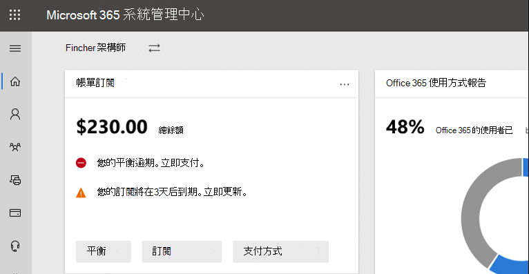

# Microsoft 365 系統管理中心的新功能

我們不斷將新功能新增至[Microsoft 365 系統管理中心](microsoft-365-admin-center-preview.md)，以修正我們所學的問題，並根據您的意見反應進行變更。 請參閱下列內容，以查看今天可提供的功能。 有些功能會以不同的速度向客戶推出。 如果您還沒有看到功能，[請嘗試將您新增至目標版本](manage/release-options-in-office-365.md)。

> [!IMPORTANT]
> **「傳統」系統管理員中心于三月份開始退休**  
當您登入 admin.microsoft.com 時，您將會在每次進入新的系統管理中心。 在三月份，我們將開始停用切換回傳統系統管理中心的功能。 現在，您仍然可以切換回來，但在新的系統管理中心有同位（而且超過它），我們會關閉所有組織的參數。    *上次更新：2020年3月2日*

此外，如果您對其他 Microsoft 雲端服務的新功能感興趣：

- [Exchange Online 的新功能](https://go.microsoft.com/fwlink/?linkid=2119714)
- [Microsoft Intune 的新功能](https://docs.microsoft.com/mem/intune/fundamentals/whats-new)
- [Microsoft 365 規範中心的新功能](https://docs.microsoft.com/Office365/SecurityCompliance/whats-new)
- [SharePoint 系統管理中心的新功能](https://docs.microsoft.com/sharepoint/what-s-new-in-admin-center)
- [Office 更新](https://docs.microsoft.com/OfficeUpdates/)

## 2020 年 3 月

### 特別推薦的反應修正：改善授權的「新增使用者」可靠性

我們收到許多來自系統管理員的意見，可供系統管理員在新增使用者時，將授權指派給他們的困難程度。 我們已對此修正進行第一次更新，我們已遷移至較可靠的幕後服務，以處理這些要求。 如果發生錯誤，您現在會收到錯誤訊息，可讓您再試一次。

:::image type="content" source="../media/MAC-WN-ImprovedLicensing.png" alt-text="新增錯誤的使用者確認頁面。":::

### Microsoft 小組首頁頁面卡片

透過 uptick 在小組的使用中，有些組織 emc 會取得一個固定的儀表板卡，讓小組開啟更容易探索。 這張卡片也具有訓練及檔的連結，可協助您的組織轉換至遠端工作。 請移至**首頁**以查看新的卡片。

:::image type="content" source="../media/MAC-WN-TeamsCard.PNG" alt-text="Microsoft 小組首頁頁面卡片":::

### 自訂群組織的 SharePoint 行動應用程式主題

您可以使用 Microsoft 365 系統管理中心，在 SharePoint 行動應用程式中自訂群組織的主題，以進行 iOS 和 SharePoint 適用于 Android 的行動應用程式。 這項功能可輕鬆提供行動內部網路應用程式經驗，可讓員工在旅途中符合您的 SharePoint 線上。 主題自訂包括您的徽標影像、導覽列色彩、文字和圖示色彩，以及強調色彩的難易色彩。

:::image type="complex" source="../media/MAC-WN-CustThemeSP.png" alt-text="圖表將系統管理中心設定對應至行動應用程式。":::

:::image-end:::

### 「新增群組」嚮導的增強功能

當系統管理員建立新的群組，並將其指派給一個小組時，他們就可以指派沒有包含小組之授權的擁有者。 而且這會產生一些麻煩。 我們已更新嚮導流程，以驗證擁有者是否擁有小組授權，以及是否未停用將群組轉換為小組的選項。

### 適用于中小型企業的 Microsoft 365 產品

我們知道這是下個月的宣告，但我們想要確保您已做好準備。

從365年4月21日起，我們將與 Office 訂閱相關的變更，用於中小企業和 Office 365 ProPlus。 這些產品現在會使用 Microsoft 365 品牌。

新的產品名稱會在2020年4月21日生效。 這只是對產品名稱所做的變更，目前沒有任何定價或功能變更。

|目前名稱 |新名稱  |
|---------|---------|
|Office 365 商務基本版     |   Microsoft 365 商務基本版      |
|Office 365 商務進階版     |    Microsoft 365 商務標準版     |
|Microsoft 365 商務版     |    Microsoft 365 商務版 Premium     |
|Office 365 商務版     |    Microsoft 365 商務應用程式       | 
|Office 365 專業增強版    |   適用于企業的 Microsoft 365 應用程式      |

### 影片、訓練及檔

[Microsoft 365 web 系列的新](https://go.microsoft.com/fwlink/p/?linkid=2118096)功能：在這個月的劇集中，我們會強調 microsoft 小組的3年周年紀念，並涵蓋新功能，包括線上會議中增強的音訊品質、firstline 管理員的目標通訊，以及倒班應用程式、小組和 Skype 使用者互通性等等。

## 2020 年 2 月

### 功能回饋修正：多組織切換器

我們收到許多來自合作夥伴和系統管理員的意見，以瞭解管理多個 Microsoft 雲端組織 emc 的挑戰。 我們第一個多組織的管理功能是「**組織切換**器」，可讓您在只需2次按一下的情況下，在您管理的組織 emc 之間進行變更。
> [!TIP]
> 您不需要執行任何動作，只要您屬於至少一個組織的記錄的協力廠商，就會顯示組織切換器。

1. 在 Microsoft 365 admin center 中，選取組織名稱。

2. 在 [組織切換器] 中，選取您要管理的組織。

這實際上!!!

### 群組

在 [群組] 區域中的兩個變更：

- **依群組名稱排序**：您可以選取 [**組名**] 欄，依字母順序排序群組清單。
- **還原已刪除的 office 365 群組**：您不再需要移至 Exchange 系統管理中心，即可還原已刪除的 office 365 群組。 移至**Microsoft 365 系統管理中心** \> **群組** \> **已刪除的群組** \> （從清單中選取群組\> ）**還原群組**。 它會將群組還原回**群組**清單，並還原群組的電子郵件、交談、筆記本、檔案和行事曆。

### 影片、訓練及檔

- **Microsoft 365 vcd 系列的新**功能：本月，我們著重于 SharePoint 線上的自訂搜尋功能，這是 Office 「全新」的管理功能，可讓您透過應用程式的 [說明] 窗格中的使用者顯示或隱藏特定功能、Yammer 中的最新安全性和相容性更新等等。 以下是最新的劇集： [Microsoft 365 的新功能](https://go.microsoft.com/fwlink/p/?linkid=2118096)

- 檔**移動**：我們會結合使用 Microsoft 365 內容的 Office 365 管理網頁文章，而且您可能會注意到新的 URL。 例如，本文的用途是： **docs.microsoft.com/Office365/Admin/whats-new-in-preview**，但 URL 現在是： **docs.microsoft.com/microsoft-365/admin/whats-new-in-preview**。 如果您已將頁面加上書簽，則應該更新連結;不過，內容連結會重新導向至新的內容儲存機制。

## 2020年1月-新年快樂

> [!NOTE]
> 您是否知道 YouTube 上的 Microsoft 365 影片系列有[哪些新功能](https://go.microsoft.com/fwlink/p/?linkid=2118096)？ 它會強調我們為使用者推出的最新功能。 我們每月都會開始連結至 [影片[、訓練及](#videos-training-and-docs)檔] 區段中的最新劇集。     以下是最新的劇集： [Microsoft 365 的新功能](https://go.microsoft.com/fwlink/p/?linkid=2118096)

### 深色模式

當我們第一次推出深色模式時，只有首頁可用。 深色模式現在已退出預覽，且位於系統管理中心內大多數頁面的目標版本。

1. 首先，您需要開啟目標版本：移至 [**設定** \> **Settings** \> ] [**組織設定檔** \> **發佈喜好**設定]。
1. ，然後開啟深色模式，移至**首頁**，然後選取 [**深色模式]** 按鈕。 （它是在**搜尋**欄位旁邊，也就是 [**新功能**] 連結）。
1. 針對具有深色模式的任何頁面，按鈕位於頁面頂端，位於新的系統**管理中心**切換旁邊。

### Office 的新功能管理

管理員想要控制 Microsoft 如何在 Office app 中向其使用者傳達「新功能」，您現在可以使用該控制項。 移至 [**設定** \> ] [**新增 Office 的新增功能管理] 預覽**。 選取可查看其詳細資料的功能，如果您不想讓使用者看到特定的「新增功能」訊息，您可以選取 [**從使用者隱藏**] 按鈕。 例如，您的組織可能會等候使用者瞭解功能，直到您組織中的每個人都有訓練為止。

![Office 的螢幕抓圖功能的 [詳細資料] 窗格已開啟的新增預覽。](../media/whatsnew-officemgmt-preview.png)

這項功能初次發佈為在11月內預覽，但有一些應該知道的功能更新： [Office 最近更新現在可使用的管理預覽更新](https://techcommunity.microsoft.com/t5/microsoft-365-blog/office-what-s-new-management-preview/ba-p/1020438)

### 協力程式

Howdy，合作夥伴！ （無法幫您自己。）我們也為您提供這一月的更新。 這是一項新功能，可讓合作夥伴讓 CSP 客戶在系統管理中心的「**帳單帳戶**」區段中接受其 Microsoft 客戶合約（MCA）選項。 在這項全新體驗中：

1. 客戶會收到邀請電子郵件，其中包含可接受夥伴關聯性和 MCA 的連結。
2. 在客戶登入後，他們就可以在系統管理中心中查看和接受 MCA 和合作夥伴許可權。

### 資源信箱

資源信箱清單已更新為新的樣式。 在 Microsoft 365 系統管理中心中，移至 [**資源** \> **聊天室] & 設備**]。

### 影片、訓練及檔（一月）

查看我們于1月發行的小型企業系統管理員訓練。

- [建立您的商務網站](https://support.office.com/article/3325d50e-d131-403c-a278-7f3296fe33a9)
- [尋找答案及說明](https://support.office.com/article/7f681212-c649-4a3e-a43b-32b1d1e58988)
- [取得協助或支援](https://support.office.com/article/18948a4c-3eb1-4b30-b1bc-a4cc29eb7655)
- [刪除使用者](https://support.office.com/article/6bcdad7b-732a-4260-997a-8c176bc3d9d6)
- [選擇 Microsoft 訂閱](https://support.office.com/article/b9f7c78e-430f-4117-89ec-2eeb1dced2ca)
- [Microsoft 365 商務版安全性概述](https://support.office.com/article/3274b159-a825-46d7-9421-7d6e209389d1)

## 11月和12月2019

在 Ignite 後，我們會結合11月和12月的新聞。 在新年看到您！

### 從信用卡變更為發票付款

我們開始開始將支付方式從信用卡變更為發票的功能。 移至**帳單**\> **產品 & 服務**，選取訂閱，然後選取信用卡付款旁邊的 [**編輯**] 連結。

想要深入閱讀它？ [從信用卡或銀行帳戶變更為發票](../commerce/billing-and-payments/change-payment-method.md#change-from-credit-card-or-bank-account-to-invoice)

### 全域讀取者

我們已在[十月 2019-Ignite Edition](#october-2019---ignite-edition)中提及全域讀取者角色，但隨著其更廣泛地展開，我們將討論一些詳細資料：

- 全域讀取器角色是全域系統管理員角色的唯讀對應。 全域讀取器可以查看全域管理員有權執行的所有動作。
- 使用一些例外狀況（如某些規範和安全性功能），全域讀者可以存取您的組織授權使用的所有 Microsoft cloud 管理中心。
- 將全域讀者角色指派給需要 it 人員進行規劃、審核和調查的使用者。
- 您也可以將全域讀取器角色與具有較少許可權的另一個角色組合。 例如，一部小型企業擁有者可能會被指派**計費管理員** + **全域讀取**者角色，讓他們可以支付帳單，並持續掌握其雲端組織的變更。
- 全域讀者可以移至 Microsoft 365 系統管理中心中的任何頁面。 當他們開啟可編輯的頁面時，會有一個警告，告訴他們他們沒有儲存變更的許可權，而且 [儲存] 按鈕會停用。

我們很樂於收到您對於全域讀取者角色的意見，以及您想要在未來看到的任何角色型許可權。 [針對角色的許可權提供意見反應](https://office365.uservoice.com/forums/273493-office-365-admin/suggestions/10115430-have-a-consistent-experience-when-assigning-admin)

### 新增設定頁面

**組織設定檔**、**安全性 & 隱私權**及**服務 & 增益集**頁面已全部結合成一個包含三個垂直索引標籤的頁面。 而且，在單一位置，您現在可以搜尋所有設定。
![[螢幕捕捉：設定] 頁面，其上的「搜尋所有設定」欄位會反白顯示在頁面頂端。](../media/MAC-SettingsMultiPivotSearch.png)

### 訓練 & 檔

本節是本文的新功能，我們會從這裡開始連結至新的訓練與檔，我們認為您會發現有趣。

在11月，我們發行了[許多學習途徑，可協助](https://docs.microsoft.com/learn/)IT 專業人員深入瞭解並取得 microsoft 365 的訓練。 請取出下列專案：

- [Microsoft 365 基礎](https://docs.microsoft.com/learn/paths/m365-fundamentals/)
- [擴充 Office 基礎](https://docs.microsoft.com/learn/paths/extend-office-fundamentals/)
- [Microsoft 365 - 透過 Windows 10 和 Office 365 專業增強版現代化您的企業部署](https://docs.microsoft.com/learn/paths/m365-getmodern/)
- [使用 Microsoft 365 管理企業部署](https://docs.microsoft.com/learn/paths/manage-enterprise-deployment-m365/)
- [為 IT 部門大規模升級 Microsoft Office](https://docs.microsoft.com/learn/paths/m365-office-for-it/)
- [使用 Windows 虛擬桌面從 Azure 傳遞遠端桌面和應用程式](https://docs.microsoft.com/learn/paths/m365-wvd/)
- [使用 Microsoft 365 和商務用 Surface 現代化您的工作場所](https://docs.microsoft.com/learn/paths/modernize-workplace-with-m365-and-surface/)
- [使用 Microsoft 365 保護身分識別與存取。](https://docs.microsoft.com/learn/paths/m365-identity/)
- [使用 Microsoft 365 保護企業資訊](https://docs.microsoft.com/learn/paths/m365-information-protection/)
- [使用 Microsoft 365 管理安全性](https://docs.microsoft.com/learn/paths/m365-security-management/)
- [使用 Microsoft 365 和 Microsoft 威脅防護來抵禦威脅](https://docs.microsoft.com/learn/paths/m365-security-threat-protection/)
- [使用 Microsoft Teams 管理團隊共同作業](https://docs.microsoft.com/learn/paths/m365-manage-team-collaboration/)
- [在 Microsoft 365 中使用 SharePoint 共同作業](https://docs.microsoft.com/learn/paths/m365-teams-sharepoint/)

## 10月 2019-Ignite Edition

歡迎使用 Microsoft 365 系統管理中心的新功能 Ignite 版！ 當然，這不是完整的宣告清單，但這裡有一些重點。 此外，請參閱 Ignite 博客以取得更卓越的版本資訊：

- [ADMIN-Microsoft 365 的安全性、生產力及網路增強功能](https://techcommunity.microsoft.com/t5/Microsoft-365-Blog/ADMIN-Security-Productivity-and-Network-Enhancements-for/ba-p/964019)。
- [Microsoft 團隊的新功能-Ignite 2020](https://techcommunity.microsoft.com/t5/Microsoft-Teams-Blog/What-s-New-in-Microsoft-Teams-Ignite-2019/ba-p/937025)。

### 角色型存取控制

從6月開始推出，我們已在系統管理中心中進行許多角色的變更：

- **比較角色**-請選取最多3個角色，以比較每個角色的許可權。 這可協助您找出可指派給使用者的最低許可角色。 移至 [**角色**]，使用第一欄中的 [多重選取] 核取方塊，最多選擇3個角色，然後選取 [**比較角色**]。

    

- **我的最愛**-您可以將星形新增至您最愛或最常用的角色，這樣就能透過排序欄或建立篩選來輕易找到。
- **使用中使用者** > **管理角色**-這已更新，以與角色的變更對齊。 就像 [角色] 清單之外，我們已將角色的預設清單範圍限定為最實用，但是您可以透過展開 [**所有按類別**展開] 來查看所有角色。
- **全域讀取者角色**-您要求的是！ 沒問題！ [全域讀取器](add-users/about-admin-roles.md#roles-available-in-the-microsoft-365-admin-center)角色！

### 報告問題

服務健康狀態已更新為新的樣式，如果您受到服務健康情況儀表板上未顯示問題的影響，您可以**報告問題**，讓 Microsoft 知道。 移至**健康情況** > **服務健康**情況。

### 「病毒」訂閱

如您所知，使用者可以開啟多種產品（如 Power BI 和 App Connect）的免費訂閱。 您現在可以看到使用者已嘗試的「病毒訂閱」。 移至**帳單** > **產品 & 服務**。 選取 [訂閱] 索引標籤上的 [**帳戶類型**] 篩選，以查看使用者購買的訂閱。 如有需要，您現在可以從您的帳戶中移除這些訂閱。

### 使用者範本

範本可讓您儲存和重複使用這些使用者的共用設定，輕易新增許多使用者。 您可以儲存角色的值、指派的授權、連絡人資訊、位置等等。 當您使用範本建立新的使用者時，他們會自動取得這些設定的儲存值。 移至 [**使用者** > ] [作用中**使用者**]，然後選取 [**使用者範本**] 以試用。

### Office 「新功能」管理（預覽）

當 office 應用程式發行重要的 Office 功能時，使用者將會收到「新增功能」卡片，以瞭解新功能。 如果您不想讓使用者看到此卡片，您可以將它隱藏。 您也可以選擇是否要讓使用者透過顯示時看到名片。 移至 [**設定** > ] [**Office 的新功能管理**]。

### SharePoint URL 變更

從技術角度來看，這不是 Microsoft 365 系統管理中心的新聞，但我們很興奮我們想確定您看到此新聞：
> [!IMPORTANT]
> 您現在可以使用常規 URL: 進入 SharePoint 系統管理中心[https://admin.microsoft.com/SharePoint](https://admin.microsoft.com/SharePoint)

如需詳細資訊，請參閱[SharePoint 系統管理中心的新功能](https://docs.microsoft.com/sharepoint/what-s-new-in-admin-center)

## 2019 年 9 月

我們會在 Ignite 2019 上向上斜接一些激動人心的功能版本，因此我們只會宣佈九月份發行的一些新功能。 但請留意下個月的文章，它會在 Ignite 的第一天發佈！

### 功能回饋修正–將刪除的使用者信箱轉換為共用信箱的選項

我們聽說您的意見反應很清晰，而且我們傳回讓其他人可以存取已刪除使用者信箱的功能，方法是將其轉換成**共用信箱**。 將此專案新增回「刪除使用者」嚮導可讓您決定要如何處理資料：

- 電子郵件：透過將已刪除使用者的信箱轉換成共用信箱，讓其他人能夠存取該信箱。
- 檔案：儲存其 OneDrive 檔案，並授與別人存取權。
- 許可權：若其他人有權存取此信箱，請移除許可權。
- 別名：移除電子郵件別名，以供其他使用者立即使用。

### 初始設定

我們已有第一個初始安裝精靈的更新： Microsoft 365 for business。 步驟已經簡化，我們將兩個設定工作移至 [設定] 頁面：

- **安全的 Windows 10 電腦**-設定原則，以更好地保護您的 windows 10 裝置，避免遭受駭客、惡意程式碼和駭客的攻擊。
- **自動安裝 Office** -當您開啟此功能並且使用者已將其電腦連線至 Microsoft 365 商務版時，其電腦會自動更新為最新的 Office 應用程式，並維持最新狀態。

## 2019 年 8 月

### 帳單

在本月，我們已取得帳單和訂閱的一些更新：

- 裝置型訂閱：您可以將**Office 365 ProPlus 教育版（裝置）** 授權指派給或取消指派給 Microsoft 365 系統管理中心內的裝置。 **Office 365 ProPlus 教育版（裝置）** 是附加元件授權，可讓您將授權指派給裝置。 移至**帳單** > **產品 & 服務**，以尋找及購買授權。
- 以使用者為基礎的授權管理：我們已更新如何將**使用者** > 作用中**使用者**的授權指派給新的樣式。 如需詳細資訊，請參閱：
  - [將授權指派給使用者](manage/assign-licenses-to-users.md)
  - [取消指派給使用者的授權](manage/remove-licenses-from-users.md)

### 安裝程式頁面更新

[安裝程式] 現在有類別和區段，包含**建議的方式，讓您**在開啟功能及設定組織時，智慧建議您下一個步驟。 我們也新增了設定的新功能：

- **Office 高級威脅防護**-如果您的組織授權使用 Office ATP，但尚未設定或開啟它，您將會看到此頁面。 請移至**安裝程式**以嘗試。

### 報告問題（八月）

如果您受到服務健康情況儀表板上未顯示問題的影響，**報告問題**功能將為您提供一種快速且簡單的方法，讓我們知道。 移至**健康情況** > **服務健康**情況。

## 2019 年 7 月

### 訊息中心

訊息中心已經更新為新的設計，看起來很了不起！

![螢幕捕捉：已選取 [所有使用中的郵件] 索引標籤及 [篩選] 功能表已開啟的郵件中心。](../media/MAC-MessageCenterUpdated.png)

- 您現在可以透過**狀態**來查看郵件。 只需選取其中一個索引標籤：**所有**使用中郵件、**重要性**、**未讀取郵件**，以及已**消除的郵件**。
- 您也可以依類別**資料隱私權**進行篩選 **、規劃變更**、**避免或修正問題**，並**保持已通知**的訊息類別。
- 從清單中選取一封郵件，並在命令列中有幾個選項：**解除**、**標示為已讀**或**標記為未**讀取或**共用**。
- 當您開啟郵件時，您可以使用更多選項：
  - 將郵件的連結複製到您的剪貼簿，以供日後儲存或與同事共用。
  - 將郵件標示為已**讀取**或**未**讀取。
  - 選擇 [**贊**] 或 [不**喜歡**]，以提供有關郵件的意見反應。 [意見反應] 窗格會開啟，要求您對此郵件的贊方式或不太喜歡的內容提供特定意見反應。

### 導覽窗格智慧

 功能窗格現在會記住您的最後一項動作，並顯示您上次保留它所在狀態的窗格。 它也會在預設會顯示經常使用的專案。

### 設定頁面 & 初始設定

我們有一些令人興奮的變更，可協助您設定組織。 首先，讓我們討論**安裝程式**與**安裝程式頁面**之間的差異。 **安裝程式**是指您用來連線至 Microsoft 線上服務的初始安裝精靈。 這通常包含三個特定步驟：連線**網域**、**新增使用者**和**下載 Office 應用程式**。 [**安裝程式] 頁面**是系統管理中心中的頁面，建議您設定工作，以確保您可以讓訂閱獲得最大的功能，例如開啟您購買授權的功能。

- **安裝**程式-初始安裝精靈已更新為**商務用 Office 365**訂閱。 這種新設計將協助新的組織更快地透過嚮導執行，並獲得更大的成功。
- **安裝程式頁面**-[**設定**] 頁面可協助您完成設定並保護您的訂閱所附帶的服務。 您也可以在 [**設定**] 頁面上看到任何已解除的建議。 若要查看是否可用於您的訂閱，請移至**Microsoft 365 系統管理中心** > **設定**。

### 帳單 & 訂閱

- **軟體**產品類型-您現在可以透過雲端服務提供者（CSP）來查看購買的軟體產品。 若要查看您的下載和機碼，請移至**帳單** > **產品 & 服務** > **軟體**] 索引標籤。
- 您可以從 Microsoft 365 系統管理中心，查看現代 Azure 產品和服務，不論您是從 Microsoft 或協力廠商提供者購買。 現代 Azure 產品的範例包括：
  - Azure 保留虛擬實例
  - Azure 支援計畫
  - Azure 混合使用權益（AHUB）
  - 管理應用程式
  - 裝置服務
  - Azure 訂閱

### 簡化多重要素驗證

系統管理員可以存取您組織中的機密資訊。 要求所有系統管理員在登入時使用多重要素驗證。 新的嚮導可協助您只需一個步驟即可完成。 若要嘗試，請移至 [**設定** > ]**加強登入安全性**。

### 使用者

[**已刪除的使用者**] 和 [**來賓使用者**] 頁面已更新為新樣式。

- **來賓使用者**：邀請使用者從 SharePoint 或 OneDrive 中查看或共用檔案，以新增來賓使用者。 您可以從**使用者** > 的**guest 使用者**中查看來賓使用者。
- **已刪除的使用者**：在 [更新**刪除的使用者**] 頁面上，您可以執行您在舊版系統管理中心中所做的所有動作，但現在您可以新增及移除欄。 而且我們有許多欄選項可供選擇。 實際上，它與您可以在 [作用中**使用者**] 頁面上選擇的欄相同。

## 2019 年 6 月

### 特別推薦的意見反應要求-深色模式

在深色模式中查看系統管理中心是在預覽中！ 您可以立即在**首頁**上進行測試。 在**首頁**上，[**深色模式**] 按鈕位於 [**最近更新**] 連結旁邊的命令列中。

### 角色管理

六月底，我們開始推出新的方法來管理系統管理員角色。 當您可以使用時，請移至**角色** > **角色**。 在此之前，請看看看得非常棒！
    

這項全新體驗可讓您更容易查看誰具有系統管理員許可權，以及指派授與系統管理員許可權的適當許可權的角色。 此外，我們還會從 Azure AD 新增更多角色，這樣您就不會浪費時間進入多個系統管理中心。
您可以在這裡執行哪些動作？

- 匯出您的組織中所有已獲指派 Azure Active Directory 365 角色的系統管理員清單。  
- 查看所有指派給特定角色的系統管理員、新增或移除特定角色的系統管理員、依名稱和關鍵字搜尋角色，以及深入瞭解每個角色允許使用者執行的動作。
- 快速搜尋特定的角色，並建立篩選。

### 支付方式

我們已更新您購買訂閱的方式。 請移至**帳單帳單** > **& 支付** > **方式支付方式**。 您可以在清單視圖中查看支付方式。 選取清單中的任何專案以加以移除，進行編輯，並且輕鬆查看與付款條件相關聯的訂閱。

## 2019 年 5 月

### 可能的功能修正-區分大小寫

現在，當您搜尋共用信箱、連絡人、資源及信箱許可權時，您的搜尋字詞不一定要區分大小寫。

**使用者和群組管理**這個月，我們更新了**封鎖使用者**、**重設密碼**、**連絡人**清單視圖、**群組**清單視圖，以及**群組**詳細資料頁面至新的系統管理中心樣式。

- 使用 [新增**群組**] 清單視圖時，您會看到有關群組的更豐富的資料，而且您可以自訂查看資料的方式，而群組清單會記住您想要如何查看資料。 例如，您現在可以**使用小組**來篩選群組，以查看群組是否屬於小組，也可以新增「**小組狀態**」欄。
- [群組] 清單也包含對使用者管理中的清單經驗所做的所有改進，包括快速動作和上下文命令列。

**建議** 
在您的系統管理中心中，您可能會看到新的建議快顯視窗，我們剛剛新增4個新的建議。 當然，如果我們認為它會讓您的組織受益匪淺，您只會看到建議。 不過，請不要等到我們向您顯示建議-您可以從卡片庫新增它。

- **密碼到期**-建議密碼設為**永不過期**。 而且，如果您的組織有不同的設定，您可能只會看到此建議。
- **太多全域管理員**-因為有太多全域系統管理員是安全性威脅，如果您有超過4個全域系統管理員，您將會看到此建議。 建議您只為使用者提供完成工作所需的存取權。
- **Intune 裝置保護**-若您的授權包含 intune，而且我們發現您未完成設定 intune 或註冊的裝置，我們建議您建立 Intune 原則，以在使用者從行動裝置存取時保護組織的檔案。
- **取得每月 office 功能更新**-我們從非常小型客戶取得的回饋是，當他們取得每月 office 功能更新時，他們的使用者就會感到高興。 因此，如果您是一部非常小的企業，而且您目前每六個月都會更新一次 Office 功能，您就會看到此建議。

**Settings**  
如設定所述，有很多變更。 大部分情況下，只需將現有的設定更新為新的系統管理中心樣式即可。 當我們向前推進並新增您以前從未見過的新設定時，我們會在這裡開始提及。 而且我們有一個整體設定可宣告：**新式驗證**。 是的，有新的設定可開啟**新式驗證**！ 若要將其取出，請移至 [**設定** > **服務 & 增益集** > **新式驗證**]。

## 2019 年 4 月

系統管理員中心的情況非常棒。 我們已閱讀您的意見反應和建議，並回答大多數，而且真的完全拿出您的核心。 當然，我們仍會執行工作，以確保所有專案都與舊的系統管理中心進行同位。 請記住，當我們推出新功能時，您可能不會立即獲得。

### 特別推薦功能-新增使用者

若為四月，我們會使用 [**新增使用者**] 嚮導來引導您 .。。等候 .。。新增使用者。 您可以逐步新增使用者的基本資訊，例如電子郵件和顯示名稱、指派授權和角色、新增使用者的連絡人資訊，然後在認可之前複查使用者的帳戶。 **為什麼要進行此變更？** 我們聽說您的意見反應您不喜歡幾乎無限的滾動，以在先前的經驗中新增使用者。
  ![[新增使用者] 嚮導的螢幕抓。](../media/MAC-AddUserWizard.png)  

有兩種方法可供您檢查：  

1. 在**首頁**中，選取 [從**使用者管理**卡**新增使用者**]。 嚮導會立即開啟，因此您不需要從您在**首頁**上進行的任何工作中流覽。
2. 移至 [**使用者** > 作用中**使用者**]，然後從命令列中選取 [**新增使用者**]。
  

我們已對**使用者管理**進行一些變更，以下是快速清單：

- [**管理角色**] 窗格已更新為新的樣式且可供存取。 我們也更新了 [**封鎖使用者**] 和 [**刪除使用者**] 窗格至新的樣式。
- 在命令列中**管理產品授權**變更的位置。
- 變更使用者相片現在變得更容易。 在 [作用中的**使用者**] 中，選取使用者，然後變更其圖片底下的**相片**。

### 請耐心等候！ 還有其他

- 在**首頁**上有一個新的安裝橫幅，您會看到您是否尚未完成設定步驟，例如新增網域、新增使用者和下載 Office 應用程式。
- [**群組**] 清單和 [詳細資料] 窗格已更新為新的樣式。 移至 [**群組** > ]**群組**，以查看變更。
  - 在 [群組] 中，我們也新增了 [ **Microsoft 小組**] 索引標籤至 [群組詳細資料] 窗格，您可以在其中將任何 Office 365 群組變成小組。 若要將群組從清單中365選取 [teamify] 群組，請選取 [ **Microsoft 小組**] 索引標籤，然後**建立小組**。 如果群組已經是小組，您會收到從**小組**系統管理的連結。
  - 最後，您可以將**小組狀態**新增至 [**群組**] 清單。 在欄標題上，選取 **[選擇欄** > **小組狀態** > **儲存**]。
- **新的有限系統管理員角色**-我們已發行一些新的系統管理員角色，因此您只能為使用者提供其所需的存取權。
  - **Kaizala admin**：此角色中的使用者具有執行 Microsoft Kaizala 中所有管理工作的許可權，包括在 Kaizala 目錄中建立及管理使用者、管理 Kaizala 群組、管理動作卡和連接器，以及建立服務要求。
  - **搜尋管理員**：此角色中的使用者具有 microsoft 365 系統管理中心內所有 microsoft 搜尋管理功能的完整存取權。 搜尋管理員可以將搜尋管理和搜尋編輯器角色委派給使用者，並建立及管理內容，如書簽、Q&專案和位置。 此外，這些使用者可以查看訊息中心、監控服務健康情況，以及建立服務要求。
  - **搜尋編輯器**：此角色中的使用者可以在 microsoft 365 系統管理中心內建立、管理和刪除 microsoft 搜尋的內容，包括書簽、Q&專案和位置。
- 本月的**帳單**變更 bonanza .。。
  - 您現在可以更新現有信用卡的 CVV，而不必刪除現有的信用卡，然後重新加入。 您可以移至**帳單** > **支付方式**，更新 CVV。
    - 我們已讓您更容易找到您的**發票**，並瞭解您的帳戶可能會遇到的任何帳單發貨。 現在您可以在網頁瀏覽器中看到您的帳單，而不需要下載 PDF。 移至 [**帳單** > **發票**]。
    - 在 [**產品 & 服務**] 頁面上，如果您有多個相同類型的訂閱，我們現在會匯總您的訂閱資訊。

## 2019年3月-我們正式發行系統管理中心

哦，如果您錯過了激動人心的新聞，我們已正式發行新的和改良的 Microsoft 365 系統管理中心！ 以下是我們宣佈的博客文章：[目前可使用的新 Microsoft 365 系統管理中心](https://techcommunity.microsoft.com/t5/Microsoft-365-Blog/The-new-Microsoft-365-admin-center-available-today/ba-p/377870)。 在三月份，我們將依據博客文章查看已發行的功能-此外，您也可以閱讀此文章，以瞭解不久未來所發行的功能，我們不允許在核心內容中執行。
    
我們想要提及的**帳單 & 訂閱**區域有一個變更。 我的意思是，y'all 不會相信我們已完成改進，您有這麼做嗎？ 因為我們不是！ 實際上，這個月新增的功能可管理您對**計費** > **計費帳戶**的夥伴關聯。 您可以從這裡查看您跨 Advisor、CSP 和間接轉銷商的合作夥伴關係。 您也可以接受新的合作夥伴關係要求，包括委派的系統管理員許可權。

如往常所述，您的意見反應對我們來說很重要，因此請繼續進行！ 在系統管理中心的任何頁面上，您可以在 [**需要協助**] 旁的右下方選擇 [**提供**意見反應]，以提供意見反應？

## 二月份 2019-帳單 & 訂閱版本

本月，我們將著重于我們對 affectionately 稱為「帳單 and 訂閱」區域所做的所有改進。 過去，您可能不會參考 affectionately，但我們認為您現在將會 .。。

- **支付方式**-我們聽說您的意見反應很難更新您的付款條件，我們已在其周圍進行許多變更。 移至**帳單** > **支付方式**。 您可以輕鬆查看您的付款條件（如您的簽證卡）以及與哪個訂閱相關聯。 在您的付款條件清單中，選取 [**更多**] 功能表（到期日旁邊的3小點），然後選取 [**查看訂閱**]。 您也可以使用 [**更多**] 功能表編輯和刪除您的支付方式。
- 以**計費帳戶**為目標的版本客戶將會先看到新的帳單帳戶頁面，然後我們會將其整個全球。 當您可以使用時，請移至**帳單** > **帳單帳戶**。 您可以對新的帳單帳戶頁面執行什麼動作？ 我很樂意問您：
  - 直接從此頁面更新組織設定檔中的位址及其他連絡人資訊。 除非您想要，否則您不需要移至**設定** > **組織設定檔**。
  - 而且，我們將生活變得更容易直接或大量授權客戶，您可以接受和審查**計費帳戶**的客戶協定。 您也可以使用其他組織 emc 連線，讓您可以將組織 emc 連結在一起，以共用授權和資源。
- 我們也已完成一些較小的增強功能和錯誤修正：
  - 重新啟用具有發票付款的訂閱
  - 編輯您訂閱的服務使用位址
  - 在 [清查詳細資料] 頁面上，我們新增了一些通知增強功能，我們會將您連結到實際可執行工作的頁面，並在庫存詳細數據卡片上進行更多動作。 移至**帳單** > **Bills** > 帳單查看任何發票上的**詳細資料**。

## 2019年1月-新年快樂

- 仍在服務中新增 **& 增益集**-我們已更新其他**設定 > 服務 & 增益集**頁面。 嘗試整合的應用程式或報告以查看最新的。
- **搜尋增強功能？** 在命令列的搜尋方塊中不會再進行進一步的**搜尋**。 它已經過更新，可讓您搜尋任務。 例如，請嘗試「重設密碼」或「新增使用者」。

### 功能回饋修正-授權和應用程式

我們會根據您的意見反應，在使用者詳細資料窗格中重新組合**授權和應用程式**。 我們最初會分割這兩項功能，以提供所有授權和所有應用程式可能性的詳細資料。 我們已聽說您將授權和應用程式分割成兩個窗格，增加混淆。 我們聽取了授權和應用程式，並將授權和應用程式一起放入一個索引標籤。現在，您可以在一個窗格中確定已在指派給使用者的所有授權中關閉應用程式。 牛奶和 cookies。 授權和應用程式。 我們現在就能得到。

取出：**使用者 > 作用中使用者 > 編輯**或**新增使用者 > 授權和應用程式**