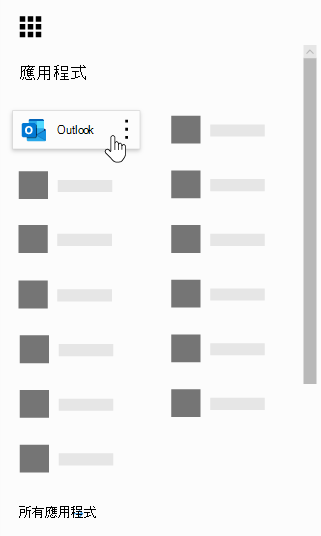
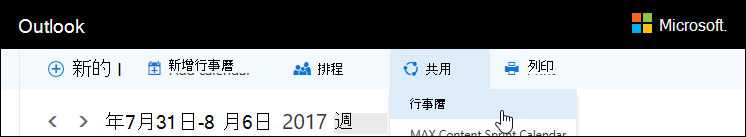
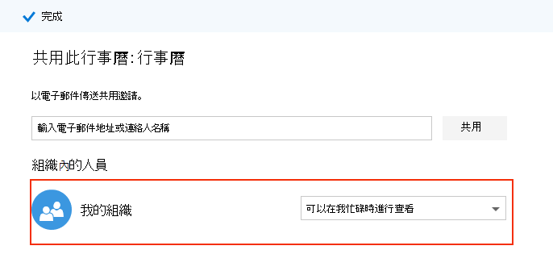

# Microsoft 預定常見問題Microsoft Bookings Frequently Asked Questions

## 一般General

### 何謂 Microsoft 預約？What is Microsoft Bookings?

Microsoft 預約是 Microsoft 365 應用程式，可讓排程和管理約會變得更輕鬆。Microsoft Bookings is a Microsoft 365 app that makes scheduling and managing appointments easy. 預約包含 Web 型預約行事曆，並與 Outlook 整合，以優化員工的行事曆，讓您的客戶可以靈活地預定最適合他們的時間。Bookings includes a Web-based booking calendar and integrates with Outlook to optimize your staff’s calendar, giving your customers flexibility to book a time that works best for them. 自動化的通知電子郵件會減少非展示的電子郵件，並減少重複排程任務的時間。Automated notification emails reduce no-shows, and organizations save time with a reduction in repetitive scheduling tasks. 預約可協助您透過 Skype 或 Microsoft 小組輕鬆執行虛擬約會，並協助您透過小組中的預約應用程式來管理日常排程。Bookings helps you easily conduct virtual appointments via Skype or Microsoft Teams, and helps you manage day-to-day scheduling via the Bookings app in Teams. 利用內建的自訂功能，預約設計可滿足任何組織的多個部分的需求。With built-in ability to customize, Bookings is designed to meet the needs of multiple parts of any organization.

### 如何使用 Microsoft 預定？How do I use Microsoft Bookings?

預定是線上服務，因此您不需要下載任何專案。Bookings is an online service, so you don't need to download anything. 移至 Microsoft 365 Web 體驗中的應用程式選擇。Just go to the app chooser within the Microsoft 365 Web experience. 系統管理員也可以使用預約輔助應用程式，及時瞭解客戶及其約會的最新資訊。Administrators can also use the Bookings companion app to stay current with the latest information about customers and their appointments.

### 誰有權存取 Microsoft 預約？Who has access to Microsoft Bookings?

Microsoft 365 商務高級版、Microsoft 365 Business Standard、A3、A5、E3 和 E5 客戶在全球皆可使用且預設為「預定」。Bookings is available and active by default for Microsoft 365 Business Premium, Microsoft 365 Business Standard, A3, A5, E3, and E5 customers worldwide. 您也可以在由世紀運作的 Office 365 中使用預定。Bookings is also available in Office 365 operated by 21Vianet.

### 我的客戶會看到我的個人或商務行事曆嗎？Will my customers see my personal or business calendar?

您的客戶只會看到您在線上發佈的預約行事曆，以供您選擇要註冊的服務、時間和人員。Your customers will only see the Bookings calendar that you publish online for the services, times, and staff that you choose to register.

### 如何變更 [管理人員] 底下的 bookable 屬性？How do I change a bookable attribute under Manage staff?

新增教職員工成員時，他們會收到電子郵件，以接受或拒絕要求。When staff members were added, they would have received an email to accept or reject the request. 他們可以開啟相同的電子郵件，並選取 [拒絕]，讓它們成為非 bookable。They can open the same email and select "Reject" to make them non-bookable. 目前我們沒有從應用程式內切換的方式。We currently do not have a way to toggle this from inside the app.

### 使用者如何存取預定應用程式？How do end users access the Bookings app?

Microsoft 365 商務版、Microsoft 365 Business Standard、A3、A5、E3、E5 或的任何人，都是以系統管理員或檢視器角色中的教職員工成員身分加入的任何人員，都可以在 Microsoft 365 Web 體驗中的應用程式選擇範圍記憶體取預定。Anyone who is licensed for Microsoft 365 Business Premium, Microsoft 365 Business Standard, A3, A5, E3, E5, or is added as a staff member in either the Administrator or Viewer roles can access Bookings in the app chooser within the Microsoft 365 Web experience. IOS 和 Android 也可以使用隨附的應用程式。There is also a companion app available for iOS and Android.

### 我是否可以在自己的網站中使用預定？Can I use Bookings in my own Web site?

是。Yes. 我們為您提供一種方法，讓您透過 iFrame 將您的預約行事曆嵌入網站。We provide a way for you to embed your Bookings calendar in your site via an iFrame. 連結嵌入程式碼位於預定應用程式內的 [ **預定] 頁面** 索引標籤。Link embedding code is located in the **Bookings page** tab within the Bookings app.

### 即使沒有公司的網頁，我可以使用預定？Can I use Bookings even if I don’t have a Web page for my business?

是。Yes. 我們會在 Web 應用程式的 [ **預定頁面** ] 索引標籤中，提供您預約頁面的連結。We provide a link to your booking page within the **Booking page** tab in the Web app. 您只需要為客戶或用戶端提供該連結，他們就能看到您公司的最新可用資訊。You just need to provide that link to your customers or clients, and they will see the latest availability information for your business. 或者，您也可以在社交媒體中共用預約頁面，甚至使用內嵌功能將其裝載在 iFrame 中。Alternatively, you can share the booking page in social media or even use the embed feature to host it in an iFrame. 您也可以透過停用直接搜尋引擎索引來控制誰可以存取頁面，並限制僅限組織內的存取權。You also have the ability to control who can access the page by disabling direct search engine indexing and restricting access to only those within your organization.

### 我們的 IT 部門是否可以控制使用者是否可以存取預定？Can our IT department control whether end users can access Bookings?

根據預設，可在 Microsoft 365 商務版、Microsoft 365 Business Standard、M365 A3/A5 和 E3/E5 租使用者中取得預約，但系統管理員可以選擇在 Microsoft 365 系統管理中心中將其關閉。Bookings is available in Microsoft 365 Business Premium, Microsoft 365 Business Standard, M365 A3/A5 and E3/E5 tenants by default, but administrators can turn it off in the Microsoft 365 admin center if they choose. 若要這麼做，請 [遵循下列指示](turn-bookings-on-or-off.md)。To do so, [follow these instructions](turn-bookings-on-or-off.md).

若客戶想要對其承租人中的某些合格授權停用預約存取權，他們可以使用群組原則來限制授權或實施 OWA 信箱原則，以限制能夠建立新預約行事曆的人員。If a customer wants to disable access to Bookings for certain eligible licenses in their tenant, they can either use a group policy to restrict licenses or implement an OWA Mailbox policy that will restrict who is able to create new Bookings calendars.

如果您使用 OWA 信箱原則來停用預約的存取權，則所有使用者都將擁有預約授權，但是當他們嘗試存取應用程式時，如果他們是原則的一部分，或已將其新增至現有的預約行事曆，則他們只會成功。If you use an OWA Mailbox policy to disable access to Bookings, all users will have a Bookings license, however when they attempt to access the app, they will only be successful if they are part of the policy or if they have been added to an existing Bookings calendar as staff. 在 [這裡](turn-bookings-on-or-off.md) 的 [只允許選取的使用者建立預約行事曆] 區段中的詳細資料。Details [here](turn-bookings-on-or-off.md) in the “Allow only selected users to create Bookings calendars” section.

### 是否可自訂預訂？Is Bookings customizable?

是的，可自訂且可用於各種不同案例的預定。Yes, Bookings is customizable and can be used for a variety of different scenarios. 當您設定預定的行事歷時，Web 排程頁面的許多方面，您可以自訂您的商務資訊、人員詳細資料、服務類型和排程原則。When setting up a Bookings calendar, many aspects of the Web-based scheduling page, your business information, staff details, service types, and scheduling policies can be customized.

### 原始預約 Web app 的所有功能是否皆可供 Microsoft 團隊使用？Is all the functionality of the original Bookings Web app available in Microsoft Teams?

「輕量的預約」現在提供為小組中的應用程式。A lightweight version of Bookings is now available as an app in Teams. 請在 [這裡](https://www.microsoft.com/microsoft-365/blog/2020/03/06/empowering-care-teams-with-new-tools-in-microsoft-365/)尋找初始宣告。Please find the initial announcement [here](https://www.microsoft.com/microsoft-365/blog/2020/03/06/empowering-care-teams-with-new-tools-in-microsoft-365/). 您可以在 Web 應用程式中向外彈出快捷方式，並在安裝程式完成前的預約使用，而不需要離開小組。There is deep link functionality to pop out in the Web app, and after setup, day-to-day use of Bookings can be done without ever leaving Teams. 跨平臺的資訊流程。Information flows across platforms.

### 是否為預定小型企業服務或企業服務？Is Bookings a small business offering or an Enterprise offering or both?

對於企業和小型企業客戶而言，預約是各行業的理想解決方案。Bookings is an ideal solution for both Enterprise and small business customers, across a variety of industries. 使用案例包括：Use cases include:

- 財務服務Financial services
    - 磋商consultations
    - 銀行和保險業服務banking and insurance services
    - 納稅歸檔tax filings

- 人力資源 (人力資源) Human resources (HR)
    - 候選人面試candidate interviews
    - 板載onboarding
    - 權益協助benefits assistance
    - 訓練和研討會training and seminars

- 醫療保健Healthcare
    - 患者走訪patient visits
    - 提供者與提供者共同作業provider-to-provider collaboration
    - 保險諮詢insurance consults

- 政府 & 公開部門Government & Public Sector
    - 法院 hearings 和試驗court hearings and trials
    - 公用服務public services
    - 部門約會department appointments

- 教育----12Education -- K-12
    - 父系教師會議parent-teacher conferences
    - 學校城鎮廳school town hall
    - 學生 counselor 就診student-counselor visits

- 教育版--高等教育版Education -- Higher Ed
    - 辦公時間office hours
    - 輔導tutoring
    - 學生服務student services
    - 考試註冊exam sign-up

- 零售業Retail
    - 輔助購物assisted shopping
    - 合同工排程contractor scheduling
    - 設計服務design services

- 一般 Enterprise 和 small business 需求General Enterprise and small business needs
    - 客戶和用戶端會議customer and client meetings
    - 技術支援tech support
    - 法律檢查legal reviews
    - 設施facilities

## 定價和授權Pricing and licensing

### 如何取得 Microsoft 預定？How do I get Microsoft Bookings?

可在 Microsoft 365 中提供預約，以供使用 Microsoft 365 商務版的客戶使用。 Microsoft 365 Business Standard、A3、A5、E3 和 E5 授權，以及 iOS 和 Android 一起使用的應用程式。Bookings is available in Microsoft 365 for customers with Microsoft 365 Business Premium, Microsoft 365 Business Standard, A3, A5, E3, and E5 licenses, along with an iOS and Android companion app. 不能以獨立應用程式形式進行預訂。Bookings is not available as a standalone app. 必須啟用 outlook Web App 或 Web 上的 Outlook，才能使用預定，因為它會將資料儲存在 Outlook 內。Outlook Web App or Outlook on the web must be enabled to use Bookings, as it stores data within Outlook.

預約授權為產品提供完整功能，包括建立及管理行事曆。A Bookings license provides full functionality to the product, including creating and managing calendars. 當使用者新增為系統管理員或查看者角色中的人員時，也可讓使用者查看及編輯現有的行事曆。It also enables the ability for users to view and edit existing calendars, when those users are added as staff in an Administrator or Viewer role.

### 我是否需要將我的電子郵件帳戶從我目前的提供者遷移至 Microsoft 365？Do I need to migrate my email account from my current provider to Microsoft 365?

您可以保留目前的提供者，但預約會將所有通知傳送至 Microsoft 365 帳戶中所用的電子郵件。You can keep your current provider, but Bookings will send all notifications to the email used in your Microsoft 365 account.

### 我的員工是否可以在沒有 Microsoft 365 帳戶的情況下使用預定？Can my employees use Bookings without a Microsoft 365 account?

是。Yes. 您可以使用任何電子郵件來新增您的員工，當有人預約約會時，他們仍會收到電子郵件確認和行事曆邀請。You can add your staff with any email, and they will still get the email confirmation and the calendar invite when someone books an appointment with them.

### 我是否可以在相同的 Microsoft 365 帳戶下建立多個預定的行事曆，並彼此切換？Can I create more than one Bookings calendar under the same Microsoft 365 account and switch between them?

是。Yes. 您可以使用一個帳戶來建立及管理多個預定行事曆。You can create and manage more than one Bookings calendar with one account. 您可以使用預定 Web app 中公司名稱旁邊的插入符號來切換它們。You can switch between them using the caret next to the business name in the Bookings Web app.

### 如果我的組織具有 F1/F3、E1 及 E3/E5 的混合授權，該怎麼辦？What if my organization has mixed licenses with F1/F3, E1, and E3/E5?

我們可辨識許多組織混合使用 Microsoft 365 授權。We recognize that many organizations have a mixture of Microsoft 365 licensing. 例如，客戶可能具有其總部中員工的 M365 E3 授權，但 M365 E1 (或 F1 或 F3) 授權的存放區員工。For example, a customer may have M365 E3 licenses for employees in their headquarters, but M365 E1 (or F1 or F3) licenses for their store employees.

在此範例中，具有 M365 E3 授權的總部員工具有預約的完整存取權，這表示他們可以建立新的行事曆、編輯設定、新增人員、發佈預約頁面、建立及管理行事曆中的約會，以及納入報告。In this example, the headquarters employees with an M365 E3 license have full access to Bookings, which means they can create new calendars, edit settings, add staff, publish a booking page, create and manage appointments within the calendar, and pull reports.

那些具有 E1/F1/F3 授權（或沒有授權）的商店員工，仍然可以新增為來賓角色中行事曆的員工，然後預約預約，當他們預約時，他們會收到確認電子郵件。Those store employees with E1/F1/F3 licenses, or with no licenses, can still be added as staff to calendars in a Guest role and then booked for appointments, and they will receive confirmation emails when they are booked. 他們仍可在其可用/排程的時段內預約，如 [教職員工] 索引標籤中所列。預定的行事曆可用性會依照設定的時數和服務時間限制 bookable 次數。They can still be booked during their available/scheduled hours as listed in the staff tab. The Bookings calendar availability constrains bookable times by their set hours and service hours.

如果已透過預約 Web app 排定約會，則儲存區員工在預訂中也會顯示為 [無法使用]。The store employees will also display as unavailable in Bookings if an appointment has already been scheduled at that time through the Bookings Web app. 透過預約預定的約會會反映為員工在預約中的行事曆上的忙碌狀態。Appointments booked via Bookings will reflect as busy on a staff member's calendar within Bookings. 具有非預約啟用授權的人員仍然可以讓其個人行事曆影響其在預約中的可用性，但前提是在相同的承租人內。Staff with a non-Bookings enabled license can still have their personal calendar impact their availability in Bookings, provided they are within the same tenant.

來賓角色中的人員可以查看客戶在初始約會建立中所提供的任何資訊。People in the Guests role can view any of the information the customer has provided within the initial appointment creation. 例如，如果預約預約預約的商店代表需要在約會之前呼叫客戶，他們就可以存取在排程過程中客戶所提供的資訊。For example, if the store representative who is booked for the appointment is required to call the customer prior to the appointment, they will have access to the information the customer provides during the scheduling process. 已預約的職員可以存取所有出現在確認電子郵件中的資訊，以及如客戶電話號碼) 所輸入的 (ics calendar 事件。The staff member who is booked will have access to all information that appears in the confirmation email, as well as the .ics calendar event (such as the customer phone number if it was entered).

訪客角色中的人員將無法存取預定 Web 應用程式來變更設定或查看及管理約會 (新增、取消和重排) 。People in the Guest role will not have the ability to access the Bookings Web app to change settings or to view and manage appointments (add, cancel, and reschedule). 不過，他們可以使用「自助」頁面代表客戶製作約會，其方式與客戶建立約會的方式相同。However, they can make appointments on behalf of customers using the Self-service page, in the same way that a customer would make an appointment.

建議您授權商務管理員或每個儲存區的系統管理員，並提供符合預定授權的授權，以設定及管理頁面及約會。We recommend licensing a business manager or administrator of each store with a Bookings-eligible license to set up and manage pages and appointments. 其他人員將會與使用預約授權的員工合作，以重新排定或取消預約。The rest of the staff would then work with the employee licensed with Bookings in order to reschedule or cancel a booking.

## 產品功能Product features

### 在我的 Microsoft 365 租使用者中顯示預約日曆的位置？ \* \*Where do Bookings calendars show up in my Microsoft 365 tenant?\*\*

每個新的預約行事曆都會在 Exchange 中建立對應的信箱，以及 Azure Active Directory (AAD) 中的相關專案，其中的專案會列為未授權的使用者。Each new Bookings calendar creates a corresponding mailbox in Exchange, as well as a related entry in Azure Active Directory (AAD), where the entry is listed as an unlicensed user.

### 可否刪除先前建立的預約行事曆？Can I delete a previously created Bookings calendar?

若要刪除預約行事曆，您必須刪除 Exchange 中相關聯的信箱。In order to delete a Bookings calendar you must delete the associated mailbox in Exchange.

### 如果我建立行事曆，而其他人有權存取預約，是否可以查看我的行事曆？If I create a calendar and someone else has access to Bookings, would they be able to see my calendar?

只有在系統管理員或查看者角色中，已以人員身分新增為個人的任何人員，都能存取您透過 Web app (所建立的預約行事曆) 。The only people who have access to Bookings calendars that you create (through the Web app) is anyone who has been added as staff, in either an Administrator or Viewer role. 租使用者系統管理員將能夠查看 Exchange 和 AAD 中所有預約信箱的清單。Tenant admins will be able to see a list of all Bookings mailboxes in Exchange and AAD.

### 影片會議是否已整合至預定應用程式？Are video conferencing meetings integrated into the Bookings app?

使用 Skype 或 Microsoft 團隊用戶端時，可在預訂內使用線上會議。Online meetings are available within Bookings when using the Skype or Microsoft Teams clients. 您可以在服務層級啟用線上會議，而您選擇的會議用戶端 (的 Skype 或小組) 將會成為已預約員工成員的預設設定。Online meetings can be enabled at the service-level, and the meeting client you choose (Skype or Teams) will be the one set by default for a booked staff member. 若要加入線上會議，每個新約會都會有附加至約會的唯一會議連結，此外，事件和確認電子郵件中也會包含輕鬆加入選項。To join the online meetings, each new appointment will have a unique meeting link attached to the appointment, and in addition, easy join options are included in the event and in confirmation emails.

### 排程原則的運作方式？How does scheduling policy work?

稱為 [ **最大前置重疊時間** ] 的設定會決定 (以天數) 所進行的預約量。A setting called **Maximum lead time** determines the farthest in advance (measured in days) that a booking can be made. 在 **最小前置** 期限內，至少必須有24小時的時間，才能 (預約和取消事項的最小前置重疊時間（小時）) 和最大前置重疊時間。There must be at least 24 hours between **Minimum lead time** (the minimum lead time, in hours, for bookings and cancellations) and Maximum lead time. 如果最小前置期限設定為0小時，則最長前置時段可以設定為一天，在此情況下，使用者就可以取消預約，直到約會在下一天內為止。Maximum lead time can be set to one day if Minimum lead time is set to 0 hours, which in this case means a customer can cancel a booking up until the time that it starts, and customers can only schedule bookings if the appointment is within the next day.

:::image type="content" source="media/bookings-faq-scheduling.png" alt-text="排程預定":::

### 預約如何在時區內運作？How does Bookings work across time zones?

所有時間皆位於商務時區中 (當地時區) 預設。All times are in the business time zone (your local time zone) by default. 這表示您為預約行事曆中設定的任何設定，例如工作時間，將會出現在這個時區。This means any setting you configure for a Bookings calendar, such as working hours, will appear in this time zone. 「自助」頁面能夠在使用者時區內顯示所有約會時間，如果需要，可以關閉此功能。The Self-service page has the ability to display all the appointment times in the end-user's time zone, which can be turned off if desired. 如果 [預約] 頁面索引標籤上的 [ **永遠在上班時間中顯示時段** ]，則在 [預約] 頁面] 索引標籤上會保持未勾選的時間段If **Always show time slots in business time zone** remains unchecked on the Bookings page tab, then people visiting the page will see time slots in their own local time zones.

:::image type="content" source="media/bookings-faq-region.png" alt-text="預定地區和時區設定":::

沒有任何規定可為預約中的人員設定時區。There is no provision to set time zone for staff in Bookings. 員工時區（上班時間）將會在上班時間區域中。Staff time zone, and thus business hours, will be in the business time zone.

### 電子郵件通知是否可以以租使用者功能變數名稱形式傳送？Can email notifications be sent as the tenant domain name?

電子郵件地址是在 Microsoft 365 設定層級加以控制和管理，視您的網域設定設定而定。The email addresses are controlled and managed at the Microsoft 365 settings level and depend on the domain configuration settings there. 您可以在 [這裡](https://docs.microsoft.com/powershell/module/exchange/get-accepteddomain)找到詳細資訊。More information can be found [here](https://docs.microsoft.com/powershell/module/exchange/get-accepteddomain).

### 是否能夠根據不同的服務或特定設定傳送短信訊息？Is the ability to send SMS messages dependent on a different service or specific configuration?

目前可在北美使用 SMS 訊息，而且會使用 Skype 或 Twilio 帳戶進行短信傳送。SMS messages are currently available in North America, and a Skype or Twilio account will be used for SMS delivery.

### 預約約會會如何顯示在人員的行事曆上？How can Bookings appointments show up on a person’s calendar?

預約的確認會同時傳送給服務提供者及客戶的收件匣。The confirmation of the booking is sent to both the service provider’s and customer’s inboxes. 確認電子郵件包含一個 \* 的 ics 檔案附件，然後可將其新增至使用者的行事曆，並提供所有相關的約會詳細資料。The confirmation email contains an \*.ics file attachment, which can then be added to the user’s calendar with all relevant appointment details.

### 哪些觸發器會觸發服務提供者或人員及客戶電子郵件？What triggers service provider or staff and customer emails?

電子郵件會根據預定 Web 應用程式中 [服務] 索引標籤的設定而觸發。Emails are triggered based on settings in the Services tab in the Bookings Web app. 由客戶在自助服務頁面上的預約，或是在預約 Web app 的 [行事曆] 索引標籤上進行的預約，會觸發確認和/或提醒電子郵件。A booking made by the customer on the Self-service page, or on the Calendar tab in the Bookings Web app, will trigger a confirmation and/or a reminder email. 當某人透過確認電子郵件中或 Web 應用程式中的「 **管理預約** 」按鈕對預約進行變更時，就會發生同樣的事。The same thing will happen when someone makes a change to the booking via the **Manage booking** button in the confirmation email or within the Web app. 提醒電子郵件會在約會之前的指定時間週期內傳送，如預定 Web 應用程式中的 [服務] 索引標籤所述。Reminder emails are sent at a specified time period prior to an appointment, as detailed in the Services tab in the Bookings Web app.

### 我是否可以預訂屬於1：許多而非1:1 的教室風格約會？Can I book classroom-style appointments that are 1:many instead of 1:1?

是的，我們有一組預約功能可讓多位人員同時預約相同的約會 (例如對健康類別) 。Yes, we have a group bookings functionality that allows multiple people to book the same appointment at the same time (such as for a fitness class). 這項功能 [在此有詳細的](https://techcommunity.microsoft.com/t5/microsoft-bookings-blog/microsoft-bookings-now-supports-online-meetings-and-group/ba-p/1214120)說明。This functionality is described in detail [here](https://techcommunity.microsoft.com/t5/microsoft-bookings-blog/microsoft-bookings-now-supports-online-meetings-and-group/ba-p/1214120).

### 是否可以保留未發佈的行事曆 (非上市公司) ，但仍可供指定的使用者存取？Can calendars remain unpublished (not public-facing) but still accessible to designated users?

是。Yes. Web 應用程式中的 [預約頁面] 索引標籤上有核取方塊： **需要從「我的組織」到預訂的 Microsoft 365 或 Office 365 帳戶**。There is a check box on the Booking page tab in the Web app: **Require a Microsoft 365 or Office 365 account from my organization to book**. 選取此核取方塊會使自助頁面存取只會限制在您租使用者中的頁面。Selecting this check box restricts Self-service page access to only those that are within your tenant. 位於 Web 應用程式建立和管理中的預約行事曆，只能由以系統管理員或檢視器角色新增為頁面人員的人員存取。The Bookings calendar that sits within the Web app for creation and management can only be accessed by those individuals added as staff to the page with Administrator or Viewer roles.

:::image type="content" source="media/bookings-faq-access-ctrl.png" alt-text="預定中的預約頁面存取控制":::

### 首頁更新的頻率如何？How frequently does the Home page update?

每次載入 Web 應用程式時，都會檢索連結到首頁的最新資料。The latest data linked to your Home page is retrieved  whenever the Web app is loaded. 如需預約追蹤之資訊類型的詳細資訊，請參閱此 [支援文章](metrics-and-activity-tracking.md)。For further details on the type of information tracked by Bookings, see this [support article](metrics-and-activity-tracking.md).

### 我可以關閉電子郵件通知的時間嗎？Can I turn off the email notifications for Time Off?

在預約 Web app 內錄製所用的時間，永遠不會觸發通知電子郵件給教職員工成員。Recording Time Off within the Bookings Web app will always trigger a notification email to staff members. 如果有任何人員成員對通知沒有任何困惑，建議您在 [休假] 通知的附注或頭銜中新增更多詳細資料，以更好地通知人員有關系統管理端所發生的情況。If any staff members are confused about the notification, we recommend you add more detail in the notes or title of the Time Off notification, to better inform staff about what is occurring on the admin side.

### 預定的行事曆是否可以複製或重複，是否可以 templatized 以方便擴充？Can Bookings calendars be cloned or duplicated, and can they be templatized for easy scaling?

處理常式是使用圖形 API 來取得信箱詳細資料，然後使用這些詳細資料來建立新的信箱。The process would be to use the Graph API to get mailbox details, and then use those details to create a new mailbox. API 檔位於 [這裡](https://docs.microsoft.com/graph/api/resources/booking-api-overview?view=graph-rest-beta)。API documentation is [here](https://docs.microsoft.com/graph/api/resources/booking-api-overview?view=graph-rest-beta).

### 哪些報表可用於預定？What reporting is available in Bookings?

所有指派給系統管理員角色的預約人員，都可以 ( 中下載以 tab 分隔的值。TSV) 檔案，所有的預約都是在過去120天內進行。All Bookings staff assigned to the Administrator role can download a tab-separated values (.TSV) file with all bookings made in the past 120 days. 可在中下載預定報告。TSV 表單從 [預定] 頁面的 [首頁] 索引標籤。Bookings reports can be downloaded in .TSV form from the Home tab of the Bookings page. 預約 API 也可以用來收集此資料，以進行更多自訂及特定用途。The Bookings API can also be used to collect this data for more customized and specific purposes.

### 您一次只能在自助服務頁面上共用一個服務嗎？Is it possible to share only one service on the Self-service page at a time?

是的，您可以為每個服務建立個別的預約行事曆，或者您可以移至 [服務] 索引標籤、[編輯服務]，然後在頁面頂端看到只會共用該特定服務之 URL 的選項。Yes, you can either create separate Bookings calendars for each service, or you can go to the Services tab, edit a service, and at the top of the page you will see an option to share a URL only for that specific service.

### 哪些選項可用於嵌入同意表單或為這些預約預約披露？What options are available for embedding a consent form or disclosure for those booking an appointment?

建議您在預約頁面啟用 [ **客戶資料使用量同意** ] 核取方塊，並自訂用語，以適當地傳遞組織的披露或同意要求。We recommend enabling the **Customer data usage consent** check box in the Booking page and customizing the wording to properly convey your organization's disclosure or consent requirements. 另一個選項是將自訂欄位新增至服務，其中包含同意表單的連結，並要求客戶先確認他們是否已完成該表單，然後才可以繼續進行約會。Another option is to add a custom field to the service that includes a link to the consent form, and require customers to confirm that they have completed the form before they can proceed with making an appointment. 您也可以將同意表單 URL 當做其他附注新增至確認和提醒電子郵件，但這不會讓使用者無法預約預約約會。You can also add the consent form URL as additional notes in confirmation and reminder emails, but this will not prevent users from booking an appointment.

### 「自助預約」頁面上的 [人員選擇] 功能可進行哪些變更？What changes can be made to the staff selection capability on the Self-service booking page?

當您取消選取 [允許客戶從預約] 頁面或 [服務] 區段中 **選擇 [預約** ] 選項的特定人員時，可完全移除預約時，客戶選取特定員工成員的能力。The ability for customers to select specific staff members when booking can be removed completely by de-selecting the **Allow customers to choose a specific person for the booking** option from the Booking page or the Services section. 根據員工可用性的情況，預約會以隨機為預約指派可用的教職員工成員。Bookings will automatically assign an available staff member at random to the booking, based on staff availability.

### 預約是否可支援許多同時進行的預約要求和自助頁面訪問？Can Bookings support many concurrent booking requests and Self-service page visits?

預約可支援一次大量的訪客和登記。Booking can support a large quantity of visitors and bookings at one time. 如果頁面出現大量的流量，使用者會收到「伺服器忙碌」的錯誤。If the page experiences a very large volume of traffic, users will receive a “server busy” error. 約會的可用性會在載入頁面時更新，也會在進行預約時更新。Appointment availability is updated when the page is loaded, as well as when a booking is made. 如果有多位人員嘗試一次同時送出相同的約會，則預約只會讓一名人員書一次，並將通知訊息傳送給其他潛在客戶，然後提示他們尋找其他的時間。If multiple people are trying to book the same appointment at one time, Bookings will only let one person book that time and give a notification message to the other potential customers, and prompt them to find a different time.

## 隱私權Privacy

### 預定資料儲存在哪裡？Where is Bookings data stored?

「預定」是 Microsoft 365 應用程式，表示所有資料都儲存在 Microsoft 365 平臺和 Exchange 中。Bookings is a Microsoft 365 app, meaning all data is stored within the Microsoft 365 platform and in Exchange. 預約是由 Microsoft 所設定的所有資料儲存原則，也就是所有 Office 應用程式後面的相同原則。Bookings follows all data storage policies set by Microsoft, which are the same policies followed by all Office apps. 預定使用 Exchange 中的共用信箱來儲存客戶、人員、服務及約會詳細資料。Bookings uses shared mailboxes in Exchange to store customer, staff, service, and appointment details. Exchange 中共用信箱的相容性原則也適用于預定信箱。Compliance policies for shared mailboxes in Exchange also apply for Bookings mailboxes. 所有客戶資料 (，包括客戶在預約) 會在預訂中取得預約時所提供的資訊，並儲存在應用程式中，因此會儲存在 Exchange 中。All customer data (including information provided by customers when booking) is captured in Bookings and is stored within the app, thus it is stored within Exchange. Microsoft 預約使用的是 Microsoft 365 所用的相同原則，您可以在 [這裡找到。](https://www.microsoft.com/online/legal/v2/?docid=22&langid=en-us)Microsoft Bookings uses the same policies used by Microsoft 365, which you can find [here.](https://www.microsoft.com/online/legal/v2/?docid=22&langid=en-us)

### 是否有任何方式可以集中管理所有使用者的預約行事曆？Is there a way to centrally manage Bookings calendars for all users?

每個預定的行事曆都是獨立維護的。Each Bookings calendar is maintained independently. 按一下首頁上的插入符號後，不會有合併的視圖，除了搜尋下拉式清單之外。There is no consolidated view, other than the search drop-down after clicking the caret on the home page.

### 如何驗證使用者？How are users authenticated?

存取預約 Web app 涉及透過一般 Azure Active Directory (AAD) 驗證進行驗證。Access to the Bookings Web app involves authentication through the regular Azure Active Directory (AAD) authentication. 您可以使用 [自助預約] 頁面，讓每位使用者都能使用網頁連結。The Self-service booking page can be made available to everyone with the Web page link. 不過，如果選取了 [從我的組織傳送給圖書的 **microsoft 365 或 Office 365 帳戶** ] 設定，則頁面僅限在 Microsoft 365 租使用者 (使用 AAD 驗證) 時使用。However, when the **Require a Microsoft 365 or Office 365 account from my organization** to book setting is selected, the page is restricted for use only within the Microsoft 365 tenant (using AAD authentication).

:::image type="content" source="media/bookings-faq-access-ctrl.png" alt-text="預定中的預約頁面存取控制":::

### 客戶資料是否因任何原因而留出生產系統？Does customer data leave the production system for any reason?

是的，由於預約是 Exchange 的一部分，因此我們允許 Graph APIs 和 Exchange Web 服務 (EWS) APIs，讓客戶下載其自己擁有存取權的資料。Yes, since Bookings is a part of Exchange, we allow Graph APIs and Exchange Web Services (EWS) APIs for the customers to download their own data to which they have access.

### 是否可以自訂客戶回復的電子郵件地址？Is there the ability to customize email addresses for customer replies?

您可以定義客戶傳送其回復的電子郵件地址。There is the ability to define which email address customer send their replies to. 此設定位於 [ **商務資訊** ] 索引標籤上。您也可以透過一般 Exchange 信箱重新命名程式，在 Exchange 內變更預約信箱名稱本身。This setting is on the **Business information** tab. The Bookings mailbox name itself can also be changed within Exchange, through usual Exchange mailbox renaming processes.

### 我們想要讓客戶在預約過程中接受我們的條款及條件。We would like for the customer to accept our terms and conditions during the booking process. 有可能嗎？Is that possible?

GDPR 合規性已存在此功能。This feature already exists for GDPR compliance. 「預約」頁面具有「自訂同意」欄位，在 [發佈詳細資料] 區段中。The Booking page has a field for custom consent, right under the publishing details section. 只需檢查該框並撰寫您自己的自訂同意訊息，它會顯示為自助頁面上的必要欄位。Just check that box and write your own custom consent message and it will show up as a required field on the Self-service page. 將記錄客戶授與同意的日期和時間。The date and time that the customer grants consent will be recorded.

本節不支援 rtf，但可在 [商務資訊] 區段下新增 [思考] 連結，而且會顯示在 [同意] 核取方塊底下。This section does not support rich text, but think links can be added under the business information section and would show up just below the consent check box.

### 如何識別 Exchange 中的預約相關信箱？How can Bookings-associated mailboxes in Exchange be identified?

您可以使用下列命令來取回所有預訂信箱的資訊及具有存取權的使用者。The following command can be used to retrieve information of all Bookings mailboxes and users who have access to them.

`Get-Mailbox -RecipientTypeDetails SchedulingMailbox -ResultSize:Unlimited | Get-MailboxPermission |Select-Object Identity,User,AccessRights | Where-Object {($_.user -like '@')}`

## 技術問題Technical Questions

### 如果使用者為由線上會議所組成的服務排程約會，他們會如何在將選用的電子郵件地址欄位保留空白的情況下，收到該會議的 Microsoft 小組連結？If a user schedules an appointment for a service consisting of an online meeting, how do they receive the Microsoft Teams link to the meeting if they leave the optional email address field empty?

如果系統不具備客戶的電子郵件資訊，便無法將確認郵件傳遞給客戶，因此不會收到小組連結。If the system does not have the customer's email information, there is no way for the confirmation mail to be delivered to the customer, and thus they will not receive a Teams link. 解決方案是將電子郵件地址設為必要的欄位，您可以在 [服務] 索引標籤上進行預訂。The solution is to set the email address as a required field, which you can do on the Services tab of Bookings. 請注意，每當您在預約中建立新的服務時，預設會將 [客戶電子郵件] 欄位設定為 [必要] 欄位。Note that whenever you create a new service in Bookings, the customer email field is set as a required field by default.

### 在選取「任何人」時，或是當客戶無法選擇約會的教職員工成員時，如何將人員指派給約會？How are staff assigned to appointments when “Anyone” is selected, or when customers do not have the ability to choose a staff member for the appointment?

在這些案例中，員工會以隨機方式指派，而不是在預約約會時可用的所有人員成員。Staff are assigned randomly in these scenarios, out of all staff members available at the time of the appointment being booked. 目前沒有任何方法可以確保在員工的所有成員中對隨機指派的約會進行均等的散佈，或將指派的約會數目上限到每個教職員工成員。Currently there is no way to ensure equal distribution of randomly assigned appointments across all members of the staff, or to cap the number of assigned appointments to each staff member. 如果您需要在大量隨機指派之後在員工之間進行負載平衡，可在 [預定] 頁面的 [行事曆] 索引標籤中手動執行。If there is load-balancing that needs to be done across your staff after a number of random assignments, it can be done manually in the Calendar tab within the Bookings page.

### 使用者如何選擇在先前已加入宣告短信後，是否可接收短信？How can users opt out of receiving SMS messages if they have already opted in previously?

當您預約啟用 SMS 文字訊息的約會時，系統會在每次預訂時，提示客戶選取 [自願加入] 方塊。When booking an appointment with SMS text messages enabled, customers will be prompted to check the opt in box each time they book. 客戶也可以直接回復 SMS message (SMS 提供者) 指出他們想要停止郵件，然後再將任何文字傳送至該電話號碼。Customers can also reply directly to the SMS message (the SMS provider) indicating that they would like the messages to cease, and then no further texts will be sent to that phone number. 如果客戶無法接收來自提供者的文字訊息，而不是從預約自行接收，則即使從 [預約] 頁面中退出時，他們仍將不再接收短信訊息。If the customer opts out of receiving text messages from the provider, not from Bookings itself, they will no longer receive SMS messages in the future, even when opting in from the Bookings page.

## 疑難排解Troubleshooting

### 無法同步處理此教職員工成員的行事曆This staff member's calendar can't be synced

如果您收到錯誤「此教職員工成員的行事曆無法同步處理」，本節會包含數個疑難排解程式，可協助您解決錯誤。If you receive the error, "This staff member's calendar can't be synced", this section contains several troubleshooting procedures to help you resolve the error.

> [!NOTE]
> 預設會針對具有 Microsoft 365 商務標準、Microsoft 365 A3 或 Microsoft 365 A5 訂閱的客戶，開啟預訂。Bookings is turned on by default for customers who have the Microsoft 365 Business Standard, Microsoft 365 A3, or Microsoft 365 A5 subscriptions. 預定也可供擁有 Office 365 Enterprise E3 和 Office 365 企業版 E5 的客戶使用，但預設為關閉。Bookings is also available to customers who have Office 365 Enterprise E3 and Office 365 Enterprise E5, but it is turned off by default. 若要開始，請參閱 [取得 Microsoft 預約存取權](get-access.md)。To get started, see [Get access to Microsoft Bookings](get-access.md). 若要開啟或關閉預約，請參閱 [為您的組織開啟或關閉預訂](turn-bookings-on-or-off.md)。To turn Bookings on or off, see [Turn Bookings on or off for your organization](turn-bookings-on-or-off.md).

如果您正在尋找同步處理員工行事曆的相關資訊，請參閱 [將教職員工新增至預定](add-staff.md)。If you are looking for information on syncing your staff's calendar, see [Add staff to Bookings](add-staff.md). 請確定 [ **人員詳細資料** ] 頁面 **會** 檢查 [行事曆的事件] 的可用性。Make sure on the **Staff details** page, **Events on calendar affect availability** is checked.

### 教職員工成員必須變更其行事曆許可權The staff member needs to change their calendar permissions

為了讓預約能夠與您的教職員工成員的行事曆正確同步，每個教職員工成員都必須共用其行事曆。In order for Bookings to properly sync with your staff members' calendars, each staff member must share their calendar. 每個教職員工成員都必須遵循這些指示來共用自己的行事曆。Each staff member must follow these instructions to share their own calendar.

1. 登入 Microsoft 365，然後從應用程式啟動器中選取 [ **Outlook** ]。Sign in to Microsoft 365, and then select **Outlook** from the app launcher.

   > [!div class="mx-imgBorder"]
   > 

1. 在頁面頂端，選取 [共用行事 \> **曆**]。At the top of the page, select **Share** \> **Calendar**.

   

1. 在 [ **組織內的人員** ] 區段中，選取 [ **我的組織**] 旁邊的下拉式方塊，然後選取 [ **在我忙碌時可以查看**]。In the **People inside your organization** section, select the drop-down box next to **My Organization**, and then select **Can view when I'm busy**.

   > [!NOTE]
   > 此設定會與您的組織中的其他使用者共用空閒/忙碌資訊。This setting shares your free/busy information with Bookings and with other users in your organization. 它不包含任何其他資訊，例如排程的約會類型、您排定約會的使用者，或位置。It does not include any other information, such as what type of appointment you have scheduled, who you have scheduled the appointment with, or the location.

   > [!div class="mx-imgBorder"]
   > ![可查看何時啟用忙碌狀態的 [行事曆共用] 畫面影像](../media/bookings-view-busy.png)

1. 選取 **[完成]**。Select **Done**.

### 我們無法找到組織中的教職員工成員We can't find a staff member in our organization

如果員工已離開您的公司，而且您已從 Microsoft 365 或 Office 365 組織中移除他們，您仍然需要從預約中移除該使用者，以便他們不會顯示在行事曆中，並防止客戶預約預約約會。If an employee has left your company and you removed them from your Microsoft 365 or Office 365 organization, you still need to remove that user from Bookings so they won't show up in the calendar and to prevent customers from booking appointments with them.

1. 登入 Microsoft 365，然後移至 **預定** \> **員工**。Sign in to Microsoft 365, and then go to **Bookings** \> **Staff**.

1. 將滑鼠游標懸停在教職員工成員的名稱上方。Hover your mouse cursor over the staff member's name. [**編輯** 和 **刪除**] 圖示會出現在 [**電話**] 欄的右側。**Edit** and **delete** icons appear to the right of the **Phone** column.

1. 選取 **刪除** 圖示。Select the **Delete** icon.

1. 在 [確認] 方塊中，選取 **[確定]**。In the confirmation box, select **OK**.

> [!NOTE]
> 如果您有一個以上的預約行事曆，您必須移除所有使用者的使用者。If you have more than one booking calendar, you must remove the user from all of them.

若要檢查您是否有一個以上的行事曆，請在左側的功能表中，選取公司名稱旁邊的下拉式箭頭，然後選取 [ **開啟**]。To check if you have more than one calendar, in the left menu, select the drop-down arrow next to your company name, and then select **Open**. 如果您只有一個行事曆，您只會看到新增預約行事曆的選項。If you only have one calendar, then you will see only the option to add a booking calendar. 此範例會顯示名為 "Contoso CO" 的第二個行事曆。This example shows that there is a second calendar named "Contoso CO".

![顯示第二個行事曆的 [行事曆] 畫面的影像](../media/bookings-choose-calendar.png)

### 發生同步錯誤無法識別There's a syncing error we can't identify

這是暫時性錯誤，通常是因為不穩定的網際網路連線。This is a transient error and typically occurs because of an unstable internet connection. 這些問題通常會在幾分鐘後自行解決。These problems usually resolve themselves after a few minutes.

如果您在長一段時間之後仍會看到此錯誤，或您經常看到此錯誤，請與支援人員聯繫。If you still see this error after an extended period of time or you are seeing it often, please contact support.

## 其他資源Additional resources

  - [Microsoft 預約會擴充企業博客中的可用性Microsoft Bookings expands availability in the enterprises blog](https://techcommunity.microsoft.com/t5/microsoft-bookings-blog/microsoft-bookings-expands-availability-in-enterprises/ba-p/1214065)

  - [Microsoft 預約如何運作影片How Microsoft Bookings Works video](https://support.office.com/article/microsoft-bookings-69c45b78-6de4-4f28-9449-cdcc18b7ae45)

  - [開始使用 Microsoft 預定Start using Microsoft Bookings](get-access.md)

  - [開啟或關閉 Microsoft BookingsTurn Microsoft Bookings on or off](turn-bookings-on-or-off.md)

  - [個別或大量新增使用者Add users individually or in bulk](https://docs.microsoft.com/microsoft-365/admin/add-users/add-users?view=o365-worldwide.)

  - [向 Bookings 新增員工Add staff to Bookings](add-staff.md)

  - [定義範本後要自動化的 API 元件API components to automate after template has been defined](https://docs.microsoft.com/graph/api/bookingbusiness-post-bookingbusinesses)

  - [顯示之預定行事曆的 URLURL to Bookings Calendar for Display](https://outlook.office.com/bookings/calendar)

  - [預定符合性原則Bookings compliance policies](https://docs.microsoft.com/microsoft-365/compliance/gdpr-dsr-office365?view=o365-worldwide#bookings)

  - [定制並發佈您的預約頁面Customize and publish your booking page](customize-booking-page.md)

  - [租使用者信箱設定Tenant Mailbox configuration](https://docs.microsoft.com/powershell/module/exchange/get-accepteddomain)

  - [群組預訂Group Bookings](https://techcommunity.microsoft.com/t5/microsoft-bookings-blog/microsoft-bookings-now-supports-online-meetings-and-group/ba-p/1214120)

  - [預定計量和活動追蹤Bookings metrics and activity tracking](metrics-and-activity-tracking.md)

  - [M365 公用藍圖M365 Public Roadmap](https://www.microsoft.com/microsoft-365/roadmap?filters=&searchterms=bookings)

  - 透過[UserVoice](https://outlook.uservoice.com/forums/314907-microsoft-bookings/suggestions/39505261-365-admins-should-have-full-access-to-all-bookings)提交意見反應Submit feedback via [UserVoice](https://outlook.uservoice.com/forums/314907-microsoft-bookings/suggestions/39505261-365-admins-should-have-full-access-to-all-bookings)
