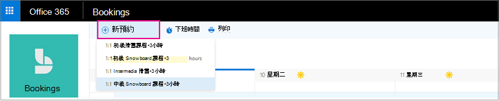

# 建立手動預約Create a manual booking

您可以以兩種不同的方式排程和安排預訂。Bookings can be scheduled and staffed in two different ways. 第一種方式是由客戶使用獨立預約頁面或您新增至網站的內嵌預約頁面。The first way is by the customer using a standalone booking page or an embedded booking page that you add to your website. 另一種方式是讓您或您的其中一位員工手動輸入預約，例如客戶通話約會。The other way is for you or one of your employees to enter the bookings manually, such as when a customer calls for an appointment. 本文涵蓋手動案例。This article covers the manual scenario.

> [!NOTE]
> 預設會針對具有 Microsoft 365 商務標準、Microsoft 365 A3 或 Microsoft 365 A5 訂閱的客戶，開啟預訂。Bookings is turned on by default for customers who have the Microsoft 365 Business Standard, Microsoft 365 A3, or Microsoft 365 A5 subscriptions. 預定也可供擁有 Office 365 Enterprise E3 和 Office 365 企業版 E5 的客戶使用，但預設為關閉。Bookings is also available to customers who have Office 365 Enterprise E3 and Office 365 Enterprise E5, but it is turned off by default. 若要開始，請參閱 [取得 Microsoft 預約存取權](get-access.md)。To get started, see [Get access to Microsoft Bookings](get-access.md). 若要開啟或關閉預約，請參閱 [為您的組織開啟或關閉預訂](turn-bookings-on-or-off.md)。To turn Bookings on or off, see [Turn Bookings on or off for your organization](turn-bookings-on-or-off.md).

1. 在 [Microsoft 365] 中，選取應用程式啟動器，然後選取 [ **預定**]。In Microsoft 365, select the App launcher, and then select **Bookings**.

   

1. 在功能窗格中，選取 [行事 **曆**] [ \> **新預約**]。In the navigation pane, select **Calendar** \> **New booking**.

   

1. 選取要提供的服務。Select the service to be provided. 請參閱 [在 Microsoft 預約中定義您](define-service-offerings.md) 的服務產品以取得服務設定指示。See [Define your service offerings in Microsoft Bookings](define-service-offerings.md) for service setup instructions.

1. 輸入客戶資訊，包括名稱、電子郵件地址、電話號碼，以及其他相關的詳細資料。Enter the customer information, including name, email address, phone number, and other relevant details.

1. 選取 [教職員工] 成員以提供服務。Select the staff member to provide the service. 顯示的教職員工成員清單是根據您在 [服務] 頁面上設定的專案而定。The list of staff members shown is based on what you set up on the services page.

   

1. 輸入服務詳細資料，包括日期、時間、地點及其他相關資訊。Enter the service details, including date, time, location, and other relevant information. 一旦您為客戶輸入有效的電子郵件地址，[ **儲存** ] 按鈕就會變更為 [ **傳送**]，您將會看到一個附注，告訴您會將確認傳送給客戶。Once you enter a valid email address for the customer, the **Save** button will change to **Send**, and you'll see a note telling you that a confirmation will be sent to the customer. 客戶確認包含附件，可將其新增至他們的行事曆。The customer confirmation includes an attachment for them to add to their calendar. 選取的教職員工成員也會收到含約會資訊的會議邀請，讓他們可以將其新增至他們的個人行事曆。Selected staff members will also receive meeting invitations with the appointment information so they can add it to their personal calendars.

1. 選取 [ **新增電子郵件提醒**]。Select **Add an email reminder**.

1. 指定應傳送提醒的時間（應該傳送的位置 (**客戶**、 **人員**、 **所有出席者**) ，以及提醒訊息應該的位置）。Specify when the reminder should be sent, where it should be sent (**Customer**, **Staff**, **All attendees**), and what the reminder message should be.

1. 選取 [ **儲存** \> **傳送**]。Select **Save** \> **Send**.

   以下是客戶將會收到之提醒的電子郵件範例：Here's an example email of the reminder your customer will receive:

:::image type="content" source="../media/bookings-confirmed-email.png" alt-text="螢幕擷取畫面：從手動預約進行確認的電子郵件範例":::