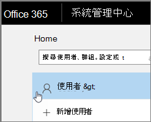
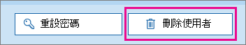

# <a name="delete-a-booking-calendar-in-bookings"></a>在預訂中刪除預約行事曆

本文說明您可以如何刪除不需要的預約行事曆。 您可以在 Microsoft 365 系統管理中心刪除預約行事曆，也可以使用 PowerShell。 「預定行事曆」是 Exchange Online 中的信箱，因此您可以刪除對應的使用者帳戶，以刪除預約行事曆。

> [!IMPORTANT]
> 您必須使用本主題上的 PowerShell 指示刪除您在2017或之前所建立的所有預約行事曆。 在2018或之後所建立的所有預約行事曆，都可以在 Microsoft 365 系統管理中心中刪除。

預約行事曆是儲存預約行事曆和資料之相關資訊的位置，包括：

- 建立預約行事歷時新增的商務資訊、標誌和工作時間
- 建立預約行事歷時新增相關人員和服務
- 所有的預約和休假工作會在建立時新增至預約行事曆。

> [!WARNING]
> 一旦刪除預約行事曆，此額外資訊也會永久刪除，且無法復原。

## <a name="delete-a-booking-calendar-in-the-microsoft-365-admin-center"></a>在 Microsoft 365 系統管理中心刪除預約行事曆

1. 移至 Microsoft 365 系統管理中心。

1. In the Admin center, select **Users**.

   

1. On the **Active Users** page, choose the names of the users that you want to delete, and then select **Delete user**.

   

## <a name="delete-a-booking-calendar-using-exchange-online-powershell"></a>使用 Exchange Online PowerShell 刪除預約行事曆

請參閱連線 [至 Exchange online PowerShell](https://docs.microsoft.com/powershell/exchange/exchange-online-powershell-v2?view=exchange-ps) 以取得連線至 exchange online PowerShell 的必要條件和指引。

若要執行這些步驟，您必須選擇 [以系統管理員身分執行] 選項，使用您所執行的 active Microsoft PowerShell 命令視窗。

1. 在 PowerShell 視窗中，執行下列命令來載入 EXO V2 模組：

   ```powershell
   Import-Module ExchangeOnlineManagement
   ```

   > [!NOTE]
   > 如果您已經 [完成安裝 EXO V2 模組](https://docs.microsoft.com/powershell/exchange/exchange-online-powershell-v2?view=exchange-ps#install-and-maintain-the-exo-v2-module)，上一個命令會依照寫好的內容的運作。
   
2. 您需要執行的命令會使用下列語法:

   ```powershell
   Connect-ExchangeOnline -UserPrincipalName <UPN> 
   ```

   - _\<UPN\>_ 是以使用者主體名稱格式（例如 `john@contoso.com`）表示的您的帳戶。

3. 出現提示時，請以租使用者系統管理員認證登入，以裝載您想要永久刪除之預定行事曆的 Microsoft 365 租使用者。

4. 完成此命令的處理之後，請輸入下列命令，以取得您租使用者中的預約信箱清單：

   ```powershell
   Get-EXOMailbox -RecipientTypeDetails Scheduling
   ```

5. 輸入下列命令：

   ```powershell
   remove-mailbox [BookingCalendarToDelete]
   ```

   > [!IMPORTANT]
   > 請務必輸入您要永久刪除之預定信箱別名的確切名稱。

6. 若要確認是否已刪除行事曆，請輸入下列命令：

   ```powershell
    Get-EXOMailbox -RecipientTypeDetails SchedulingMailbox
   ```

   已刪除的行事曆不會出現在輸出中。
