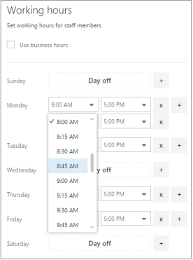

# Microsoft 預定中的員工工作時間

設定員工的工作時間，可確保客戶嘗試預訂其可用性時，會正確顯示其可用性。 根據預設，每個員工的工作時間與您在 Microsoft 預約應用程式中建立的上班時間相符。 請參閱 [輸入商務資訊](enter-business-information.md#set-your-business-hours)中的「設定您的上班時間」一節。

在 [ **人員** ] 頁面上，您可以自訂員工工作時數，以符合您的商務和員工的需求。

如果您想要為職員人員上班時間，讓客戶無法在外出時將其預訂，請參閱 [排程公休日、請假和請假的時間](schedule-closures-time-off-vacation.md) 。

> [!NOTE]
> 預設會針對具有 Microsoft 365 商務標準、Microsoft 365 A3 或 Microsoft 365 A5 訂閱的客戶，開啟預訂。 預定也可供擁有 Office 365 Enterprise E3 和 Office 365 企業版 E5 的客戶使用，但預設為關閉。 若要開始，請參閱 [取得 Microsoft 預約存取權](get-access.md)。 若要開啟或關閉預約，請參閱 [為您的組織開啟或關閉預訂](turn-bookings-on-or-off.md)。

## 自訂員工工作時間

請觀賞這段影片，或遵循下列步驟來設定員工的工作時間。

> [!VIDEO https://www.microsoft.com/videoplayer/embed/RWuXUq]

1. 在 [Microsoft 365] 中，選取應用程式啟動器，然後選取 [ **預定**]。

1. 在功能窗格中，選取 [ **職員**]，然後選取要設定其工時的教職員工成員。

   

1. 在 [工作時間] 下，清除 [ **使用上班時間** ] 核取方塊。

1. 使用下拉式功能表選取每天的開始和結束時間。 可在15分鐘內增加時間。

   

1. 按一下 **+** 以新增開始與結束時間選取器。

1. 選取 [儲存]。

## 設定員工的休假天數

當您為員工排程一天時，該員工將無法在 [預約] 頁面上顯示。 使用 [預約] 頁面的客戶將無法排程該天的服務。

1. 在 [工作時間] 畫面上，選取員工即將休假的那一天旁邊的 **x** 。

   

1. 如果您想要排程先前標示為一天的日期，請選取 **+** 您要排程之那一天旁邊的符號。

> [!TIP]
> 若要排程員工休假時間或其他大量的時段，請參閱排程 [公休日、請假和假期時間](schedule-closures-time-off-vacation.md#schedule-employee-time-off)的「排程員工請假」一節。
