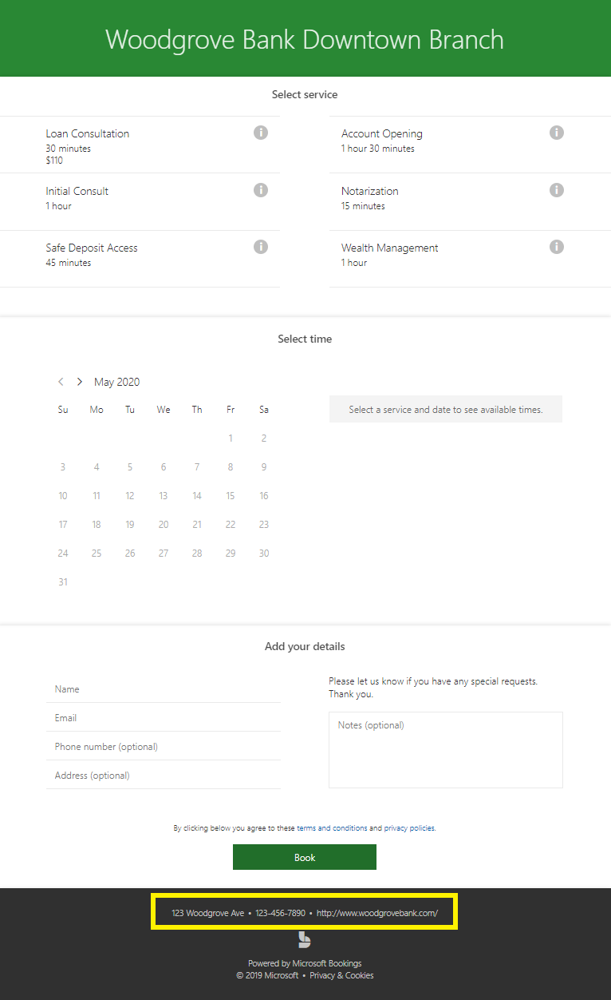
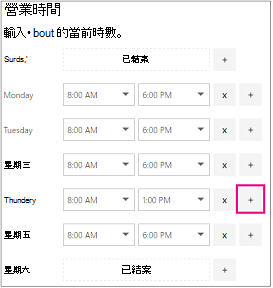
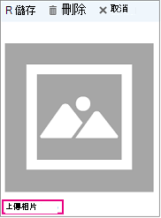

# 輸入您的商務資訊Enter your business information

在 Microsoft 預約中，web 應用程式內的「商務資訊」頁面包含您通常會在商務「關於我們」頁面上找到的所有詳細資料。In Microsoft Bookings, the Business Information page within the web app contains all the details that you'd typically find on a business' "About us" page. 這些詳細資料包含您的相關名稱、位址、電話號碼、網站 URL、隱私權原則 URL、徽標和上班時間。These details include your a relevant name, address, phone number, web site URL, privacy policy URL, logo, and business hours.

您在這裡提供的資訊將會顯示在頁面上，客戶和用戶端用來預約約會 (稱為「預約」) 頁面），並在郵件和提醒透過預約傳送給他們時使用。The information you provide here will be displayed on the page customers and clients use to book appointments (known as the booking page) and in messages and reminders sent to them by Bookings. 在 [預約] 頁面上的此資訊範例將會反白顯示。An example of this information on the booking page is highlighted below.

   

> [!NOTE]
> 預設會針對具有 Microsoft 365 商務標準、Microsoft 365 A3 或 Microsoft 365 A5 訂閱的客戶，開啟預訂。Bookings is turned on by default for customers who have the Microsoft 365 Business Standard, Microsoft 365 A3, or Microsoft 365 A5 subscriptions. 預定也可供擁有 Office 365 Enterprise E3 和 Office 365 企業版 E5 的客戶使用，但預設為關閉。Bookings is also available to customers who have Office 365 Enterprise E3 and Office 365 Enterprise E5, but it is turned off by default. 若要開始，請參閱 [取得 Microsoft 預約存取權](get-access.md)。To get started, see [Get access to Microsoft Bookings](get-access.md). 若要開啟或關閉預約，請參閱 [為您的組織開啟或關閉預訂](turn-bookings-on-or-off.md)。To turn Bookings on or off, see [Turn Bookings on or off for your organization](turn-bookings-on-or-off.md).

## 提供公司名稱和連絡人資訊Provide business name and contact information

1. 在 [Microsoft 365] 中，選取應用程式啟動器，然後選取 [ **預定**]。In Microsoft 365, select the App launcher, and then select **Bookings**.

1. 在功能窗格中，選取 [ **商務資訊**]。In the navigation pane, select **Business information**.

1. 輸入您要用於預定行事曆的相關名稱、位址和電話號碼。Enter the relevant name, address, and phone number you would like to use for your Bookings calendar.

1. 在 [ **傳送客戶回復**] 中，輸入要轉寄電子郵件回復至預約確認和提醒的電子郵件地址。In **Send customer replies to**, type the preferred email address where email replies to booking confirmations and reminders should be forwarded.

1. 在 [ **網站 URL** ] 欄位中，輸入商務用首頁的 URL。In the **Website URL** field, enter the URL of the home page for your business.

1. 輸入 **隱私權原則** 及 **字詞 & 條件** URLs。Enter the **privacy policy** and **terms & conditions** URLs.

1. 選取 **[儲存]**。Select **Save**.

## 設定上班時間Set your business hours

根據預設，預約應用程式中的上班時間設定為上午8點。By default, the business hours in the Bookings app are set to 8 a.m. 到晚上5點，週一至週五。to 5 p.m., Monday through Friday. 時間以15分鐘為增量提供。Times are provided in 15-minute increments. 預定應用程式會使用12小時制。The Bookings app uses the 12-hour clock.

將 **上班時間** 設定為您的工作時數。Set **business hours** to your operational hours. 這些是限制所有預訂的時段。These are the hours to which all bookings are restricted. 您可以針對每個服務和「服務和人員」頁面中的每個教職員工成員，分別設定預約約會的其他時間限制。Additional time restrictions of when appointments can be booked can be set for each service and for each staff member in the Services and Staff pages, respectively.

1. 在 [商務資訊] 頁面的 [上班時間] 下，使用下拉式功能表來選取每天的開始和結束時間。On the Business information page, under Business hours, use the dropdowns to select start and end times for each day.

1. 按一下 **+** 以新增開始與結束時間選取器。Click **+** to add start- and end-time selectors.

## 設定分割班次的小時數How to set hours for a split shift

您可能需要將一天或一周的一部分封鎖，讓員工會議、更新清查或處理其他 rhythm 的商務用詳細資料。You might need to block out a portion of each day or week to have staff meetings, update inventory, or take care of other rhythm-of-business details. 預約應用程式可讓您將客戶約會限制在指定的時間內。The Bookings app allows you to limit customer appointments to your specified time slots.

例如，您的員工每星期四從1點到2:30，想要封鎖此時間，讓您的所有職員都可以參加會議。For example, you have staff meetings every Thursday from 1 o'clock to 2:30 and want to block out that time so all of your staff members can attend. 若要執行這項操作，請執行下列步驟：To do this:

1. 在 [商務資訊] 頁面的 [上班時間] 下，選取 Thursdays 的開始和結束時間。On the Business information page, under Business hours, select a start and end time for Thursdays. 在此範例中，我們將設定 8:00 a.m.。In this example we'll set 8:00 a.m. 到 1:00 p.m。to 1:00 p.m.

1. 選取 **+** 以建立星期四的新列。Select **+** to create a new row for Thursday.

   

1. 在新列中，選取 2:30 p.m.。In the new row, select 2:30 p.m. 的開始時間和 6:00 p.m。for the start time and 6:00 p.m. 結束時間。for the end time.

   

1. 選取 [儲存]。Select Save.

    當客戶前往您的預約頁面時，他或她會在 Thursdays 上看到您的業務已從1到2:30 關閉。When a customer goes to your booking page, he or she will see that your business is closed from 1 to 2:30 on Thursdays.

## 上傳您的徽標Upload your logo

如果您還沒有將商務徽標上傳至預定應用程式，您可以從 [商務資訊] 頁面進行。If you haven't already uploaded your business logo to the Bookings app, you can do it from the Business information page.

1. 在 [商務資訊] 頁面上的 [上傳徽標] 底下，選取 [ **變更**]。On the Business information page, under Upload logo, select **Change**.

1. 選取 **[上傳相片**]。Select **Upload photo**.

   

1. 選取 [儲存]\*\*\*\*。Select **Save**.
