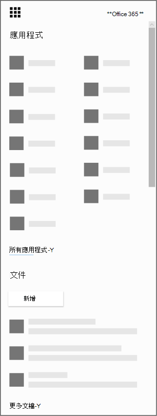

# 取得適用于 iOS 和 Android 的 Microsoft 預約應用程式

感謝您下載 Microsoft 預約應用程式！ Microsoft 預約可做為 iOS 和 Android 的行動應用程式。 IOS 的預約應用程式可在 Apple 支援的所有地區和國家中取得。 您可以從 [ITunes App Store](https://apps.apple.com/app/microsoft-bookings/id1065657468)下載應用程式。 適用于 Android 的預約應用程式可從美國及加拿大的 [Google Play 商店](https://play.google.com/store/apps/details?id=com.microsoft.exchange.bookings) 下載。

開始之前，您必須在網路上設定預定。

1. Can't find the app you're looking for? 從應用程式啟動器中，選取 [所有應用程式]，以查看您可以使用的 Microsoft 365 應用程式的字母順序清單。 您可以從該處搜尋特定的應用程式

   

2. 前往 [Office 首頁](https://office.com)，然後從應用程式啟動器選取 [**預定**]。

3. 選取 [ **立即取得**]。

4. 提供您所執行之公司的名稱和類型，例如頭髮 salon 或牙科練習，然後選取 [ **預定**]。

5. 您現在已準備好為您的組織設定預定。 請遵循 [Microsoft](bookings-overview.md) 預約主題中的步驟，以完成預約的設定。 請回到行動裝置，並登入行動裝置應用程式。 重新登入以移至新的預約行事曆。

## 僅供查看的模式

在預約中，任何未被授與讀寫存取權的使用者，仍然可以使用「僅供查看」模式中的行動應用程式。 加入預約授權的任何人都可以查看自己及其同事的排程、約會詳細資料和商務資訊。 具有「僅供查看」存取權的使用者無法變更或編輯，也無法存取客戶清單。
