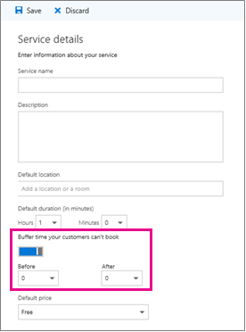

# 在 Microsoft 預定中設定緩衝時間Set buffer time in Microsoft Bookings

您的一些約會可能需要在您與客戶進行設定、清除或重設會議室和設備之後的時間。Some of your appointments might require time before or after you meet with your customer to set up, clean up, or reset your room and equipment. 或者，如果您正處於客戶約會之間，您可能需要一些時間，以確保您和您的小組可以在約會之間進行移動，而不需等待客戶等候。Or if you’re on the road between customer appointments, you may need time to ensure you and your team can travel between appointments without making the customer wait.

您可以在約會開始之前、約會結束或兩者之間設定緩衝時間，讓員工在下一個約會中做好準備。You can set buffer time before appointments start, after appointments end, or both to give staff the extra time they need to prepare for their next appointment.

## 設定緩衝時間預設值Set buffer time defaults

緩衝時間預設值是在 [ **服務詳細資料** ] 頁面的 [預定] 中設定。Buffer time defaults are set on the **Service details** page in Bookings. 就像此頁面上設定的所有服務預設值一樣，您可以為特定預約編輯這些預設值，以符合特定客戶的需求。Like all service defaults set on this page, these defaults can be edited by you for a specific booking to meet specific customer needs.

您可以在 [**服務詳細資料**] 頁面上的 **預設持續時間** 選擇器底下找到緩衝時間設定。The buffer time setting can be found just below the **Default duration** pickers on the **Service details** page. 在為指定的服務設定之前，您必須選取緩衝時間切換來啟用緩衝時間設定。Before it can be set for a given service, you must enable the buffer time setting by selecting the buffer time toggle. 這會顯示「 **之前** 」和「 **之後** 」下拉式列，用來挑選每個預約之前和之後保留的預設時間長度，如下所示：This causes the **Before** and **After** drop-downs to appear, which are used to pick the default amount of time to hold before and after each booking, as shown here:

   

## 緩衝時間及約會時間Buffer time and appointment timing

為了避免客戶預期與您見面時的困惑，預約會顯示緩衝時間和實際約會時間 (您的客戶預期會在您的行事曆上) 您的行事曆，以及電子郵件確認和提醒給相關人員的時間。To avoid confusion about when customers expect to meet with you, Bookings shows buffer time and actual appointment time (the time your customers expect to meet with you) on your calendar, and in email confirmations and reminders to relevant staff. 例如，下列為客戶在預約中所看到的預約約會，其中包含15分鐘前的預約緩衝時間。For example, below is what you’d see in Bookings for an appointment with a customer that includes 15 minutes of pre-appointment buffer time.

請注意，事件本身 (在下圖中的左側) 會為實際的客戶約會顯示較亮的陰影，以及緩衝時間的較暗陰影。Note that the event itself (on the left in the image below) shows lighter shading for the buffer time and darker shading for the actual customer appointment. 約會撥出 (會在您選取事件時開啟) 明確指出約會介於9：12:00 到10：12:00 搭配 Katie，並在約會之前包含15分鐘的緩衝時間，以及約會之後0分鐘。The appointment call-out (which is opened when you select the event) specifically states that the appointment is from 9:00AM to 10:00AM with Katie Jordan and includes 15 minutes of buffer time before the appointment and 0 minutes after the appointment. 對員工的確認和提醒類似參照特定的緩衝和約會時間，客戶只會取得參考和提醒，其參考的是9：12:00 至10：12:00 約會時間。Confirmations and reminders to staff similarly reference specific buffer and appointment time while the customer would only get confirmations and reminders that reference a 9:00AM to 10:00AM appointment time.

   

## 緩衝時間與可用性Buffer time and availability

您的客戶不會直接看到，而且無法變更您設定的緩衝時間。Your customers don’t directly see and cannot change the buffer times you set. 不過，由於緩衝時間是用來計算整體服務持續時間，所以客戶會看到您和您的相關人員，在進行緩衝和定期約會時間時已預約。However, because buffer time is used to calculate overall service duration, customers will see you and your relevant staff as booked during both buffer and regular appointment times. 只要約會和其緩衝時間有足夠的時間，客戶也只會看到您和您的員工可用性。Customers also only see availability for you and your staff if there is enough time for both the appointment and its buffer time.

舉例來說，具有15分鐘前置約會緩衝時間的一小時約會，至少需要1小時到15分鐘的可用時間區塊。As an example, a one-hour appointment with a 15-minute pre-appointment buffer time requires an available time block of at least 1 hour and 15 minutes. 因此，此服務的約會會在您的行事曆上填滿75分鐘的時間區塊，而且需要75分鐘的時間來進行預訂，而不會發生衝突。An appointment for this service would therefore fill a 75-minute block of time on your calendar and needs 75 minutes of availability to book without conflict.
