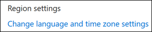
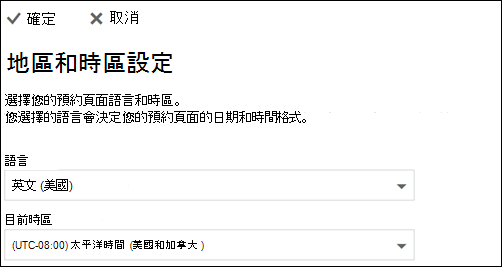

# 在 Microsoft 預約中設定語言和時區Set language and time zones in Microsoft Bookings

如果您使用的是 Microsoft 預約，且在錯誤的時間建立了預約，您可能需要變更您的時區設定。If you are using Microsoft Bookings and bookings are created at the wrong time, then your time zone settings might need to be changed. 同樣地，如果某些預約是以錯誤的語言，您可能需要變更您的語言設定。Likewise, if some bookings are in the wrong language, you might need to change your language settings.

有兩種不同的語言和時區設定可供預訂。There are two separate language and time zone settings for Bookings. 第一個設定會控制預約行事曆的語言和時區，並使用 Outlook 的使用者設定，以供登入使用者的個人行事曆使用。The first setting controls the language and time zone of the booking calendar and is set using the Outlook on the web settings for the personal calendar of the logged-in user. 第二個設定會影響客戶使用的「自助預約」頁面，並使用「地區設定」頁面來設定，此頁面只會控制該頁面的語言和時區。The second setting affects the self-service booking page that your customers use and is set using a "regional settings" page that controls language and time zone only for that page.

> [!NOTE]
> 預設會針對具有 Microsoft 365 商務標準、Microsoft 365 A3 或 Microsoft 365 A5 訂閱的客戶，開啟預訂。Bookings is turned on by default for customers who have the Microsoft 365 Business Standard, Microsoft 365 A3, or Microsoft 365 A5 subscriptions. 預定也可供擁有 Office 365 Enterprise E3 和 Office 365 企業版 E5 的客戶使用，但預設為關閉。Bookings is also available to customers who have Office 365 Enterprise E3 and Office 365 Enterprise E5, but it is turned off by default. 若要開始，請參閱 [取得 Microsoft 預約存取權](get-access.md)。To get started, see [Get access to Microsoft Bookings](get-access.md). 若要開啟或關閉預約，請參閱 [為您的組織開啟或關閉預訂](turn-bookings-on-or-off.md)。To turn Bookings on or off, see [Turn Bookings on or off for your organization](turn-bookings-on-or-off.md).

## 設定預約行事曆的語言和時區Setting language and time zone for a booking calendar

預約行事曆使用登入的使用者語言和時區設定。The booking calendar uses the logged-in user’s language and time zone settings. 例如，如果登入使用者的時區設定為東部標準時間 (EST) ，則預約行事曆會顯示期限的現有約會開始時間和結束時間。For example, If the logged-in user’s time zone is set to Eastern Standard Time (EST), then the booking calendar will show existing appointment start and end times in EST. 這個時區最初是在使用者的 Microsoft 365 和 Outlook 網頁帳戶建立時設定。This time zone was originally set when the user’s Microsoft 365 and Outlook on the web accounts were created.

若要設定預約行事曆的語言和時區：To set the language and time zone for the booking calendar:

1. 登入 Microsoft 365，然後在 [登陸] 頁面上選取 [Outlook 磚] (如下列螢幕擷取畫面所示) 或 Microsoft 365 應用程式啟動器中所示。Log into Microsoft 365 and select the Outlook tile on the landing page (as shown in the screenshot below) or in the Microsoft 365 App Launcher.

   

1. 開啟 Outlook 後，選取螢幕右上角的 **齒輪圖示** ，以開啟個人和帳戶設定，然後在 [ **設定** ] 面板搜尋方塊中搜尋「時區」。After Outlook opens, select the **gear icon** in the upper, right-hand corner of the screen to open your personal and account settings, then search for “time zone” in the **Settings** panel search box. 面板將會更新，以顯示您目前的個人語言和時區設定的帳戶。The panel will update to show your current personal language and time zone settings for this account. 如以上所述，此設定也會控制預定行事曆的語言和時區。As noted above, this setting also controls the language and time zone of the booking calendar.

1. 在 [ **語言] 或 [目前** 時區] 方塊中選取下拉式箭號，然後選擇所需的設定，以變更語言或時區。Change the language or time zone by selecting the drop-down arrow in the **Language or Current time zone** box and choosing the desired setting.

1. 按一下 **[儲存]**。Click **Save**. [設定] 面板隨即關閉，網頁上的 Outlook 重新開機，並套用新的語言和時區設定。The Settings panel closes, Outlook on the web restarts, and the new language and time zone settings are applied.

## 設定 [預約] 頁面的語言和時區Setting the language and time zone for the booking page

1. 在 [Microsoft 365] 中，選取應用程式啟動器，然後選取 [ **預定**]。In Microsoft 365, select the app launcher, and then select **Bookings**.

1. 在功能窗格中，選取 [ **預約] 頁面** ，然後選取 [ **變更語言和時區設定**]。In the navigation pane, select **Booking page** and select **Change language and time zone settings**.

   

1. 選取您的語言和目前時區，然後選擇 [確定]。Select your language and current time zone and choose OK.

   
