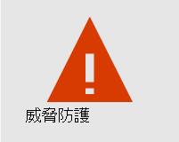
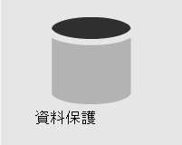

# 安全性概述

> [!VIDEO https://www.microsoft.com/videoplayer/embed/RE4mzxI?autoplay=false]

Microsoft 365 商務版提供威脅防護、資料保護和裝置管理功能，可協助您保護您的公司免受線上威脅和未經授權的存取，以及保護和管理手機、平板電腦和電腦上的公司資料。

| [威脅防護](#threat-protection)|  [資料保護](#data-protection) |   [裝置管理](#device-management) |
|--|--|--|

## 威脅防護

Microsoft 365 商務版365特優威脅防護 (ATP) ，這是一種雲端式電子郵件篩選服務，可防止惡意程式碼、勒索軟體、有害連結等等。 ATP 安全連結可保護您的電子郵件或 Office 檔中的惡意 URLs。 ATP 安全附件可保護您免受惡意程式碼和附件的郵件或檔的侵擾。

多重要素驗證 (MFA) 或雙步驟驗證，需要您提供另一種形式的驗證（例如驗證碼），以在存取資源之前確認您的身分識別。  

Windows Defender 針對病毒、惡意程式碼、間諜軟體和其他威脅，為您的系統、檔案及線上活動提供全面保護。

## 資料保護

Microsoft 365 商務版中的資料保護功能可協助確定重要的資料是安全的，只有授權的人員才能存取。

您可以使用資料遺失防護 (DLP) 原則，識別及管理機密資訊（例如社會保險或信用卡號碼），使其不會錯誤共用。 

Office 365 郵件加密結合加密和存取許可權功能，協助確保只有預定的收件者可以查看郵件內容。 Office 365 郵件加密適用于 Outlook.com、Yahoo！、Gmail 及其他電子郵件服務。

Exchange Online 封存是雲端式封存解決方案，可與 Microsoft Exchange 或 Exchange Online 搭配使用，以提供高級封存功能（包括保留和資料冗余）。 您可以使用保留原則來協助您的組織減少電子郵件和其他通訊相關的債務。 如果您的公司需要保留與訴訟相關的通訊，您可以使用 In-Place 保留和訴訟保留以保留相關的電子郵件。

## 裝置管理

Microsoft 365 商務高級裝置管理功能可讓您監視及控制使用者可對註冊的裝置執行的作業。 這些功能包括條件式存取、行動裝置管理 (MDM) 、BitLocker 和自動更新。

您可以使用條件式存取原則，針對特定使用者和任務需要其他安全性措施。 例如，您可以要求多重要素驗證 (MFA) 或封鎖不支援條件式存取的用戶端。

使用 MDM，您可以協助保護和管理使用者的行動裝置，例如 Iphone、Ipad、Androids 和 Windows phone。 您可以建立及管理裝置安全性原則，以遠端方式清除裝置，以移除所有公司資料、將裝置重設為出廠設定，以及查看詳細的裝置報告。 

您可以啟用 BitLocker 加密，協助保護資料以防裝置遺失或遭盜，並啟用 Windows 利用防護，以針對勒索軟體提供高級防護。

您可以設定自動更新，使最新的安全性功能和更新套用至所有使用者裝置。 