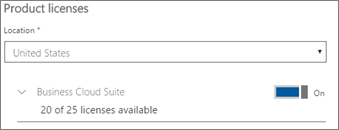

# 將其他使用者新增至 Microsoft 365 商務版

## 新增使用者

在管理中心移至**使用者**卡片\>**新增使用者**。
  

  
在 [**新增使用者**] 面板中，輸入所需的資訊。 
  
您也可以輸入 [**連絡人資訊**的其他資訊、 選擇如何設定 [**密碼**] 設定的密碼並指派下**角色**的角色。
  

  
在 [產品授權] 區段中設定**Microsoft 365 商務**產品授權設定為**上**。
  

  

  

