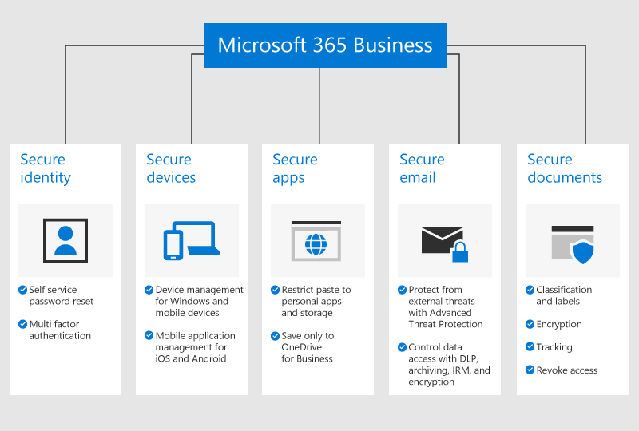

# Microsoft 365 商務版的概觀Overview of Microsoft 365 Business

## 什麼是 Microsoft 365 商務版What is Microsoft 365 Business

Microsoft 365 商務版是一組完整的企業生產力和共同作業工具，例如 Outlook、Word、Excel 和其他隨時保持最新狀態的 Office 產品。您可以使用易於管理的企業級安全性功能，保護所有 iOS、Android 和 Windows 10 裝置上的工作檔案。Microsoft 365 Business is a comprehensive set of business productivity and collaboration tools, such as Outlook, Word, Excel, and other Office products that are always up to date. You can protect your work files on all of your iOS, Android, and Windows 10 devices with enterprise-grade security that is simple to manage.
  
Microsoft 365 商務版是最多 300 個授權，如果您需要更多授權，請參閱[Microsoft 365 企業版](https://go.microsoft.com/fwlink/p/?linkid=860986)文件的詳細資訊。Microsoft 365 Business is meant for up to 300 licenses, if you need more licenses, see [Microsoft 365 Enterprise](https://go.microsoft.com/fwlink/p/?linkid=860986) documentation for more information.

完整的功能清單，請參閱[Microsoft 365 商務版服務說明](https://docs.microsoft.com/office365/servicedescriptions/microsoft-365-business-service-description)。See [Microsoft 365 Business service description](https://docs.microsoft.com/office365/servicedescriptions/microsoft-365-business-service-description) for the entire list of features.
  
## 小型企業版安全性需求Small business security needs

您的商務資料可能會遭到洩漏，有許多方式。Your business data can be compromised in many ways. 您和您的使用者可能危害組織的安全性，當您使用不同的裝置和應用程式上的檢視組織資料或遭入侵的認證登入。You and your users can compromise your organization's security when you sign in with compromised credentials or view organization data on different devices and applications. 更具體而言，您的組織是處於風險中：More specifically, your organization is at risk from:

1. 遭入侵或弱式登入認證。Compromised or weak sign-in credentials.
2. 遭入侵的裝置，含弱式的 pin 碼或使用者所擁有的裝置。Compromised device with a weak pin, or a user owned device.
3. 可以儲存檔案複製/貼上您的組織資料到個人應用程式的使用者。Users who can copy/paste/save your organization's data to personal apps.
4. 安裝及使用弱式安全性 3rd廠商應用程式的使用者。Users who install and use 3rd party apps with weak security.
5. 包括共用機密資料的電子郵件弱點、 網路釣魚嘗試，惡意程式碼等等。Email vulnerabilities including sharing sensitive data, phishing attempts, malware, etc.
6. 時，應該的人員可以存取具有機密資訊的文件。When people who should not, can access documents with sensitive information.

Microsoft 365 商務版可協助保護您在每個這些執行個體的資料。Microsoft 365 Business helps safeguard your data in each of these instances. 保護您的商務資料的安全性功能的詳細資訊，如下圖中。The security features that protect your business data are detailed in the following figure.

若要查看的安全性功能的完整清單，請參閱[Microsoft 365 商務版安全性功能](security-features.md)。To see the full list of security features, see [Microsoft 365 Business security features](security-features.md). <b0>設定 Microsoft 365 商務版</b0>之後，請參閱 < 開始使用並不包含在內做為安裝程式的一部分的安全性功能的 [<b1>設定進階的安全性原則</b1>。After you [Set up Microsoft 365 Business](set-up.md), see [Set up advanced security policies](set-up-advanced-security.md) to get started with the security features that are not included as a part of the setup. 如需如何設定抵禦網路罪犯和駭客保護良好概觀讀取也[來保護 Office 365 和 Microsoft 365 商務版計劃的前 10 個方式](https://docs.microsoft.com/office365/admin/security-and-compliance/secure-your-business-data)。Read also [Top 10 ways to secure Office 365 and Microsoft 365 Business plans](https://docs.microsoft.com/office365/admin/security-and-compliance/secure-your-business-data) for a good overview on how to set up protections against cyber criminals and hackers.

## 取得 Microsoft 365 商務版Get Microsoft 365 Business

- 如果您有合作夥伴，他們將獲得 Microsoft 365 商務版：[從 Microsoft 合作夥伴中心取得 Microsoft 365 商務版](get-microsoft-365-business.md#get-microsoft-365-business-from-microsoft-partner-center)。If you have a partner, they will get Microsoft 365 Business: [Get Microsoft 365 Business from Microsoft Partner Center](get-microsoft-365-business.md#get-microsoft-365-business-from-microsoft-partner-center).

- 如果您不有合作夥伴，並想要取得 Microsoft 365 商務版，您可以[在這裡購買](https://www.microsoft.com/microsoft-365/business)並遵循[註冊](sign-up.md)指示。If you don't have a partner and want to get Microsoft 365 Business, you can [buy it here](https://www.microsoft.com/microsoft-365/business) and follow the [sign up](sign-up.md) instructions.