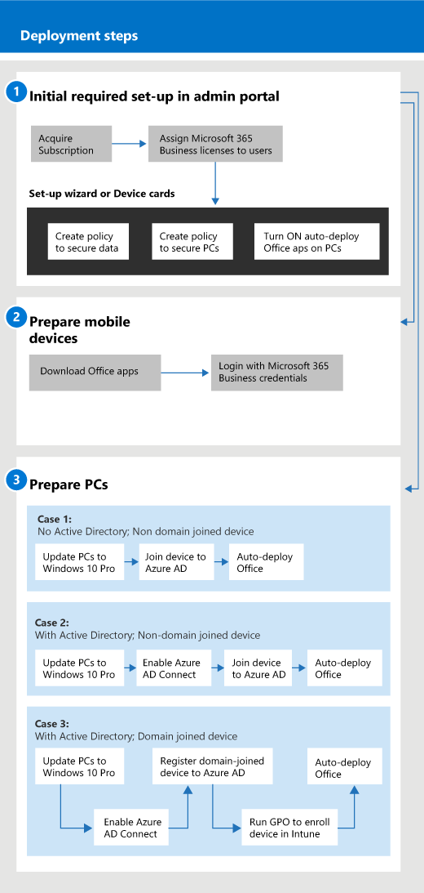

# 開始使用 Microsoft 365 商務版

## 什麼是 Microsoft 365 商務版

Microsoft 365 商務版是一組完整的商務生產力和共同作業工具，例如 Outlook、 Word、 Excel 和其他 Office 產品，永遠是最新狀態。 您可以保護您的工作檔案上所有您 iOS、 Android 和 Windows 10 裝置以易於管理的企業級安全性。
  
Microsoft 365 商務版是最多 300 個授權。 如果您需要更多授權，請參閱如需詳細資訊的[Microsoft 365 企業版](https://go.microsoft.com/fwlink/p/?linkid=860986)文件。 
  
## 取得 Microsoft 365 商務版

- 如果您有合作夥伴，他們會收到 Microsoft 365 商務版：[從 Microsoft 合作夥伴中心取得 Microsoft 365 商務](get-microsoft-365-business.md)。
    
- 如果您不有合作夥伴，並想要取得 Microsoft 365 商務版，您可以[在這裡購買](https://www.microsoft.com/microsoft-365/business)。
    
## 設定 Microsoft 365 商務版

 **設定 Microsoft 365 商務版套件的概觀**
  
下圖說明系統管理員如何設定 Microsoft 365 商務版。 此外，也描述準備 Windows 電腦以設定 Microsoft 365 商務版的步驟。 您也可以透過[Windows AutoPilot](add-autopilot-devices-and-profile.md)在 Microsoft 365 商務版系統管理中心中新增新的裝置。 您可以使用 AutoPilot 來設定和預先設定新的裝置，以便它們是用於工作生產就緒，只要使用者登入他們的 Microsoft 365 商務版認證。
  

  
### 1： 設定 Microsoft 365 商務版 （系統）

使用您的全域系統管理員認證，登入[Microsoft 365 商務版系統管理中心](https://portal.office.com/adminportal/home)，然後完成下列步驟來設定 Microsoft 365 商務版。 
  
1. [使用 Microsoft 365 商務版的裝置上的資料保護的必要條件](pre-requisites-for-data-protection.md)
    
    讀取第一次若要確保您的裝置可供使用 Microsoft 365 商務版的必要條件。
    
2. [使用安裝精靈來設定 Microsoft 365 商務版](set-up.md)
    
    如果您是**永久移至雲端的本機 Active directory**，您可以移至 Microsoft 365 商務版系統管理中心，並使用安裝精靈將您的使用者以手動方式，或您可以執行一次性同步作業的 Azure AD Connect。 方法有兩種： 
    
    - 如果您也有 Exchange 2010、 Exchange 2013 或 Exchange 2016 伺服器，您可以[使用基本混合式以快速移轉至 Office 365 的 Exchange 信箱](https://support.office.com/article/fdecceed-0702-4af3-85be-f2a0013937ef)。 基本混合式步驟包括使用者到 Azure AD 的一次性同步作業和電子郵件從內部部署移轉至雲端。 電子郵件移轉完畢之後，當您使用此方法的目錄同步處理會自動關閉。
    
    - 使用 Office 365 目錄同步精靈將使用者同步到雲端。 請按照[為 Office 365 設定目錄同步處理](https://support.office.com/article/1b3b5318-6977-42ed-b5c7-96fa74b08846)中的步驟來完成此程序。 您將使用者同步到雲端後，您必須[關閉的 Office 365 目錄同步處理](https://support.office.com/article/ee5f861e-bd48-4267-83d1-a4ead4b4a00d)。
    
    您也必須授與每個使用者，已將這種方式授權新增至 Microsoft 365 商務版。 您可以在[安裝精靈](set-up.md)，或您可以[指派給商務用 Office 365 中的使用者授權](https://support.office.com/article/997596B5-4173-4627-B915-36ABAC6786DC)。
    
### 2： 準備行動裝置

遵循在裝置上安裝 Office 應用程式，以確保它們由 Microsoft 365 商務版保護[Microsoft 365 商務版使用者的行動裝置上設定](set-up-mobile-devices.md)的步驟。 
  
### 3： 準備電腦

系統管理員可以使用[Windows AutoPilot](add-autopilot-devices-and-profile.md)來預先選取適用於新的 Windows 10 電腦的設定。 使用者可以將他們現有或新的 Windows 10 裝置設定遵循此主題中的步驟：[設定 Microsoft 365 商務版使用者的 Windows 電腦](set-up-windows-devices.md)。 對於現有的裝置，則使用者可以**選擇**[[移至商務用 OneDrive 的檔案](move-files-to-onedrive.md)。 他們也可以使用協力廠商工具來移動至 OneDrive 的 Windows 設定檔相關聯的檔案。
  
如果您的組織使用 Windows Server Active Directory 內部部署，您可以設定 Microsoft 365 商務版來保護 Windows 10 裝置，同時仍維持需要本機驗證的內部部署資源的存取權。 請遵循[啟用由 Microsoft 365 商務版來管理已加入網域的 Windows 10 裝置](manage-windows-devices.md)設定此案例中的步驟。 此方法較佳，且處於此狀態的裝置稱為**混合式 Azure AD 加入裝置**。 
  
如果您保留本機 Active Directory，其中包含一些內部資源 （例如檔案共用和印表機），您可以授與您的**Azure AD 加入的裝置**存取這些資源遵循以下步驟：[存取內部部署 Microsoft 365 商務版中的 Azure AD 加入裝置的資源](access-resources.md)。
  
  
## 連絡客戶支援

 **如果您需要連絡客戶支援：**
  
- 請與您的合作夥伴連絡。
    
- Microsoft 365 商務版系統管理員，您可以存取我們的客戶支援小組：**[商務版產品-系統管理說明連絡支援部門](https://support.office.com/article/32a17ca7-6fa0-4870-8a8d-e25ba4ccfd4b)**
    
## 相關主題
[Microsoft 365 商務版文件和資源](https://go.microsoft.com/fwlink/p/?linkid=853701)
  
[管理 Microsoft 365 商務版](manage.md)[將移轉至 Microsoft 365 商務版](migrate-to-microsoft-365-business.md)
  

