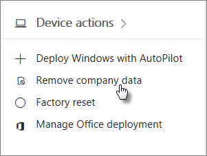

# 從裝置移除公司資料Remove company data from devices

## 移除公司資料Remove company data

您可以使用 Microsoft 365 商務移除公司資料您的使用者必須在其[裝置](app-protection-settings-for-android-and-ios.md)或[Windows Pc](protection-settings-for-windows-10-devices.md) Microsoft 365 來保護。**如果您移除公司資料來源裝置]，您無法將它稍後還原**。You can use Microsoft 365 Business to remove company data that your users have on their [devices](app-protection-settings-for-android-and-ios.md) or [Windows PCs](protection-settings-for-windows-10-devices.md) that are protected by Microsoft 365. **If you remove company data from a device, you cannot restore it later**. 
  
1. 使用全域系統管理員認證登入 [Microsoft 365 商務版](https://portal.office.com)。Sign in to [Microsoft 365 Business](https://portal.office.com) with global admin credentials. 
    
2. 在管理中心的 [**裝置動作**在卡片上，選擇 [**移除公司資料**。In the admin center, on the **Device actions** card, choose **Remove company data**.
    
    
  
3. 在**移除公司資料**] 窗格中，選擇 [或搜尋使用者誰具有您要移除，並選擇名稱的資料。On the **Remove company data** pane, choose or search for a user who's data you want to remove, and choose the name. 
    
4. 在 [下一步] 窗格中選取的裝置從**受管理的裝置**清單中移除的資料並選擇 [**下一步**。On the next pane, select the device or devices from the **Managed devices** list to remove data from and choose **Next**. 
    
    
  
5. 在**您確定要移除之裝置上的公司資料**] 窗格中，選擇 [**移除** \> **關閉**。On the **Are you sure you want to remove company data on the devices** pane, choose **Remove** \> **Close**.
    

