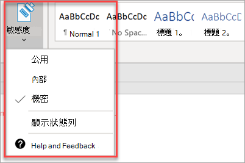

# 設定合規性功能Set up compliance features

您的 Microsoft 365 商務版特優隨附功能可保護您的資料和裝置，並可協助您保護您的和客戶的敏感資訊。Your Microsoft 365 Business Premium comes with features to protect your data and devices, and help you keep your and your customers' sensitive information secure.

## 設定 DLP 功能Set up DLP features

請參閱 [從範本建立 DLP 原則](https://docs.microsoft.com/microsoft-365/compliance/create-a-dlp-policy-from-a-template) ，以取得如何設定原則以避免個人資料的保護遺失的範例。See [Create a DLP policy from a template](https://docs.microsoft.com/microsoft-365/compliance/create-a-dlp-policy-from-a-template) for an example on how to set up a policy to protect against protect loss of personal data. 
  
DLP 隨附許多可用於許多不同地區設定的現成原則範本。DLP comes with many ready-to-use policy templates for many different locales. 例如，澳大利亞財務資料、加拿大個人資訊法案、美國財務資料等等。For example, Australia Financial Data, Canada Personal Information Act, U.S. Financial Data, and so on. 如需完整清單，請參閱 [DLP 原則範本包含哪些內容](https://docs.microsoft.com/microsoft-365/compliance/what-the-dlp-policy-templates-include) 。See [What the DLP policy templates include](https://docs.microsoft.com/microsoft-365/compliance/what-the-dlp-policy-templates-include) for a full list. 您可以啟用上述所有範本，類似 PII 範本範例。All of these templates can be enabled similar to the PII template example. 
  
## 設定 Exchange Online 封存的電子郵件保留Set up email retention with Exchange Online Archiving

 **Exchange Online** 封存授權功能可透過保存 eDiscovery 的電子郵件內容，協助維護法規遵從性和法規標準。**Exchange Online Archiving** license features help maintain compliance and regulatory standards by preserving email content for eDiscovery. 如果有訴訟，也會在安全性破壞或需要復原已刪除的專案時，提供復原資料的方法。It also helps reduce your risk if there is a lawsuit, and provides a way to recover data after a security breach or when you need to recover deleted items. 您可以使用訴訟暫止以保留使用者的所有內容，或使用保留原則自訂您想要保留的專案。You can use litigation hold to preserve all of a user's content, or use retention policies to customize what you want to preserve.
  
**訴訟暫止：** 您可以將使用者的整個信箱置於訴訟暫止狀態，以保留包括已刪除專案的所有信箱內容。**Litigation hold:** You can preserve all mailbox content including deleted items by putting a user's entire mailbox on litigation hold. 
    
若要將信箱設為訴訟暫止狀態，請在系統管理中心：To place a mailbox on litigation hold, in the Admin center:
    
1. 在左側導覽中，移至 [ **使用者** ] [作用中 \> **使用者** ]。In the left nav, go to **Users** \> **Active users** .
    
2. 選取您要對其信箱進行訴訟暫止的使用者。Select a user whose mailbox you want to place on litigation hold. 在 [使用者] 窗格中，展開 [ **郵件設定** ]，然後按一下 [ **其他設定** ] 旁的 [ **編輯 Exchange 屬性** ]。In the user pane, expand **Mail settings** , and next to **More settings** , choose **Edit Exchange properties** .
    
3. 在使用者的 [信箱] 頁面上，選擇左側流覽上的 [\*] [信箱功能] \* \*，然後選擇 [ **訴訟暫** 止] 下的 [ **啟用** ] 連結。On the mailbox page for the user, choose \*\* mailbox features \*\* on the left nav, and then choose the **Enable** link under **Litigation hold** .
    
4. 在 [ **訴訟** 暫止] 對話方塊中，您可以在 [ **訴訟暫止持續時間** ] 欄位中指定訴訟暫止持續時間。In the **litigation hold** dialog box, you can specify the litigation hold duration in the **Litigation hold duration** field. 如果您想要進行無限保留，請將此欄位保留空白。Leave the field empty if you want to place an infinite hold. 您也可以新增附注，並將信箱擁有者導向至網站，您可能需要進一步說明訴訟暫止。You can also add notes and direct the mailbox owner to a website you might have to explain more about the litigation hold. \>**儲存** 。\> **Save** .
    
**保留：** 例如，您可以啟用自訂的保留原則，以在保留期間結束時保留特定時間量或永久刪除內容。**Retention:** You can enable customized retention policies, for example, to preserve for a specific amount of time or delete content permanently at the end of the retention period. 若要深入瞭解，請參閱 [保留原則一覽](https://docs.microsoft.com/microsoft-365/compliance/retention-policies)。To learn more, see [Overview of retention policies](https://docs.microsoft.com/microsoft-365/compliance/retention-policies).

## 設定敏感度標籤Set up Sensitivity labels

敏感度標籤隨附 Azure 資訊保護 (AIP) 方案1，並可選擇性地使用標籤來保護您的檔和電子郵件。Sensitivity labels come with Azure Information Protection (AIP) Plan 1, and help you classify, and optionally protect your documents and emails, by applying labels. 系統管理員可以自動套用標籤，以定義規則和條件、手動由使用者手動套用，或是使用使用者提供建議的組合來套用。Labels can be applied automatically by administrators who define rules and conditions, manually by users, or by using a combination where users are given recommendations.

若要設定敏感度標籤，請 view [建立及管理敏感度標籤](https://support.microsoft.com/office/2fb96b54-7dd2-4f0c-ac8d-170790d4b8b9) 影片。To set up Sensitivity labels, view [create and manage sensitivity labels](https://support.microsoft.com/office/2fb96b54-7dd2-4f0c-ac8d-170790d4b8b9) video.

### 手動安裝 Azure 資訊保護用戶端Install the Azure Information Protection client manually

若要手動安裝 AIP 用戶端：To manually install the AIP client:

1. 從 [Microsoft 下載中心](https://www.microsoft.com/download/details.aspx?id=53018)下載 **AzinfoProtection_UL.exe** 。Download **AzinfoProtection_UL.exe** from [Microsoft download center](https://www.microsoft.com/download/details.aspx?id=53018).
 
2. 您可以透過查看 Word 檔來驗證安裝是否正常運作，並確定 [ **首頁** ] 索引標籤上有 [ **敏感度** ] 選項。You can verify that the installation worked by viewing a Word document and making sure that the **Sensitivity** option is available on the **Home** tab.
 ![在 Word 檔中下拉式清單中的 [保護] 索引標籤。](../media/word-sensitivity.png)

如需詳細資訊，請參閱 [安裝用戶端](https://docs.microsoft.com/azure/information-protection/infoprotect-tutorial-step3)。For more information, see [Install the client](https://docs.microsoft.com/azure/information-protection/infoprotect-tutorial-step3).
