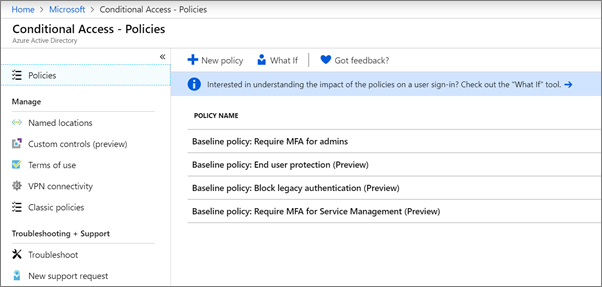

# 設定條件式存取原則Set up Conditional Access policies

[條件式存取](https://docs.microsoft.com/azure/active-directory/conditional-access/overview)原則會增加大量額外的安全性。[Conditional Access](https://docs.microsoft.com/azure/active-directory/conditional-access/overview) policies add substantial additional security. Microsoft 提供一組為所有客戶建議的基準條件式存取原則。Microsoft provides a set of baseline Conditional Access policies that are recommended for all customers. 基準原則是一組預先定義的原則，可協助保護組織不受許多常見的攻擊。Baseline policies are a set of predefined policies that help protect organizations against many common attacks. 這些常見的攻擊可能包括密碼噴塗、重新顯示和網路釣魚。These common attacks can include password spray, replay, and phishing.

這些原則要求系統管理員和使用者在符合特定條件時，輸入第二種形式的驗證（稱為多重驗證或 MFA）。These policies require admins and users to enter a second form of authentication (called multifactor authentication, or MFA) when certain conditions are met. 例如，如果使用者從不同的國家/地區登入，則可能會認為登入是危險的，而且使用者必須提供其他形式的驗證。For example, if a user is signing in from a different country, the sign-in might be considered risky and the user must provide an additional form of authentication. 

目前的基準原則包括下列各項：Currently, baseline policies include the following:
- **需要** &ndash;對系統管理員進行 MFA，必須對特權最高的系統管理員角色（包括全域管理員）進行多重要素驗證。**Require MFA for admins** &ndash; Requires multi-factor authentication for the most privileged administrator roles, including global administrator.
- 只有在登入危險時 **，使用者才** &ndash;需要使用者的多重要素驗證。**End user protection** &ndash; Requires multi-factor authentication for users only when a sign-in is risky. 
- **封鎖舊版驗證** &ndash;舊版用戶端應用程式和某些新的應用程式不會使用較新、更安全的驗證通訊協定。**Block legacy authentication** &ndash; Older client apps and some new apps don't use newer, more secure, authentication protocols. 這些繼承應用程式可略過條件式存取原則，並對您的環境進行未授權的存取。These older apps can bypass Conditional Access policies and gain unauthorized access to your environment. 這個原則會封鎖不支援條件式存取之用戶端的存取權。This policy blocks access from clients that don't support Conditional Access. 
- **需要 MFA for Service management** &ndash;才能存取管理工具（包括 Azure 入口網站（您設定基準原則）的多重要素驗證。**Require MFA for Service Management** &ndash; Requires multi-factor authentication for access to management tools, including Azure portal (where you configure baseline policies). 

Microsoft 建議您啟用所有的基準原則。Microsoft recommends you enable all of these baseline policies. 啟用這些原則之後，系統會提示系統管理員和使用者註冊 Azure Multii 要素驗證。After these policies are enabled, admins and users will be prompted to register for Azure Multii-Factor authentication.

如需這些原則的詳細資訊，請參閱[什麼是基準原則](https://docs.microsoft.com/azure/active-directory/conditional-access/concept-baseline-protection)？For more information about these policies, see [What are baseline policies](https://docs.microsoft.com/azure/active-directory/conditional-access/concept-baseline-protection)?

## 設定基準原則Set up baseline policies

1. 移至[azure 入口網站](https://portal.azure.com)，然後流覽至 [ **azure Active Directory** \> **條件式存取**]。Go to [Azure portal](https://portal.azure.com), and then navigate to **Azure Active Directory** \> **Conditional Access**.
    
    基準原則會列在頁面上。The baseline policies are listed on the page.    
    
1. 請參閱下列每個原則的特定指示：See the following specific instructions for each policy:

  - [需要對系統管理員進行 MFARequire MFA for admins](https://docs.microsoft.com/azure/active-directory/conditional-access/howto-baseline-protect-administrators)
- [使用者需要 MFARequire MFA for users](https://docs.microsoft.com/azure/active-directory/conditional-access/howto-baseline-protect-end-users)  
 - [封鎖舊版驗證Block legacy authentication](https://docs.microsoft.com/azure/active-directory/conditional-access/howto-baseline-protect-legacy-auth)
  - [需要 MFA 進行服務管理Require MFA for service management](https://docs.microsoft.com/azure/active-directory/conditional-access/howto-baseline-protect-azure)

您可以設定許多額外的原則，例如要求核准的用戶端應用程式。You can set up many additional policies, such as requiring approved client apps. 如需詳細資訊，請參閱[條件式存取檔](https://docs.microsoft.com/azure/active-directory/conditional-access/)。For more information, see the [Conditional Access Documentation](https://docs.microsoft.com/azure/active-directory/conditional-access/).
