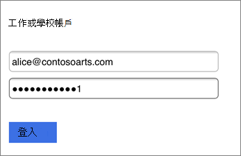
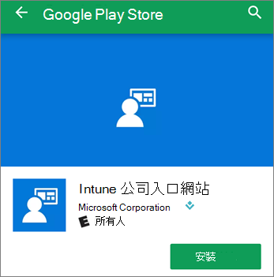

# 為商務用 Microsoft 365 使用者設定行動裝置Set up mobile devices for Microsoft 365 for business users

按照索引標籤中的指示在 iPhone 或 Android 手機上安裝 Office。Follow the instructions in the tabs to install Office on an iPhone or an Android phone. 遵循這些步驟之後，您在 Office 應用程式中建立的工作檔案會受到 Microsoft 365 for business 的保護。After you follow these steps, your work files created in Office apps will be protected by Microsoft 365 for business.

此範例適用於 Outlook，但也適用於任何其他您要安裝的 Office App。The example is for Outlook, but applies for any other Office apps you want to install also.
  
## 設定行動裝置Set up mobile devices

## [IphoneiPhone](#tab/iPhone)
  
觀看有關如何在使用 Microsoft 365 for business 的 iOS 裝置上設定 Office app 的簡短影片。Watch a short video on how to set up Office apps on iOS devices with Microsoft 365 for business.  

> [!VIDEO https://www.microsoft.com/videoplayer/embed/RWee2n] 

如果您覺得這段影片很有幫助，請查看[適用於小型企業和 Microsoft 365 新手的完整訓練系列](https://support.microsoft.com/office/6ab4bbcd-79cf-4000-a0bd-d42ce4d12816)。If you found this video helpful, check out the [complete training series for small businesses and those new to Microsoft 365](https://support.microsoft.com/office/6ab4bbcd-79cf-4000-a0bd-d42ce4d12816).

移至 **應用程式存放區**，然後在 Microsoft Outlook 的搜尋欄位類型中。Go to **App store**, and in the search field type in Microsoft Outlook.
  

  
點選雲端圖示以安裝 Outlook。Tap the cloud icon to install Outlook.
  

  
安裝完成時，請點擊 [ **開啟** ] 按鈕以開啟 Outlook，然後按 [ **開始**]。When the installation is done, tap the **Open** button to open Outlook and then tap **Get Started**.
  

  
在 [ **新增電子郵件帳戶** ] 畫面的 [新增帳戶] 中輸入您的工作電子郵件地址 \> \*\*\*\*，然後輸入您的 Microsoft 365 for business 身分登 \> **入**。Enter your work email address on the **Add Email Account** screen \> **Add Account**, and then enter your Microsoft 365 for business credentials \> **Sign in**.
  

  
如果您的組織正在保護應用程式中的檔案，您會看到一個對話方塊，說明您的組織現在正在保護應用程式中的資料，而您需要重新開機應用程式以繼續使用它。If your organization is protecting files in apps, you'll see a dialog stating that your organization is now protecting the data in the app and you need to restart the app to continue to use it. 按一下 **[確定]** ，然後關閉 Outlook。Tap **OK** and close Outlook. 
  

  
在 iPhone 上找出並重新啟動 Outlook。Locate Outlook on the iPhone, and restart it. 出現提示時，請輸入 PIN 碼並加以驗證。When prompted, enter a PIN and verify it. 您 iPhone 上的 Outlook 現已可供使用。Outlook on your iPhone is now ready to be used.
  

  
## [AndroidAndroid](#tab/Android)
  
觀賞如何在 Android 裝置上安裝 Outlook 和 Office 的相關影片。Watch a video about installing Outlook and Office on Android devices.  

> [!VIDEO https://www.microsoft.com/videoplayer/embed/ecc2e9c0-bc7e-4f26-8b14-91d84dbcfef0] 

如果您覺得這段影片很有幫助，請查看[適用於小型企業和 Microsoft 365 新手的完整訓練系列](https://support.microsoft.com/office/6ab4bbcd-79cf-4000-a0bd-d42ce4d12816)。If you found this video helpful, check out the [complete training series for small businesses and those new to Microsoft 365](https://support.microsoft.com/office/6ab4bbcd-79cf-4000-a0bd-d42ce4d12816).

若要在您的 Android 手機上開始安裝程式，請移至播放存放區。To begin setup on your Android phone, go to the Play Store.
  

  
在 [Google Play] 搜尋方塊中輸入 Microsoft Outlook，然後按 [ **安裝**]。Enter Microsoft Outlook in the Google Play search box and tap **Install**. 完成 Outlook 安裝後，請點擊 [ **開啟**]。Once Outlook is done installing, tap **Open**.
  

  
在 Outlook app 中，按一下 [ **開始** 使用]，然後新增您的 Microsoft 365 以取得商務電子郵件帳戶 \> \*\*\*\*，然後使用您的組織認證登入。In the Outlook app, tap **Get Started**, then add your Microsoft 365 for business email account \> **Continue**, and sign in with your organization credentials.
  

  
在指出您必須安裝 Intune 公司入口網站應用程式的對話方塊中，按一下 [ **移至儲存區**]。In the dialog that states you must install the Intune Company Portal app, tap **Go to store**.
  

  
在 [播放存放區] 中，安裝 Intune 公司入口網站。In Play Store, install Intune Company Portal.
  

  
重新開啟 Outlook，然後輸入並確認 PIN。您的 Outlook App 現已可供使用。Open Outlook again, and enter and confirm a PIN. Your Outlook app is now ready for use.
  

## 請參閱See also

[商務用 Microsoft 365 訓練影片Microsoft 365 for business training videos](https://support.microsoft.com/office/6ab4bbcd-79cf-4000-a0bd-d42ce4d12816)

---
