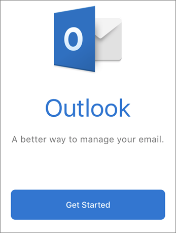
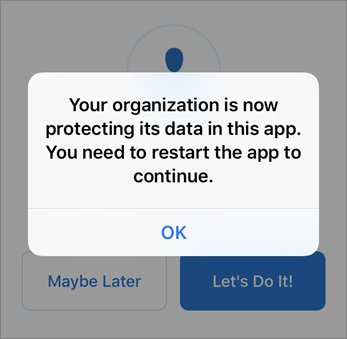
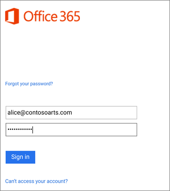

# 為 Microsoft 365 商務版使用者設定行動裝置

按照索引標籤中的指示在 iPhone 或 Android 手機上安裝 Office。遵循這些步驟操作後，您在 Office App 中建立的工作檔案就會受到 Microsoft 365 商務版保護。

  
此範例適用於 Outlook，但也適用於任何其他您要安裝的 Office App。
  
## 設定行動裝置

## [iPhone](#tab/iPhone)
  
觀看有關如何設定 iOS 裝置上使用 Microsoft 365 商務版的 Office 應用程式的影片：

> [!VIDEO https://www.microsoft.com/videoplayer/embed/e0ee7052-e0f4-4c42-a4f1-5e91b9776ce9?autoplay=false] 

移到**應用程式存放區**，並在搜尋欄位中輸入 Microsoft Outlook 中。
  

  
點選雲端圖示以安裝 Outlook。
  

  
安裝完成時，點選 [**開啟**] 按鈕來開啟 Outlook，然後點選 [**開始**]。
  

  
在 [**新增電子郵件帳戶**] 畫面上輸入您的公司電子郵件地址\>**新增帳戶**]，然後輸入您的 Microsoft 365 商務版認證\>**登入**。
  

  
如果貴組織保護 App 上的檔案，您會看到一個對話方塊，指出貴組織正在保護 App 中的資料，而且您必須重新啟動 App 才能繼續使用。 點選 [**確定]** ，並關閉 Outlook。 
  

  
在 iPhone 上找出並重新啟動 Outlook。當系統提示您時，輸入 PIN 並進行驗證。您 iPhone 上的 Outlook 現已可供使用。
  

  
## [Android](#tab/Android)
  
若要開始安裝 Android 手機上的，移至 Play 商店。
  

  
Google Play 搜尋方塊中輸入 Microsoft Outlook，然後點選 [**安裝**]。一旦完成 Outlook 安裝，請點選 [**開啟**。
  

  
在 Outlook app 中點選 [**開始**，然後新增您的 Microsoft 365 商務版電子郵件帳戶\>**繼續**，並以您組織的認證登入。
  

  
在] 對話方塊中，指出您必須安裝 Intune 公司入口網站應用程式，點選 [**移至商店]**。
  

  
在 [Play 商店] 中，安裝 Intune 公司入口網站。
  

  
重新開啟 Outlook，然後輸入並確認 PIN。您的 Outlook App 現已可供使用。
  

  
---

