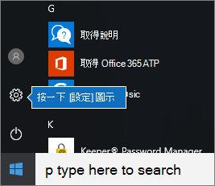

# 為 Microsoft 365 商務版使用者設定 Windows 裝置

## 設定為 Microsoft 365 商務版使用者的 Windows 裝置的必要條件

請先確認所有 Windows 裝置皆執行 Windows 10 專業版的版本 1703 (Creators Update)，才能為 Microsoft 365 商務版使用者設定 Windows 裝置。Windows 10 專業版是部署 Windows 10 商務版的先決條件，它是一套加強 Windows 10 專業版的雲端服務和裝置管理功能，而且可支援 Microsoft 365 商務版的集中管理和安全性控制。
  
如果您有執行 Windows 7 專業版、Windows 8 專業版或 Windows 8.1 專業版的 Windows 裝置，您的 Microsoft 365 商務版訂閱即符合 Windows 10 升級的資格。
  
如需有關如何將 Windows 裝置升級到 Windows 10 專業版 Creators Update 的資訊，請按照本主題中的步驟進行：[將 Windows 裝置升級到 Windows 專業版 Creators Update](upgrade-to-windows-pro-creators-update.md)。
  
請參閱[驗證裝置已連線到 Azure AD](#verify-the-device-is-connected-to-azure-ad)若要確認您已升級或確認升級正常運作。

觀看有關 Windows 連線至 Microsoft 365 簡短影片。  

> [!VIDEO https://www.microsoft.com/videoplayer/embed/RE3yXh3] 

如果您覺得這段影片很有幫助，請查看[適用於小型企業和 Microsoft 365 新手的完整訓練系列](https://support.office.com/article/6ab4bbcd-79cf-4000-a0bd-d42ce4d12816)。
  
## 將 Windows 10 裝置加入到貴組織的 Azure AD

組織中的所有 Windows 裝置可以都已升級至 Windows 10 專業版 Creators Update，或已在執行 Windows 10 專業版 Creators Update 時, 您可以將這些裝置加入貴組織的 Azure Active Directory。 一旦加入裝置後，他們將會自動升級到 Windows 10 商務版，這是 Microsoft 365 商務版訂閱的一部分。
  
### 適用於全新或新升級的 Windows 10 專業版裝置

針對執行 Windows 10 專業版 Creators Update 的全新裝置，或針對已升級到 Windows 10 專業版 Creators Update 但未完成 Windows 10 裝置設定的裝置，請按照這些步驟進行。
  
1. 移到 Windows 10 裝置設定，直到到達**您要如何設定？** ] 頁面。 
    
    
  
2. 在這裡，選擇 [**為組織設定**，然後輸入您的使用者名稱和密碼，Microsoft 365 商務版。 
    
3. 完成 Windows 10 裝置設定。
    
   完成後，使用者將連線到貴組織的 Azure AD。請參閱[驗證裝置已連線到 Azure AD](#verify-the-device-is-connected-to-azure-ad) 以確認。 
  
### 適用於已設定且執行 Windows 10 專業版的裝置

 **將使用者連線到 Azure AD：**
  
1. In your user's Windows PC, that is running Windows 10 Pro, version 1703 (Creators Update) (see [pre-requisites](pre-requisites-for-data-protection.md)), click the Windows logo, and then the Settings icon.
  
   
  
2. 在 [**設定**] 中，移至 [**帳戶**。
  
   
  
3. 在**您的資訊]** 頁面上，按一下 [**存取公司或學校** \> **連線**。
  
   
  
4. 在 [**設定公司或學校帳戶**] 對話方塊中，[**其他動作**] 底下選擇 [**加入至 Azure Active Directory 此裝置**。
  
   
  
5. 在 [**讓我們協助您登入**] 頁面上，輸入您的公司或學校帳戶\>**下一步**。
  
   在 [**輸入密碼**] 頁面上，輸入您的密碼\>**登入**。
  
   
  
6. 在**確定這是您的組織**] 頁面上，確認資訊正確，然後按一下 [**加入**。
  
   在**一切就緒 ！** ] 頁面上，按一下 [**完成**]。
  
   
  
如果您將檔案上傳至商務用 OneDrive，請將檔案同步回原處。 如果您使用協力廠商工具移轉個人資料和檔案時，也將這些內容同步到新的設定檔。
  
## 驗證裝置已連線到 Azure AD

若要確認您的同步處理狀態，在 [**設定**] [**存取公司或學校資源**] 頁面上按一下 [在**連線至**_\<組織名稱\>_ 區域中展示 [**資訊**] 以及 [**中斷連線**] 按鈕。 按一下 [**資訊**]，以取得您同步處理狀態。 
  
在 [同步處理狀態] 頁面上，按一下 [同步處理] 將最新的行動裝置管理原則下載到 PC 上。
  
若要開始使用 Microsoft 365 商務版帳戶，請移至 Windows [**開始**] 按鈕，以滑鼠右鍵按一下您目前的帳戶圖片]，然後**切換帳戶**。 使用您的組織電子郵件和密碼登入。
  

  
## 驗證裝置已升級到 Windows 10 商務版

驗證 Azure AD 加入的 Windows 10 裝置已升級到 Windows 10 商務版，做為 Microsoft 365 商務版訂閱的一部分。
  
1. 移至 [**設定** \> **系統** \> **有關**。
    
2. 確認**版本**] 顯示**Windows 10 商務版**。
    
    
  
## 後續步驟

若要設定行動裝置，請參閱[為 Microsoft 365 商務版使用者設定行動裝置](set-up-mobile-devices.md)。若要設定裝置保護或 App 保護原則，請參閱[管理 Microsoft 365 商務版](manage.md)。
  
## 如需設定和使用 Microsoft 365 商務版

[Microsoft 365 商務版訓練影片](https://support.office.com/article/6ab4bbcd-79cf-4000-a0bd-d42ce4d12816)
