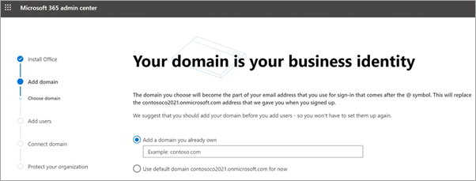

# 在安裝精靈中設定 Microsoft 365 商務版 Premium

請觀看這段影片，以取得 Microsoft 365 商務版特優設定的概要。  

> [!VIDEO https://www.microsoft.com/videoplayer/embed/RE4jZwg] 

## 新增您的網域、使用者及設定原則

當您購買 Microsoft 365 商務版特優功能時，您可以選擇使用您擁有的網域，或在 [註冊](sign-up.md)期間購買一個網域。

- 如果您在註冊時購買新的網域，則您的網域全都都已設定完畢，您可以移至 [新增使用者並指派授權](#add-users-and-assign-licenses)。

### 新增您的網域以個人化登入

1. 使用您的全域系統管理員認證登入 [Microsoft 365 系統管理中心](https://admin.microsoft.com)。 

2. 請選擇 **[移至設定]** 來啟動精靈。

    ![選取 [移至設定]。](../media/gotosetupinadmincenter.png)

3. 在 **[安裝您的 Office 應用程式]** 頁面上，您可以選擇將應用程式安裝到自己的電腦上。
    
4. 在 **[新增網域]** 步驟中，輸入您要使用的網域名城（例如 contoso.com）。

    > [!IMPORTANT]
    > 如果您在註冊時購買了網域，就不會在此看到 **[新增網域]** 步驟。 改移至 [[新增使用者]](#add-users-and-assign-licenses)。

    

    
4. 依照嚮導中的步驟，在任何可驗證您擁有網域之 [Microsoft 365 的 dns 主機服務提供者中建立 dns 記錄](/office365/admin/get-help-with-domains/create-dns-records-at-any-dns-hosting-provider) 。 如果您知道您的網域主機，請參閱 [[主機特定指示]](/office365/admin/get-help-with-domains/set-up-your-domain-host-specific-instructions)。

    如果您的主機服務供應商是 GoDaddy 或透過 [[網域連結]](/office365/admin/get-help-with-domains/domain-connect) 所啟用的另一個主機，這個過程便會很簡單，您自動便會被要求登入，並讓 Microsoft 替您進行驗證。

    ![在 GoDaddy 確認存取頁面上，選取 [授權]。](../media/godaddyauth.png)

### 新增使用者並指派授權

您可以在精靈中新增使用者，或稍後在系統管理中心[[新增使用者]](../admin/add-users/add-users.md)。 此外，如果您有本機網域控制站，您可以使用 [Azure AD Connect](/azure/active-directory/hybrid/how-to-connect-install-express)新增使用者。

#### 在精靈中新增使用者

您在嚮導中新增的任何使用者會自動指派 Microsoft 365 商務版優質授權。

![嚮導中 [新增使用者] 頁面的螢幕擷取畫面](../media/addnewuserspage.png)

1. 如果您的 Microsoft 365 商務版訂閱有現有的使用者 (例如，如果您使用 Azure AD Connect) ，您可以選擇立即將授權指派給他們。 請繼續進行，為他們新增授權。

2. 新增使用者之後，您也會看到與您新增之使用者共用認證的選項。 您可以選擇列印認證、透過電子郵件傳送認證，或是下載認證。

### 連接您的網域

> [!NOTE]
> 如果您選擇使用 onmicrosoft 網域，或使用 Azure AD Connect 來設定使用者，您將不會看到此步驟。
  
若要設定服務，您必須更新 DNS 主機或網域註冊機構中的某些記錄。
  
1. 設定精靈通常會偵測您的註冊機構，並提供您一個逐步指示連結，讓您更新在註冊機構網站上的 NS 記錄。 如果不是，請 [將名稱伺服器變更為設定 Microsoft 365 與任何網域註冊機構](../admin/get-help-with-domains/change-nameservers-at-any-domain-registrar.md)。 

    - 如果您有現有的 DNS 記錄，例如現有網站，但您的 DNS 主機已啟用 [網域連線](/office365/admin/get-help-with-domains/domain-connect)，請選擇 **[為我新增記錄]**。 在 **[選擇您的線上服務]** 頁面，接受所有預設值，並選擇 **[下一步]**，然後在您的 DNS 主機頁面上選擇 **[授權]**。
    - 如果您的現有 DNS 記錄中有其他 DNS 主機(該主機無法用於網域連線)，您最好能自己管理自己的 DNS 記錄，以確保現有服務保持連線。 如需詳細資訊，請參閱 [網域基本資訊](/office365/admin/get-help-with-domains/dns-basics)。

        

2. 按照精靈中的步驟進行，系統會為您設定電子郵件及其他服務。

### 保護您的組織 

您在嚮導中設定的原則會自動套用至稱為「*所有使用者*」的 [安全性群組](/office365/admin/create-groups/compare-groups#security-groups)。 您也可以在系統管理中心建立其他群組，以指派原則。

1. 在 [ **加強來自高級網路威脅的保護**] 中，建議您接受預設值，讓 [Office 365 的高級威脅防護](../security/office-365-security/defender-for-office-365.md) 掃描 office 應用程式中的檔案和連結。

    ![[增加保護] 頁面的螢幕擷取畫面。](../media/increasetreatprotection.png)

2. 在 [ **防止敏感性資料洩漏** ] 頁面上，接受預設值以開啟 Office 365 資料遺失防護 (DLP) 以追蹤 office 應用程式中的機密資料，並防止在組織外意外共用這些資料。

3. 在 [ **保護** 行動裝置中的資料] 頁面上，將行動應用程式管理留給 [開啟]，展開設定並加以檢查，然後選取 [建立行動裝置 **應用程式管理原則**]。

    ![在 [行動裝置] 頁面中保護資料的螢幕擷取畫面。](../media/protectdatainmobile.png)

## 保護 Windows 10 電腦

在左導覽上，選取 [ **安裝** ]，然後在 [登 **入和安全性**] 下，選擇 [ **保護您的 Windows 10 電腦**]。 選擇 [View] （ **查看** ）立即開始。 請參閱 [保護您的 Windows 10 電腦](secure-win-10-pcs.md) 以取得完整的指示。

## 部署 Office 365 用戶端應用程式

如果您選擇在設定期間自動安裝 Office 應用程式，當使用者從 Windows 裝置登入 Azure AD 時，將會在 Windows 10 裝置上安裝應用程式，並使用其工作認證。

若要在行動裝置 iOS 或 Android 裝置上安裝 Office，請參閱為 [Microsoft 365 商務版使用者設定行動裝置](set-up-mobile-devices.md)。

您也可以個別安裝 Office。 請參閱 [在 PC 或 Mac 上安裝 Office](https://support.microsoft.com/office/4414eaaf-0478-48be-9c42-23adc4716658) 以取得指示。

## 請參閱

[商務用 Microsoft 365 訓練影片](https://support.microsoft.com/office/6ab4bbcd-79cf-4000-a0bd-d42ce4d12816)
