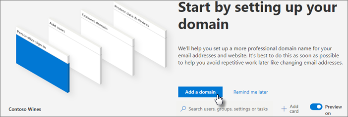

# 設定 Microsoft 365 商務版

在您開始之前，請參閱[取得 Microsoft 365 商務版](get-microsoft-365-business.md)，如註冊的詳細資訊。

使用設定精靈] 中，並時您沒有內部部署 Active Directory 觀賞[簡短的影片，如何設定 Microsoft 365 商務版](https://support.office.com/article/38003e30-9d10-44cf-b596-f1b5f662bfa1)
  

## 概觀

可以在安裝程式精靈] 完成大部分的設定步驟，但也會列出其他選項。

1. [新增您的網域](#add-your-domain-to-personalize-sign-in)（如果您在[註冊](sign-up.md)購買您的網域，為已完成這個步驟。）
2. 新增使用者]。 您可以在任何的三種方式：
    - 在[安裝精靈](#add-users-in-the-wizard)]。
    - 如果您有內部部署 Active directory，請使用新增[的使用者使用 Azure AD Connect](#add-users-by-using-azure-ad-connect)目錄同步處理。
    - 您也可以在系統管理中心的 [[新增使用者更新版本](add-users-m365b.md)。
3. 設定安全性原則和設定裝置。 您可以在任何的三種方式：
    - 在[安裝精靈](#set-up-policies-in-the-wizard)]。  
    - 在[系統管理中心](#modify-or-add-policies-in-the-admin-center)。
    - 在[Intune 系統管理中心](https://docs.microsoft.com/intune/what-is-device-management)中。
4. 設定及管理 Windows 10 裝置。

    當您在 WIndows 10 裝置加入 Azure AD 時，取得套用所有原則。
    - 設定[安裝程式精靈](#set-up-policies-in-the-wizard)] 中的 Windows 10 裝置設定。
    - 將[新的 Windows 10 裝置](set-up-windows-devices.md#for-a-brand-new-or-newly-upgraded-windows-10-pro-device)加入 Azure AD。
    - 將[現有的 Windows 10 裝置](set-up-windows-devices.md#for-a-device-already-set-up-and-running-windows-10-pro)加入 Azure AD。
1. 安裝 Office 365 商務版。
    - 您可以使用[安裝精靈](#set-up-policies-in-the-wizard)，在 Windows 裝置上自動安裝 Office。
    - 從自動[安裝 Office](auto-install-or-uninstall-office.md)系統管理中心。
    - Windows 和裝置，可讓使用者[安裝 Office 應用程式](https://docs.microsoft.com/office365/admin/setup/install-applications)。
     
1. 設定額外的安全性。
    - 安裝精靈會新增原則來保護您的裝置，但您也可以利用的[其他安全性](#additional-security-settings)功能來幫助保護您的資料、 帳戶及電子郵件。 

## 新增您的網域使用者，並設定原則

當您購買 Microsoft 365 商務版時，您可以使用您自己的網域，或購買其中期間選擇[註冊](sign-up.md)。

- 如果您購買新的網域，當您註冊時，您的網域，且所有設定，而且您可以移到[新增使用者並指派授權](#add-users-and-assign-licenses)。

### 新增網域至個人化登入

1. 使用全域系統管理員認證登入[Microsoft 365 系統管理中心](https://admin.microsoft.com)。 

2. 選擇 [**新增網域**]，以啟動精靈]。

    
    
3. 在精靈中，輸入您想要使用 （例如 contoso.com) 的網域名稱。

    

    
4. 若要驗證您擁有該網域的[Office 365 任何 DNS 主機服務提供者處建立 DNS 記錄](https://docs.microsoft.com/office365/admin/get-help-with-domains/create-dns-records-at-any-dns-hosting-provider)，請遵循精靈中的步驟。 如果您知道您的網域主機，請參閱[主應用程式的特定指示](https://docs.microsoft.com/office365/admin/get-help-with-domains/set-up-your-domain-host-specific-instructions)。

    如果您的主機服務提供者是 GoDaddy，程序簡單，而且您將會自動登入，並讓 Microsoft 代替您驗證要求：

    ![在 GoDaddy 確認存取] 頁面上，選取 [授權]。](media/godaddyauth.png)

### 新增使用者並指派授權

您可以新增使用者在精靈中，但您也可以在系統管理中心的 [[新增使用者更新版本](add-users-m365b.md)。 此外，如果您有在本機網域控制站，您可以新增使用者的[Azure AD Connect](https://docs.microsoft.com/azure/active-directory/hybrid/how-to-connect-install-express)。

#### 在精靈中新增使用者

您在精靈中新增的使用者自動取得 Microsoft 365 商務版授權。
如果您已在本機網域控制站，並使用 Active Directory，請參閱[how to ddd 使用者藉由使用 Azure AD Connect](#add-users-by-using-azure-ad-connect)。

1. 如果您的 Microsoft 365 商務版訂閱有現有的使用者 (例如，如果您使用 Azure AD Connect)，系統會提供立即將授權指派給他們的選項。請繼續進行，為他們新增授權。

3. 新增使用者之後，您也會取得與您新增新使用者共用認證的選項。 您可以選擇列印認證、透過電子郵件傳送認證，或是下載認證。

4. 略過移轉電子郵件，並在**移轉電子郵件訊息**] 頁面上選擇 [**下一步**。 

    如果您要移動從另一個電子郵件提供者，並想稍後複製資料，您可以[移轉電子郵件和連絡人移轉到 Office 365](https://support.office.com/article/a3e3bddb-582e-4133-8670-e61b9f58627e)。

#### 使用 Azure AD Connect 來新增使用者

 如果您有使用 Active Directory 的本機網域控制站，您同步處理您的使用者與 Microsoft 365 商務版使用[Azure AD Connect](https://docs.microsoft.com/azure/active-directory/hybrid/how-to-connect-install-express)。 在您開始安裝精靈之前，請完成此選項。 您可以在系統管理中心下載它：

- 移至**使用者** \> **作用中使用者**]，選取在頁面頂端的省略符號，然後選取 [下載 Azure AD Connect**目錄同步處理**。

    ![在作用中使用者] 頁面上選取 [省略符號 > 目錄 snchronization。](media/setupdirsync.png)

    > [!IMPORTANT]
    > 如果您建立使用者如此一來，您仍必須在系統管理中心中指派授權給他們。

##### 繼續存取已加入網域的應用程式和裝置

如果您想要繼續存取已加入網域的應用程式和裝置，請閱讀下列文章針對啟用的兩個不同的方式：
  
- [啟用由 Microsoft 365 商務版來管理已加入網域的 Windows 10 裝置](manage-windows-devices.md)
    - 這是建議的方式。

- [存取內部部署 Microsoft 365 商務版中的 Azure AD 加入裝置的資源](access-resources.md)

### 連接您的網域

> [!NOTE]
> 如果您選擇.onmicrosoft 網域，或是用來設定使用者的 Azure AD Connect，您將不會看到此步驟。
  
若要設定服務，您必須更新 DNS 主機或網域註冊機構中的某些記錄。
  
1. 設定精靈通常會偵測您的註冊機構，並提供您一個逐步指示連結，讓您更新在註冊機構網站上的 NS 記錄。 如果沒有，[以設定 Office 365 運用任何網域註冊機構變更名稱伺服器](https://support.office.com/article/a8b487a9-2a45-4581-9dc4-5d28a47010a2)。 

    - 如果您有現有的 DNS 記錄，例如現有的 iis 網站，您會想要管理 DNS 記錄，以確定現有服務保持聯繫。 如需詳細資訊的[網域基本概念](https://docs.microsoft.com/office365/admin/get-help-with-domains/dns-basics)，請參閱。

        ![連接您的網域] 頁面上與我管理自己的 DNS 記錄。](media/connectyourdomainpage.png)

2. 遵循精靈中的步驟和電子郵件和其他服務就會設定為您。

### 設定安全性原則和裝置設定 

這些原則套用到每個使用者提供授權，或一群使用者如果您決定要將不同的原則指派給一群使用者。

#### 設定精靈] 中的原則

您在精靈中設定的原則會自動套用至名為*所有使用者*的[安全性群組](https://docs.microsoft.com/office365/admin/create-groups/compare-groups#security-groups)。

1. 在 [**保護行動裝置上的工作檔案**] 選項上預設會選取**裝置遺失或遭竊時保護工作檔案**。 您有一個選項來開啟 [**管理使用者如何存取行動裝置上的 Office 檔案**，而且，所以建議您。

    ![螢幕擷取畫面的保護工作檔案在行動裝置] 頁面上。](media/protectworkfilesondevices.png)

     - 如果您依序展開 [**裝置遺失或遭竊時保護工作檔案**時，[預設值](protect-work-files-on-lost-or-stolen-device.md)，會預先選取：

        

    - 如果您選取 [**管理使用者如何存取行動裝置上的 Office 檔案**，並予以展開，會顯示[預設值](manage-user-access-on-mobile-devices.md)。 建議您在設定時接受預設值，以建立適用於所有使用者的 Android、iOS 和 Windows 10 應用程式原則。 設定完成後，您可以建立更多原則。

        

2. 在最後一個步驟保護資料和裝置可讓您保護 Windows 10 裝置設定原則。 使用者的 Windows 10 連線至您的組織時，會自動套用這些設定。 您可以展開**保護 Windows 10 裝置**，以查看並修改[預設值](secure-windows-10-devices.md)。
3. 您也可以選擇在 Windows 10 裝置上[自動安裝 Office](install-office-on-windows-10-during-setup.md) 。

    ![螢幕擷取畫面的設定 Windows 10 裝置設定] 頁面。](media/setwin10config.png)

#### 修改或新增原則在系統管理中心

請參閱[管理 Microsoft 365 商務版](manage.md)如需如何檢視和修改裝置和應用程式保護的主題連結原則，以及如何移除其中資料，或重設使用者的裝置。

## 部署及管理 Windows 10
若要手動連線到 Azure AD，其中的新電腦，或藉由變更登入設定檔的現有電腦安裝期間[設定為 Microsoft 365 商務版使用者的 Windows 裝置](set-up-windows-devices.md)，請參閱。 

### 使用 Autopilot 來設定新裝置

您可以使用[Windows Autopilot](add-autopilot-devices-and-profile.md)來自動預先設定**新**的 Windows 10 裝置的使用者，但它可能會比較容易取得[合作夥伴](https://www.microsoft.com/solution-providers/search)可以執行這項操作您。 您也可以移至[Microsoft 網上商店](https://go.microsoft.com/fwlink/?linkid=874598)，並要求您購買您的新裝置上設定雲端技術專家。

### 存取內部部署資源

如果您的組織使用 Windows Server Active Directory 內部部署，您可以設定 Microsoft 365 商務版來保護 Windows 10 裝置，同時仍維持需要本機驗證的內部部署資源的存取權。 請遵循[啟用由 Microsoft 365 商務版來管理已加入網域的 Windows 10 裝置](manage-windows-devices.md)設定此案例中的步驟。 這是慣用的方法，在此狀態的裝置稱為混合式 Azure AD 加入的裝置。

如果貴公司有本機 Active Directory，其中包含一些內部資源 （例如檔案共用和印表機），您可以授與您的 Azure AD 加入的裝置存取這些資源遵循以下步驟：[存取內部部署資源Microsoft 365 商務版中的 azure AD 加入裝置](access-resources.md)。

## 部署 Office 365 用戶端應用程式

如果您選擇要設定自動安裝期間集的 Office 應用程式中的，應用程式會安裝在 Windows 10 裝置上，使用者已經登入後到 Azure AD 從他們的 Windows 裝置，使用其公司認證。
若要在行動裝置的 iOS 或 Android 裝置上安裝 Office，請參閱[為 Microsoft 365 商務版使用者的行動裝置上設定](set-up-mobile-devices.md)。

您也可以個別安裝 Office。 請參閱 <<c0>在 PC 或 Mac 上安裝 Office的指示。

## 額外的安全性設定

除了安全性與合規性設定安裝程式精靈] 中的，您也可以設定下列其他設定：
  
- **電子郵件的惡意程式碼保護**
- **進階的威脅防護 (ATP) 的安全附件**
- **ATP 安全連結**
- **引起的防網路釣魚**
- **Exchange Online 封存**
- **資料外洩防護 (DLP)**
- **Azure 資訊保護**（方案 1）
- **Intune 入口網站可用性**

若要取得啟動，請參閱[設定進階的安全性原則](set-up-advanced-security.md)。

另請參閱[上方的 10 種方法來保護您的 Microsoft 365 商務版](https://docs.microsoft.com/office365/admin/security-and-compliance/secure-your-business-data)的最佳安全性作法藍圖。