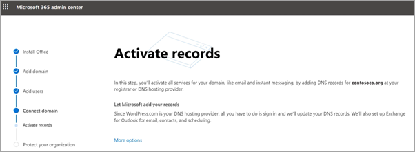

# 在安裝精靈中設定 Microsoft 365 商務版 PremiumSet up Microsoft 365 Business Premium in the setup wizard

請觀看這段影片，以取得 Microsoft 365 商務版特優設定的概要。Watch this video for an overview of Microsoft 365 Business Premium setup.  

> [!VIDEO https://www.microsoft.com/videoplayer/embed/RE1FYSM] 

如果您覺得這段影片很有幫助，請查看[適用於小型企業和 Microsoft 365 新手的完整訓練系列](https://support.microsoft.com/office/6ab4bbcd-79cf-4000-a0bd-d42ce4d12816)。If you found this video helpful, check out the [complete training series for small businesses and those new to Microsoft 365](https://support.microsoft.com/office/6ab4bbcd-79cf-4000-a0bd-d42ce4d12816).

## 新增您的網域、使用者及設定原則Add your domain, users, and set up policies

當您購買 Microsoft 365 商務版特優功能時，您可以選擇使用您擁有的網域，或在[註冊](sign-up.md)期間購買一個網域。When you purchase Microsoft 365 Business Premium, you have the option of using a domain you own, or buying one during the [sign-up](sign-up.md).

- 如果您在註冊時購買新的網域，則您的網域全都都已設定完畢，您可以移至 [新增使用者並指派授權](#add-users-and-assign-licenses)。If you purchased a new domain when you signed up, your domain is all set up and you can move to [Add users and assign licenses](#add-users-and-assign-licenses).

### 新增您的網域以個人化登入Add your domain to personalize sign-in

1. 使用您的全域系統管理員認證登入 [Microsoft 365 系統管理中心](https://admin.microsoft.com)。Sign in to [Microsoft 365 admin center](https://admin.microsoft.com) by using your global admin credentials. 

2. 請選擇 **[移至設定]** 來啟動精靈。Choose **Go to setup** to start the wizard.

    ![選取 [移至設定]。](../media/gotosetupinadmincenter.png)

3. 在 **[安裝您的 Office 應用程式]** 頁面上，您可以選擇將應用程式安裝到自己的電腦上。On the **Install your Office apps** page, you can optionally install the apps on your own computer.
    
4. 在 **[新增網域]** 步驟中，輸入您要使用的網域名城（例如 contoso.com）。In the **Add domain** step, enter the domain name you want to use (like contoso.com).

    > [!IMPORTANT]
    > 如果您在註冊時購買了網域，就不會在此看到 **[新增網域]** 步驟。If you purchased a domain during the sign-up, you will not see **Add a domain** step here. 改移至 [[新增使用者]](#add-users-and-assign-licenses)。Go to [Add users](#add-users-and-assign-licenses) instead.

    

    
4. 依照嚮導中的步驟，在任何可驗證您擁有網域之[Microsoft 365 的 dns 主機服務提供者中建立 dns 記錄](https://docs.microsoft.com/office365/admin/get-help-with-domains/create-dns-records-at-any-dns-hosting-provider)。Follow the steps in the wizard to [Create DNS records at any DNS hosting provider for Microsoft 365](https://docs.microsoft.com/office365/admin/get-help-with-domains/create-dns-records-at-any-dns-hosting-provider) that verifies you own the domain. 如果您知道您的網域主機，請參閱 [[主機特定指示]](https://docs.microsoft.com/office365/admin/get-help-with-domains/set-up-your-domain-host-specific-instructions)。If you know your domain host, see also the [host specific instructions](https://docs.microsoft.com/office365/admin/get-help-with-domains/set-up-your-domain-host-specific-instructions).

    如果您的主機服務供應商是 GoDaddy 或透過 [[網域連結]](https://docs.microsoft.com/office365/admin/get-help-with-domains/domain-connect) 所啟用的另一個主機，這個過程便會很簡單，您自動便會被要求登入，並讓 Microsoft 替您進行驗證。If your hosting provider is GoDaddy or another host enabled with [domain connect](https://docs.microsoft.com/office365/admin/get-help-with-domains/domain-connect), the process is easy and you'll be automatically asked to sign in and let Microsoft authenticate on your behalf.

    ![在 GoDaddy 確認存取頁面上，選取 [授權]。](../media/godaddyauth.png)

### 新增使用者並指派授權Add users and assign licenses

您可以在精靈中新增使用者，或稍後在系統管理中心[[新增使用者]](add-users-m365b.md)。You can add users in the wizard, but you can also [add users later](add-users-m365b.md) in the admin center. 此外，如果您有本機網域控制站，您可以使用 [Azure AD Connect](https://docs.microsoft.com/azure/active-directory/hybrid/how-to-connect-install-express)新增使用者。Additionally, if you have a local domain controller, you can add users with [Azure AD Connect](https://docs.microsoft.com/azure/active-directory/hybrid/how-to-connect-install-express).

#### 在精靈中新增使用者Add users in the wizard

您在嚮導中新增的任何使用者會自動指派 Microsoft 365 商務版優質授權。Any users you add in the wizard get automatically assigned a Microsoft 365 Business Premium license.

![嚮導中 [新增使用者] 頁面的螢幕擷取畫面](../media/addnewuserspage.png)

1. 如果您的 Microsoft 365 商務版訂閱有現有的使用者（例如，如果您使用 Azure AD Connect），您可以選擇立即將授權指派給他們。If your Microsoft 365 Business Premium subscription has existing users (for example, if you used Azure AD Connect), you get an option to assign licenses to them now. 請繼續進行，為他們新增授權。Go ahead and add licenses to them as well.

2. 新增使用者之後，您也會看到與您新增之使用者共用認證的選項。After you've added the users, you'll also get an option to share credentials with the new users you added. 您可以選擇列印認證、透過電子郵件傳送認證，或是下載認證。You can choose to print them out, email them, or download them.

### 連接您的網域Connect your domain

> [!NOTE]
> 如果您選擇使用 onmicrosoft 網域，或使用 Azure AD Connect 來設定使用者，您將不會看到此步驟。If you chose to use the .onmicrosoft domain, or used Azure AD Connect to set up users, you will not see this step.
  
若要設定服務，您必須更新 DNS 主機或網域註冊機構中的某些記錄。To set up services, you have to update some records at your DNS host or domain registrar.
  
1. 設定精靈通常會偵測您的註冊機構，並提供您一個逐步指示連結，讓您更新在註冊機構網站上的 NS 記錄。The setup wizard typically detects your registrar and gives you a link to step-by-step instructions for updating your NS records at the registrar website. 如果不是，請[將名稱伺服器變更為設定 Microsoft 365 與任何網域註冊機構](https://docs.microsoft.com/microsoft-365/admin/get-help-with-domains/change-nameservers-at-any-domain-registrar)。If it doesn't, [Change nameservers to set up Microsoft 365 with any domain registrar](https://docs.microsoft.com/microsoft-365/admin/get-help-with-domains/change-nameservers-at-any-domain-registrar). 

    - 如果您有現有的 DNS 記錄，例如現有網站，但您的 DNS 主機已啟用 [網域連線](https://docs.microsoft.com/office365/admin/get-help-with-domains/domain-connect)，請選擇 **[為我新增記錄]**。If you have existing DNS records, for example an existing web site, but your DNS host is enabled for [domain connect](https://docs.microsoft.com/office365/admin/get-help-with-domains/domain-connect), choose **Add records for me**. 在 **[選擇您的線上服務]** 頁面，接受所有預設值，並選擇 **[下一步]**，然後在您的 DNS 主機頁面上選擇 **[授權]**。On the **Choose your online services** page, accept all the defaults, and choose **Next**, and choose **Authorize** on your DNS host's page.
    - 如果您的現有 DNS 記錄中有其他 DNS 主機(該主機無法用於網域連線)，您最好能自己管理自己的 DNS 記錄，以確保現有服務保持連線。If you have existing DNS records with other DNS hosts (not enabled for domain connect), you'll want to manage your own DNS records to make sure the existing services stay connected. 如需詳細資訊，請參閱 [網域基本資訊](https://docs.microsoft.com/office365/admin/get-help-with-domains/dns-basics)。See [domain basics](https://docs.microsoft.com/office365/admin/get-help-with-domains/dns-basics) for more info.

        

2. 按照精靈中的步驟進行，系統會為您設定電子郵件及其他服務。Follow the steps in the wizard and email and other services will be set up for you.

### 保護您的組織Protect your organization 

您在嚮導中設定的原則會自動套用至稱為「*所有使用者*」的[安全性群組](https://docs.microsoft.com/office365/admin/create-groups/compare-groups#security-groups)。The policies you set up in the wizard are applied automatically to a [Security group](https://docs.microsoft.com/office365/admin/create-groups/compare-groups#security-groups) called *All Users*. 您也可以在系統管理中心建立其他群組，以指派原則。You can also create additional groups to assign policies to in the admin center.

1. 在 [**加強來自高級網路威脅的保護**] 中，建議您接受預設值，讓[Office 365 的高級威脅防護](https://docs.microsoft.com/microsoft-365/security/office-365-security/office-365-atp)掃描 office 應用程式中的檔案和連結。On the **Increase protection from advanced cyber threats**, it is recommended that you accept the defaults to let [Office 365 Advance Threat Protection](https://docs.microsoft.com/microsoft-365/security/office-365-security/office-365-atp) scan files and links in Office apps.

    ![[增加保護] 頁面的螢幕擷取畫面。](../media/increasetreatprotection.png)

2. 在 [**防止敏感性資料洩漏**] 頁面上，接受預設值以開啟 Office 365 資料遺失防護（DLP）以追蹤 office 應用程式中的機密資料，並防止在組織外意外共用這些資料。On the **Prevent leaks of sensitive data** page, accept the defaults to turn on Office 365 Data Loss Prevention (DLP) to track sensitive data in Office apps and prevent the accidental sharing of these outside your organization.

3. 在 [**保護**行動裝置中的資料] 頁面上，將行動應用程式管理留給 [開啟]，展開設定並加以檢查，然後選取 [建立行動裝置**應用程式管理原則**]。On the **Protect data in Office for mobile** page, leave mobile app management on, expand the settings and review them, and then select **Create mobile app management policy**.

    ![在 [行動裝置] 頁面中保護資料的螢幕擷取畫面。](../media/protectdatainmobile.png)

## 保護 Windows 10 電腦Secure Windows 10 PCs

在左導覽上，選取 [**安裝**]，然後在 [登**入和安全性**] 下，選擇 [**保護您的 Windows 10 電腦**]。On the left nav, select **Setup** and then, under **Sign-in and security**, choose **Secure your Windows 10 computers**. 選擇 [View] （**查看**）立即開始。Choose **View** to get started. 請參閱[保護您的 Windows 10 電腦](secure-win-10-pcs.md)以取得完整的指示。See [secure your Windows 10 computers](secure-win-10-pcs.md) for complete instructions.

## 部署 Office 365 用戶端應用程式Deploy Office 365 client apps

如果您選擇在設定期間自動安裝 Office 應用程式，當使用者從 Windows 裝置登入 Azure AD 時，將會在 Windows 10 裝置上安裝應用程式，並使用其工作認證。If you chose to automatically install Office apps during setup, the apps will install on the Windows 10 devices once the users have signed in to Azure AD from their Windows devices, using their work credentials.

若要在行動裝置 iOS 或 Android 裝置上安裝 Office，請參閱為[Microsoft 365 商務版使用者設定行動裝置](set-up-mobile-devices.md)。To install Office on mobile iOS or Android devices, see [Set up mobile devices for Microsoft 365 Business Premium users](set-up-mobile-devices.md).

您也可以個別安裝 Office。You can also install Office individually. 請參閱[在 PC 或 Mac 上安裝 Office](https://support.microsoft.com/office/4414eaaf-0478-48be-9c42-23adc4716658)以取得指示。See [install Office on a PC or Mac](https://support.microsoft.com/office/4414eaaf-0478-48be-9c42-23adc4716658) for instructions.

## 請參閱See also

[商務用 Microsoft 365 訓練影片Microsoft 365 for business training videos](https://support.microsoft.com/office/6ab4bbcd-79cf-4000-a0bd-d42ce4d12816)
