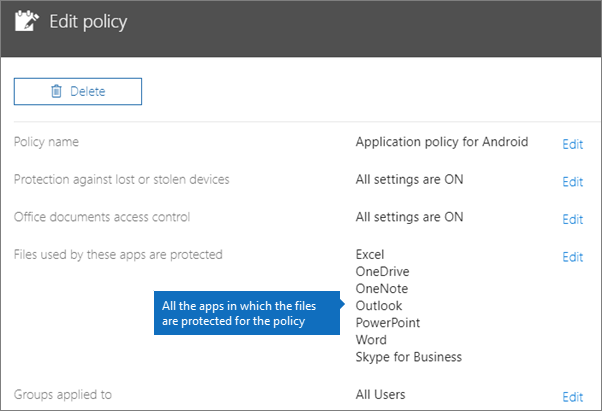
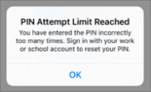

# 驗證 Android 或 iOS 裝置上的 app 保護設定

請遵循下列各節中的指示來驗證 Android 或 iOS 裝置上的 app 保護設定。
  
## Android
  
### 檢查使用者裝置上所運作的 app 保護設定

在您[設定 Android 裝置的 App 設定](app-protection-settings-for-android-and-ios.md)以保護 App 後，可以按照這些步驟驗證您選擇的設定是否可正常運作。 
  
首先，請確定將原則套用至您即將來進行驗證的應用程式。
  
1. 在 Microsoft 365 商務版[系統管理中心](https://portal.office.com)中，移至 [**原則** \> **編輯原則**。
    
2. 對於您建立安裝程式，在設定] 或 [另一個原則，您建立，並確認它強制執行該針對 Outlook，例如，選擇 [ **Android 版的應用程式原則**。 
    
    
  
### 檢查 [需要 PIN 或指紋才能存取 Office App] 設定

在 [**編輯原則**] 窗格中，選擇旁的 [**編輯** **Office 文件存取控制**，依序展開 [**管理使用者如何存取行動裝置上的 Office 檔案**，並確定，**需要 PIN 或指紋才能存取 Office app**設為**上**。
  

  
1. 在使用者的 Android 裝置中，開啟 Outlook 並以使用者的 Microsoft 365 商務版認證登入。
    
2. 系統也會提示您輸入的 pin 碼，或使用指紋。
    
    
  
### 驗證 [嘗試失敗幾次之後重設 PIN ] 設定

在 [**編輯原則**] 窗格中，選擇旁的 [**編輯** **Office 文件存取控制**，依序展開 [**管理使用者如何存取行動裝置上的 Office 檔案**，並確定，**重設 PIN 的天數之後失敗的嘗試**設為某個數字。 這是預設值為 5。 
  
1. 在使用者的 Android 裝置中，開啟 Outlook 並以使用者的 Microsoft 365 商務版認證登入。
    
2. 根據原則指定的次數重複輸入不正確的 PIN。 您會看到提示，指出**已達到 PIN 嘗試限制**重設 pin 碼。 
    
    
  
3. 按下 [**重設 pin 碼**]。 您將提示以使用者的 Microsoft 365 商務版認證登入，然後才能設定新的 pin 碼。
    
### 驗證 [強制使用者將所有工作檔案儲存到商務用 OneDrive] 設定

在 [**編輯原則**] 窗格中，選擇**防範遺失或遭竊的裝置**旁邊的 [**編輯**、 展開**裝置遺失或遭竊時保護工作檔案**，並確定，**強制使用者將儲存到商務用 OneDrive 的所有工作檔案**設為**上**。
  

  
1. 在使用者的 Android 裝置中，開啟 Outlook 並以使用者的 Microsoft 365 商務版認證登入及輸入 PIN (如果系統要求的話)。
    
2. 開啟包含附件的電子郵件，然後點選附件資訊旁邊的向下箭號圖示。
    
    
  
    您會看到**無法儲存到裝置**上螢幕底部。 
    
    
  
    > [!NOTE]
    > 目前 Android 裝置無法儲存到商務用 OneDrive，因此您只會看到本機儲存已遭到封鎖。 
  
### 驗證 [Office App 閒置這段時間之後要求使用者重新登入] 設定

在 [**編輯原則**] 窗格中，選擇旁的 [**編輯** **Office 文件存取控制**，依序展開 [**管理使用者如何存取行動裝置上的 Office 檔案**，並確定，**要求使用者重新登入之後 Office app 閒置的**設為分鐘數。 這是預設的 30 分鐘。 
  
1. 在使用者的 Android 裝置中，開啟 Outlook 並以使用者的 Microsoft 365 商務版認證登入及輸入 PIN (如果系統要求的話)。
    
2. 現在，您應該會看到 Outlook 的收件匣。請不要觸控 Android 裝置至少 30 分鐘 (或是其他比您在原則中指定的時間還要久的時間長度)。裝置畫面會變暗。
    
3. 在 Android 裝置上存取 Outlook。
    
4. 系統會提示您輸入 pin 碼，您可以再次存取 Outlook 之前。
    
### 驗證 [使用加密保護工作檔案] 設定

在 [**編輯原則**] 窗格中，選擇**防範遺失或遭竊的裝置**旁邊的 [**編輯**、 展開**裝置遺失或遭竊時保護工作檔案**，並確定**使用加密保護工作檔案**設為**上**，並**強制使用者將儲存到商務用 OneDrive 的所有工作檔案**設為**關閉**。
  
1. 在使用者的 Android 裝置中，開啟 Outlook 並以使用者的 Microsoft 365 商務版認證登入及輸入 PIN (如果系統要求的話)。
    
2. 開啟包含幾個影像檔案附件的電子郵件。
    
3. 點選附件資訊旁邊的向下箭號圖示以儲存附件。
    
    
  
4. 系統可能會提示您允許 Outlook 存取裝置上的相片、媒體和檔案。 點選 [**允許**]。
    
5. 在畫面底端，選擇 [儲存**至裝置**，然後再開啟 [**圖片庫**] app。 
    
6. 您應該會在清單中看到一張經過加密的相片 (或數張相片，如果您儲存了多個影像檔案附件的話)。這張相片可能會在 [圖片] 清單中顯示為灰色的方形，中央有以白色圓圈包住的白色驚嘆號。
    
    
  
## iOS
  
### 檢查使用者裝置上的 App 保護設定是否可正常運作

在您[設定 iOS 裝置的 App 設定](app-protection-settings-for-android-and-ios.md)以保護 App 後，可以按照這些步驟驗證您選擇的設定是否可正常運作。 
  
首先，請確定將原則套用至您即將來進行驗證的應用程式。
  
1. 在 Microsoft 365 商務版[系統管理中心](https://portal.office.com)中，移至 [**原則** \> **編輯原則**。
    
2. 對於您建立安裝程式，在設定] 或 [另一個原則，您建立，並確認它強制執行該 outlook，例如，選擇 [ **iOS 版的應用程式原則**。 
    
    
  
### 驗證 [設定需要 PIN 才能存取 Office App] 設定

在 [**編輯原則**] 窗格中，選擇旁的 [**編輯** **Office 文件存取控制**，依序展開 [**管理使用者如何存取行動裝置上的 Office 檔案**，並確定，**需要 PIN 或指紋才能存取 Office app**設為**上**。
  

  
1. 在使用者的 iOS 裝置中，開啟 Outlook 並以使用者的 Microsoft 365 商務版認證登入。
    
2. 系統也會提示您輸入的 pin 碼，或使用指紋。
    
    
  
### 驗證 [嘗試失敗幾次之後重設 PIN ] 設定

在 [**編輯原則**] 窗格中，選擇旁的 [**編輯** **Office 文件存取控制**，依序展開 [**管理使用者如何存取行動裝置上的 Office 檔案**，並確定，**重設 PIN 的天數之後失敗的嘗試**設為某個數字。 這是預設值為 5。 
  
1. 在使用者的 iOS 裝置中，開啟 Outlook 並以使用者的 Microsoft 365 商務版認證登入。
    
2. 根據原則指定的次數重複輸入不正確的 PIN。 您會看到提示，指出**已達到 PIN 嘗試限制**重設 pin 碼。 
    
    
  
3. 按 **[確定]**。 您將提示以使用者的 Microsoft 365 商務版認證登入，然後才能設定新的 pin 碼。
    
### 驗證 [強制使用者將所有工作檔案儲存到商務用 OneDrive] 設定

在 [**編輯原則**] 窗格中，選擇**防範遺失或遭竊的裝置**旁邊的 [**編輯**、 展開**裝置遺失或遭竊時保護工作檔案**，並確定，**強制使用者將儲存到商務用 OneDrive 的所有工作檔案**設為**上**。
  

  
1. 在使用者的 iOS 裝置中，開啟 Outlook 並以使用者的 Microsoft 365 商務版認證登入及輸入 PIN (如果系統要求的話)。
    
2. 開啟包含附件的電子郵件、 開啟附件，並選擇畫面底部的 [**儲存**。 
    
    
  
3. 您應該只會看到一個適用於商務用 OneDrive 的選項。 如果沒有，請點選 [**新增帳戶**，然後從 [**新增儲存體帳戶**] 畫面中選取 [**商務用 OneDrive** 。 在系統提示時提供使用者的 Microsoft 365 商務版以登入。 
    
    點選 [**儲存**]，然後選取 [**商務用 OneDrive**。
    
### 驗證 [Office App 閒置這段時間之後要求使用者重新登入] 設定

在 [**編輯原則**] 窗格中，選擇旁的 [**編輯** **Office 文件存取控制**，依序展開 [**管理使用者如何存取行動裝置上的 Office 檔案**，並確定，**要求使用者重新登入之後 Office app 閒置的**設為分鐘數。 這是預設的 30 分鐘。 
  
1. 在使用者的 iOS 裝置中，開啟 Outlook 並以使用者的 Microsoft 365 商務版認證登入及輸入 PIN (如果系統要求的話)。
    
2. 現在，您應該會看到 Outlook 的收件匣。請不要觸控 iOS 裝置至少 30 分鐘 (或是其他比您在原則中指定的時間還要久的時間長度)。裝置畫面會變暗。
    
3. 在 iOS 裝置上存取 Outlook。
    
4. 系統會提示您輸入 pin 碼，您可以再次存取 Outlook 之前。
    
### 驗證 [使用加密保護工作檔案] 設定

在 [**編輯原則**] 窗格中，選擇**防範遺失或遭竊的裝置**旁邊的 [**編輯**、 展開**裝置遺失或遭竊時保護工作檔案**，並確定**使用加密保護工作檔案**設為**上**，並**強制使用者將儲存到商務用 OneDrive 的所有工作檔案**設為**關閉**。
  
1. 在使用者的 iOS 裝置中，開啟 Outlook 並以使用者的 Microsoft 365 商務版認證登入及輸入 PIN (如果系統要求的話)。
    
2. 開啟包含幾個影像檔案附件的電子郵件。
    
3. 點選附件，然後點選 [**儲存**] 選項。 
    
4. 從主畫面開啟**相片**」 app。 您應該會看到一張經過加密的相片被儲存 (或數張相片，如果您儲存多個影像檔案附件的話)。 
    
---

