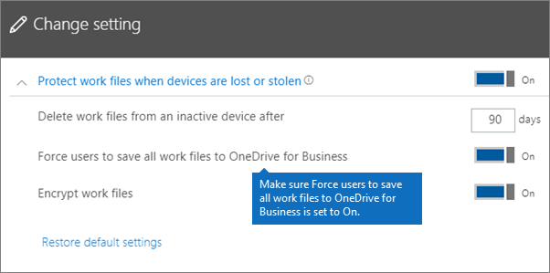
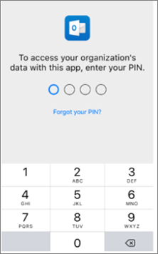

# 驗證 Android 或 iOS 裝置上的應用程式保護設定

依照下列各節中的指示驗證 Android 或 iOS 裝置上的應用程式保護設定。
  
## Android
  
### 檢查使用者裝置上的應用程式保護設定是否正常運作

在您[設定 Android 裝置的 App 設定](app-protection-settings-for-android-and-ios.md)以保護 App 後，可以按照這些步驟驗證您選擇的設定是否可正常運作。 
  
首先，請確定原則套用至您要驗證的應用程式。
  
1. 在 Microsoft 365 商務進階版系統 [管理中心](https://portal.office.com)，移至 [**原則**] [ \> **編輯原則**]。
    
2. 針對安裝時所建立的設定，選擇 [ **Android 應用程式原則**]，或選擇您建立的其他原則，然後驗證是否強制執行 Outlook，例如。 
    
    
  
### 檢查 [需要 PIN 或指紋才能存取 Office App] 設定

在 [**編輯原則**] 窗格中，選擇 [ **Office 檔存取控制**] 旁的 [**編輯**]，然後展開 [**管理使用者存取行動裝置上 Office** 檔案的方式]，並確定 **需要 PIN 或指紋才能存取 Office 應用程式** 設定為 [**開啟**]。
  
![請確定 [需要 PIN 或指紋才能存取 Office 應用程式] 設定為 [開啟]。](../media/f37eb5b2-7e26-49fb-9bd6-d955d196bacf.png)
  
1. 在使用者的 Android 裝置中，開啟 Outlook，並以使用者的 Microsoft 365 商務進階版認證登入。
    
2. 系統也會提示您輸入 PIN 或使用指紋。
    
    
  
### 驗證 [嘗試失敗幾次之後重設 PIN ] 設定

在 [**編輯原則**] 窗格中，選擇 [ **Office 檔存取控制**] 旁的 [**編輯**]，然後展開 [**管理使用者存取行動裝置上 Office** 檔案的方式]，並確定在 [失敗嘗試次數] 設定為 [一定] 數位 **後重設 PIN 碼失敗**。 預設為5。 
  
1. 在使用者的 Android 裝置中，開啟 Outlook，並以使用者的 Microsoft 365 商務進階版認證登入。
    
2. 根據原則指定的次數重複輸入不正確的 PIN。 您會看到一則提示，指出已 **接通 Pin 嘗試限制** 以重設 pin 碼。 
    
    
  
3. 按下 [ **重設 PIN**]。 系統會提示您使用使用者的 Microsoft 365 商務進階版認證進行登入，然後必須設定新的 PIN 碼。
    
### 驗證 [強制使用者將所有工作檔案儲存到商務用 OneDrive] 設定

在 [**編輯原則**] 窗格中，選擇 [防止 **遺失或被盜裝置防護**] 旁的 [**編輯**]，然後在 **裝置遺失或遭竊時展開 [保護工作檔**]，並確定 [**強制使用者將所有工作檔案儲存至商務用 OneDrive** ] 設定為 [**開啟**]。
  

  
1. 在使用者的 Android 裝置中，開啟 Outlook，並以使用者的 Microsoft 365 商務進階版認證登入，並視需要輸入 PIN 碼。
    
2. 開啟包含附件的電子郵件，然後點選附件資訊旁邊的向下箭號圖示。
    
    
  
    您將會看到畫面底部 **無法儲存至裝置** 。 
    
    
  
    > [!NOTE]
    > 目前 Android 裝置無法儲存到商務用 OneDrive，因此您只會看到本機儲存已遭到封鎖。 
  
### 驗證 [Office App 閒置這段時間之後要求使用者重新登入] 設定

在 [**編輯原則**] 窗格中，選擇 [ **Office 檔存取控制**] 旁的 [**編輯**]，然後展開 [**管理使用者存取行動裝置上 Office** 檔案的方式]，並確定 **Office 已閒置的應用程式中，需要使用者重新登入**，且已設定為數分鐘的時間。 預設為30分鐘。 
  
1. 在使用者的 Android 裝置中，開啟 Outlook，並以使用者的 Microsoft 365 商務進階版認證登入，並視需要輸入 PIN 碼。
    
2. 現在，您應該會看到 Outlook 的收件匣。請不要觸控 Android 裝置至少 30 分鐘 (或是其他比您在原則中指定的時間還要久的時間長度)。裝置畫面會變暗。
    
3. 在 Android 裝置上重新存取 Outlook。
    
4. 您必須先輸入 PIN 碼，才能再存取 Outlook。
    
### 驗證 [使用加密保護工作檔案] 設定

在 [**編輯原則**] 窗格中，選擇 [**針對遺失或被盜的裝置加以防護**] 旁邊的 [**編輯**]，然後在 **裝置遺失或遭竊時** 展開 [保護工作檔]，並確定 [**保護具有加密的工作** 檔] 已設為 [**開啟**]，然後 **強制使用者將所有工作檔案儲存到商務用 OneDrive** 已設定為 [**關閉**]。
  
1. 在使用者的 Android 裝置中，開啟 Outlook，並以使用者的 Microsoft 365 商務進階版認證登入，並視需要輸入 PIN 碼。
    
2. 開啟包含一些影像檔附件的電子郵件。
    
3. 點選附件資訊旁邊的向下箭號圖示以儲存附件。
    
    
  
4. 系統可能會提示您允許 Outlook 存取裝置上的相片、媒體和檔案。 按 [ **允許**]。
    
5. 在螢幕底部，選擇 [ **儲存至裝置** ]，然後開啟 **圖庫** 應用程式。 
    
6. 您應該會在清單中看到一張經過加密的相片 (或數張相片，如果您儲存了多個影像檔案附件的話)。這張相片可能會在 [圖片] 清單中顯示為灰色的方形，中央有以白色圓圈包住的白色驚嘆號。
    
    
  
## iOS
  
### 檢查使用者裝置上的 App 保護設定是否可正常運作

在您[設定 iOS 裝置的 App 設定](app-protection-settings-for-android-and-ios.md)以保護 App 後，可以按照這些步驟驗證您選擇的設定是否可正常運作。 
  
首先，請確定原則套用至您要驗證的應用程式。
  
1. 在 Microsoft 365 商務進階版系統 [管理中心](https://portal.office.com)，移至 [**原則**] [ \> **編輯原則**]。
    
2. 針對安裝時所建立的設定，選擇 **iOS 的應用程式原則**，或選擇您建立的其他原則，然後在 Outlook 中驗證是否強制執行。 
    
    
  
### 驗證 [設定需要 PIN 才能存取 Office App] 設定

在 [**編輯原則**] 窗格中，選擇 [ **Office 檔存取控制**] 旁的 [**編輯**]，然後展開 [**管理使用者存取行動裝置上 Office** 檔案的方式]，並確定 **需要 PIN 或指紋才能存取 Office 應用程式** 設定為 [**開啟**]。
  
![請確定 [需要 PIN 或指紋才能存取 Office 應用程式] 設定為 [開啟]。](../media/f37eb5b2-7e26-49fb-9bd6-d955d196bacf.png)
  
1. 在使用者的 iOS 裝置中，開啟 Outlook 並以使用者的 Microsoft 365 商務進階版認證登入。
    
2. 系統也會提示您輸入 PIN 或使用指紋。
    
    
  
### 驗證 [嘗試失敗幾次之後重設 PIN ] 設定

在 [**編輯原則**] 窗格中，選擇 [ **Office 檔存取控制**] 旁的 [**編輯**]，然後展開 [**管理使用者存取行動裝置上 Office** 檔案的方式]，並確定在 [失敗嘗試次數] 設定為 [一定] 數位 **後重設 PIN 碼失敗**。 預設為5。 
  
1. 在使用者的 iOS 裝置中，開啟 Outlook 並以使用者的 Microsoft 365 商務進階版認證登入。
    
2. 根據原則指定的次數重複輸入不正確的 PIN。 您會看到一則提示，指出已 **接通 Pin 嘗試限制** 以重設 pin 碼。 
    
    
  
3. 按 **[確定]**。 系統會提示您使用使用者的 Microsoft 365 商務進階版認證進行登入，然後必須設定新的 PIN 碼。
    
### 驗證 [強制使用者將所有工作檔案儲存到商務用 OneDrive] 設定

在 [**編輯原則**] 窗格中，選擇 [防止 **遺失或被盜裝置防護**] 旁的 [**編輯**]，然後在 **裝置遺失或遭竊時展開 [保護工作檔**]，並確定 [**強制使用者將所有工作檔案儲存至商務用 OneDrive** ] 設定為 [**開啟**]。
  

  
1. 在使用者的 iOS 裝置中，開啟 Outlook 並以使用者的 Microsoft 365 商務進階版認證登入，並視需要輸入 PIN 碼。
    
2. 開啟包含附件的電子郵件，開啟附件，然後選擇畫面底部的 [ **儲存** ]。 
    
    
  
3. 您應該只會看到一個適用於商務用 OneDrive 的選項。 如果不是，請點擊 [**新增帳戶**]，然後從 [**新增儲存體帳戶**] 畫面中選取 [**商務用 OneDrive** ]。 當系統提示時，提供使用者的 Microsoft 365 商務進階版登入。 
    
    按一下 [**儲存**]，然後選取 [**商務用 OneDrive**]。
    
### 驗證 [Office App 閒置這段時間之後要求使用者重新登入] 設定

在 [**編輯原則**] 窗格中，選擇 [ **Office 檔存取控制**] 旁的 [**編輯**]，然後展開 [**管理使用者存取行動裝置上 Office** 檔案的方式]，並確定 **Office 已閒置的應用程式中，需要使用者重新登入**，且已設定為數分鐘的時間。 預設為30分鐘。 
  
1. 在使用者的 iOS 裝置中，開啟 Outlook 並以使用者的 Microsoft 365 商務進階版認證登入，並視需要輸入 PIN 碼。
    
2. 現在，您應該會看到 Outlook 的收件匣。請不要觸控 iOS 裝置至少 30 分鐘 (或是其他比您在原則中指定的時間還要久的時間長度)。裝置畫面會變暗。
    
3. 再次存取 iOS 裝置上的 Outlook。
    
4. 您必須先輸入 PIN 碼，才能再存取 Outlook。
    
### 驗證 [使用加密保護工作檔案] 設定

在 [**編輯原則**] 窗格中，選擇 [**針對遺失或被盜的裝置加以防護**] 旁邊的 [**編輯**]，然後在 **裝置遺失或遭竊時** 展開 [保護工作檔]，並確定 [**保護具有加密的工作** 檔] 已設為 [**開啟**]，然後 **強制使用者將所有工作檔案儲存到商務用 OneDrive** 已設定為 [**關閉**]。
  
1. 在使用者的 iOS 裝置中，開啟 Outlook 並以使用者的 Microsoft 365 商務進階版認證登入，並視需要輸入 PIN 碼。
    
2. 開啟包含一些影像檔附件的電子郵件。
    
3. 點擊附件，然後點擊它底下的 [ **儲存** ] 選項。 
    
4. 從主畫面開啟 **相片** 應用程式。 您應該會看到一張經過加密的相片被儲存 (或數張相片，如果您儲存多個影像檔案附件的話)。 
    
---

