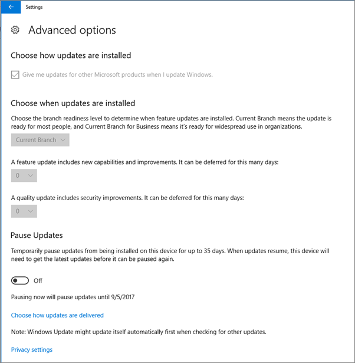

# 驗證 Windows 10 電腦上的裝置保護設定Validate device protection settings on Windows 10 PCs

## 請確認已設定 Windows 10 裝置原則Verify that Windows 10 device policies are set

之後您[設定裝置原則](protection-settings-for-windows-10-pcs.md)，可能會佔用的原則至使用者的裝置上生效的幾個小時。After you [set up devices policies](protection-settings-for-windows-10-pcs.md), it may take up to a few hours for the policy to take effect on users' devices. 您可以確認原則所需的效果，來查看使用者的裝置上的各種 Windows 設定畫面。You can confirm that the policies took effect by looking at various Windows Settings screens on the users' devices. 因為使用者無法修改其 Windows 10 裝置上的 Windows 更新] 和 [Windows Defender 防毒軟體設定，有許多選項將會變為灰色。Because the users won't be able to modify the Windows Update and Windows Defender Antivirus settings on their Windows 10 devices, many options will be grayed out.
  
1. 移至 [**設定** \> **更新&amp;安全性** \> **Windows Update** \> **重新啟動選項**，並確認所有設定呈現都灰色。Go to **Settings** \> **Update &amp; security** \> **Windows Update** \> **Restart options** and confirm that all settings are grayed out. 
    
    
  
2. 移至 [**設定** \> **更新&amp;安全性** \> **Windows Update** \> **進階選項]** ，並確認所有設定呈現都灰色。Go to **Settings** \> **Update &amp; security** \> **Windows Update** \> **Advanced options** and confirm that all settings are grayed out. 
    
    
  
3. 移至 [**設定** \> **更新&amp;安全性** \> **Windows Update** \> **進階選項** \> **選擇更新傳送的方式**。Go to **Settings** \> **Update &amp; security** \> **Windows Update** \> **Advanced options** \> **Choose how updates are delivered**.
    
    確認您可以看到的訊息 （以紅色），某些設定都是隱藏或受管理的組織，並且會變為灰色，所有選項。Confirm that you can see the message (in red) that some settings are hidden or managed by your organization, and all the options are grayed out.
    
    ![選擇 [更新傳送的方式設定都是隱藏或由組織管理] 頁面上會指示。](../media/6b3e37c5-da41-4afd-9983-b4f406216b59.png)
  
4. 若要開啟 [Windows Defender 資訊安全中心，移至 [**設定** \> **更新&amp;安全性** \> **Windows Defender** \>按一下 [**開啟 Windows defender 資訊安全中心** \> **病毒&amp;執行緒保護** \> **病毒&amp;威脅保護設定**。To open the Windows Defender Security Center, go to **Settings** \> **Update &amp; security** \> **Windows Defender** \> click **Open Windows Defender Security Center** \> **Virus &amp; thread protection** \> **Virus &amp; threat protection settings**. 
    
5. 確認所有選項呈現都灰色。Verify that all options are grayed out. 
    
    
  
## 相關主題Related Topics

[Microsoft 365 商務版文件和資源Microsoft 365 Business documentation and resources](https://go.microsoft.com/fwlink/p/?linkid=853701)
  
[開始使用 Microsoft 365 商務版Get started with Microsoft 365 Business](microsoft-365-business-overview.md)
  
[管理 Microsoft 365 商務版Manage Microsoft 365 Business](manage.md)
  
[設定適用於 Windows 10 電腦的裝置設定Set device configurations for Windows 10 PCs](protection-settings-for-windows-10-pcs.md)
  

