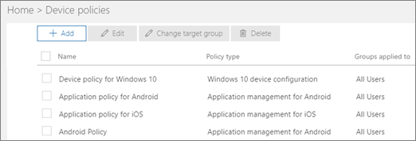

# 檢視原則和裝置View policies and devices

## 檢視裝置原則View device policies

1. 使用全域系統管理員認證登入 [Microsoft 365 商務版](https://portal.office.com)。Sign in to [Microsoft 365 Business](https://portal.office.com) with global admin credentials. 
    
2. 在左側導覽中，選擇 [**裝置** \> **原則** \> **新增**。On the left nav, choose **Devices** \> **Policies** \> **Add**.
    
    您可以在這個頁面上建立、編輯、變更目標群組或刪除原則。On this page you can create, edit, change target group, or delete a policy.
    
    
  
## 檢視裝置動作View device actions

1. 使用全域系統管理員認證登入 [Microsoft 365 商務版](https://portal.office.com)。Sign in to [Microsoft 365 Business](https://portal.office.com) with global admin credentials. 
    
2. 在系統管理中心中，在 [**裝置動作**] 卡片中，選擇 [**裝置動作**以開啟 [**裝置動作**] 頁面。In the admin center, on the **Device actions** card, choose **Device actions** to open the **Device actions** page. 
    
    您可以在這個頁面上選取一或多個裝置以及移除公司資料。針對您已設定裝置保護設定的 Windows 10 裝置，您也可以選擇將裝置重設成出廠預設值。On this page you can select one or more devices and either remove company data. For Windows 10 devices that you have set device protections settings for, you can also choose to reset the device to factory settings.
    
    
  
  

