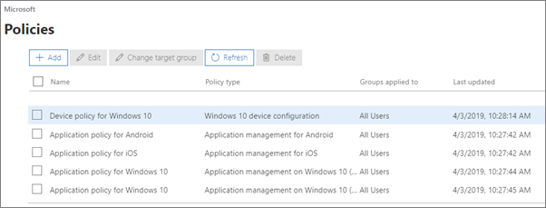

# 查看及管理原則和裝置View and manage policies and devices

[![[標籤] 可讓您知道系統管理中心正在變更，您可以在 aka.ms/aboutM365preview 取得更多詳細資料。](../media/m365admincenterchanging.png)](https://docs.microsoft.com/office365/admin/microsoft-365-admin-center-preview)

## 查看和編輯裝置原則View and edit device policies

1.  移至位於 <a href="https://go.microsoft.com/fwlink/p/?linkid=837890" target="_blank">https://admin.microsoft.com</a> 的系統管理中心。Go to the admin center at <a href="https://go.microsoft.com/fwlink/p/?linkid=837890" target="_blank">https://admin.microsoft.com</a>.
2. 在左側導覽中，選擇 [**裝置** \> **原則**]。On the left nav, choose **Devices** \> **Policies**.

    在此頁面上，您可以建立、編輯、變更目標群組或刪除原則。On this page, you can create, edit, change target group, or delete a policy.

    
  
## 查看和管理裝置View and manage devices

1. 在左側導覽上，選擇 [**裝置** \> **管理**]。On the left nav, choose **Devices** \> **Manage**. 
    
    在此頁面上，您可以選取一或多個裝置及移除公司資料。On this page, you can select one or more devices and remove company data. 針對您已設定裝置保護設定的 Windows 10 裝置，您也可以選擇將裝置重設成出廠預設值。For Windows 10 devices that you have set device protections settings for, you can also choose to reset the device to factory settings.
  
   

