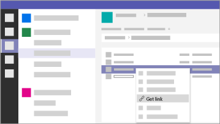

適用於小型企業和活動的 Microsoft 365
===========================

在我們現今的世界中，保持資料和通訊的安全是優先要務，醫療和法律實務、政治活動，以及許多其他小型企業尤其如此。 此解決方案提供一組建議，其設計可協助保護您和您的資料。 此文件庫包含設定及使用此建議環境的相關說明，而無論您的企業類型為何。

此設定包括下列用於生產力、共同作業、檔案儲存空間、電子郵件、裝置和身分識別的指導方針，以保護您的企業：

| 保護目標 | 描述 | 連結 |
| ----- | ----- | ----- | ----- |
|電子郵件 | 使用多重要素驗證、ATP 進階網路釣魚防護，以及 ATP 安全連結和安全附件，並對敏感性資訊使用加密的電子郵件。| [設定多重要素驗證](m365-campaigns-multifactor-authenication.md)、[防範網路釣魚攻擊](m365-campaigns-phishing-and-attacks.md)、[將敏感性電子郵件加密或加標籤](send-encrypted-email.md) |
|iPhone 和 Android 裝置 |使用多重要素驗證，設定 Microsoft 行動裝置應用程式，並要求 PIN 碼 | [設定多重要素驗證](m365-campaigns-multifactor-authenication.md)、[設定行動裝置](../business/set-up-mobile-devices.md?toc=/microsoft-365/campaigns/toc.json)|
|攜帶您自己的裝置 (BYOD) Mac 和 Windows 10 PC |讓 Office 保持最新、保持作業系統更新，並啟用安全性功能。 | [保護未受管理的 Windows 10 PC 和 Mac](m365-campaigns-protect-pcs-macs.md) |
|安全地儲存及共用檔案 | 從 Microsoft Teams、OneDrive、SharePoint 和 Microsoft Stream 共用檔案和影片，並保護敏感性資料。| [共用檔案和影片](share-files-and-videos.md) |
|受管理的 Windows 10 裝置 |讓重要員工使用受管理的裝置，並保護這些裝置。 | [設定受管理的裝置](../business/set-up-windows-devices.md?toc=/microsoft-365/campaigns/toc.json) |

Microsoft 365 商務版進階版的建議安全性設定
------------------------------------

此 Microsoft 365 商務進階版的建議安全設定可讓您：

- 依賴受信任的商務生產力和共同作業工具，例如 Outlook、Word、Excel 及其他 Office 產品。
- 您可以使用易於管理的企業級安全性功能，保護 iOS、Android 和 Windows 10 裝置上的所有工作檔案。
- 針對使用者帳戶和身分識別套用額外的保護。

> [!VIDEO https://www.microsoft.com/videoplayer/embed/RE3clbH]

雖然僅美國的聯邦和部分州選舉活動才符合 Microsoft 365 商務進階版的適用於活動的 Microsoft 365 方案[特殊價格](get-microsoft-365-campaigns.md)，但具備商務進階版方案的任何組織都可以利用本指導方針來設定加強的安全性，並了解如何安全地進行共同作業。

此文件庫包含以下各項：

- 新增安全性的說明性設定指導方針。
- 協助使用者設定裝置以進行安全存取。
- 如何安全地共同作業與共用的指導方針。

如需有關內含內容的詳細資訊，請參閱 [Microsoft 365 商務版](https://www.microsoft.com/microsoft-365/business)。

入門
--------------------------

請按照下列步驟開始使用：

- 針對活動：[取得 Microsoft 365 活動](get-microsoft-365-campaigns.md)
- 針對任何企業：[了解您的使用者將如何使用 Microsoft 365](m365-campaigns-users.md)
- 針對任何企業：[設定 Microsoft 365](microsoft-365-campaigns-setup-overview.md)

企業的解決方案
--------------------------

設定安全 Microsoft 365 環境之後，您可以使用下列解決方案進行工作：

| 建立共同作業小組 | 安排線上會議 |
| ------------- | ------------- |
|  |  |
| 與關鍵人員、所有人員以及合作夥伴或供應商的團隊共同作業。 [建立您的團隊](create-teams-for-collaboration.md) | 使用 Microsoft Teams 的音訊、影片和共用排程會議。 [安排會議](set-up-meetings.md) |

| 幫您的機密電子郵件加密或加上標籤 | 建立通訊網站 |
| ------------- | ------------- |
|  |  |
| 使用加密和敏感度標籤來保護內含機密或機密資訊的電子郵件。 [傳送加密的電子郵件](send-encrypted-email.md) | 在使用 SharePoint 建立的內部通訊網站中，與您的小組共用活動、訊息、影像等內容。 [建立您的網站](create-communications-site.md) |

| 共用檔案和影片 |
| ------------- |
|  |
| 將您的檔案和影片儲存到雲端，  以便所有適當的人員都能夠取得。 [開始共用](share-files-and-videos.md) |
