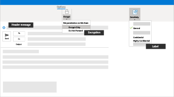

Microsoft 365 的活動
===========================

在目前的環境中, 保持資料和通訊安全是頭等大事, 特別是政治活動、醫療和法律作法, 以及許多其他公司。 Microsoft 365 for 商務工作隨附一組建議, 以協助保護您和您的資料。 此文件庫包含有關設定和使用此建議環境的說明, 即使您不是活動也是如此。

> [!VIDEO https://www.microsoft.com/videoplayer/embed/RE3clbH] 

**什麼是 Microsoft 365 的市場活動？** 建議的安全設定包括 Microsoft 365 商務版, 讓您能夠:
- 依賴信任的商務生產力和共同作業工具, 例如 Outlook、Word、Excel 和其他 Office 產品 
- 使用易於管理的企業級安全性, 保護所有 iOS、Android 和 Windows 10 裝置上的工作檔案 
- 對使用者帳戶和身分識別套用額外的保護 

雖然美國的聯邦版選舉活動符合 Microsoft 365 商務版的特殊價格, 但任何具有此計畫的組織都可以利用此指導方針來設定更高的安全性, 並瞭解如何安全地進行整合。

此程式庫包含下列專案:
- 新增安全性的規範性設定指引。
- 協助使用者設定裝置以進行安全存取。
- 如何安全地進行共同作業和共用的指引。

如需所包含專案的詳細資訊, 請參閱[Microsoft 365 Business](https://www.microsoft.com/microsoft-365/business)。 

開始使用
--------------------------

<ul class="panelContent cardsJ">
    <li>
        

            

                

                    

                        

                            
                        

                    

                    

                        
<b>請遵循下列步驟開始:</b>

                        
<a href="get-microsoft-365-campaigns.md">取得 Microsoft 365 活動</a>

                        
<a href="m365-campaigns-users.md">瞭解使用者將如何使用 Microsoft 365</a>

                        
<a href="microsoft-365-campaigns-setup-overview.md">設定 Microsoft 365 活動</a>

                    

                

            

        

    </li>
</ul>

您的活動或小型企業的解決方案
--------------------------

在您設定安全的 Microsoft 365 環境之後, 您可以使用下列解決方案來運作:

<ul class="panelContent cardsW cols cols2">
    <li>
        

            

                

                    

                        

                            
                        

                    

                    

                        <h3>建立共同作業小組</h3>
                        
使用 Microsoft 團隊的主要人員、所有員工及合作夥伴或廠商的特定小組進行通訊和共同作業的空間。

                        
<a href="create-teams-for-collaboration.md">建立您的小組</a>

                    

                

            

        

    </li>
    <li>
        

            

                

                    

                        

                            
                        

                    

                    

                        <h3>設定線上會議</h3>
                        
使用音訊、影片和 Microsoft 小組的共用來排程會議。

                        
<a href="set-up-meetings.md">設定會議</a>

                    

                

            

        

    </li>
    <li>
        

            

                

                    

                        

                            
                        

                    

                    

                        <h3>加密或標記您的機密電子郵件</h3>
                        
使用加密和敏感度標籤來保護包含機密或敏感資訊的電子郵件。

                        
<a href="send-encrypted-email.md">傳送加密的電子郵件</a>

                    

                

            

        

    </li>
    <li>
        

            

                

                    

                        

                            
                        

                    

                    

                        <h3>建立通訊網站</h3>
                        
在使用 SharePoint 建立的內部通訊網站中, 與您的小組共用事件、訊息、圖像等等。

                        
<a href="create-communications-site.md">建立您的網站</a>

                    

                

            

        

    </li>
    <li>
        

            

                

                    

                        

                            
                        

                    

                    

                        <h3>共用檔案和影片</h3>
                        
將檔案和影片儲存至雲端, 以供所有適當的人員使用。

                        
<a href="share-files-and-videos.md">開始共用</a>

                    

                

            

        

    </li>
</ul>
