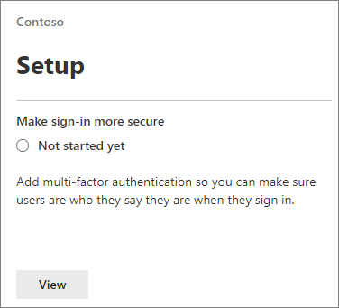

# 需要多重要素驗證和設定條件式存取原則

您的資料與多重要素驗證和條件式存取原則保護的存取。 這些增加大量額外的安全性。 Microsoft 對於所有客戶提供一組建議的比較基準條件式存取原則。 [比較基準原則是一組預先定義的原則，以協助保護組織免受許多常見的攻擊。 密碼噴灑、 重新顯示和網路釣魚，可以包含這些常見的攻擊。

這些原則需要系統管理員和使用者輸入驗證 （稱為多重要素驗證] 或 [MFA） 第二個表單時符合特定條件。 例如，如果您組織中的使用者嘗試從不同的國家/地區或未知的裝置，登入 Microsoft 365，登入小可能會被視為風險。 使用者必須提供額外的形式的驗證 （例如指紋或程式碼），以證明其身分識別。 

目前，基準原則包括下列：
- Microsoft 365 系統管理中心中設定：
    - **系統管理員需要 MFA** — 最小權限的系統管理員角色，包括全域系統管理員需要多重要素驗證。
    - **使用者保護**— 需要多重要素驗證的使用者，只有當時，登入風險。 
- 設定 Azure Active Directory 入口網站中：
    - **封鎖舊版驗證**— 較舊的用戶端應用程式和一些新的應用程式不使用較新、 更安全的驗證通訊協定。 這些較舊的應用程式可以略過條件式存取原則，且未經授權存取您的環境。 從用戶端不支援條件式存取此原則封鎖存取。 
    - **需要 MFA 的服務管理**-需要多重要素驗證管理工具]，包括 （在您設定基準原則） 的 Azure 入口網站的存取。 

Microsoft 建議您啟用所有的這些基準原則。 啟用這些原則之後，系統管理員和使用者將會提示註冊 Azure 多重要素驗證。

如需這些原則的詳細資訊，請參閱[什麼是基準原則](https://docs.microsoft.com/azure/active-directory/conditional-access/concept-baseline-protection)？

## 需要 MFA

若要要求所有使用者都登入識別碼的第二個表單：

1. 移至系統管理中心， <a href="https://go.microsoft.com/fwlink/p/?linkid=837890" target="_blank">https://admin.microsoft.com</a> ，然後選擇 [**安裝程式**。

2. 在 [設定] 頁面上選擇 [**產生登入更安全**卡中的**檢視**。

    
3. 在進行登入更安全] 頁面上，選擇 [**開始**]。
 
4. 在 [加強登入安全性] 窗格中，選取 [**需要系統管理員適用的多重要素驗證**，並**要求使用者註冊 multi-factor authentication 並封鎖存取，如果偵測到風險**] 旁的核取方塊。
    請務必從 MFA 需求**尋找使用者**] 方塊中排除[緊急](m365-campaigns-protect-admin-accounts.md#create-an-emergency-admin-account)或 「 中斷玻璃 「 系統管理員帳戶。
    
    ![加強登入安全性] 頁面。](../media/requiremfa.png)

5. 選擇 [上] 頁面底部的 [**建立原則**。

## [比較基準原則設定

1. 移至[Azure 入口網站](https://portal.azure.com)，然後再瀏覽至 [ **Azure Active Directory** \> **條件式存取**。
    
    比較基準原則會列出在頁面上，並且您所見，**需要 MFA 的系統管理員**和**使用者保護**已獲您完成中[需要 MFA](#require-mfa)的步驟之後。

    ![] 頁面會列出基準條件式存取原則。](../media/casettings.png)
2. 請參閱下列的特定指示，針對每個原則：

    - [系統管理員需要 MFA](https://docs.microsoft.com/azure/active-directory/conditional-access/howto-baseline-protect-administrators)
    - [使用者需要 MFA](https://docs.microsoft.com/azure/active-directory/conditional-access/howto-baseline-protect-end-users)  
    - [封鎖舊版驗證](https://docs.microsoft.com/azure/active-directory/conditional-access/howto-baseline-protect-legacy-auth)
    - [需要 MFA 的服務管理](https://docs.microsoft.com/azure/active-directory/conditional-access/howto-baseline-protect-azure)

您可以設定額外的原則，例如需要核准的用戶端應用程式。 如需詳細資訊，請參閱[條件式存取文件](https://docs.microsoft.com/azure/active-directory/conditional-access/)。
