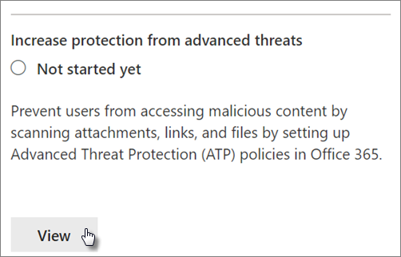

# 增加威脅防護Increase threat protection

本文可協助您加強 Microsoft 365 訂閱中的保護, 以防範網路釣魚、惡意程式碼和其他威脅。This article helps you increase the protection in your Microsoft 365 subscription to protect against phishing, malware, and other threats. 這些建議適用于增加安全性需求的組織, 例如政治活動、法律辦公室和健康護理診所。These recommendations are appropriate for organizations with an increased need for security, like political campaigns, law offices, and health care clinics. 

在您開始之前, 請先檢查您的 Office 365 安全分數。Before you begin, check your Office 365 Secure Score. Office 365 安全分數會根據您的一般活動和安全性設定來分析您的 Office 365 組織安全性, 並會指定分數。Office 365 Secure Score analyzes your Office 365 organization's security based on your regular activities and security settings and assigns a score. 請記下您目前的分數。Begin by taking note of your current score. 採取本文中建議的動作可提高您的分數。Taking the actions recommended in this article increases your score. 目標不會達到最大分數, 但請注意, 保護您的環境不會對使用者的生產力造成不良影響的機會。The goal is not to achieve the max score, but to be aware of opportunities to protect your environment that do not negatively affect productivity for your users. 

如需詳細資訊, 請參閱[Microsoft 安全分數](https://docs.microsoft.com/en-us/office365/securitycompliance/microsoft-secure-score)。For more information, see [Microsoft Secure Score](https://docs.microsoft.com/en-us/office365/securitycompliance/microsoft-secure-score).

## 提升郵件中惡意程式碼的保護層級Raise the level of protection against malware in mail

您的 Office 365 或 Microsoft 365 環境包含對惡意程式碼的防護, 但是您可以使用常用於惡意程式碼的檔案類型來封鎖附件, 以增加這種保護。Your Office 365 or Microsoft 365 environment includes protection against malware, but you can increase this protection by blocking attachments with file types that are commonly used for malware. 若要以電子郵件擴充惡意程式碼保護:To bump up malware protection in email:
  
1. 移至[https://protection.office.com](https://protection.office.com)並以您的系統管理員帳號憑證登入。Go to [https://protection.office.com](https://protection.office.com) and sign in with your admin account credentials. 
    
2. 在 [Office 365 安全性&amp;規範中心] 的左功能窗格中, 選擇 [**威脅管理**] 下的 [**原則** \> **反惡意**代碼]。In the Office 365 Security &amp; Compliance Center, in the left navigation pane, under **Threat management**, choose **Policy** \> **Anti-Malware**.
    
3. 按兩下預設原則, 以編輯此全公司原則。Double-click the default policy to edit this company-wide policy.
    
4. 按一下 [**設定**]。Click **Settings**.
    
5. 在 [**常用附件類型篩選**] 底下, 選取 [**開啟**]。Under **Common Attachment Types Filter**, select **On**. 封鎖的檔案類型會列在此控制項下方的視窗中。The file types that are blocked are listed in the window directly below this control.  請確定您新增這些 filetypes:Make sure you add these filetypes:
   - ade、adp、ani、bas、bat、chm、cmd、com、cpl、crt、.hlp、ht、hta、inf、jse、mdz、.pcd、、cmd、、、、、、、、、、、ade, adp, ani, bas, bat, chm, cmd, com, cpl, crt, hlp, ht, hta, inf, ins, isp, job, js, jse, lnk, mda, mdb, mde, mdz, msc, msi, msp, mst, pcd, reg, scr, sct, shs, url, vb, vbe, vbs, wsc, wsf, wsh, exe, pif    如有需要, 您可以稍後新增或刪除檔案類型。You can add or delete file types later, if needed.
    
6. 按一下 [儲存]\*\*\*\*。Click **Save.**
    
如需詳細資訊, 請參閱[反惡意程式碼保護](https://go.microsoft.com/fwlink/?linkid=2015692&amp;clcid=0x409)。For more information, see [Anti-malware protection](https://go.microsoft.com/fwlink/?linkid=2015692&amp;clcid=0x409).
  

## 防止勒索軟體Protect against ransomware

勒索軟體會透過加密檔案或鎖定電腦螢幕, 來限制資料存取權。Ransomware restricts access to data by encrypting files or locking computer screens. 然後, 它會要求「ransom」 (通常是 Bitcoin 的 cryptocurrencies 形式) 來 extort 金錢, 並在 exchange 中存取資料。It then attempts to extort money from victims by asking for "ransom," usually in form of cryptocurrencies like Bitcoin, in exchange for access to data. 
  
您可以透過建立一或多個郵件流程規則來封鎖勒索軟體 (這些副檔名會在 [在[郵件中提高惡意程式碼的防護等級](#raise-the-level-of-protection-against-malware-in-mail)] 步驟中新增), 或警告使用者收到這些郵件, 以防止勒索代碼電子郵件中的附件。You can protect against ransomware by creating one or more mail flow rules to block file extensions that are commonly used for ransomware (these were added in the [raise the level of protection against malware in mail](#raise-the-level-of-protection-against-malware-in-mail) step), or to warn users who receive these attachments in email.

除了您在上一個步驟中封鎖的檔案之外, 也建議您先建立規則, 以在開啟包含宏的 Office 檔案附件之前警告使用者。In addition to the files that you blocked in the previous step, it is also good practice to create a rule to warn users before opening Office file attachments that include macros. 您可以在宏內隱藏勒索軟體, 因此我們會警告使用者不要從他們不知道的人開啟這些檔案。Ransomware can be hidden inside macros, so we'll warn users to not open these files from people they do not know.

若要建立郵件傳輸規則:To create a mail transport rule:
  
1. 移至系統<a href="https://go.microsoft.com/fwlink/p/?linkid=837890" target="_blank">https://admin.microsoft.com</a>管理中心, 然後選擇 [系統**管理中心** \> ] [ **Exchange**]。Go to the admin center at <a href="https://go.microsoft.com/fwlink/p/?linkid=837890" target="_blank">https://admin.microsoft.com</a> and choose **Admin centers** \> **Exchange**.
    
2. 在 [**郵件流程**] 類別中, 按一下 [**規則**]。In the **mail flow** category, click **rules**.
    
3. 按一下**+**[], 然後按一下 [**建立新規則**]。Click **+**, and then click **Create a new rule**.
    
4. 按一下對話方塊底部的 [**更多選項**], 以查看完整的選項群組。Click **More options** at the bottom of the dialog box to see the full set of options. 
    
5. 在下表中套用規則的設定。Apply the settings in the following table for the rule. 除非您想要變更這些設定, 否則預設保留其預設值。Leave the rest of the settings at the default, unless you want to change these.
    
6. 按一下 [儲存]\*\*\*\*。Click **Save**.
    
|**設定****Setting**|**開啟 Office 檔案的附件之前警告使用者****Warn users before opening attachments of Office files**||
|:-----|:-----|:-----|
|名稱Name    |反惡意軟體規則: 警告使用者Anti-ransomware rule: warn users     |
|若要套用此規則。Apply this rule if . . .    |任何附件。Any attachment . . . 副檔名相符。file extension matches . . .    |
|指定字詞或片語Specify words or phrases    |新增下列檔案類型:Add these file types:    normal.dotm、.docm、xlsm、sltm、xla、xlam、xll、pptm、potm、ppam、ppsm、sldmdotm, docm, xlsm, sltm, xla, xlam, xll, pptm, potm, ppam, ppsm, sldm   |
|請執行下列動作。Do the following . . .    |以郵件通知收件者Notify the recipient with a message    |
|提供訊息文字Provide message text    |請勿從您不知道的人開啟這些類型的檔案, 因為它們可能含有惡意程式碼的宏。Do not open these types of files from people you do not know because they might contain macros with malicious code.    |
   
如需詳細資訊，請參閱：For more information, see:
  
- [如何處理勒索軟體How to deal with ransomware](https://go.microsoft.com/fwlink/?linkid=2016501&amp;clcid=0x409)
    
- [還原您的 OneDriveRestore your OneDrive](https://support.office.com/article/fa231298-759d-41cf-bcd0-25ac53eb8a15.aspx)
    

## 停止電子郵件的自動轉寄功能Stop auto-forwarding for email

取得使用者信箱存取權的駭客可以透過將信箱設為自動轉寄電子郵件, 來竊取您的郵件。Hackers who gain access to a user's mailbox can steal your mail by setting the mailbox to automatically forward email. 即使沒有使用者的認知, 也可能會發生這種情況。This can happen even without the user's awareness. 您可以設定郵件流程規則, 避免發生這種情況。You can prevent this from happening by configuring a mail flow rule. 
  
若要建立郵件傳輸規則, 請觀看[這段簡短的影片](https://support.office.com/article/f9d693ba-5c78-47c0-b156-8e461e062aa7), 或遵循下列步驟:To create a mail transport rule, either watch [this short video](https://support.office.com/article/f9d693ba-5c78-47c0-b156-8e461e062aa7) or follow these steps:
  
1. 在 Microsoft 365 系統管理中心, 按一下 [系統**管理中心** \> ] [ **Exchange**]。In the Microsoft 365 admin center, click **Admin centers** \> **Exchange**.
    
2. 在 [**郵件流程**] 類別中, 按一下 [**規則**]。In the **mail flow** category, click **rules**.
    
3. 按一下**+**[], 然後按一下 [**建立新規則**]。Click **+**, and then click **Create a new rule**.
    
4. 按一下對話方塊底部的 [**更多選項**], 以查看完整的選項群組。Click **More options** at the bottom of the dialog box to see the full set of options. 
    
5. 套用下表中的設定。Apply the settings in the following table. 除非您想要變更這些設定, 否則預設保留其預設值。Leave the rest of the settings at the default, unless you want to change these.
    
6. 按一下 [儲存]\*\*\*\*。Click **Save**.
    
|**設定****Setting**|**開啟 Office 檔案的附件之前警告使用者****Warn users before opening attachments of Office files**|
|:-----|:-----|
|名稱Name    |防止自動將電子郵件轉寄至外部網域Prevent auto forwarding of email to external domains    |
|將此規則套用至 .。。Apply this rule if ...    |寄件者。The sender . . . 為 external/internal。is external/internal . . . 組織內部Inside the organization    |
|新增條件Add condition    |郵件屬性。The message properties . . . 包含郵件類型。include the message type . . . 自動轉寄Auto-forward    |
|請執行下列動作 .。。Do the following ...    |封鎖郵件。Block the message . . . 拒絕郵件並包含說明。reject the message and include an explanation.    |
|提供訊息文字Provide message text    |因為安全性的原因, 無法自動將電子郵件轉寄到此組織外部。Auto-forwarding email outside this organization is prevented for security reasons.    |

## 保護您的電子郵件免受網路釣魚攻擊Protect your email from phishing attacks

如果您已為 Office 365 或 Microsoft 365 環境設定一或多個自訂網域, 您可以設定目標的反網路釣魚保護。If you've configured one or more custom domains for your Office 365 or Microsoft 365 environment, you can configure targeted anti-phishing protection. ATP 反網路釣魚防護, 部分的 Office 365 高級威脅防護, 可協助保護您的組織免受惡意模擬型網路釣魚攻擊和其他網路釣魚攻擊。ATP anti-phishing protection, part of Office 365 Advanced Threat Protection, can help protect your organization from malicious impersonation-based phishing attacks and other phishing attacks. 如果您尚未設定自訂網域, 則不需要執行此動作。If you haven't configured a custom domain, you do not need to do this.
  
我們建議您先建立一個原則, 以保護最重要的使用者和您的自訂網域, 以開始使用這項保護。We recommend that you get started with this protection by creating a policy to protect your most important users and your custom domain. 

  
若要建立 ATP 反網路釣魚原則, 請觀看[這個簡短的訓練影片](https://support.office.com/article/86c425e1-1686-430a-9151-f7176cce4f2c), 或完成下列步驟:To create an ATP anti-phishing policy, watch  [this short training video](https://support.office.com/article/86c425e1-1686-430a-9151-f7176cce4f2c), or complete the following steps:
  
1. 請移至 [https://protection.office.com](https://protection.office.com)。Go to [https://protection.office.com](https://protection.office.com). 
    
2. 在 Office 365 安全性&amp;合規性中心的左功能窗格中, 選擇 [**威脅管理**] 底下的 [**原則**]。In the Office 365 Security &amp; Compliance Center, in the left navigation pane, under **Threat management**, choose **Policy**.
    
3. 在 [**原則**] 頁面上, 選擇 [ **ATP 反網路釣魚**]。On the **Policy** page, choose **ATP anti-phishing**.
    
4. 在 [**反網路釣魚**] 頁面上, 選取 [ **+ 建立**]。On the **Anti-phishing** page, select **+ Create**. [! 注意] 會啟動嚮導, 以逐步定義您的反網路釣魚原則。A wizard launches that steps you through defining your anti-phishing policy.
    
5. 請按照下表中的建議, 指定原則的名稱、描述和設定。Specify the name, description, and settings for your policy as recommended in the chart below. 如需詳細資訊, 請參閱[瞭解 ATP 反網路釣魚原則選項](https://go.microsoft.com/fwlink/?linkid=2016505&amp;clcid=0x409)。See [Learn about ATP anti-phishing policy options](https://go.microsoft.com/fwlink/?linkid=2016505&amp;clcid=0x409) for more details. 
    
6. 檢查您的設定之後, 請視需要選擇 [**建立這個原則**] 或 [**儲存**]。After you have reviewed your settings, choose **Create this policy** or **Save**, as appropriate.
    

|**設定或選項****Setting or option** |**建議設定****Recommended setting**  |
|:-----|:-----|
|名稱Name    |網域和最有價值的活動人員Domain and most valuable campaign staff    |
|描述Description    |確保最重要的人員和我們的網域不會受到類比。Ensure most important staff and our domain are not being impersonated.    |
|新增要保護的使用者Add users to protect    |選取 **+ [新增條件], 收件者是**。Select **+ Add a condition, The recipient is**. 輸入使用者名稱, 或輸入候選人、活動管理員及其他重要職員成員的電子郵件地址。Type user names or enter the email address of the candidate, campaign manager, and other important staff members. 您最多可以新增20個要防止模擬的內部和外部地址。You can add up to 20 internal and external addresses that you want to protect from impersonation.    |
|新增要保護的網域Add domains to protect    |選取 **+ 新增條件, 收件者網域是**。Select **+ Add a condition, The recipient domain is**. 輸入與您的 Microsoft 365 訂閱相關聯的自訂網域 (如果您定義了的話)。Enter the custom domain associated with your Microsoft 365 subscription, if you defined one. 您可以輸入一個以上的網域。You can enter more than one domain.    |
|選擇動作Choose actions    |如果由模擬的使用者傳送電子郵件: 選擇 [**將郵件重新導向至另一個電子郵件地址**], 然後輸入安全性系統管理員的電子郵件地址。例如,*劉愛琳@contoso .com*。If email is sent by an impersonated user: Choose **Redirect message to another email address**, and then type the email address of the security administrator; for example, *Alice@contoso.com*.          如果由模擬的網域傳送電子郵件: 選擇 [**隔離郵件**]。If email is sent by an impersonated domain: Choose **Quarantine message**.    |
|信箱智慧Mailbox intelligence    |根據預設, 當您建立新的反網路釣魚原則時, 會選取信箱智慧。By default, mailbox intelligence is selected when you create a new anti-phishing policy. 將此設定保留為 [**開啟**] 以取得最佳結果。Leave this setting **On** for best results.    |
|新增信任的寄件者和網域Add trusted senders and domains    |您可以在這裡新增您自己的網域或任何其他信任的網域。Here you can add your own domain, or any other trusted domains.    |
|套用至Applied to    |選取 **[收件**者] 網域。Select **The recipient domain is**. 在**其中任何一項**下, 選取 **[選擇**]。Under **Any of these**, select **Choose**. 選取 [ **+ 新增**]。Select **+ Add**. 選取功能變數名稱旁的核取方塊, 例如\*contoso。com  \*, 然後選取清單中的 [**新增**]。Select the check box next to the name of the domain, for example, *contoso.com*, in the list, and then select **Add**. 選取 [**完成**]。Select **Done**.    |
   
如需詳細資訊, 請參閱[設定 Office 365 ATP 反網路釣魚原則](https://go.microsoft.com/fwlink/?linkid=2016505&amp;clcid=0x409)。For more information, see [Set up Office 365 ATP anti-phishing policies](https://go.microsoft.com/fwlink/?linkid=2016505&amp;clcid=0x409).
  
## 使用高級威脅防護 (ATP) 來防止惡意附件、檔案及連結Protect against malicious attachments, files and links with Advanced Threat Protection (ATP)

首先, 請確定<a href="https://go.microsoft.com/fwlink/p/?linkid=837890" target="_blank">https://admin.microsoft.com</a>您在系統管理中心開啟新的系統管理中心預覽;開啟**新系統管理中心**文字旁的切換功能。First, make sure, in the admin center at <a href="https://go.microsoft.com/fwlink/p/?linkid=837890" target="_blank">https://admin.microsoft.com</a> you have the new admin center preview turned on; turn on the toggle next to the text **The new admin center**.

   

如果您沒有在租使用者中看到含卡的 [**安裝**] 頁面, 請參閱如何在 Office 365 安全性&amp;與合規性中心完成這些步驟。If you don't see the **Setup** page with cards in your tenant yet, see how to complete these steps in Office 365 Security &amp; Compliance Center. 請參閱[設定安全性 & 合規性中心內的 atp 安全附件](#set-up-atp-safe-attachments-in-the-security--compliance-center), 並[設定安全性 & 規範中心內的 atp 安全連結](#set-up-atp-safe-links-in-the-security--compliance-center)。See [Set up ATP safe attachments in the Security & Compliance Center](#set-up-atp-safe-attachments-in-the-security--compliance-center) and [Set up ATP Safe Links in the Security & Compliance Center](#set-up-atp-safe-links-in-the-security--compliance-center).

1.  在左側導覽中, 選擇 [**安裝**]。In the left nav, choose **Setup**.
2. 在 [**設定**] 頁面\*\*\*\* 上, 選擇 [**增加來自高級威脅的保護**]。On the **Setup** page choose **View** on the **Increase protection from advanced threats** card.  
    ![選擇 [從高級威脅提升保護]。](media/startatp.png) 

3. 在 [**從高級威脅增加保護**] 頁面上, 選擇 [**開始**]。On the **Increase protection from advanced threats** page, choose **Get started**.
4. 在開啟的窗格上, 選取 [電子郵件中的**連結和附件**] 旁的核取方塊、[**在 SharePoint、OneDrive 及小組中掃描**檔案] 和 [掃描**專案以尋找惡意內容**] 下的**office 桌面和 office Online 應用程式中的連結**。On the pane that opens, check check-boxes next to **Links and attachments in email**, **Scan files in SharePoint, OneDrive, and Teams**, and **Scan links in Office desktop and Office Online apps** under **Scan items for malicious content**.

      - 在 [**電子郵件中的連結和附件**] 底下, 輸入 [所有使用者], 或您要掃描其電子郵件的特定使用者。Under **Links and attachments in email**, Type in All Users, or the specific users whose email you want scanned.

    
5. 選擇 [**建立原則**] 以開啟 ATP 安全附件和 atp 安全連結。Choose **Create policies** to turn on ATP safe attachments and ATP safe links.

### 設定安全性 & 合規性中心內的 ATP 安全附件Set up ATP safe attachments in the Security & Compliance Center

人們會定期傳送、接收和共用附件, 例如檔、簡報、試算表等等。People regularly send, receive, and share attachments, such as documents, presentations, spreadsheets, and more. 只要查看電子郵件訊息, 就不一定容易知道附件是否安全或惡意。It's not always easy to tell whether an attachment is safe or malicious just by looking at an email message. Office 365 高級威脅防護包括 ATP 安全附件保護, 但是預設不會開啟此保護。Office 365 Advanced Threat Protection includes ATP Safe Attachment protection, but this protection is not turned on by default. 建議您建立新的規則, 以開始使用此保護。We recommend that you create a new rule to begin using this protection. 這項保護延伸至 SharePoint、OneDrive 及 Microsoft 團隊中的檔案。This protection extends to files in SharePoint, OneDrive, and Microsoft Teams.
  
若要建立 ATP 安全附件原則, 請觀看[這段簡短的影片](https://support.office.com/article/e7e68934-23dc-4b9c-b714-e82e27a8f8a5), 或完成下列步驟:To create an ATP safe attachment policy, either watch [this short video](https://support.office.com/article/e7e68934-23dc-4b9c-b714-e82e27a8f8a5), or complete the following steps:
  
1. 移至[https://protection.office.com](https://protection.office.com)並以您的系統管理員帳戶登入。Go to [https://protection.office.com](https://protection.office.com) and sign in with your admin account. 
    
2. 在 Office 365 安全性&amp;合規性中心的左功能窗格中, 選擇 [**威脅管理**] 底下的 [**原則**]。In the Office 365 Security &amp; Compliance Center, in the left navigation pane, under **Threat management**, choose **Policy**.
    
3. 在 [原則] 頁面上, 選擇 [ **ATP 安全附件**]。On the Policy page, choose **ATP safe attachments**.
    
4. 在 [安全附件] 頁面上, 選取 [**開啟 SharePoint、OneDrive 及 Microsoft 團隊**版的 ATP] 核取方塊, 以廣泛套用這種保護。On the Safe attachments page, apply this protection broadly by selecting the **Turn on ATP for SharePoint, OneDrive, and Microsoft Teams** check box. 
    
5. 選取**+** 以建立新原則。Select **+** to create a new policy. 
    
6. 套用下表中的設定。Apply the settings in the following table. 
    
7. 檢查您的設定之後, 請視需要選擇 [**建立這個原則**] 或 [**儲存**]。After you have reviewed your settings, choose **Create this policy** or **Save**, as appropriate.
    

|**設定或選項****Setting or option**|**建議設定****Recommended setting**  |
|:-----|:-----|
|名稱Name    |封鎖目前和未來已偵測到惡意程式碼的電子郵件。Block current and future emails with detected malware.    |
|描述Description    |封鎖目前和未來的電子郵件和附件偵測到的惡意程式碼。Block current and future emails and attachments with detected malware.    |
|儲存附件未知的惡意軟體回應Save attachments unknown malware response    |Select **block-封鎖目前和未來的電子郵件和附件偵測到的惡意**代碼。Select **Block - Block the current and future emails and attachments with detected malware**.    |
|在偵測上重新導向附件Redirect attachment on detection    |啟用重新導向 (選取此方塊) 輸入系統管理員帳戶或隔離的信箱設定。Enable redirection (select this box)          Enter the admin account or a mailbox setup for quarantine.          如果惡意程式碼掃描附件時超時或發生錯誤, 請套用上述選取範圍 (選取此方塊)。Apply the above selection if malware scanning for attachments times out or error occurs (select this box).    |
|套用至Applied to    |收件者網域是。The recipient domain is . . . 選取您的網域。select your domain.    |
   
如需詳細資訊, 請參閱[設定 Office 365 ATP 反網路釣魚原則](https://go.microsoft.com/fwlink/?linkid=2016505&amp;clcid=0x409)。For more information, see [Set up Office 365 ATP anti-phishing policies](https://go.microsoft.com/fwlink/?linkid=2016505&amp;clcid=0x409).
  
### 設定安全性 & 合規性中心內的 ATP 安全連結Set up ATP Safe Links in the Security & Compliance Center

駭客有時會在電子郵件或其他檔案的連結中隱藏惡意的網站。Hackers sometimes hide malicious websites in links in email or other files. Office 365 ATP 安全連結 (ATP 安全連結) 是 Office 365 高級威脅防護的一部分, 可提供電子郵件訊息和 Office 檔中的網頁位址 (Url) 驗證, 以協助保護您的組織。Office 365 ATP Safe Links (ATP Safe Links), part of Office 365 Advanced Threat Protection, can help protect your organization by providing time-of-click verification of web addresses (URLs) in email messages and Office documents. 保護是透過 ATP 安全連結原則所定義。Protection is defined through ATP Safe Links policies.
  
我們建議您執行下列動作:We recommend that you do the following:
  
- 修改預設原則以提升保護。Modify the default policy to increase protection.
    
- 新增針對您網域中的所有收件者的新原則。Add a new policy targeted to all recipients in your domain.
    
若要設定 ATP 安全連結, 請觀看[這個簡短的訓練影片](https://support.office.com/article/61492713-53c2-47da-a6e7-fa97479e97fa), 或完成下列步驟:To set up ATP Safe Links, watch [this short training video](https://support.office.com/article/61492713-53c2-47da-a6e7-fa97479e97fa), or complete the following steps:
  
1. 移至[https://protection.office.com](https://protection.office.com)並以您的系統管理員帳戶登入。Go to [https://protection.office.com](https://protection.office.com) and sign in with your admin account. 
    
2. 在 Office 365 安全性&amp;合規性中心的左功能窗格中, 選擇 [**威脅管理**] 底下的 [**原則**]。In the Office 365 Security &amp; Compliance Center, in the left navigation pane, under **Threat management**, choose **Policy**.
    
3. 在 [原則] 頁面上, 選擇 [ **ATP 安全連結**]。On the Policy page, choose **ATP Safe Links**.
    
若要修改預設原則:To modify the default policy:
  
1. 在 [安全連結] 頁面的 [**適用于整個組織的原則**] 下, 選取**預設**原則。On the Safe links page, under **Policies that apply to the entire organization**, select the **Default** policy. 
    
2. 在 [**電子郵件除外的設定**] 下, 選取 [ **office 365 專業增強版]、[office For iOS 和 Android**]。Under **Settings that apply to content except email**, select **Office 365 ProPlus, Office for iOS and Android**.
    
3. 按一下 [儲存]\*\*\*\*。Click **Save**. 
    
若要建立以您網域中的所有收件者為目標的新原則:To create a new policy targeted to all recipients in your domain:
  
1. 在 [安全連結] 頁面上, 按一下**+** [套用**至整個組織的原則**] 下的 [建立新原則]。On the Safe links page, under **Policies that apply to the entire organization**, click **+** to create a new policy. 
    
2. 套用下表所列的設定。Apply the settings listed in the following table.
    
3. 按一下 [儲存]\*\*\*\*。Click **Save**. 

|**設定或選項****Setting or option**|**建議設定****Recommended setting**  |
|:-----|:-----|
|名稱Name    |網域中所有收件者的安全連結原則Safe links policy for all recipients in the domain    |
|選取郵件中未知潛在惡意 Url 的動作Select the action for unknown potentially malicious URLs in messages    |**當使用者按一下連結時, 會重新寫入並檢查已知惡意連結清單中的 [On url**]。Select **On - URLs will be rewritten and checked against a list of known malicious links when user clicks on the link**.    |
|使用安全附件掃描可下載的內容Use Safe Attachments to scan downloadable content    |選取此方塊。Select this box.    |
|套用至Applied to    |收件者網域是。The recipient domain is . . . 選取您的網域。select your domain.    |
   
如需詳細資訊, 請參閱[Office 365 ATP 安全連結](https://go.microsoft.com/fwlink/?linkid=2016138&amp;clcid=0x409)。For more information, see [Office 365 ATP safe links](https://go.microsoft.com/fwlink/?linkid=2016138&amp;clcid=0x409).
  
## 開啟統一的審計記錄檔Turn on the Unified Audit Log

在安全性&amp;與合規性中心開啟 [審核記錄搜尋] 之後, 您可以在記錄中保留系統管理員和其他使用者活動, 並加以搜尋。After you turn on the audit log search in the Security &amp; Compliance center, you can retain the admin and other user activity in the log and search it. 

您必須在 Exchange Online 中指派「審核記錄」角色, 以在 Microsoft 365 商務版訂閱中開啟或關閉審核記錄搜尋。You have to be assigned the Audit Logs role in Exchange Online to turn audit log search on or off in your Microsoft 365 Business subscription. 根據預設, 此角色會指派給 Exchange 系統管理中心的 [許可權] 頁面上的 [規範管理] 和 [組織管理] 角色群組。By default, this role is assigned to the Compliance Management and Organization Management role groups on the Permissions page in the Exchange admin center. Microsoft 365 中的全域系統管理員預設為此群組的成員。Global admins in Microsoft 365 are members of this group by default.

1. 若要開啟 [審核記錄搜尋], 請移至系統管理中心<a href="https://go.microsoft.com/fwlink/p/?linkid=837890" target="_blank">https://admin.microsoft.com</a> , 然後在左側導覽中選擇 [系統**管理中心**] 底下的 [**規範**]。To turn on the audit log search on, go to the admin center at <a href="https://go.microsoft.com/fwlink/p/?linkid=837890" target="_blank">https://admin.microsoft.com</a> and then choose **Compliance** under **Admin centers** in the left nav. 
2. 在 [ **Microsoft 365 規範**] 頁面上, 選擇 [**更多資源**], 然後在**Office &amp; 365 安全性中心**卡片上**開啟**。On the **Microsoft 365 compliance** page, choose **More resources**, and then **Open** on the **Office 365 security &amp; center** card.

    ![選擇 [Office 365 安全性 & 合規性轎車] 上的 [開啟]。](media/gotosecandcomp.png)
3. 在 [安全性與合規性] 頁面上, 選擇 [**搜尋**], 然後按一下 [**審核記錄搜尋**]。On the security and compliance page, choose **Search** and then **Audit log search**.
1. 在 [**審核記錄搜尋**] 頁面的頂端, 選擇 [**開啟審計**]。On the top of the **Audit log search** page, choose **Turn on auditing**.

功能開啟後, 您就可以搜尋檔案、資料夾及許多活動。After the feature is turned on you can search for files, folders, and many activities. 如需詳細資訊, 請參閱[search the audit log](https://docs.microsoft.com/office365/securitycompliance/search-the-audit-log-in-security-and-compliance)。For more information, see [search the audit log](https://docs.microsoft.com/office365/securitycompliance/search-the-audit-log-in-security-and-compliance).

## 調整 SharePoint 和 OneDrive 檔案和資料夾的匿名共用設定Tune-up anonymous sharing settings for SharePoint and OneDrive files and folders

(將預設的匿名連結到期時間變更為14天, 將預設共用類型變更為「特定人員」)若要變更 OneDrive 和 SharePoint 的共用設定:(change default anonymous link expiration to 14 days, change default sharing type to "Specific People") To change the sharing settings for OneDrive and SharePoint:
1. 移至系統管理中心<a href="https://go.microsoft.com/fwlink/p/?linkid=837890" target="_blank">https://admin.microsoft.com</a> , 然後在左側導覽中選擇 [系統**管理中心**] 底下的 [ **SharePoint** ]。Go to the admin center at <a href="https://go.microsoft.com/fwlink/p/?linkid=837890" target="_blank">https://admin.microsoft.com</a> and then choose **SharePoint** under **Admin centers** in the left nav. 
2. 在 SharePoint 系統管理中心, 移至 [**原則** \> ] [**共用**]。In the SharePoint Admin center, go to **Policies** \> **Sharing**.
3. 在 [**共用**] 頁面的 [檔案**和資料夾連結**] 下, 選取 [**特定人員**], 然後在 **[任何人] 連結的 [高級設定]** 底下, 選取 [**這些連結必須在這幾天內到期**], 然後輸入 14 (或其他數目的您想要限制連結壽命的天數)。On the **Sharing** page, under **File and folder links**, select **Specific people**, and under **Advanced settings for "Anyone" links**, select **These links must expire within this many days**, and type in 14 (or another number of days you want to restrict the link lifetime to).

    ![選擇 [特定人員], 並將 [連結到期] 設定為14天。](media/anyonelinks.png)

## 活動警示Activity alerts

您可以使用活動提醒追蹤系統管理員和使用者活動, 並偵測組織中的惡意程式碼和資料遺失保護事件。You can use activity alerts to track admin and user activities and detect malware and data loss prevention incidents in your organization. 您的訂閱包含一組預設原則, 但您也可以另外建立自訂原則。Your subscription includes a set of default policies, but you can also create custom ones too. 如需詳細資訊, 請參閱[警示原則](https://docs.microsoft.com/office365/securitycompliance/alert-policies)。For more information, see [alert policies](https://docs.microsoft.com/office365/securitycompliance/alert-policies). 例如, 如果您將重要檔案儲存在 SharePoint 中, 而不想讓任何人在外部共用, 您可以建立通知, 讓您在某人進行共用時提醒您。For example, if you store an important file in SharePoint that you don't want anyone to share externally, you can create a notification that alerts you if someone does share it.

下圖顯示 Microsoft 365 商務版隨附的預設原則。The following figure shows the default policies that are included with Microsoft 365 Business.   
    

## 停用或管理行事曆共用Disable or manage calendar sharing

您可以防止組織中的人員共用其行事曆, 也可以管理他們可以共用的專案。You can prevent people in your organization from sharing their calendars, or you can also manage what they can share. 例如, 您可以將共用限制為僅限共用空閒/忙碌的時間。For example, you can restrict the sharing to free/busy times only.

1. 移至<a href="https://go.microsoft.com/fwlink/p/?linkid=837890" target="_blank">https://admin.microsoft.com</a>系統管理中心, 然後選擇 [**設定** \> **服務] & 增益集**Go to the admin center at <a href="https://go.microsoft.com/fwlink/p/?linkid=837890" target="_blank">https://admin.microsoft.com</a> and choose **Settings** \> **Services & add-ins**
2. 在 [**服務] & 增益集**] 頁面上, 選擇 [行事**曆**], 然後選擇您組織中的人員是否可以與擁有 Office 365 或 Exchange 的人員或任何人共用其行事曆。On the **Services & add-ins** page choose **Calendar**, and choose if people in your organization can share their calendars with people outside who have Office 365 or Exchange, or with anyone. 
    如果您選擇與任何人共用, 您可以決定只共用空閒/忙碌資訊。If you choose the share with anyone you can decide to also only share free/busy information.

3. 選擇頁面底部的 [**儲存變更**]。Choose **Save changes** on the bottom of the page.

    下圖顯示不允許行事曆共用。The following figure shows calendar sharing not allowed.   
    

    下圖顯示使用只含空閒/忙碌資訊之電子郵件連結的行事曆共用時的設定。The following figure shows the settings when calendar sharing is allowed with an email link with only free/busy information.

   

如果允許您的使用者共用其行事曆, 請參閱[這些指示](https://support.office.com/article/7ecef8ae-139c-40d9-bae2-a23977ee58d5)瞭解如何從網頁上的 Outlook 共用。If your users are allowed to share their calendars, see [these instructions](https://support.office.com/article/7ecef8ae-139c-40d9-bae2-a23977ee58d5) for how to share from Outlook on the web.