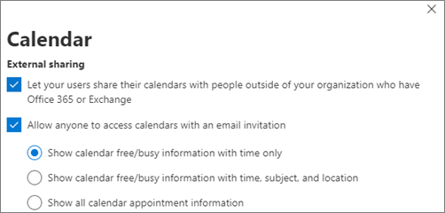

# 加強威脅防護

本文可協助您提高 Microsoft 365 訂閱中的保護，以防範網路釣魚、惡意程式碼和其他威脅。 這些建議適用于已增加安全性需求的組織，例如政治活動、法律辦事處和衛生保健診所。 

開始之前，請先檢查您的 Office 365 安全分數。 Office 365 安全分數會根據您的定期活動和安全性設定來分析貴組織的安全性，並指定分數。 請先記下您目前的分數。 採取本文中建議的動作可提升您的分數。 目標不會達到最大分數，但請注意保護您的環境不會對使用者生產力造成不良影響的機會。 

如需詳細資訊，請參閱[Microsoft 安全分數](https://docs.microsoft.com/office365/securitycompliance/microsoft-secure-score)。

## 提升郵件中惡意程式碼的保護層級

您的 Office 365 或 Microsoft 365 環境包括防範惡意程式碼，但是您可以使用常見於惡意程式碼的檔案類型來封鎖附件，以提升這種保護。 若要將惡意程式碼保護放大電子郵件：
  
1. 移至[https://protection.office.com](https://protection.office.com)並以您的系統管理員帳號憑證登入。 
    
2. 在&amp;安全性與合規性中心的左功能窗格中，在 [**威脅管理**] 底下，選擇 [**原則** \> **Anti-Malware**]。
    
3. 按兩下預設原則，以編輯此全公司原則。
    
4. 按一下 **[設定]**。
    
5. 在 [**一般附件類型篩選**] 底下，選取 [**開啟**]。 封鎖的檔案類型會列在此控制項底下的視窗中。  請務必新增下列 filetypes：
   - ade、adp、ani、bas，bat，chm，cmd，com，cpl，crt，.hlp，ht，的 hta，inf，ins，jse，mdb，mdb，mde，mdz，msc，msi，msp，.msp，.pcd，reg，.scr，sct，wsc，wsf，wsh，vbe，pif    您可以稍後新增或刪除檔案類型（如有必要）。
    
6. 按一下 [儲存]****。
    
如需詳細資訊，請參閱[反惡意程式碼保護](https://go.microsoft.com/fwlink/?linkid=2015692&amp;clcid=0x409)。
  

## 防護勒索軟體

勒索軟體會以加密檔案或鎖定電腦畫面限制存取資料。 然後，它會要求「ransom」（通常是以 cryptocurrencies 如 Bitcoin 的形式） extort money，以供 exchange 存取資料。 
  
您可以建立一或多個郵件流程規則，以封鎖勒索軟體常用的副檔名（新增于 [在[郵件中提升惡意程式碼的保護層級](#raise-the-level-of-protection-against-malware-in-mail)）]，或警告使用者在電子郵件中收到這些附件，以防禦勒索軟體。

除了上一個步驟中所封鎖的檔案之外，在開啟包含宏的 Office 檔案附件之前，請先建立規則，以警告使用者。 勒索軟體可以隱藏在宏內，所以警告使用者不要從他們不知道的人開啟這些檔案。

若要建立郵件傳輸規則：
  
1. 移至 [系統管理中心] <a href="https://go.microsoft.com/fwlink/p/?linkid=837890" target="_blank">https://admin.microsoft.com</a> ，然後選擇 [系統**管理中心** \> ] [ **Exchange**]。
    
2. 在 [**郵件流程**] 類別中，按一下 [**規則**]。
    
3. 按一下**+**[]，然後按一下 [**建立新規則**]。
    
4. 按一下對話方塊底部的 [**更多選項**]，以查看完整的選項組。 
    
5. 針對規則套用下表中的設定。 除非您想要變更設定的預設值，否則請保留預設值。
    
6. 按一下 [儲存]****。
    
|**設定**|**開啟 Office 檔案的附件之前警告使用者**||
|:-----|:-----|:-----|
|名稱    |反內部的勒索軟體規則：警告使用者     |
|將此規則套用至 if。 . .    |任何附件。 . . 副檔名符合。 . .    |
|指定字詞或片語    |新增下列檔案類型：    .docm、xlsm、sltm、xla、xlam、xll、pptm、potm、ppam、ppsm、sldm   |
|請執行下列動作。 . .    |以郵件通知收件者    |
|提供郵件文字    |請勿從不知道的人開啟這些類型的檔案，因為這些人可能會包含惡意程式碼的宏。    |
   
如需詳細資訊，請參閱：
  
- [如何處理勒索軟體](https://go.microsoft.com/fwlink/?linkid=2016501&amp;clcid=0x409)
    
- [還原您的 OneDrive](https://support.office.com/article/fa231298-759d-41cf-bcd0-25ac53eb8a15.aspx)
    

## 停止電子郵件的自動轉寄功能

取得使用者信箱存取權的駭客可將信箱設定為自動轉寄電子郵件，以竊取您的郵件。 即使沒有使用者的認知，也可能會發生這種情況。 您可以設定郵件流程規則，避免發生這種情況。 
  
若要建立郵件傳輸規則，請觀看[這段簡短的影片](https://support.office.com/article/f9d693ba-5c78-47c0-b156-8e461e062aa7)，或遵循下列步驟：
  
1. 在 Microsoft 365 系統管理中心中，按一下 [系統**管理中心** \> ] [ **Exchange**]。
    
2. 在 [**郵件流程**] 類別中，按一下 [**規則**]。
    
3. 按一下**+**[]，然後按一下 [**建立新規則**]。
    
4. 按一下對話方塊底部的 [**更多選項**]，以查看完整的選項組。 
    
5. 套用下表中的設定。 除非您想要變更設定的預設值，否則請保留預設值。
    
6. 按一下 [儲存]****。
    
|**設定**|**開啟 Office 檔案的附件之前警告使用者**|
|:-----|:-----|
|名稱    |禁止將電子郵件自動轉寄轉送至外部網域    |
|將此規則套用至 if .。。    |寄件者。 . . 為外部/內部。 . . 組織內部    |
|新增條件    |郵件屬性。 . . 包含郵件類型。 . . 自動轉寄    |
|請執行下列動作 .。。    |封鎖郵件。 . . 拒絕郵件並包含說明。    |
|提供郵件文字    |由於安全性原因，禁止此組織外部的電子郵件的自動轉寄電子郵件。    |

## 保護您的電子郵件免受網路釣魚攻擊

如果您已為 Office 365 或 Microsoft 365 環境設定一或多個自訂網域，您可以設定目標的反網路釣魚防護。 ATP 反網路釣魚保護，部分的 Office 365 高級威脅防護，可協助保護您的組織免受惡意模擬型網路釣魚攻擊和其他網路釣魚攻擊。 若尚未設定自訂網域，您不需要執行此動作。
  
建議您建立原則來保護您最重要的使用者和自訂網域，以開始使用這項保護。 

若要建立 ATP 反網路釣魚原則，請觀看[這段簡短的訓練影片](https://support.office.com/article/86c425e1-1686-430a-9151-f7176cce4f2c)，或完成下列步驟：
  
1. 請移至 [https://protection.office.com](https://protection.office.com)。 
    
2. 在安全性&amp;與合規性中心的左功能窗格中，選擇 [**威脅管理**] 底下的 [**原則**]。
    
3. 在 [**原則**] 頁面上，選擇 [ **ATP 反網路釣魚**]。
    
4. 在 [**反網路釣魚**] 頁面上，選取 [ **+ 建立**]。 嚮導會啟動以逐步逐步定義您的反網路釣魚原則。
    
5. 請依照下表中的建議，指定原則的名稱、描述及設定。 如需詳細資訊，請參閱[瞭解 ATP 反網路釣魚原則選項](https://docs.microsoft.com/microsoft-365/security/office-365-security/set-up-anti-phishing-policies)。 
    
6. 檢查您的設定之後，請選擇 [**建立這個原則**] 或 [**儲存**] （如適用）。
    

|**設定或選項** |**建議的設定**  |
|:-----|:-----|
|名稱    |網域和最有價值的活動人員    |
|描述    |確定最重要的人員和我們的網域未進行類比。    |
|新增要保護的使用者    |選取 **[+ 新增條件]，收件者是**。 輸入使用者名稱，或輸入候選人、活動管理員及其他重要員工成員的電子郵件地址。 您最多可以新增20個要從類比中保護的內部和外部地址。    |
|新增要保護的網域    |選取 **[+ 新增條件]，收件者網域是**。 輸入您的 Microsoft 365 訂閱相關聯的自訂網域（如果您已定義的話）。 您可以輸入一個以上的網域。    |
|選擇動作    |如果模仿的使用者傳送電子郵件：選擇 [重新**導向郵件至其他電子郵件地址**]，然後輸入安全性管理員的電子郵件地址。例如，*劉愛琳@contoso .com*。          如果電子郵件來自冒充的網域：請選擇 **[隔離郵件]**。    |
|信箱情報    |當您建立新的反網路釣魚原則時，系統會預設選取信箱情報。 請將此設定保留為 **[開啟]**，以獲得最佳結果。    |
|新增受信任的寄件者與網域    |您可以在這裡新增您自己的網域或任何其他受信任的網域。    |
|套用對象    |請選取 **[收件者的網域是]**。 在 **[任一項]** 底下選取 **[選擇]**。 選取 **[+ 新增]**。 選取功能變數名稱（例如 contoso）旁的核取方塊 *。com  *，在清單中，然後選取 [**新增**]。 選取 **[完成]**。    |
   
如需詳細資訊，請參閱[設定 Office 365 ATP 反網路釣魚原則](https://docs.microsoft.com/microsoft-365/security/office-365-security/set-up-anti-phishing-policies)。
  
## 抵禦具有高級威脅防護（ATP）的惡意附件、檔案及連結

首先，請確定您已開啟新的系統<a href="https://go.microsoft.com/fwlink/p/?linkid=837890" target="_blank">https://admin.microsoft.com</a>管理中心預覽，請參閱系統管理員中心。 開啟**新系統管理中心**的文字旁的切換功能。

   

如果您還沒有在租使用者中看到含卡的「**安裝**」頁面，請參閱 how to Complete &amp; The Security 合規性中心內的步驟。 請參閱在[安全性 & 規範中心內設定 atp 安全附件](#set-up-atp-safe-attachments-in-the-security--compliance-center)，並在[安全性 & 規範中心設定 atp 安全連結](#set-up-atp-safe-links-in-the-security--compliance-center)。

1.  在左側導覽中，選擇 [**安裝**]。
2. 在 [**安裝**] 頁面上，選擇 [**增加來自高級威脅的保護**] 的 [**查看**]。  
    ![在 [增加來自高級威脅的保護] 中，選擇 [View on]。](../media/startatp.png) 

3. 在 [**增加來自高級威脅的保護**] 頁面上，選擇 [**開始**]。
4. 在開啟的窗格上，選取 [電子郵件中的**連結和附件**] 旁邊的核取方塊、[**掃描 SharePoint、OneDrive 和團隊**中的檔案]，然後在 [掃描專案] 下**掃描 office desktop 和 office Online 應用程式中的連結**，**以取得惡意內容**。

      - 在 [**電子郵件中的連結和附件**] 底下，輸入所有使用者或您要掃描其電子郵件的特定使用者。

    ![選取 [增加保護以免受高級威脅] 中的所有核取方塊。](../media/setatp.png)
5. 選擇 [**建立原則**] 以開啟 ATP 安全附件和 atp 安全連結。

### 在安全性 & 規範中心內設定 ATP 安全附件

人們經常傳送、接收及共用附件，例如文件、簡報和試算表等等。 只查看電子郵件訊息，不一定可輕易知道附件是否安全或有危害。 Office 365 的高級威脅防護包括 ATP 安全附件保護，但預設不會開啟此保護。 建議您建立新的規則，以開始使用這種保護。 這項保護會延伸至 SharePoint、OneDrive 和 Microsoft 小組中的檔案。
  
若要建立 ATP 安全附件原則，請觀看[這段簡短的影片](https://support.office.com/article/e7e68934-23dc-4b9c-b714-e82e27a8f8a5)，或完成下列步驟：
  
1. 移至[https://protection.office.com](https://protection.office.com)並以您的系統管理員帳戶登入。 
    
2. 在安全性&amp;與合規性中心的左功能窗格中，選擇 [**威脅管理**] 底下的 [**原則**]。
    
3. 在 [原則] 頁面上，選擇 [ **ATP 安全附件**]。
    
4. 在 [安全附件] 頁面上，選取 [**開啟 SharePoint、OneDrive 和 Microsoft 小組的 ATP** ] 核取方塊，廣泛套用此保護。 
    
5. 選取**+** 以建立新的原則。 
    
6. 套用下表中的設定。 
    
7. 檢查您的設定之後，請選擇 [**建立這個原則**] 或 [**儲存**] （如適用）。
    

|**設定或選項**|**建議的設定**  |
|:-----|:-----|
|名稱    |使用偵測到的惡意程式碼封鎖目前和未來的電子郵件。    |
|描述    |使用偵測到的惡意程式碼封鎖目前和未來的電子郵件和附件。    |
|儲存附件未知的惡意程式碼回應    |Select **Block-封鎖目前和未來的電子郵件和附件偵測到的惡意**代碼。    |
|在偵測時重新導向附件    |啟用重新導向（選取此方塊）輸入系統管理員帳戶或隔離的信箱設定。          若惡意程式碼掃描附件超時或發生錯誤，請套用上述選取範圍（選取此方塊）。    |
|套用對象    |收件者網域是。 . . 選取您的網域。    |
   
如需詳細資訊，請參閱[設定 Office 365 ATP 反網路釣魚原則](https://docs.microsoft.com/microsoft-365/security/office-365-security/set-up-anti-phishing-policies)。
  
### 在安全性 & 規範中心內設定 ATP 安全連結

駭客有時候會在電子郵件或其他檔案的連結中隱藏惡意網站。 Office 365 ATP 安全連結（ATP 安全連結）是 Office 365 高級威脅防護的一部分，可在電子郵件訊息和 Office 檔中提供網頁位址（URLs）的時間驗證，以協助保護您的組織。 保護是透過 ATP 安全連結原則定義。
  
我們建議您執行下列作業：
  
- 修改預設原則以提升保護。
    
- 新增針對您網域中所有收件者的新原則。
    
若要設定 ATP 安全連結，請觀看[這段簡短的訓練影片](https://support.office.com/article/61492713-53c2-47da-a6e7-fa97479e97fa)，或完成下列步驟：
  
1. 移至[https://protection.office.com](https://protection.office.com)並以您的系統管理員帳戶登入。 
    
2. 在安全性&amp;與合規性中心的左功能窗格中，選擇 [**威脅管理**] 底下的 [**原則**]。
    
3. 在 [原則] 頁面上，選擇 [ **ATP 安全連結**]。
    
若要修改預設原則：
  
1. 在 [安全連結] 頁面上，于 [套用**至整個組織的原則**] 底下，選取**預設**原則。 
    
2. 在 [**電子郵件除外，套用至內容**] 底下，選取 [適用于**企業的 Microsoft 365 應用程式、Office iOS 和 Android**]。
    
3. 按一下 [儲存]****。 
    
若要建立新的原則針對您網域中的所有收件者：
  
1. 在 [安全連結] 頁面的 [**適用于整個組織的原則**] 底下**+** ，按一下以建立新原則。 
    
2. 套用下表所列的設定。
    
3. 按一下 [儲存]****。 

|**設定或選項**|**建議的設定**  |
|:-----|:-----|
|名稱    |網域中所有收件者的安全連結原則    |
|選取郵件中未知可能惡意 URLs 的動作    |選取 **[URLs 會在使用者按一下連結時，重新寫入並檢查已知惡意連結的清單**。    |
|使用安全附件掃描可下載的內容    |選取此方塊。    |
|套用對象    |收件者網域是。 . . 選取您的網域。    |
   
如需詳細資訊，請參閱[Office 365 ATP 安全連結](https://go.microsoft.com/fwlink/?linkid=2016138&amp;clcid=0x409)。
  
## 開啟整合的審計記錄檔

在安全性&amp;與合規性中心開啟「審核記錄搜尋」之後，您可以保留記錄中的系統管理員和其他使用者活動，並加以搜尋。 

您必須獲指派 Exchange Online 中的「審計記錄」角色，才可在 Microsoft 365 訂閱中開啟或關閉審核記錄搜尋。 根據預設，此角色會指派給 Exchange 系統管理中心的 [許可權] 頁面上的 [規範管理] 和 [組織管理] 角色群組。 Microsoft 365 中的全域系統管理員預設為此群組的成員。

1. 若要開啟 [審計記錄檔搜尋]，請移至系統管理中心<a href="https://go.microsoft.com/fwlink/p/?linkid=837890" target="_blank">https://admin.microsoft.com</a> ，然後在左側導覽中的 [系統**管理中心**] 下選擇 [**合規性**]。 
2. 在 [ **Microsoft 365 合規性**] 頁面上，選擇 [**其他資源**]，然後在 [ **Office 365 &amp;安全性中心**] 卡片上**開啟**。

    ![在安全性 & 合規性轎車上選擇 [開啟]。](../media/gotosecandcomp.png)
3. 在 [安全性與合規性] 頁面上，選擇 [**搜尋**]，然後再**審核記錄搜尋**。
1. 在 [**審計記錄搜尋**] 頁面的頂端，選擇 [**開啟審計**]。

開啟功能後，您可以搜尋檔案、資料夾及許多活動。 如需詳細資訊，請參閱[搜尋審核記錄](https://docs.microsoft.com/office365/securitycompliance/search-the-audit-log-in-security-and-compliance)檔。

## 調整 SharePoint 和 OneDrive 檔案及資料夾的匿名共用設定

（將預設匿名連結到期變更為14天，將預設共用類型變更為「特定人員」）若要變更 OneDrive 和 SharePoint 的共用設定：
1. 移至 [系統管理中心] <a href="https://go.microsoft.com/fwlink/p/?linkid=837890" target="_blank">https://admin.microsoft.com</a> ，然後選擇左側導覽中的 [系統**管理中心**] 底下的 [ **SharePoint** ]。 
2. 在 SharePoint 系統管理中心，移至 [**原則** \> ] [**共用**]。
3. 在 [**共用**] 頁面的 [檔案**和資料夾連結**] 底下，選取 [**特定人員**]，然後在 **[任何人] 連結的 [高級設定**] 底下，選取 [**這些連結必須在這段天數內到期**]，然後輸入14（或您想要限制連結壽命的其他天數）。

    ![選擇 [特定人員]，並將連結到期設定為14天。](../media/anyonelinks.png)

## 活動警示

您可以使用活動警示來追蹤系統管理員和使用者活動，並偵測組織中的惡意程式碼和資料遺失防護事件。 您的訂閱包含一組預設原則，但您也可以建立自訂的原則。 如需詳細資訊，請參閱[警示原則](https://docs.microsoft.com/office365/securitycompliance/alert-policies)。 例如，如果您在 SharePoint 中儲存重要檔案，而您不想讓任何人在外部共用，您可以建立通知，以在使用者共用郵件時提醒您。

下圖顯示 Microsoft 365 隨附的預設原則。   
    

## 停用或管理行事曆共用

您可以防止組織中的人員共用他們的行事曆，也可以管理他們可以共用的內容。 例如，您可以將共用限制為僅限共用空閒/忙碌的時間。

1. 移至 [系統管理中心] <a href="https://go.microsoft.com/fwlink/p/?linkid=837890" target="_blank">https://admin.microsoft.com</a> ，然後選擇 [**設定** \> **服務] & 增益集**]。
2. 在 [**服務 & 增益集**] 頁面上，選擇 [行事**曆**]，然後選擇您組織中的人員是否可以與擁有 Office 365 或 Exchange 的外部人員或任何人共用他們的行事曆。 
    如果您選擇 [與任何人共用] 選項，您可以決定只共用空閒/忙碌資訊。

3. 選擇頁面底部的 [**儲存變更**]。

    下圖顯示不允許使用行事曆共用。   
    

    下圖顯示只允許具有空閒/忙碌資訊之電子郵件連結的行事曆共用的設定。

   

如果允許使用者共用其行事曆，請參閱如何從網頁上的 Outlook 共用的[相關指示](https://support.office.com/article/7ecef8ae-139c-40d9-bae2-a23977ee58d5)。
