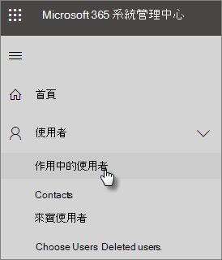

# 保護您的系統管理員帳戶Protect your administrator accounts

系統管理員帳戶會隨附提升的權限，因為它們的駭客和網路罪犯寶貴的目標。Because admin accounts come with elevated privileges, they're valuable targets for hackers and cyber criminals. 本文說明：This article describes:

- 如何設定緊急情況納入考量的其他系統管理員帳戶。How to set up an additional administrator account for emergencies.
- 如何保護這些帳戶。How to protect these accounts.
 
當您註冊 Microsoft 365 商務版，並輸入您的資訊時，會自動成為全域系統管理員。全域系統管理員具有使用者帳戶的最終控制項和其他所有設定在 Microsoft 系統管理中心中，但有許多不同種類的系統管理員帳戶具有不同程度的存取。When you sign up for Microsoft 365 Business and enter your information, you automatically become the global admin. A global admin has the ultimate control of user accounts and all the other settings in the Microsoft admin center, but there are many different kinds of admin accounts with varying degrees of access. 請參閱[關於系統管理員角色](https://docs.microsoft.com/office365/admin/add-users/about-admin-roles)的系統管理員角色的每一種不同的存取層級的相關資訊。See [about admin roles](https://docs.microsoft.com/office365/admin/add-users/about-admin-roles) for information about the different access levels for each kind of admin role.

## 建立其他系統管理員帳戶Create additional admin accounts

使用系統管理員帳戶僅適用於管理。Use admin accounts only for administration. 系統管理員應該有個別的使用者帳戶的 Office 應用程式的一般用於與僅使用其時管理帳戶和裝置，以及其他系統函數工作時所需的系統管理帳戶。Admins should have a separate user account for regular use of Office apps and only use their administrative account when necessary to manage accounts and devices, and while working on other admin functions. 它也是系統管理員帳戶的 Microsoft 365 商務版授權移除，因此您不需要支付它們是個好主意。It's also a good idea to remove the Microsoft 365 Business license from the admin accounts so you don't have to pay for them.

想要設定至少一個其他的全域系統管理員帳戶，將系統管理存取權授與另一個受信任的員工。You'll want to set up at least one additional global admin account to give admin access to another trusted employee. 您也可以建立不同的系統管理員帳戶的使用者管理 （此角色會呼叫**使用者管理系統管理員**）。You can also create separate admin accounts for user management (this role is called **User management administrator**). 如需詳細資訊，請參閱[關於系統管理員角色](https://docs.microsoft.com/office365/admin/add-users/about-admin-roles)。For more information, see [about admin roles](https://docs.microsoft.com/office365/admin/add-users/about-admin-roles).

若要建立其他系統管理員帳戶：To create additional admin accounts:

 1. 移至<a href="https://go.microsoft.com/fwlink/p/?linkid=837890" target="_blank">系統管理中心</a>，然後選擇 [**使用者**\>左側的 **[作用中使用者**Go to the <a href="https://go.microsoft.com/fwlink/p/?linkid=837890" target="_blank">admin center</a> and then choose **Users** \> **Active users** in the left nav.

    

2. 在 [**作用中使用者**] 頁面上，選取頂端] 頁面上，並且在 [**新增使用者**] 面板上的 [**新增使用者**，輸入名稱，以及其他資訊。On the **Active users** page, select **Add a user** at the top of the page, and on the **New user** panel, enter the name and other information.
3. 依序展開 [**角色**] 區段中，並選擇**全域系統管理員**授與此使用者的全域系統管理員存取權。Expand the **Roles** section, and choose **Global administrator** to give this user global admin access. 您也可以選擇**自訂的系統管理員**，然後選擇 [任何會顯示角色。You can also choose **Customized administrator** and choose any of the roles that are displayed.

    在 [**備用電子郵件地址**] 文字方塊中輸入備用電子郵件。Enter an alternate email in the **Alternative email address** text box. 您可以使用這個地址來復原您的密碼資訊，如果您要取得鎖定。全域系統管理員，帳單會傳送到這個地址。You can use this address to recover your password information if you get locked out. For global admins, a billing statement will also be sent to this address.

    
    
4. 在 [**產品授權**] 區段中，移動選取器**Microsoft 365 商務**版來**關閉**使用中] 及 [**產品授權沒有建立使用者\*\*\*\*上**。In the **Product licenses** section, move the selector for **Microsoft 365 Business** to **Off** and the **Create user without product license** to **On**.

    

## 建立緊急系統管理員帳戶Create an emergency admin account

您也應該建立未設定，以多重要素驗證 (MFA) 讓您不小心鎖定自行備份帳戶 （例如如果您遺失您正在使用作為第二個表單式驗證的電話）。You should also create a backup account that isn't set up with multi-factor authentication (MFA) so you don't accidentally lock yourself out (for example if you lose your phone that you're using as a second form of verification). 請確定此帳戶的密碼是片語或，至少有 16 個字元長時間。Make sure that the password for this account is a phrase or at least 16 characters long. 這通常稱為 「 中斷玻璃帳戶 」。This is often referred to as a "break-glass account."

## 建立您自己的使用者帳戶Create a user account for yourself

使用您的使用者帳戶來參與共同作業與您的組織，包括檢查郵件。Use your user account to participate in collaboration with your organization, including checking mail. 這表示您的系統管理員認證可能會類似於*Alice.Chavez@Contoso.org*及一般使用者帳戶，您可能會類似於*Alice@Contoso.com*。This means your admin credentials might be similar to  *Alice.Chavez@Contoso.org* and your regular user account might be similar to *Alice@Contoso.com*.

若要建立新的使用者帳戶：To create a new user account:
1. 移至<a href="https://go.microsoft.com/fwlink/p/?linkid=837890" target="_blank">系統管理中心</a>，然後選擇 [**使用者**\>左側的 **[作用中使用者**Go to the <a href="https://go.microsoft.com/fwlink/p/?linkid=837890" target="_blank">admin center</a> and then choose **Users** \> **Active users** in the left nav.
2. 在 [**作用中使用者**] 頁面上，選取頂端] 頁面上，並且在 [**新增使用者**] 面板上的 [**新增使用者**，輸入名稱，以及其他資訊。On the **Active users** page, select **Add a user** at the top of the page, and on the **New user** panel, enter the name and other information.
3. 依序展開 [**角色**] 區段中，然後選擇 [**使用者 （沒有管理存取）**。Expand the **Roles** section, and choose **User (no administrative access)**.
1. 在 [**產品授權**] 區段中，將選擇器**Microsoft 365 商務**版往**上**。In the **Product licenses** section, move the selector for **Microsoft 365 Business** to **On**. 

## 註冊每個這些帳戶的多重要素驗證Register each of these accounts for multi-factor authentication

## 其他建議Additional recommendations

- 請務必針對多重要素驗證也設定系統管理員帳戶。Be sure that admin accounts are also set up for multi-factor authentication. 我們將顯示您如何執行這項操作中[設定條件式存取原則](m365-campaigns-conditional-access.md)。We'll show you how to do this in [Configure conditional access policies](m365-campaigns-conditional-access.md).
- 使用系統管理員帳戶之前, 關閉所有不相關的瀏覽器工作階段和應用程式，包括個人電子郵件帳戶。Before using admin accounts, close out all unrelated browser sessions and apps, including personal email accounts. 您也可以使用私人，或 incognito 瀏覽器視窗中。You can also use in private, or incognito browser windows.
- 完成之後系統管理工作，請務必先登出瀏覽器工作階段。After completing admin tasks, be sure to sign out of the browser session.
