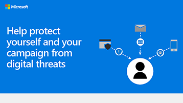

## 資訊圖表： 協助您防止數位威脅保護您自己和您的行銷活動 
下列連結以 PowerPoint 和 PDF 可以下載及列印 tabloid 格式 (也稱為 ledger 11 x 17 或 A3)。

[PDF](downloads/M365CampaignsWhatCanUsersDoToSecure.pdf) | [PowerPoint](https://github.com/MicrosoftDocs/microsoft-365-docs-pr/raw/live/m365-democracy/microsoft-365/campaigns/downloads/M365CampaignsWhatCanUsersDoToSecure.pptx)
