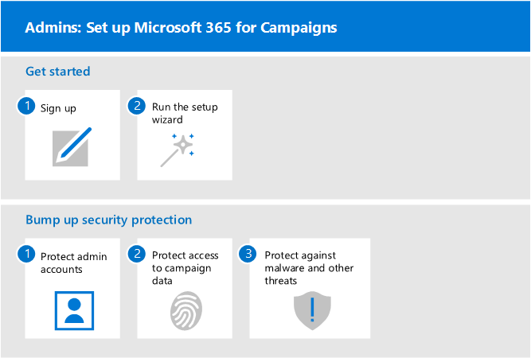

# 設定 Microsoft 365

本文說明設定 Microsoft 365 的處理常式。 任何有 Microsoft 365 商務進階版的人都可以使用此指導方針來逐步提高安全性。

## Admins：設定 Microsoft 365

下圖說明管理員設定 Microsoft 365 的方式。

針對符合特殊定價的行銷活動，請[從 Microsoft 提出邀請](https://m365forcampaigns.microsoft.com/)，然後[註冊行銷活動的 Microsoft 365](m365-campaigns-sign-up.md)開始著手。 若要完成安裝程式，請 [執行安裝精靈](../business/set-up.md?toc=/microsoft-365/campaigns/toc.json) 以設定核心設定。

對於所有其他組織，在您[註冊 Microsoft 365 商務進階版](../business/sign-up.md)之後，請執行[安裝精靈](../business/set-up.md?toc=/microsoft-365/campaigns/toc.json)以設定核心設定，以完成安裝。

針對所有組織而言，安全性保護的方式如下： [保護系統管理員帳戶](m365-campaigns-protect-admin-accounts.md)、 [保護郵件和資料的存取](m365-campaigns-conditional-access.md)，以及 [增加威脅防護](m365-campaigns-increase-protection.md)。

## 所有人：設定您的裝置

使用者必須花幾分鐘的時間來設定裝置以與此環境搭配使用。 若為主要使用者 (駭客) 最高價值目標的使用者，您可以設定和預先設定新裝置。 這可協助他們在使用 Microsoft 365 認證登入時開始使用。

  
若要設定使用者裝置：

1. 每個使用者都 [設定其行動裝置](../business/set-up-mobile-devices.md?toc=%2Fmicrosoft-365%2Fcampaigns%2Ftoc.json)。
2. 對於未管理的裝置，使用者會設定其 [pc 和 mac](m365-campaigns-protect-pcs-macs.md)。
針對主要人員，建議您使用 [受管理的裝置](../business/set-up-windows-devices.md?toc=/microsoft-365/campaigns/toc.json) ，以獲得更佳的保護。 針對所有裝置，您會想要設定 [多重要素驗證](m365-campaigns-multifactor-authenication.md)。
3. 所有使用者都應該瞭解如何透過 [網路釣魚和其他攻擊](m365-campaigns-phishing-and-attacks.md)來保護自己和您的活動。 此 [資訊圖表](m365-campaigns-protect-campaign-infographic.md) 也可協助您的使用者瞭解如何協助保護您的活動免受線上威脅。

## 連絡客戶支援

 **如果您需要連絡客戶支援：**
  
做為 Microsoft 365 的系統管理員，您可以存取我們的客戶支援小組， **[與商務產品的支援人員聯繫-系統管理](../business-video/get-help-support.md)說明**
