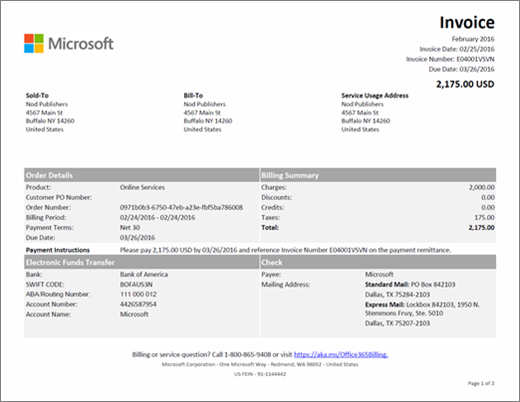

# 瞭解適用于商務用 Microsoft 365 的帳單或發票

每月您都會收到一封電子郵件，告訴您您的新帳單報表可在系統管理中心中取得。 [瞭解如何尋找及查看您的帳單或發票](view-your-bill-or-invoice.md)。
  
您的發票包含兩個頁面。 第1頁是「發票摘要」，包含發票、訂單、應付金額到期的一般資訊、如何進行付款，以及如何與支援人員聯繫。
  

  
第2頁包含每個訂閱之帳單活動的詳細資料。
  

  
如需發票中所包含的欄位及字詞的描述，請參閱本文稍後的 [[發票] 欄位詞彙表](#invoice-field-glossary)。
  
## 瞭解帳單概念

在您查看發票之前，請先瞭解一些重要的帳單概念，這會很有説明。
  
### 發票餘額與訂單餘額

 「**發票餘額**」是顯示在發票上的金額，而且只是該特定計費期間的應付金額。 您的總**訂單餘額**是所有未支付之發票的總和。 您可以在系統管理中心的 [**計費**] 區段中查看訂單餘額。
  
### 計費頻率與發票頻率

 **計費頻率**表示您的計費頻率。 訂閱會根據您在訂閱購買期間所選擇的選項，依月或每一年計費。 [**發票頻率**] 表示您接收發票的頻率。 如果您選擇 [年度帳單]，除非您訂閱的活動需要費用或貸項，否則您每年只會收到一張發票。
  
如果您有一個以上的訂單，您會收到每份訂單的發票。
  
## 發票欄位詞彙表

下表說明您可能會在發票上看到的欄位。 [！注意] 這裡所列的部分欄位可能不會出現在您的發票中，取決於您是以發票付款還是按信用卡或銀行帳戶付款。
  
> [!NOTE]
> 銀行帳戶付款不適用於部分國家或地區。
  
|**Name**|**描述**|
|:-----|:-----|
|年價格|訂閱會以月度或每年為帳單。 如果您在購買訂閱期間選擇了 [年度帳單]，則該發票上會反映年度授權價格。 如果您想變更帳單頻率，必須取消訂閱並以新的計費頻率 repurchase。|
|計費期間|計費期間是指自最後一個發票日期起的時間週期。 服務期間是您用來收費使用服務的時段。|
|帳單|這是您帳單部門的位址，通常與「銷售者」位址相同。 若要更新您的帳單位址，請參閱[變更您的帳單位址](change-your-billing-addresses.md)。|
|收費|發票的第1頁摘要列出發票計費期間的所有費用。 第2頁顯示每個訂閱的詳細費用。|
|檢查|如果您是在您的國家/地區提供發票和支票付款，則第1頁的底部會包含有關寄送付款的位置資訊。 請參考支票上的發票編號。|
|參與名單|您的發票第1頁會匯總發票計費期間的所有貸方。 第2頁顯示每個訂閱的詳細點數。|
|客戶 PO 編號|您的採購單（PO）編號。 如果您更新 PO 號碼，則未來的發票會包含它。 [變更您的採購訂單編號](#change-your-purchase-order-number)。   **記事**您無法將 PO 號碼新增至現有的發票。           |
|天|每個帳單交易都與一個服務期間相關聯。 [天數] 欄位會指出服務週期中的天數。|
|折扣|您的發票第1頁摘要發票計費期間的所有折扣。 第2頁顯示每個訂閱的詳細折扣。|
|到期日|發票付款到期的日期。 如果您使用信用卡或銀行帳戶支付您的訂閱，我們會在開票日之後收取您的信用卡或銀行帳戶。   **記事**在某些國家或地區無法使用銀行帳戶付款。           |
|電子基金轉移|如果您選擇「發票」做為訂閱支付方式，第1頁會包含 Microsoft 銀行帳戶資訊，以用於電子（電線、ACH、SEPA 等）付款。 通常，當您傳送付款時，您的銀行將會有您已完成的參考欄位。 請參照此欄位中顯示的發票編號。|
|總計|此列包括發票上所列所有預訂的所有費用、折扣、信用、小計、稅金和匯總欄總數。|
|發票日期|建立發票的日期。 [開具發票] 日期是帳單期限結束後的那一天。 例如，如果您的帳單期限是1月15日到2月14日，則您的發票日期是2月15日。|
|發票編號|指派給發票的唯一號碼。 請使用您的付款參考發票號碼。|
|每月價格|訂閱會以月度或每年為帳單。 如果您在購買訂閱時選擇每月帳單，則發票上會反映每月授權價格。 如果您想變更帳單頻率，必須取消訂閱並以新的計費頻率 repurchase。|
|訂單編號|每次您購買新的訂閱時，即會建立訂單。 每月都會收到每個訂單的發票。|
|付款指示|如果您是以信用卡支付，您會看到「不要向信用卡支付費用。」 如果您是以發票付款，您將會看到透過電子資金轉帳（EFT）和支票（如果適用）所支付的指示。|
|付款條款|付款到期時，從發票日期開始的天數。 標準為30天。|
|產品|在您的發票第1頁上，「線上服務」是用來描述您之訂閱的一般術語。 在第2頁，您會看到個別訂閱名稱。|
|數量|在服務期間購買的授權數目。|
|服務期間|服務期間是您用來收費使用服務的時段。 計費期間是自上次發票日期以來的時段。|
|服務使用位址|使用服務的位址，通常與您的銷售位址相同。 若要更新您的服務使用位址，請參閱[變更您的帳單位址](change-your-billing-addresses.md)。|
|已售出-To|您的公司名稱和位址。 若要更新此資訊，請參閱[變更貴組織的位址、技術連絡人電子郵件以及其他資訊](../../admin/manage/change-address-contact-and-more.md)。|
|次 全 切除|在您的發票上列出的每個訂閱都有個別的分類匯總資料列，以供該訂閱的所有費用、折扣、信用、小計、稅收和總計欄使用。|
|稅|您的發票第1頁會顯示總稅款。 第2頁顯示所套用的稅率，以及每個行專案的稅金總金額。 如果您的發票包含稅費，而您的公司是免稅的，請[與支援人員聯繫](../../admin/contact-support-for-business-products.md)。|
|總計|發票計費期間的應付金額。|

## 變更您的採購訂單編號

如果您是以發票付款，您可以新增或變更您訂閱的採購訂單（PO）號碼。
  
> [!NOTE]
> 您無法將 PO 號碼新增至現有的發票。 PO 編號會出現在所有未來的發票上。

::: moniker range="o365-worldwide"

1. 在系統管理中心中，移至 [**帳單** \> <a href="https://go.microsoft.com/fwlink/p/?linkid=842054" target="_blank">產品</a>] 頁面。

2. 如果您是在**表格**視圖中，請選取 [**卡片**] 以切換視圖。

3. 尋找您要變更的訂閱。

4. 在 [**記帳**] 區段中，選取 [**發票**] 旁邊的 [**編輯**]。

5. 在 [**編輯付款明細**] 窗格的底部，輸入您的訂單編號，然後選取 [**儲存**]。

::: moniker-end

::: moniker range="o365-germany"

1. 在系統管理中心中，前往 [帳單]**** \> [訂閱] 頁面。

2. 選取您要變更的訂閱，然後在 [**付款條件**] 區段中，選取 [**變更付款明細**]。

3. 在 [**變更付款明細**] 窗格的底部，輸入您的訂單編號，然後選取 [**提交**]。

::: moniker-end

::: moniker range="o365-21vianet"

1. 在系統管理中心中，前往 [帳單]**** \> [訂閱] 頁面。

2. 選取您要變更的訂閱，然後在 [**付款條件**] 區段中，選取 [**變更付款明細**]。

3. 在 [**變更付款明細**] 窗格的底部，輸入您的訂單編號，然後選取 [**提交**]。

::: moniker-end

## 相關文章

[購買 Microsoft 365 for business 訂閱](pay-for-your-subscription.md)

[Minecraft: Education Edition 付款選項](https://go.microsoft.com/fwlink/p/?linkid=838761)